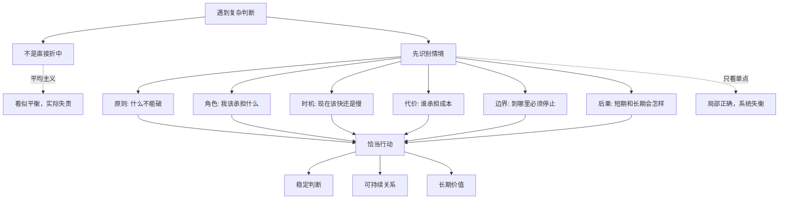
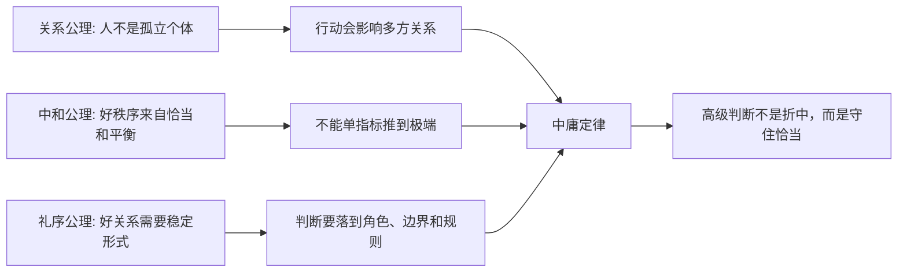
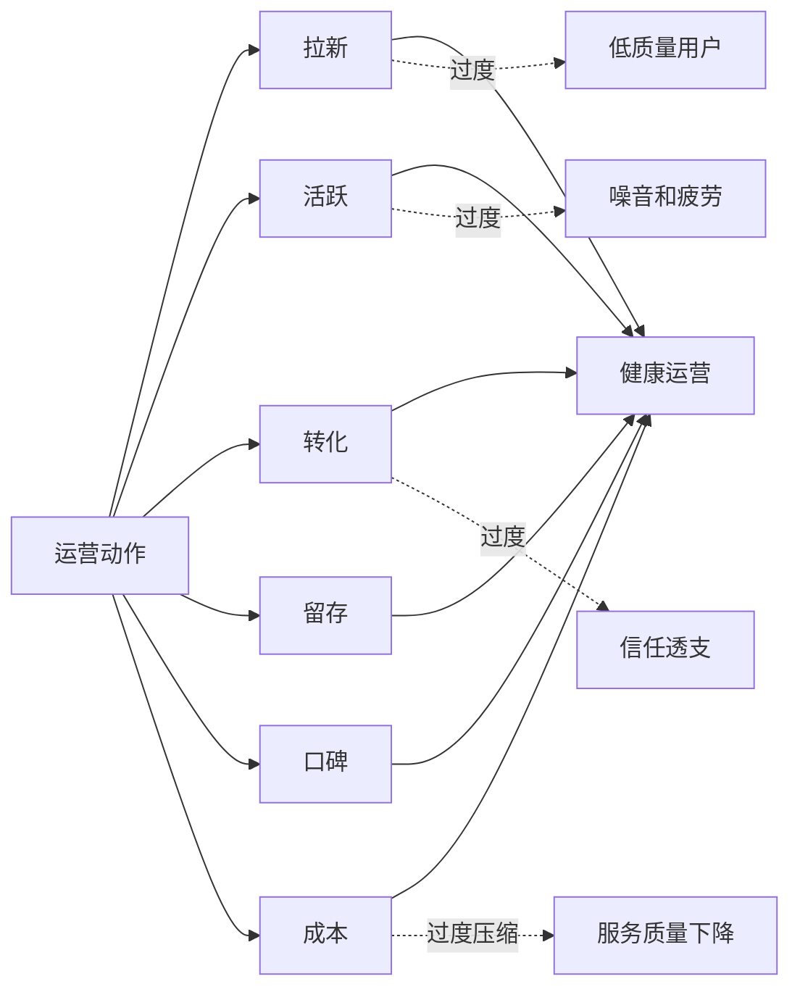

## 儒家思维筑基课: 中庸定律: 高级判断不是折中，而是守住恰当

### 作者
digoal

### 日期
2026-05-18

### 标签
儒家思维 , 中庸定律 , 恰当判断 , 情境决策 , 原则边界 , 系统思维 , 产品决策 , 运营策略 , 创业管理 , 投资纪律

----

## 背景

> 面向对象: 大学生、产品经理、运营经理、创业者、有投资需求的人
> 核心问题: 世界表面变化太快，为什么很多人把“中庸”误解成折中、妥协、不得罪人，结果既守不住原则，也抓不住机会？
> 先说结论: 中庸定律说的是: 高级判断不是在两个极端中间取平均，而是在具体情境中守住恰当。恰当不是软弱，而是同时看见原则、角色、时机、代价、边界和后果，然后做出能承受检验的行动。

## 一张图先看懂



## 求真讲法

### 它到底说了什么

“中庸定律”可以表述为:

> 面对复杂问题时，真正高级的判断不是把相反意见各取一半，而是根据原则、情境、角色、时机和后果，找到此时此地最恰当的行动。

中庸里的“中”，不是地理上的中间点，而是不过度、不不足、合乎情境。  
中庸里的“庸”，不是平庸，而是常道: 可以长期遵循、反复使用、经得起关系和后果检验的做法。

所以中庸不是:

```text
A 要 100，B 要 0，所以取 50。
```

中庸更像:

```text
先判断什么是不能破的原则，
再判断当前情境最需要什么，
最后选择代价可承受、边界清楚、长期不反噬的行动。
```

有时候，中庸表现为温和。  
有时候，中庸表现为坚决。  
有时候，中庸表现为等待。  
有时候，中庸表现为立刻停止。  
关键不在姿态，而在是否恰当。

### 它是怎么来的

在儒家传统中，《中庸》强调“中”和“和”。教学性地理解，“中”解决尺度问题，“和”解决协调问题。

从前面的底层公理看，中庸定律可以这样推出:



这个推导不是数学证明，而是实践逻辑:

1. 人的行动会影响关系网络，不能只看自己一方。
2. 复杂系统有多个变量，不能单一指标最大化。
3. 关系需要角色、边界和稳定形式，不能只靠情绪判断。
4. 因此，高级判断要在具体情境中守住恰当。

现代领域里，中庸定律也反复出现:

| 领域 | 中庸的现代说法 | 关键问题 |
|---|---|---|
| 伦理判断 | 原则与情境结合 | 什么不能破，什么可以变 |
| 管理学 | 权衡、取舍、情境领导 | 什么时候授权，什么时候收紧 |
| 产品 | 用户价值、体验和商业化协调 | 哪个指标不能再推 |
| 运营 | 拉新、留存、转化、口碑匹配 | 热闹是否伤害长期关系 |
| 创业 | 速度、质量、现金流和组织能力匹配 | 快在哪里，慢在哪里 |
| 投资 | 收益、风险、期限、仓位匹配 | 看对后能否承受波动 |

### 它依赖哪些假设

中庸定律依赖几个前提:

1. 现实问题通常不是单变量问题，而是多变量张力。
2. 原则不能丢，但原则要进入具体情境才能行动。
3. 同一个动作在不同阶段、角色和资源条件下，意义可能不同。
4. 过度和不足都会造成系统成本。
5. 恰当判断需要反馈和校准，不是一次性定论。

这些前提让我们从“选左还是选右”转向更成熟的问题:

```text
现在的主矛盾是什么?
哪些原则不能牺牲?
哪些变量已经过度?
哪些成本被隐藏?
如果继续这样做，系统会在哪里反噬?
```

### 中庸不是折中

中庸最常见的误解，是把它当成折中。

| 判断方式 | 典型动作 | 问题 |
|---|---|---|
| 极端判断 | 只推一个目标到最大 | 容易造成反噬 |
| 折中判断 | 两边各让一步 | 可能回避真正矛盾 |
| 和稀泥 | 不判断、不负责、不得罪人 | 表面和平，底层腐烂 |
| 中庸判断 | 基于原则和情境守住恰当 | 需要更高认知和承担 |

比如产品商业化，不是“用户体验 50 分，广告收入 50 分”就叫中庸。真正的中庸要问:

- 用户是否知道自己正在被商业化影响？
- 广告是否破坏核心使用场景？
- 收入是否用于增强长期服务能力？
- 有没有清楚边界，比如儿童、医疗、金融等高敏场景不能乱推？

这不是折中，而是守住恰当。

### 一个可复用的七问模型

面对生活、产品、运营、创业或投资决策，可以用“中庸七问”:

| 问题 | 看什么 | 反面信号 |
|---|---|---|
| 原则是什么 | 哪些底线不能破 | 为了效率牺牲诚信 |
| 情境是什么 | 当前阶段、资源、约束 | 用旧办法处理新局面 |
| 角色是什么 | 我该承担什么责任 | 越位、缺位、甩锅 |
| 主次是什么 | 当前最关键矛盾 | 每件事都平均用力 |
| 过度在哪里 | 哪个指标被推过头 | 数据好看但副作用累积 |
| 不足在哪里 | 哪个关键变量被忽视 | 短板长期无人处理 |
| 如何校准 | 用什么反馈修正 | 一条路走到黑 |

这七问能把中庸从抽象修养变成可执行的判断工具。

### 常见误解

| 误解 | 更准确的理解 |
|---|---|
| 中庸就是折中 | 中庸是情境中的恰当，不是数学平均 |
| 中庸就是没立场 | 中庸首先要知道什么原则不能破 |
| 中庸就是慢一点 | 有些情境下，恰当行动是立刻决断 |
| 中庸就是不得罪人 | 真正中庸可能会得罪不守边界的人 |
| 中庸会削弱竞争力 | 中庸防止局部极致破坏长期系统 |

## 求存讲法

### 它有什么用

中庸定律的最大用途，是帮你避免被“单一正确”骗住。

现实世界特别喜欢把复杂问题包装成一句话:

- 年轻人就要拼命卷。
- 产品就要极致体验。
- 运营就要增长第一。
- 创业就要不惜一切速度。
- 投资就要重仓高确定性。
- 管理就要结果导向。

这些话都有局部道理，但只要变成唯一原则，就会制造失衡。

中庸定律提醒你:

```text
一句话越有力量，越要检查它省略了什么条件。
```

### 它怎么迁移到生活

生活中的中庸，不是把每件事都平均安排，而是知道当前阶段什么最该守住。

一个大学生如果临近毕业还只追绩点，可能错过实习、作品和真实协作。  
如果完全不管成绩，只追体验和社交，也可能失去基本选择权。  
如果为了赚钱过度兼职，可能牺牲长期能力。  
如果只追长期能力，完全不管现金压力，也可能撑不到能力兑现。

可以用这张表做自检:

| 生活变量 | 过度 | 不足 | 中庸判断 |
|---|---|---|---|
| 学习 | 只会考试 | 基础薄弱 | 学到能迁移的能力 |
| 社交 | 被关系消耗 | 信息闭塞 | 建立高质量合作关系 |
| 金钱 | 过度焦虑 | 透支消费 | 让现金流服务自由 |
| 健康 | 过度控制 | 精力崩盘 | 支撑长期行动 |
| 表达 | 只顾表现 | 不敢发声 | 在事实基础上清楚表达 |

中庸不是让人生平淡，而是让关键变量不互相摧毁。

### 它怎么迁移到产品

产品经理最容易被某个单指标绑架。

| 产品目标 | 推到极端会怎样 | 中庸做法 |
|---|---|---|
| 转化率 | 诱导、误导、投诉 | 转化要经得起用户换位检验 |
| 留存 | 成瘾、打扰、疲劳 | 留存要来自真实价值 |
| 简洁 | 功能不足，无法完成任务 | 简洁服务核心场景 |
| 丰富 | 复杂难用，学习成本高 | 丰富有层次和边界 |
| 商业化 | 品牌折损，用户流失 | 变现不破坏信任 |

一个产品是否成熟，不在于某个指标多高，而在于它能否让用户价值、体验成本、商业收入和长期信任保持恰当比例。

### 它怎么迁移到运营

运营中的中庸，是在增长和关系之间守住恰当。



如果只追拉新，用户质量可能下降。  
如果只追活跃，社群可能变成噪音场。  
如果只追转化，用户会感觉被收割。  
如果只控成本，服务体验会塌。

中庸运营不是不增长，而是增长要守住用户信任、服务能力和长期复购。

### 它怎么迁移到创业

创业里的中庸尤其难，因为创业天然需要偏执和速度。但偏执不等于失衡。

| 创业张力 | 过度一侧 | 过度另一侧 | 恰当判断 |
|---|---|---|---|
| 速度与质量 | 快到交付崩 | 慢到错过窗口 | 核心场景快，关键质量守住 |
| 融资与现金流 | 依赖资本续命 | 过度保守错失机会 | 用融资换能力，不换虚胖 |
| 创始人控制与授权 | 一言堂 | 无人负责 | 关键方向集中，执行充分授权 |
| 客户定制与标准化 | 项目制泥潭 | 脱离客户需求 | 从定制中抽象产品能力 |
| 增长与组织 | 组织跟不上 | 团队过早官僚 | 阶段性补齐组织短板 |

创业中庸不是让公司温吞，而是知道什么必须激进，什么必须克制。

### 它怎么迁移到投融资

投资中的中庸，是风险、收益、时间、仓位和认知边界的匹配。

很多亏损不是因为完全看错，而是因为恰当性错了:

- 看对公司，但买太贵。
- 看对方向，但仓位太重。
- 看对长期，但资金太短。
- 看对价值，但扛不住波动。
- 看对行业，但忽视治理和周期。

| 投资判断 | 折中式错误 | 中庸式判断 |
|---|---|---|
| 仓位 | 平均买一点 | 仓位匹配确定性和承受力 |
| 估值 | 好公司贵点没事 | 好公司也要看价格和预期 |
| 分散 | 越分散越安全 | 分散到能理解和跟踪 |
| 长期 | 买了不动就是长期 | 长期要基于基本面持续成立 |
| 风险 | 只看波动 | 看永久损失、流动性和杠杆 |

这不是具体投资建议，而是一种纪律: 高级投资判断不是永远激进或永远保守，而是在自己的能力圈、现金流、期限和心理承受力内守住恰当。

### 它的适用范围和边界

| 场景 | 中庸定律有效的条件 | 边界 |
|---|---|---|
| 生活选择 | 多个目标需要长期协调 | 危机时要先处理关键风险 |
| 产品决策 | 指标之间互相牵制 | 早期探索可能需要阶段性极致 |
| 运营策略 | 增长、口碑、成本共同影响结果 | 不能用平衡掩盖目标不清 |
| 创业管理 | 速度、现金流、组织和交付需匹配 | 机会窗口短时要果断倾斜 |
| 投资决策 | 收益、风险、期限和仓位需匹配 | 不能用中庸逃避判断和止损 |

中庸定律最重要的边界是: 它不是不决策。

更成熟的表达是:

```text
成熟中庸 = 原则清楚 + 情境准确 + 主次分明 + 边界明确 + 动态校准
```

如果一个人总说“要中庸”，却从不判断主次、不承担取舍，那不是中庸，而是逃避。

### 正例: 怎么用它提升能力

假设你是产品经理，负责一个 AI 学习工具的商业化。

点状思维会说:

```text
要收入 -> 加强付费墙 -> 提高转化 -> 多弹窗提醒
```

折中思维可能说:

```text
付费墙弱一点，弹窗少一点。
```

中庸思维会问:

```text
学习场景中，什么体验不能破?
什么功能可以收费?
用户在哪个时点最能理解付费价值?
免费体验要保留到什么程度，才能建立信任?
商业化强度如何被续费率、投诉率和学习效果约束?
```

于是你可能会这样设计:

- 基础学习路径免费，让用户先体验真实价值。
- 高阶批改、个性化计划、长期记忆追踪收费。
- 付费说明清楚，不用焦虑文案诱导。
- 在用户完成一次有效学习后展示升级价值。
- 用续费、完课率、投诉率约束商业化强度。

这不是折中，而是在学习价值、用户信任和商业收入之间守住恰当。

### 反例: 前提不成立会怎样

某创业公司奉行“增长第一”，所有部门只看新增和 GMV。起初数据很好，后来问题集中爆发:

- 销售为了签单夸大承诺。
- 产品堆功能满足大客户定制，核心体验变差。
- 交付团队长期加班，离职率上升。
- 财务回款质量下降，现金流紧张。
- 管理层继续用更高目标掩盖系统问题。

这里失败不是因为增长不重要，而是增长被推成唯一原则。中庸定律的前提不成立时，局部胜利会变成系统失败。

真正恰当的做法，不是放弃增长，而是给增长设置边界: 客户质量、交付能力、现金流、团队承载力和长期口碑必须同步校准。

## 思考

中庸定律最能帮助我们抵抗“极端叙事”。

极端叙事很有传播力，因为它简单、刺激、容易站队。但现实世界更像一个多变量系统。一个变量被推到极致，常常会从别处收取代价。

很多人误判未来，不是因为没有信息，而是因为只抓住一个正确变量:

- 只看到技术趋势，没看到商业化边界。
- 只看到用户增长，没看到留存质量。
- 只看到利润率，没看到客户和员工承受力。
- 只看到估值便宜，没看到价值陷阱。
- 只看到长期机会，没看到短期流动性风险。

中庸不是让人变得圆滑，而是让人学会在复杂系统里守住恰当。

一个更锋利的问题是:

> 我现在坚持的“正确”，是否已经越过恰当边界，开始伤害它本来想保护的东西？

这句话能检验很多生活选择、产品策略、创业决策和投资判断。

## 最后记住

1. 中庸定律不是折中，而是在具体情境中守住恰当。
2. 恰当判断需要同时看原则、角色、时机、代价、边界和后果。
3. 产品、运营、创业和投资中，单一指标最大化常常会制造长期反噬。
4. 成熟中庸不是逃避决策，而是原则清楚、主次分明、动态校准。
5. 判断未来时，要问: 当前看似正确的做法，是否已经越过恰当边界。

## 参考资料

- 《中庸》: 关于“中”“和”“诚”以及情境恰当性的经典思想资源。
- 《论语》: “过犹不及”等关于尺度、分寸和恰当行动的表达。
- 《礼记》: 礼乐秩序、角色分寸和社会协调的思想资源。
- Aristotle, *Nicomachean Ethics*: 德性作为过度与不足之间的恰当状态，可作为跨文化参照。
- Herbert A. Simon, *Administrative Behavior*, 1947: 有限理性与管理决策中的权衡。
- Peter M. Senge, *The Fifth Discipline*, 1990: 系统思考、反馈回路和复杂系统学习。
- Howard Marks, *The Most Important Thing*, 2011: 投资中的风险、周期、二阶思维和恰当性判断。
- 本文为跨学科教学性重构，目的是提供生活、产品、运营、创业和投资中的底层分析框架，不构成具体投资建议。
  
#### [PostgreSQL 解决方案集合](../201706/20170601_02.md "40cff096e9ed7122c512b35d8561d9c8")
  
  
#### [德哥 / digoal's Github - 公益是一辈子的事.](https://github.com/digoal/blog/blob/master/README.md "22709685feb7cab07d30f30387f0a9ae")
  
  
#### [About 德哥](https://github.com/digoal/blog/blob/master/me/readme.md "a37735981e7704886ffd590565582dd0")
  
  

  
