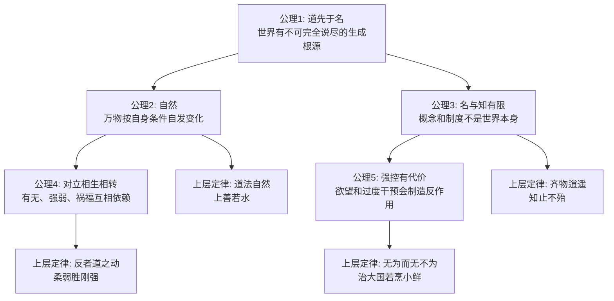
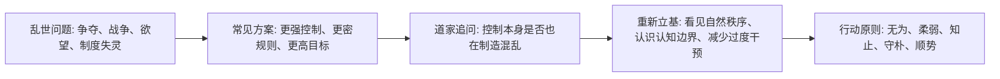

## 道家思维筑基课: 中国道家思想: 从底层公理到上层定律

### 作者
digoal

### 日期
2026-05-18

### 标签
道家思想 , 底层公理 , 上层定律 , 道德经 , 庄子 , 自然 , 无为 , 认知边界 , 对立转化 , 哲学体系

----

## 背景
> 面向对象: 高中生到普通读者  
> 核心问题: 道家思想到底不是一句“躺平”或“什么都不做”，而是一套从世界观推导到做人、做事、治理的思想系统。  
> 先说结论: 道家的底层公理是“世界有一个先于人为命名和制度的自发生成秩序，人的知识、欲望和控制都有限”。由此推出的上层定律是: 顺其自然、少私寡欲、以柔克刚、无为而治、知止不殆、齐物逍遥。

本文讨论的是以《道德经》《庄子》为核心的先秦哲学道家，不把后世宗教道教、炼丹方术、民间信仰混在一起。

## 一张图先看懂



## 求真讲法

### 它到底说了什么

如果把道家思想压缩成一个理论系统，可以分成两层。

第一层是底层公理。公理不是在系统内部被证明出来的结论，而是道家看世界时先选择接受的基本出发点。

第二层是上层定律。这里的“定律”不是物理学那种可测量公式，而是从这些公理推出的人生、政治、认知和行动原则。

一个简化公式是:

```text
世界先有自发秩序
        ↓
人的语言、欲望、制度和控制都有限
        ↓
越强行替世界规定路线，越容易产生反作用
        ↓
高明的行动不是不行动，而是低干预、顺结构、抓关键
```

### 底层公理

| 编号 | 底层公理 | 通俗说法 | 主要来源线索 |
|---|---|---|---|
| A1 | 道先于名 | 世界的根源和运行方式，早于人给它起名字、立规则 | 《道德经》开篇关于“道”与“名”的区分 |
| A2 | 道法自然 | 万物不是靠外部命令才存在，而是按自身条件生长变化 | 《道德经》“人法地，地法天，天法道，道法自然” |
| A3 | 名与知有限 | 语言、分类、价值判断只能截取世界，不能穷尽世界 | 《庄子·齐物论》对是非、彼此、成心的反思 |
| A4 | 对立相生相转 | 有无、难易、长短、高下、祸福不是孤立存在，而是互相生成、互相转化 | 《道德经》关于“有无相生”“反者道之动”的思想 |
| A5 | 强控有反作用 | 欲望越多、干预越密、控制越硬，越容易破坏原有秩序 | 《道德经》关于无为、少私寡欲、治国不扰民的论述 |

这些公理的共同点是: 道家不先问“我怎样征服世界”，而先问“世界本来怎样运行，我的认知和行动会不会破坏它”。

### 它是怎么来的

道家思想产生的背景，是春秋战国时期秩序崩解、战争频繁、礼法和权力竞争不断加码。儒家更重视用礼、仁、义重建人伦秩序，法家更重视用法、术、势重建国家控制力。道家提出的反方向问题是:

如果秩序越修越复杂，人的欲望越管越膨胀，制度越密越制造机巧，那么问题会不会不在“管得不够”，而在“管得太过”？

所以，道家的思路不是逃离现实，而是从更底层质疑人的控制冲动:



### 经典上层定律

#### 1. 道法自然

意思不是“随便怎样都行”，而是行动要尊重对象自身的生长逻辑。

种树不能靠拔苗助长，教育不能靠天天吼叫，治理不能靠把每个细节都规定死。真正的秩序不是外力压出来的，而是让事物的内在机制能够正常运行。

#### 2. 无为而无不为

“无为”不是不做事，而是不做违反结构、强行加戏、过度干预的事。

好老师不是替学生写作业，而是设置任务、反馈方法、保留练习空间。好管理不是天天插手每个动作，而是明确边界、资源和责任，让系统自己运转。

#### 3. 反者道之动

事物发展到极端，常常会向反面转化。

过度追求安全，可能失去活力；过度追求效率，可能积累脆弱；过度追求证明自己，可能暴露内心不稳。这不是神秘预言，而是道家对“极端会制造反作用”的观察。

#### 4. 有无相生

“有”与“无”互相成就。杯子的有用之处，不只在杯壁这个“有”，也在中间能装水的“无”。房间的价值，不只在墙和屋顶，也在里面可活动的空处。

迁移到做事上: 计划很重要，空白也重要；规则很重要，弹性也重要；表达很重要，沉默也能给关系留下余地。

#### 5. 柔弱胜刚强

柔弱不是软弱，而是保留弹性、减少硬碰硬、借势变化。

水看似柔，却能绕开障碍、向低处汇聚、长期改变地形。道家推崇“柔”，不是因为力量不重要，而是因为僵硬的力量最怕环境变化。

#### 6. 上善若水

水的高明有三点: 利万物而不争，处众人所恶的低处，随容器改变形态。

这推导出一种做人原则: 有价值但不处处抢中心，有能力但不必处处显胜，有方向但能根据地形调整路径。

#### 7. 知止不殆

知道在哪里停止，才不容易陷入危险。

这条定律来自对欲望边界的判断。很多失败不是因为人没有能力，而是因为能力成功之后，欲望继续扩张，最后超过了承载能力。

#### 8. 齐物逍遥

《庄子》的重点比《道德经》更偏向精神自由和认知边界。“齐物”不是说万物完全一样，而是提醒人: 你以为绝对正确的判断，常常只是站在某个位置看见的局部。

“逍遥”也不是逃避责任，而是在看见差异、限制和变化之后，不被单一评价体系绑死。

### 它依赖哪些假设

道家思想有几个关键假设。

第一，世界存在某种可观察的自发秩序。自然、社会、身体、关系都不是完全靠外部命令运转。

第二，人的认知能力有限。人用语言和制度理解世界，但语言和制度总会遗漏东西。

第三，过度欲望会扭曲判断。一个人太想赢、太想占有、太想控制，就容易把手段当目标。

第四，许多系统有反作用。管得越细不一定越好，力量越硬不一定越强，目标越满不一定越成功。

第五，保留余地是一种能力。空白、退让、沉默、低处、柔性，不一定是失败，也可能是长期稳定的结构。

### 常见误解

| 误解 | 为什么不对 | 更准确的理解 |
|---|---|---|
| 道家就是躺平 | 道家反对妄为，不反对行动 | 少做破坏结构的事，把力用在关键处 |
| 无为就是不管理 | 完全不管也可能失序 | 管边界、管节奏、管根本，不乱插手 |
| 自然就是原始 | 自然不是拒绝文明，而是尊重对象自身规律 | 技术和制度也可以“道法自然”，前提是不扭曲人和事物 |
| 柔弱就是没原则 | 柔是方法，不是没有底线 | 有原则，但不把硬碰硬当唯一策略 |
| 齐物就是没有是非 | 庄子不是取消判断，而是警惕把局部判断绝对化 | 判断要知道自己的视角、条件和边界 |

## 求存讲法

### 它有什么用

道家思想最有用的地方，是训练人识别三类风险。

第一，过度控制的风险。你越想把一切抓在手里，系统越可能失去自我修复能力。

第二，过度欲望的风险。你越被目标牵着走，越容易看不见代价和边界。

第三，过度确定的风险。你越坚信自己绝对正确，越容易把复杂世界压扁成单一答案。

### 它怎么迁移到熟悉领域

| 场景 | 道家原则 | 可操作做法 |
|---|---|---|
| 学习 | 道法自然 | 找到自己的薄弱点和节奏，不只模仿学霸时间表 |
| 写作 | 有无相生 | 观点要明确，也要留出例子、停顿和读者思考空间 |
| 管理 | 无为而治 | 定目标、边界和反馈，不替每个人做细节判断 |
| 冲突 | 柔弱胜刚强 | 先降温、换位置、找共同约束，再谈输赢 |
| 决策 | 知止不殆 | 事先设停止条件，避免赢了还想赢导致反亏 |
| 创新 | 反者道之动 | 警惕极端优化带来的脆弱性，给系统保留冗余 |

### 它的适用范围和边界

道家思想适合处理复杂系统、长期关系、个人修养、组织治理、认知谦逊和节奏控制。

但它不适合被滥用成三种借口。

第一，不能把“无为”当成不承担责任。火灾、疾病、重大安全事故面前，低干预不是放任。

第二，不能把“自然”当成合理化现状。贫困、压迫、欺骗、暴力不因为“已经存在”就天然合理。

第三，不能把“齐物”当成取消判断。视角多元不等于事实不存在，也不等于所有判断同样可靠。

### 正例: 怎么用它提升能力

假设一个学生数学不好，常见做法是每天强迫自己刷更多题。但如果错误原因是基础概念没懂，刷题越多，挫败越强。

道家的做法不是“不学习”，而是“少妄为”:

1. 先停下盲目刷题，找出真正卡点。
2. 把题量降下来，改成每题复盘概念、条件和错误类型。
3. 保留休息和消化时间，让理解自然生长。
4. 等基础稳定后，再逐步提高速度和难度。

这里的关键不是省力，而是顺着学习机制发力。

### 反例: 前提不成立会怎样

如果一个团队已经出现严重欺诈，有人说“道家讲无为，所以领导不要干预”，这就是误用。

因为“无为”的前提是系统还有自我修复能力，且低干预能让秩序恢复。欺诈场景中，信息已经被故意破坏，激励已经扭曲，继续放任只会扩大损失。

这时更合适的做法是: 先止损、查证、修复制度，再谈减少过度管理。道家反对的是乱作为，不是反对必要行动。

## 思考

道家思想最值得现代人思考的，不是“要不要努力”，而是“努力是否符合结构”。

一个人越强，越容易相信自己可以靠意志解决一切。但道家提醒我们: 世界不是只靠意志推动的。身体有节律，关系有距离，组织有惯性，市场有周期，语言有边界。

可以用三个问题检查自己是否理解了道家:

```text
1. 我现在是在顺着事物机制发力，还是在和机制硬拼？
2. 我增加的规则、目标、动作，真的降低了问题，还是制造了新问题？
3. 我以为必须抓住的东西，有没有可能正是让我失去自由的东西？
```

更高阶的问题是: 如果“少做”有时比“多做”更难，那是因为少做需要判断力、自制力和对系统的理解。道家的难处正在这里。

## 最后记住

1. 道家的底层公理不是玄学口号，而是关于世界秩序、认知边界和行动代价的假设。
2. “道法自然”不是随便，而是尊重事物自身机制。
3. “无为”不是不做，而是不妄为、不强控、不破坏系统自发秩序。
4. “柔弱胜刚强”不是软弱，而是用弹性对抗变化，用低姿态获得长期力量。
5. “齐物逍遥”不是没有判断，而是知道判断有视角、有条件、有边界。

## 参考资料

- 《道德经》: 重点参照第1章、第2章、第8章、第25章、第37章、第40章、第48章、第60章等通行章次。
- 《庄子》: 重点参照《逍遥游》《齐物论》《养生主》等篇。
- 冯友兰《中国哲学简史》: 关于先秦道家、老子、庄子思想的通行解释框架。
- 陈鼓应《老子今注今译》《庄子今注今译》: 关于文本章句与现代解释的参考。
- 本文未联网检索，主要基于上述经典文本和通行中国哲学史教材体系整理。
  
#### [PostgreSQL 解决方案集合](../201706/20170601_02.md "40cff096e9ed7122c512b35d8561d9c8")
  
  
#### [德哥 / digoal's Github - 公益是一辈子的事.](https://github.com/digoal/blog/blob/master/README.md "22709685feb7cab07d30f30387f0a9ae")
  
  
#### [About 德哥](https://github.com/digoal/blog/blob/master/me/readme.md "a37735981e7704886ffd590565582dd0")
  
  

  
