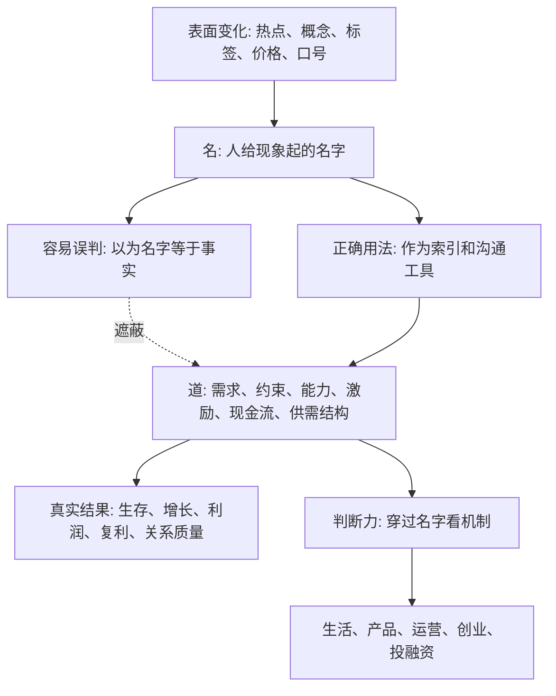
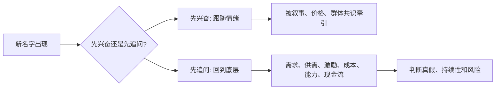

## 道家思维筑基课: 道先于名: 世界不是被名字造出来的

### 作者
digoal

### 日期
2026-05-18

### 标签
道先于名 , 名实关系 , 真实机制 , 概念边界 , 产品判断 , 运营判断 , 创业判断 , 投资判断 , 现金流 , 长期价值

----

## 背景

> 面向对象: 大学生、产品经理、运营经理、有投资需求的人  
> 核心问题: 表面概念变化太快，热点、赛道、模型、商业模式、资产名称层出不穷。只看名字，容易被包装、叙事、口号和短期价格牵着走。  
> 先说结论: “道先于名”不是否定语言和品牌，而是提醒我们: 名字只是地图，真正决定结果的是名字背后的生成机制、约束条件、资源流动和因果结构。看不见“道”，就会把标签当真相，把叙事当规律，把价格当价值。

本文把“道先于名”当作一个认知公理来讲。它不能在道家系统内部被“证明”，而是道家选择的一种看世界的起点: 先承认世界有先于人类命名的运行结构，再讨论我们怎样命名、判断和行动。

## 一张图先看懂



一句话版:

```text
名 = 我们给世界贴的标签
道 = 让事情真实发生的底层机制

名字能帮助沟通，但不能替代机制。
标签能制造注意力，但不能自动制造价值。
```

## 求真讲法

### 它到底说了什么

“道先于名”可以拆成三句话。

第一，世界不是因为我们命名才开始运行。太阳不会因为我们叫它“太阳”才发光，用户不会因为你把产品叫“AI 原生”就真实需要它，企业不会因为被归入“新质生产力”就自动产生现金流。

第二，名字是人类为了沟通、分类、管理和交易而创造的工具。名字有用，但它只是工具。工具一旦被误当成事实本身，就会制造误判。

第三，判断真假和预测未来，要回到名字背后的机制。所谓机制，就是事情为什么会发生、靠什么持续、受什么限制、在什么条件下失效。

对大学生来说，专业名称不是能力本身。对产品经理来说，功能名称不是用户价值本身。对运营经理来说，指标名称不是增长质量本身。对投资者来说，股票名称、行业标签和市场叙事都不是企业价值本身。

### 它是怎么来的

《道德经》开篇区分“道”与“名”。通行理解里，“道”指向世界的根源、生成方式和运行结构；“名”指人对事物的命名、概念化和表达。道家不是说名字没用，而是说名字无法穷尽真实。

这条公理的动机很现实: 人会被语言骗。

一个东西被命名之后，人的大脑会产生一种错觉: 既然它有名字，它就像一个稳定、清楚、独立的东西。但很多名字只是临时分类。例如“风口行业”“高端用户”“爆款内容”“长期价值”“战略升级”，听起来很完整，真正追问时却可能很空。

所以“道先于名”的选择理由是:

1. 避免把概念当成现实。
2. 避免把叙事当成因果。
3. 避免把短期价格当成长期价值。
4. 避免把组织内部话术当成市场真实需求。

它不是古代哲学的抽象癖好，而是一种反包装、反概念泡沫、反自我欺骗的判断方法。

### 它依赖哪些假设

这条公理依赖五个假设。

第一，真实世界有相对稳定的因果结构。表面变化很快，但需求、供需、激励、成本、信任、能力、时间这些底层约束不会因为换个名字就消失。

第二，人类语言是压缩工具。一个名字把复杂现实压缩成一个词，因此必然遗漏大量条件。

第三，名字会影响注意力和协作，但不能单独创造可持续结果。一个新概念可以吸引融资、媒体和用户试用，但留存、复购、利润和口碑仍要靠真实价值。

第四，越是复杂领域，名字越容易成为遮蔽物。生活、创业、投资、组织管理里，很多结果由多因素共同决定，单一标签最容易误导人。

第五，长期结果比短期叙事更接近“道”。短期内名字可以拉动情绪，长期看机制会重新定价一切。

### 常见误解

| 误解 | 为什么不对 | 更准确的理解 |
|---|---|---|
| 名字完全没用 | 没有名字就很难沟通、组织和交易 | 名字是索引，不是实体 |
| 品牌只是虚的 | 品牌能降低信任成本，也能影响选择 | 品牌必须长期连接真实体验 |
| 概念都是骗局 | 好概念能帮助人看见新结构 | 关键是概念是否对应真实机制 |
| 价格就是价值 | 价格受流动性、情绪、供需和预期影响 | 价值要看长期现金流、稀缺性和替代关系 |
| 只要会讲故事就能创业 | 故事能获得注意力和资源 | 留存、交付、成本结构和组织能力决定能否活下去 |

## 求存讲法

### 它有什么用

“道先于名”最直接的用途，是帮人穿过快速变化的表面现象，建立四种判断力。

第一，识别真伪。看一个概念是否有真实机制支撑，而不是只看它听起来是否高级。

第二，判断持续性。短期热度可能来自名字，长期结果必须来自结构。

第三，避开伪机会。很多机会只是换了名字的旧问题，甚至只是把风险包装成新趋势。

第四，提升预测能力。预测未来不是猜下一个热词，而是判断哪些底层约束正在改变，哪些只是表达方式改变。

### 它怎么迁移到熟悉领域

| 领域 | “名”的表现 | “道”的追问 |
|---|---|---|
| 生活选择 | 热门专业、体面职业、成功人设 | 我是否积累了真实能力、信用、健康和选择权 |
| 产品管理 | AI 原生、平台化、闭环、私域、增长飞轮 | 用户痛点是否真实，替代方案是什么，使用频率和付费意愿是否成立 |
| 运营管理 | DAU、GMV、转化率、裂变、留存 | 指标是否来自真实需求，是否透支补贴、信任或渠道红利 |
| 创业 | 风口、赛道、商业模式、生态位 | 客户是否愿意持续付费，交付成本是否下降，组织是否能复制 |
| 投融资 | 概念股、主题投资、估值故事、行业龙头 | 企业如何赚钱，护城河是否真实，现金流是否可靠，价格是否留有安全边际 |

### 它的适用范围和边界

这条公理适合用于识别概念泡沫、拆解商业叙事、判断职业选择、分析产品价值、审视运营指标和建立投资纪律。

但它有边界。

第一，名字并非没有力量。法律上的“所有权”、组织里的“职位”、市场里的“品牌”，都会改变人的行为。名字可以改变协调方式和预期。

第二，名字的力量来自共同信任和制度承认，不是来自词本身。货币是一张纸或一串数字，但它背后有信用、制度、税收、清算网络和社会共识。

第三，不能用“道先于名”否定传播。好东西也需要被正确命名，否则别人无法理解、搜索、传播和购买。

所以更准确的边界是: 名字可以放大现实、组织现实、传播现实，但不能长期替代现实。

### 正例: 怎么用它提升能力

假设你是产品经理，老板说要做一个“AI 知识管理平台”。如果只看“名”，你会立刻开始设计 AI 对话、知识库、插件市场和精美首页。

按“道先于名”的方法，应该先问底层机制:

1. 用户原来用什么解决知识管理问题？
2. 他们真正痛的是找不到资料、资料不可信、协作混乱，还是没人愿意维护？
3. AI 介入后，哪一个成本真的下降了？
4. 用户会在什么场景下高频使用？
5. 付费来自个人效率提升，还是组织合规、培训、客服、销售支持？
6. 如果去掉“AI”这个名字，产品还解决问题吗？

如果答案是“即使不叫 AI，它也能显著降低查找和复用知识的成本”，那么这个名字背后可能有道。如果答案是“主要靠 AI 这个词吸引注意力”，那就只是名。

### 反例: 前提不成立会怎样

一个投资者看到“低空经济”“AI 算力”“机器人”“出海龙头”等名字，就认为这些标的一定有长期价值，于是买入一批高估值公司。

这个判断失败，不是因为这些方向一定不好，而是因为他把名字当成了道。真正应该检查的是:

1. 公司收入是否真的来自这个方向。
2. 客户是否持续付费，而不是一次性项目。
3. 毛利率是否能维持，而不是被竞争快速压低。
4. 资本开支和债务是否吞掉未来现金流。
5. 当前价格是否已经提前透支多年增长。

这里失效的前提是“名字能代表真实经济结构”。当这个前提不成立时，投资就会从价值判断变成标签赌博。

### 一个实用检查表

```text
看到一个新名字时，先不要问: 它火不火？

先问六个问题:
1. 它指向的真实对象是什么？
2. 它解决了谁的什么问题？
3. 没有这个名字，问题是否仍然存在？
4. 谁愿意为它持续付费或持续投入？
5. 它的成本、风险和替代方案是什么？
6. 三年后名字不流行了，底层需求还在不在？
```

## 思考

这个时代最危险的地方，不是新概念太多，而是概念变化速度超过了人的追问速度。

很多人以为自己在理解世界，其实只是在背诵世界给他的最新命名。今天叫新消费，明天叫私域，后天叫 AIGC，再后来叫智能体。名字不断变化，但底层问题反复出现: 谁有真实需求，谁控制稀缺资源，谁承担成本，谁获得现金流，谁拥有复利能力，谁在透支信用。

“道先于名”不是让人拒绝新词，而是训练一种更慢、更硬的追问能力。



一个反事实问题值得长期放在心里:

如果明天所有流行词都消失，只剩下真实用户、真实成本、真实现金流、真实能力和真实关系，你现在相信的机会还成立吗？

如果仍然成立，你看见的可能是道。  
如果立刻崩塌，你抓住的多半只是名。

## 最后记住

1. 道先于名: 世界不是被名字造出来的，名字只是人类对真实结构的压缩表达。
2. 名字有用，但它的正确位置是索引、沟通和传播，不是真相本身。
3. 判断生活、产品、运营、创业和投资，要从标签回到需求、约束、激励、能力和现金流。
4. 短期内名字能制造注意力，长期看底层机制会重新决定结果。
5. 每遇到一个新概念，都问一句: 如果去掉这个名字，它背后的真实问题和真实价值还在不在？

## 参考资料

- 《道德经》第一章: 关于“道”与“名”的经典区分。
- 《道德经》第二十五章: “人法地，地法天，天法道，道法自然”的思想线索。
- 《庄子·齐物论》: 关于名言、是非、彼此和认知视角边界的讨论。
- 冯友兰《中国哲学简史》: 关于老庄哲学的通行解释框架。
- 陈鼓应《老子今注今译》《庄子今注今译》: 关于文本章句和现代注释的参考。
- Alfred Korzybski, *Science and Sanity*: “地图不是疆域”这一现代语义学表达，可作为“名不是道”的跨学科参照。
- 本文未联网检索，主要基于经典文本、通行中国哲学史解释和常见商业/投资分析框架整理；文中投融资部分是原则教育，不构成具体投资建议。
  
#### [PostgreSQL 解决方案集合](../201706/20170601_02.md "40cff096e9ed7122c512b35d8561d9c8")
  
  
#### [德哥 / digoal's Github - 公益是一辈子的事.](https://github.com/digoal/blog/blob/master/README.md "22709685feb7cab07d30f30387f0a9ae")
  
  
#### [About 德哥](https://github.com/digoal/blog/blob/master/me/readme.md "a37735981e7704886ffd590565582dd0")
  
  

  
