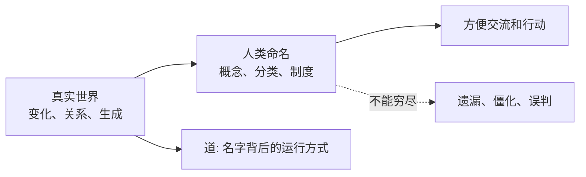

## 道家思维筑基课: 道先于名: 世界不是被名字造出来的

### 作者
digoal

### 日期
2026-05-18

### 标签
道先于名 , 道 , 名 , 语言边界 , 概念 , 真实世界 , 道德经 , 庄子 , 认知 , 哲学公理

----

## 背景
> 面向对象: 高中生到普通读者  
> 核心问题: 为什么《道德经》开篇要说“道可道，非常道；名可名，非常名”？  
> 先说结论: “道先于名”是道家最底层的公理之一。它不是证明出来的定理，而是一种出发点: 真实世界先于人的语言、概念、制度和评价存在。

## 一张图先看懂



## 求真讲法

### 它到底说了什么

“名”是人给世界贴的标签，比如“好学生”“成功”“失败”“有用”“无用”。道家提醒我们: 标签有用，但标签不是事物本身。

“道”不是一个普通物体，而是万物生成、变化、相互作用的根本方式。它可以被描述，但不能被某一句话彻底装进去。

### 它是怎么来的

这是公理，不是在道家系统内部被证明的结论。它的动机是: 人一旦太相信名字，就会把活的世界变成死的分类。

比如一个学生被叫作“差生”，这个名字可能遮住他的具体问题: 是基础薄弱、方法不对、注意力差，还是家庭环境影响？名字提高了沟通速度，也降低了观察精度。

### 它依赖哪些假设

| 假设 | 含义 | 如果不成立 |
|---|---|---|
| 世界比语言复杂 | 名字只能截取局部 | 名字就能完全等于真实 |
| 事物会变化 | 固定标签会过时 | 一次命名就永远准确 |
| 人需要概念行动 | 道家不是反语言 | 人无法学习和协作 |

### 常见误解

| 误解 | 更准确的理解 |
|---|---|
| 道家反对说话和定义 | 道家反对把定义当成全部真实 |
| “道”就是神秘实体 | 在哲学道家中，道更像生成根源和运行方式 |
| 既然名有限，就不用判断 | 判断仍然需要，但要知道它有边界 |

## 求存讲法

### 它有什么用

它训练人不要被标签绑架。学习、管理、亲密关系、投资判断中，很多错误都来自“把名字当事实”。

### 它怎么迁移到熟悉领域

```text
看见标签 -> 追问具体结构 -> 观察变化 -> 再下判断
```

### 它的适用范围和边界

适合处理复杂人事、长期关系和不确定问题。不适合用来否认事实，比如考试分数、合同条款、医学指标仍然有客观约束。

### 正例: 怎么用它提升能力

你被说“表达差”，不要只接受这个标签。把它拆开: 是观点不清、例子不足、语速太快，还是结构混乱？拆开后才有改进路径。

### 反例: 前提不成立会怎样

如果交通信号灯显示红灯，有人说“红灯只是名字，所以不用管”，这就是误用。这里的“名”对应明确公共规则，忽视它会造成现实危险。

## 思考

如果一个名字让你停止观察，它就在伤害你。如果一个名字帮助你重新观察，它就是工具。

## 最后记住

1. “道先于名”说的是真实世界先于人的命名。
2. 名字有用，但不能等于事物本身。
3. 越复杂的对象，越不能只靠标签判断。
4. 好的判断要从名字回到具体结构和变化。

## 参考资料

- 《道德经》第1章。
- 《庄子·齐物论》。
- 冯友兰《中国哲学简史》相关章节。
- 本文未联网检索，基于经典文本和通行中国哲学史教材体系整理。
  
#### [PostgreSQL 解决方案集合](../201706/20170601_02.md "40cff096e9ed7122c512b35d8561d9c8")
  
  
#### [德哥 / digoal's Github - 公益是一辈子的事.](https://github.com/digoal/blog/blob/master/README.md "22709685feb7cab07d30f30387f0a9ae")
  
  
#### [About 德哥](https://github.com/digoal/blog/blob/master/me/readme.md "a37735981e7704886ffd590565582dd0")
  
  

  
