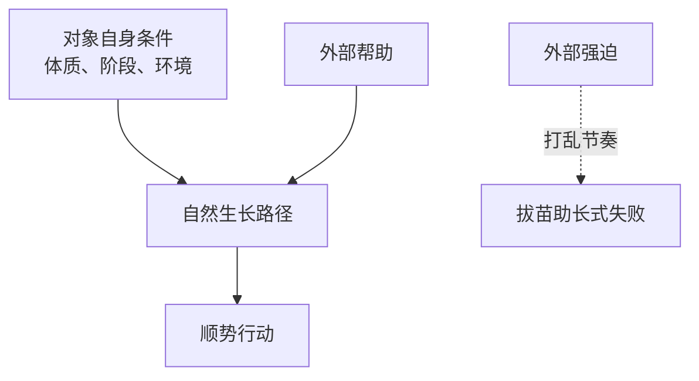

## 道家思维筑基课: 自然公理: 万物有自己的生长方式

### 作者
digoal

### 日期
2026-05-18

### 标签
自然公理 , 自然 , 生长机制 , 顺势 , 道法自然 , 内在秩序 , 低干预 , 道家 , 成长 , 边界

----

## 背景
> 面向对象: 高中生到普通读者  
> 核心问题: 道家说“自然”，到底是不是“什么都不用管”？  
> 先说结论: 自然公理认为，万物不是靠外部命令才存在，而是按自身条件和关系自发变化。它是道家反对过度干预的基础。

## 一张图先看懂

## 求真讲法

### 它到底说了什么

“自然”不是现代口语里的大自然风景，而是“自己如此”。树按树的条件长，水按地势流，人按身体、经验和处境变化。

道家选择这个公理，是为了提醒人: 行动之前先看对象的内在机制。

### 它是怎么来的

这是公理，不能在道家系统内部被证明，只能通过观察获得说服力。人们反复看到: 许多事情不是越用力越好，而是要符合时机、条件和节奏。

### 它依赖哪些假设

| 假设 | 说明 |
|---|---|
| 对象有内在结构 | 学习、身体、组织都有自己的运行机制 |
| 外力有边界 | 外力能帮助，也能破坏 |
| 时间有作用 | 成长、恢复、信任都需要过程 |

### 常见误解

| 误解 | 更准确的理解 |
|---|---|
| 自然就是原始 | 自然是顺机制，不是反文明 |
| 自然就是放任 | 放任也可能破坏自然秩序 |
| 顺其自然就是认命 | 顺势后仍要行动，只是少做反结构的事 |

## 求存讲法

### 它有什么用

它帮助人判断什么时候该推、什么时候该等、什么时候该换方法。

### 它怎么迁移到熟悉领域

| 场景 | 顺自然 | 逆自然 |
|---|---|---|
| 学习 | 先补概念再刷题 | 不懂还狂刷 |
| 健身 | 循序渐进 | 一开始就超负荷 |
| 管理 | 明确边界后授权 | 每个细节都插手 |

### 它的适用范围和边界

适合成长型、复杂型、长期型问题。遇到急救、安全事故、违法行为时，不能用“自然”当作不处理的理由。

### 正例: 怎么用它提升能力

写作训练时，不要一上来追求华丽文风。先把观点说清楚，再练结构，最后打磨语言。这就是顺着能力生成顺序行动。

### 反例: 前提不成立会怎样

如果一个伤口已经感染，却说“让它自然恢复”，可能延误治疗。这里身体的自我修复机制已经不足，必须引入医疗干预。

## 思考

顺其自然不是少负责任，而是先承认对象不是橡皮泥，不能随意捏成你想要的样子。

## 最后记住

1. “自然”是自己如此，不是随便如此。
2. 顺自然就是尊重对象的内在机制。
3. 外力可以帮助，也可以破坏。
4. 判断力在于分清“该助长”与“拔苗助长”。

## 参考资料

- 《道德经》第25章。
- 《庄子·养生主》。
- 陈鼓应《老子今注今译》。
- 本文未联网检索，基于经典文本和通行解释整理。
  
#### [PostgreSQL 解决方案集合](../201706/20170601_02.md "40cff096e9ed7122c512b35d8561d9c8")
  
  
#### [德哥 / digoal's Github - 公益是一辈子的事.](https://github.com/digoal/blog/blob/master/README.md "22709685feb7cab07d30f30387f0a9ae")
  
  
#### [About 德哥](https://github.com/digoal/blog/blob/master/me/readme.md "a37735981e7704886ffd590565582dd0")
  
  

  
