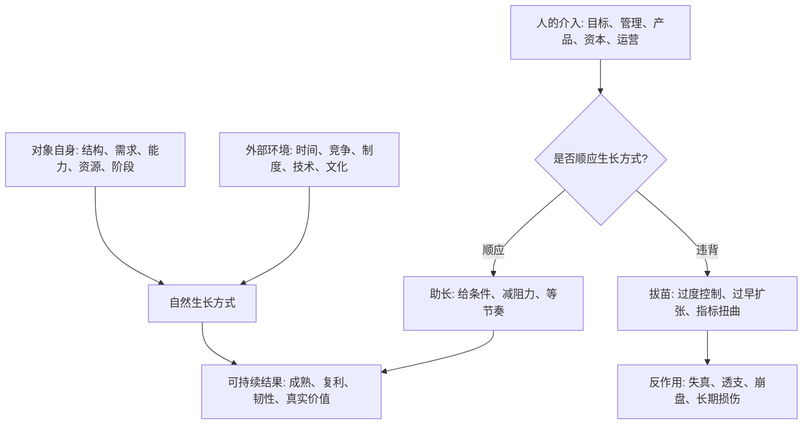
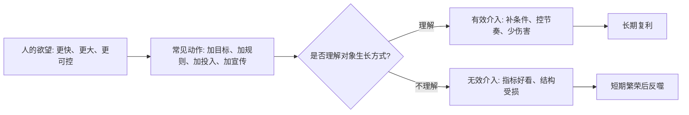
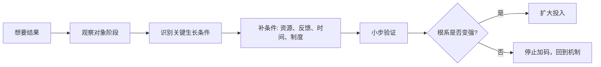

## 道家思维筑基课: 自然公理: 万物有自己的生长方式

### 作者
digoal

### 日期
2026-05-18

### 标签
自然公理 , 生长方式 , 事物机制 , 阶段判断 , 产品增长 , 运营节奏 , 创业扩张 , 投资纪律 , 现金流 , 反拔苗

----

## 背景

> 面向对象: 大学生、产品经理、运营经理、有投资需求的人  
> 核心问题: 世界表面变化很快，热点、工具、平台、赛道和价格每天都在变。但很多失败不是因为人不努力，而是因为把自己的意愿强加给对象，违背了对象自己的生长方式。  
> 先说结论: “自然”不是放任不管，而是承认每个对象都有自己的结构、节律、约束和成熟路径。真正高明的行动，是先理解它怎样生长，再选择介入的位置、力度和时间。

本文把“自然公理”当作一个认知公理来讲。它不能在道家系统内部被“证明”，而是道家选择的一种看世界的起点: 万物不是靠人的命令才运行，而是在自身条件、外部环境和时间节律中展开。

## 一张图先看懂



一句话版:

```text
自然 = 对象按自身条件成长的方式
人为 = 人对对象施加的目标、工具和控制

好的人为，是顺着自然补条件。
坏的人为，是无视自然强改节奏。
```

## 求真讲法

### 它到底说了什么

“自然公理”可以拆成四句话。

第一，任何事物都有自己的生成条件。一个学生的能力、一个产品的留存、一个组织的文化、一个企业的利润，都不是靠一句口号立刻出现的。

第二，生长有阶段。种子、幼苗、开花、结果不是同一个阶段；冷启动、验证需求、规模化、组织化也不是同一个阶段。不同阶段需要不同方法。

第三，外部力量只能改变条件，不能直接替代生长。老师能设计练习，不能替学生理解；产品经理能降低使用成本，不能替用户产生需求；资本能提供资源，不能替企业形成护城河。

第四，违背生长方式会产生反作用。拔苗助长看似让苗变高，实际破坏根系；补贴堆增长看似让数据变好，实际可能破坏真实需求判断。

所以，“自然”不是“随便发生”，而是“按对象自己的结构发生”。

### 它是怎么来的

《道德经》里有一句核心线索: “人法地，地法天，天法道，道法自然。”这里的“自然”不是现代口语里的自然界，也不是“什么都别管”，而是“自己如此”“按其自身方式而然”。

道家选择这条公理，是为了反对一种常见幻觉: 只要我有目标、有权力、有资源、有方法，就能按我的意志重塑世界。

但真实世界经常不是这样。

一个人不能靠焦虑跳过训练过程。一个社区不能靠活动口号立刻形成信任。一个产品不能靠堆功能替代真实场景。一个企业不能靠融资规模替代商业模式。一个投资标的不能靠主题热度替代长期现金流。

自然公理要解决的问题，就是把判断重心从“我想要什么”转回“对象如何生长”。



### 它依赖哪些假设

这条公理依赖五个假设。

第一，对象有内在结构。人有身体和认知限制，产品有使用场景和替代方案，组织有激励和信任结构，企业有成本、供需和竞争位置。

第二，时间不可压缩到零。理解、信任、品牌、能力、网络效应、组织文化都需要积累，不能无限加速。

第三，资源不是越多越好。过多资源如果超过吸收能力，会造成浪费、依赖、失真和路径错误。

第四，阶段决定方法。同样是增长，验证期要找真实需求，扩张期要复制效率，成熟期要维护质量和现金流。

第五，长期结果会惩罚违背机制的短期动作。短期 KPI、融资叙事、流量冲刺和价格炒作都可能暂时有效，但如果不符合对象的生长方式，最终会回吐。

### 常见误解

| 误解 | 为什么不对 | 更准确的理解 |
|---|---|---|
| 自然就是不干预 | 很多事需要教育、管理、训练和制度 | 干预要顺着对象机制，而不是替代机制 |
| 顺其自然就是躺平 | 躺平是不承担建设条件的责任 | 顺其自然是识别节律、减少妄动、精准用力 |
| 生长方式是固定不变的 | 对象会随环境变化而变化 | 不变的是“要尊重机制”，不是某个具体方法永远有效 |
| 只要资源足够就能催熟 | 资源超过吸收能力会伤害系统 | 资源要匹配阶段、能力和真实需求 |
| 指标增长就是健康成长 | 指标可能被补贴、刷量、短期刺激扭曲 | 健康成长要看留存、复购、口碑、现金流和能力积累 |

## 求存讲法

### 它有什么用

自然公理最有用的地方，是帮人判断“什么时候该用力，什么时候该等，什么时候该停”。

对个人，它提醒你别用焦虑破坏长期能力。学习、身体、表达、关系、专业判断，都有训练周期。

对产品，它提醒你别用功能和概念掩盖需求不成立。产品的生长来自用户场景、使用频率、价值感知和替代成本。

对运营，它提醒你别把短期指标当成长。真正的运营是在正确人群中建立可重复的价值连接。

对创业，它提醒你别拿融资节奏替代商业节奏。公司不是融资越快越健康，而是需求、交付、组织、现金流共同成熟。

对投资，它提醒你别把市场热度当企业成长。企业价值的生长来自可理解的生意、长期竞争优势、真实现金流、可靠管理和合理价格。

### 它怎么迁移到熟悉领域

| 领域 | 对象的自然生长方式 | 违背方式 | 正确介入 |
|---|---|---|---|
| 学习 | 概念理解、练习反馈、迁移应用逐步形成 | 只刷题、不复盘、靠熬夜硬顶 | 降低题量，提高反馈质量，按薄弱点训练 |
| 产品 | 从真实场景到稳定使用，再到规模复制 | 没验证需求就堆功能、追热点 | 先找高频痛点和替代方案，再做最小可用闭环 |
| 运营 | 从种子用户信任到内容/活动/渠道复用 | 用补贴和噱头制造虚假活跃 | 区分真实留存和刺激性活跃 |
| 创业 | 需求验证、交付稳定、单位经济模型、组织复制 | 融资后盲目扩张、过早多线作战 | 按阶段配置资源，先证明可重复 |
| 投融资 | 企业价值由长期现金流和竞争优势复利形成 | 只追主题、估值和短期涨跌 | 先问是否在能力圈内，再看护城河、现金流和安全边际 |

### 它的适用范围和边界

自然公理适合处理复杂系统: 教育、职业成长、产品建设、社区运营、组织管理、创业扩张、长期投资。

它不适合被滥用成三种借口。

第一，不能用“自然”否定必要干预。疾病、安全事故、财务造假、组织腐败、产品重大缺陷，都需要及时处理。

第二，不能用“自然”合理化现状。一个人贫穷、一个组织低效、一个市场被垄断，并不等于它们“本来就应该这样”。

第三，不能把“等生长”变成拖延。自然有节律，但节律不是借口。你仍然要施肥、除草、修枝、观察天气。

更准确地说: 自然公理不是让你少做事，而是让你少做破坏生长的事，多做创造条件的事。

### 正例: 怎么用它提升能力

假设你是运营经理，负责一个知识付费社群。老板希望三个月内把社群从 2000 人做到 10 万人。

如果只看表面增长，你可能会大量投放、低价拉新、堆活动、催用户转发。数据可能短期好看，但社群里的信任、内容质量、答疑能力和用户连接还没长出来，结果是大量低质量用户进入，老用户体验下降，运营团队被客服和活动压垮。

按自然公理，先判断社群的生长方式:

1. 这个社群靠什么形成信任？
2. 用户为什么留下，是内容、陪伴、资源、身份，还是结果交付？
3. 当前团队能服务多少高质量用户？
4. 哪些活动能沉淀复用资产，哪些只是一次性热闹？
5. 扩张会不会破坏原有密度和氛围？

更稳的做法是: 先把 2000 人里的真实需求、复购原因、内容供给和服务边界弄清楚，再扩大到 5000、1 万、3 万。每次扩张都检查留存、转介绍、客服压力和内容质量。这样增长慢一些，但根系更深。

### 反例: 前提不成立会怎样

一个创业公司刚做出原型，还没有证明用户愿意持续付费，就因为站上热门赛道拿到融资。团队立刻扩张销售、市场、品牌和多个产品线，试图“抢窗口”。

表面看，这是高速成长。按自然公理看，问题是它跳过了生长阶段: 需求没有验证，交付没有稳定，单位经济模型没有跑通，组织也没有形成复制能力。

一旦融资环境变冷、获客成本上升或客户续费不足，公司就会暴露真实状态: 人多、钱烧得快、产品线复杂、现金流薄弱。这里失败的前提是“资源可以替代成熟”。当这个前提不成立，资本反而会放大未成熟系统的脆弱性。

投融资里也一样。一个公司如果没有可理解的赚钱方式、稳定的竞争优势和可靠现金流，仅靠“赛道正在生长”并不等于“这家公司会自然长大”。行业有行业的自然，公司有公司的自然，股票价格还有市场情绪的自然，三者不能混为一谈。

### 一个实用检查表

```text
判断一个对象能不能健康成长，先问八个问题:

1. 它现在处于哪个阶段: 种子、幼苗、扩张、成熟，还是衰退?
2. 它真正依赖的生长条件是什么?
3. 哪些变量可以加速，哪些变量不能硬压缩?
4. 当前资源是否超过它的吸收能力?
5. 指标增长来自真实需求，还是刺激、补贴、包装和短期情绪?
6. 如果停止外部输血，它还能不能继续运转?
7. 扩张会增强根系，还是消耗根系?
8. 什么信号说明我该停下来，而不是继续加码?
```

## 思考

现代社会最容易制造一种错觉: 只要速度足够快，就能赢。

但自然公理提醒我们，速度不是单独存在的。速度必须和对象的承载力匹配。树长得太快可能木质疏松，人升得太快可能能力空心化，产品扩得太快可能服务崩掉，企业融得太快可能纪律消失，资产涨得太快可能透支未来收益。

真正的问题不是“快好还是慢好”，而是“快是否符合生长方式”。



一个反事实问题值得长期保留:

如果不能加预算、不能换名字、不能靠短期刺激、不能透支未来，这件事还会不会自己变好？

如果会，说明它可能有真实生长力。  
如果不会，说明你看到的也许只是外部推力，不是自然生长。

## 最后记住

1. 自然公理不是“放任”，而是承认万物都有自己的结构、阶段、节律和约束。
2. 好的行动不是替代生长，而是补充生长条件、降低阻力、避免伤根。
3. 生活、产品、运营、创业和投资里，最危险的是用人的欲望强改对象的生长节奏。
4. 短期指标可能被刺激出来，长期价值必须从真实机制里长出来。
5. 每次想加速之前，先问: 我是在帮助它长根，还是只是在把它往上拔？

## 参考资料

- 《道德经》第二十五章: “人法地，地法天，天法道，道法自然”的思想线索。
- 《道德经》第六十四章: “合抱之木，生于毫末；九层之台，起于累土；千里之行，始于足下”的渐进生长思想。
- 《庄子·养生主》: 关于顺应对象纹理、避免强行用力的思想线索。
- 冯友兰《中国哲学简史》: 关于老庄“自然”“无为”思想的通行解释框架。
- 陈鼓应《老子今注今译》《庄子今注今译》: 关于道家文本章句和现代注释的参考。
- Warren Buffett 投资思想中的能力圈、长期主义、现金流、护城河和安全边际，可作为“尊重企业自身生长方式”的现代商业参照。
- 本文未联网检索，主要基于经典文本、通行中国哲学史解释和常见产品/运营/创业/投资分析框架整理；投融资部分是原则教育，不构成具体投资建议。
  
#### [PostgreSQL 解决方案集合](../201706/20170601_02.md "40cff096e9ed7122c512b35d8561d9c8")
  
  
#### [德哥 / digoal's Github - 公益是一辈子的事.](https://github.com/digoal/blog/blob/master/README.md "22709685feb7cab07d30f30387f0a9ae")
  
  
#### [About 德哥](https://github.com/digoal/blog/blob/master/me/readme.md "a37735981e7704886ffd590565582dd0")
  
  

  
