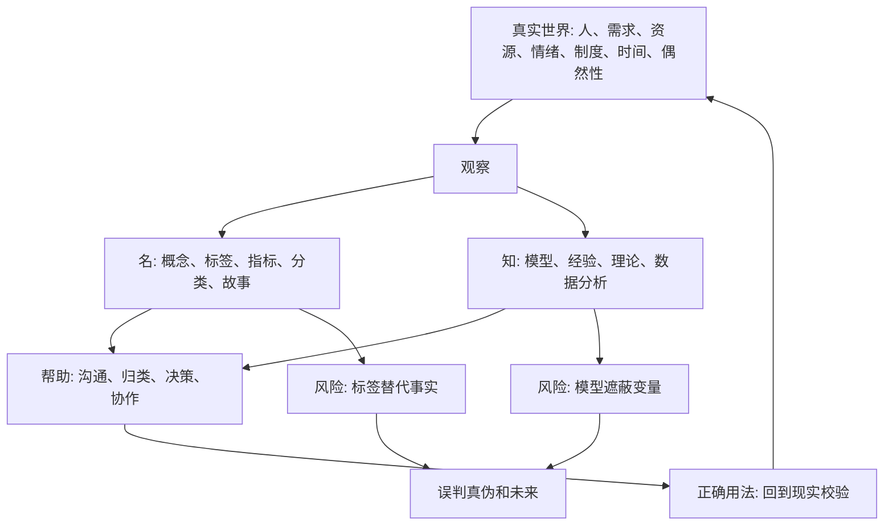
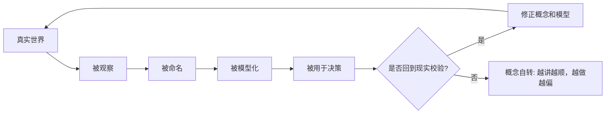

## 道家思维筑基课: 名与知有限: 概念不是世界本身

### 作者
digoal

### 日期
2026-05-18

### 标签
名与知有限 , 概念边界 , 模型局限 , 指标失真 , 用户画像 , 产品判断 , 运营指标 , 创业叙事 , 估值模型 , 现实反馈

----

## 背景

> 面向对象: 大学生、产品经理、运营经理、有投资需求的人  
> 核心问题: 世界变化太快，概念、指标、模型、画像、估值、赛道名不断更新。人如果把这些认知工具当成世界本身，就会误判真假、误读趋势、误投资源。  
> 先说结论: “名与知有限”不是反对概念和知识，而是提醒我们: 概念只是对现实的压缩，知识只是从某个角度建立的模型。概念能帮助判断，也会遮蔽事实；模型能提高效率，也会制造盲区。

本文把“名与知有限”当作一个认知公理来讲。它不能在道家系统内部被证明，而是道家看世界时选择的出发点: 人必须借助语言、分类和知识理解世界，但任何语言、分类和知识都不等于世界本身。

## 一张图先看懂



一句话版:

```text
现实 > 观察 > 概念/模型 > 决策

错误发生在:
把概念当现实
把模型当真理
把指标当结果
把知道当做到
```

## 求真讲法

### 它到底说了什么

“名与知有限”可以拆成四句话。

第一，名字不是事物本身。一个人被叫作“高潜人才”，不等于他已经有长期创造价值的能力；一个产品被叫作“AI Agent”，不等于它真的能稳定完成任务；一个公司被叫作“龙头”，不等于它的竞争优势没有变化。

第二，概念是压缩。现实很复杂，概念把许多细节压成一个词。压缩让沟通变快，也一定会丢信息。

第三，知识是模型。模型不是现实的复制品，而是为了某个目的抓住一部分变量。财务模型抓现金流，用户画像抓典型行为，增长模型抓转化路径，哲学概念抓存在方式。它们都有用，但都有边界。

第四，越复杂的领域，越不能只靠一个概念判断。生活、产品、运营、创业、投融资都不是单变量系统。一个标签可能让人看见方向，也可能让人忽略关键变量。

所以，这条公理不是让人反智，而是让人保持认知谦逊: 你知道的，通常只是现实的一部分。

### 它是怎么来的

《道德经》开篇说“道可道，非常道；名可名，非常名”。这里的重点不是玩文字游戏，而是指出语言无法穷尽世界。能说出的“道”，已经是被表达、被切分、被简化后的道；能命名的“名”，也不是永恒固定的名。

《庄子·齐物论》进一步讨论“彼此”“是非”“成心”。人常常站在自己的位置，用自己的分类系统判断世界，然后误以为这个分类系统就是世界本身。

道家选择“名与知有限”这条公理，是为了防止三种认知危险:

1. 语言危险: 被词语的气势骗住。
2. 分类危险: 把连续变化的世界切成僵硬标签。
3. 知识危险: 掌握一个模型后，以为所有问题都能用它解释。

用现代话说，就是“地图不是疆域”。地图有用，但地图永远比疆域简单。



### 它依赖哪些假设

这条公理依赖五个假设。

第一，真实世界的复杂度高于语言表达。任何词语都只能抓住某些方面，放弃另一些方面。

第二，观察者有位置。大学生、产品经理、运营经理、创业者、投资者看到的是不同切面，不存在完全无视角的观察。

第三，知识有目的。一个模型为了提高某类判断效率，必然会忽略暂时不重要的变量。

第四，概念会反过来影响行动。人一旦相信某个概念，就会按它组织资源、解释数据、说服别人，甚至忽略反证。

第五，现实会惩罚脱离校验的概念。用户不留存、现金流断裂、关系破裂、身体崩溃、投资亏损，都是现实对错误概念的反馈。

### 常见误解

| 误解 | 为什么不对 | 更准确的理解 |
|---|---|---|
| 概念没用 | 没有概念，人无法沟通、学习和组织行动 | 概念有用，但不能替代现实校验 |
| 知识越多判断越准 | 知识越多，也可能越会合理化错误 | 关键是知识是否贴近问题、是否能被反馈修正 |
| 数据不会骗人 | 数据口径、采样、指标设计都会影响结论 | 数据是现实的切片，不是现实全体 |
| 用户画像就代表用户 | 画像是抽象出来的典型，不是活人本身 | 画像必须不断回到真实行为和访谈校准 |
| 估值模型能算出价值 | 模型依赖假设，假设错了结果会很精确地错误 | 估值是思考框架，不是自动答案 |

## 求存讲法

### 它有什么用

“名与知有限”最有用的地方，是让人在复杂世界中保留校验能力。

对大学生，它提醒你: 专业、学历、证书、MBTI、实习 title 都是标签，不等于能力、判断力和长期可靠性。

对产品经理，它提醒你: 用户画像、需求池、PRD、功能名、竞品分类都只是工具。真正的用户行为经常比文档更诚实。

对运营经理，它提醒你: DAU、GMV、转化率、打开率、复购率都只是指标。指标可以帮你看见问题，也可能诱导你制造虚假繁荣。

对创业者，它提醒你: 赛道、商业模式、战略定位、品牌叙事都不是公司本身。公司真正活在客户、交付、组织、成本和现金流里。

对投资者，它提醒你: “成长股”“价值股”“龙头”“高股息”“AI 概念”“低估值”都是分类，不是安全保证。真正要问的是生意是否能理解、竞争优势是否持续、现金流是否真实、价格是否合理。

### 它怎么迁移到熟悉领域

| 场景 | 容易被误当成现实的“名/知” | 应该回到的现实 |
|---|---|---|
| 职业选择 | 热门专业、高薪岗位、性格测试 | 真实能力、兴趣耐受度、行业供需、长期学习曲线 |
| 产品设计 | 用户画像、需求优先级、功能清单 | 用户真实任务、替代方案、使用频率、失败场景 |
| 运营增长 | DAU、GMV、裂变率、投放 ROI | 留存质量、复购动机、获客成本、信任消耗 |
| 创业融资 | 赛道名、商业模式、市场规模 PPT | 客户付费、交付成本、组织能力、现金流周期 |
| 投融资 | 估值模型、行业标签、券商叙事 | 企业赚钱机制、护城河、管理层、负债、买入价格 |

### 它的适用范围和边界

这条公理适合用于所有依赖概念、数据和模型的判断场景。越是抽象的领域，越要用它提醒自己: 我看到的是地图，不是疆域。

但它有边界。

第一，不能因为概念有限，就拒绝概念。没有概念，复杂世界会变成一团混乱。

第二，不能因为模型有限，就拒绝模型。没有模型，人只能靠直觉和情绪判断，错误会更多。

第三，不能因为知识有限，就滑向“什么都不知道”。更成熟的态度是: 用知识，但知道知识的边界；用模型，但持续校验模型；用概念，但不被概念奴役。

### 正例: 怎么用它提升能力

假设你是产品经理，负责提升一个学习 App 的留存。数据看起来很清楚: 新用户第 2 天留存低。团队给出一个概念解释: “用户缺少激励”。于是准备做积分、勋章、排行榜。

如果你相信“激励不足”这个概念就是现实，很可能直接开工。但按“名与知有限”的方法，应该先承认这个概念只是一个假设。

更好的做法是:

1. 把“激励不足”改写成可验证问题: 用户为什么第二天没回来？
2. 拆分样本: 新手、备考用户、兴趣用户、付费用户是否一样？
3. 看行为路径: 是注册后没找到课程，还是第一节课太难，还是提醒时机不对？
4. 做访谈和回放: 用户原话与数据是否一致？
5. 小范围测试: 积分、学习计划、课程推荐、老师反馈哪个更有效？

最后你可能发现，问题不是激励不足，而是第一节课难度太高、课程路径不清楚。这样，概念被现实校正，产品动作才不会跑偏。

### 反例: 前提不成立会怎样

一个投资者学会了“低市盈率就是便宜”这个概念，于是买入一批低 PE 公司。他认为自己在做价值投资。

这里的问题不是 PE 指标没用，而是他把一个估值指标当成了企业真实价值。低 PE 可能意味着市场错杀，也可能意味着利润不可持续、行业衰退、资产减值、债务风险、治理问题或周期顶部利润虚高。

这个反例失效的前提是“单一指标足以代表真实价值”。当这个前提不成立时，知识反而制造了自信幻觉。投资判断必须回到企业如何赚钱、利润能否变成现金、竞争优势是否持续、管理层是否可信、价格是否留有安全边际。

### 一个实用检查表

```text
当你准备相信一个概念、模型或指标时，先问九个问题:

1. 这个概念到底指向什么真实对象?
2. 它压缩了哪些信息，又丢掉了哪些信息?
3. 它来自事实、经验、理论，还是传播话术?
4. 它适用于什么场景，不适用于什么场景?
5. 它背后的关键假设是什么?
6. 哪些证据会证明它错了?
7. 有没有用户行为、现金流、复购、交付结果等现实反馈?
8. 我是不是因为喜欢这个概念，所以忽略了反例?
9. 如果不用这个概念，我还能怎样描述同一个问题?
```

## 思考

现代人的麻烦，不是没有知识，而是太容易把“知道某个概念”误认为“理解了世界”。

大学生知道很多职业名词，却未必知道自己能长期承受什么样的工作。产品经理掌握很多方法论，却未必知道用户真正在哪里卡住。运营经理盯着很多指标，却未必知道增长是否在消耗信任。创业者讲得清商业模式，却未必跑得通现金流。投资者能说出很多估值术语，却未必理解企业真实经营。

“名与知有限”要求我们建立一种反复回路:


一个反事实问题值得长期保留:

如果把所有高级词、模型名、指标名、行业标签都拿掉，你还能不能用朴素语言解释这件事为什么成立？

如果不能，说明你可能只掌握了“名”。  
如果能，并且能说清它在什么条件下会错，说明你才开始接近“知”。

## 最后记住

1. 名字、概念、指标、模型都是理解世界的工具，不是世界本身。
2. 知识越有用，越要知道它的边界；模型越精致，越要检查它的假设。
3. 生活、产品、运营、创业和投资里的重大误判，常常来自把标签当事实、把指标当结果、把模型当真理。
4. 真正可靠的判断，不是不用概念，而是让概念不断接受现实反馈。
5. 每次被一个新概念打动时，先问: 它解释了什么，又遮蔽了什么？

## 参考资料

- 《道德经》第一章: “道可道，非常道；名可名，非常名”的思想线索。
- 《庄子·齐物论》: 关于彼此、是非、成心和认知视角边界的讨论。
- 冯友兰《中国哲学简史》: 关于老庄哲学中名言、知识边界和相对视角的通行解释。
- 陈鼓应《老子今注今译》《庄子今注今译》: 关于相关章句和现代注释的参考。
- Alfred Korzybski, *Science and Sanity*: “地图不是疆域”的现代语义学表达，可作为“概念不是世界本身”的跨学科参照。
- George E. P. Box 关于“所有模型都是错的，但有些是有用的”的统计建模思想，可作为“模型有用但有限”的现代参照。
- 本文未联网检索，主要基于经典文本、通行中国哲学史解释和常见产品/运营/创业/投资分析框架整理；投融资部分是原则教育，不构成具体投资建议。
  
#### [PostgreSQL 解决方案集合](../201706/20170601_02.md "40cff096e9ed7122c512b35d8561d9c8")
  
  
#### [德哥 / digoal's Github - 公益是一辈子的事.](https://github.com/digoal/blog/blob/master/README.md "22709685feb7cab07d30f30387f0a9ae")
  
  
#### [About 德哥](https://github.com/digoal/blog/blob/master/me/readme.md "a37735981e7704886ffd590565582dd0")
  
  

  
