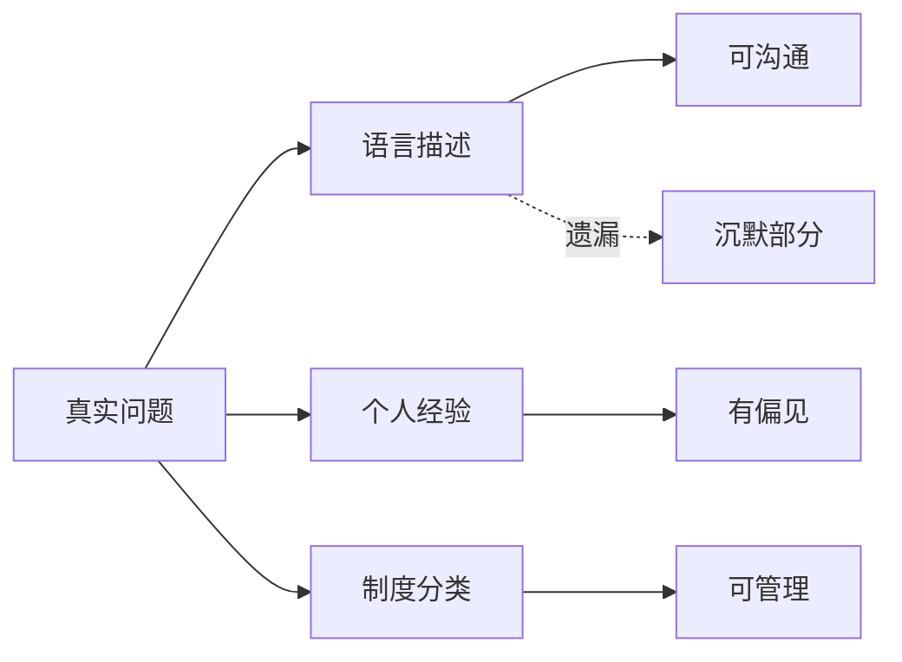

## 道家思维筑基课: 名与知有限: 概念不是世界本身

### 作者
digoal

### 日期
2026-05-18

### 标签
名与知有限 , 认知边界 , 语言 , 知识 , 判断 , 齐物论 , 庄子 , 视角 , 偏见 , 事实

----

## 背景
> 面向对象: 高中生到普通读者  
> 核心问题: 为什么道家总提醒人不要太相信自己的判断？  
> 先说结论: “名与知有限”认为，人的语言、知识和价值判断只能抓住世界的一部分。它不是反智，而是反对把局部认知绝对化。

## 一张图先看懂

## 求真讲法

### 它到底说了什么

人认识世界要靠概念，但概念会简化世界。比如“内向”这个词有用，但它可能混合了害羞、谨慎、专注、社交疲劳等不同现象。

道家不是说知识没用，而是说知识一旦忘记自己的边界，就会变成偏见。

### 它是怎么来的

这是道家对人类认知的基本假设。《庄子·齐物论》尤其关心“是非”如何被位置、经验和成见塑造。

### 它依赖哪些假设

| 假设 | 解释 |
|---|---|
| 人总从某个位置看世界 | 没有人拥有全视角 |
| 语言必须压缩现实 | 一句话不能装下全部条件 |
| 判断受欲望影响 | 想赢、想证明自己会扭曲观察 |

### 常见误解

| 误解 | 更准确的理解 |
|---|---|
| 既然知识有限，就不用学习 | 正因为有限，才要持续修正 |
| 所有观点都一样 | 观点有证据强弱，只是都要说明边界 |
| 道家否认事实 | 道家主要警惕把解释当事实 |

## 求存讲法

### 它有什么用

它能降低争论、决策和自我评价中的盲目确定性。

### 它怎么迁移到熟悉领域

| 做法 | 效果 |
|---|---|
| 把“我确定”换成“在这些条件下我判断” | 给修正留空间 |
| 把评价拆成事实、解释、情绪 | 减少误伤 |
| 主动找反例 | 防止自我封闭 |

### 它的适用范围和边界

适合复杂判断和价值冲突。不适合拿来模糊明确事实，例如“是否迟到”“是否抄袭”“数据是否造假”。

### 正例: 怎么用它提升能力

同学没有回复消息，你先不下结论“他看不起我”，而是列出可能性: 忙、没看到、不知怎么回、关系确实变淡。这样你会少很多误判。

### 反例: 前提不成立会怎样

考试答案有明确计算结果时，如果说“每个人都有自己的理解”，就误用了认知边界。这里存在可验证标准，不能用多视角逃避检验。

## 思考

成熟不是没有判断，而是知道判断从哪里来、能管到哪里、什么时候该改。

## 最后记住

1. 概念是工具，不是世界本身。
2. 知识越有用，越要说明适用条件。
3. 多视角不是取消事实。
4. 道家的认知谦逊是为了更准确地行动。

## 参考资料

- 《庄子·齐物论》。
- 《道德经》第1章、第56章。
- 冯友兰《中国哲学简史》。
- 本文未联网检索，基于经典文本和通行解释整理。
  
#### [PostgreSQL 解决方案集合](../201706/20170601_02.md "40cff096e9ed7122c512b35d8561d9c8")
  
  
#### [德哥 / digoal's Github - 公益是一辈子的事.](https://github.com/digoal/blog/blob/master/README.md "22709685feb7cab07d30f30387f0a9ae")
  
  
#### [About 德哥](https://github.com/digoal/blog/blob/master/me/readme.md "a37735981e7704886ffd590565582dd0")
  
  

  
