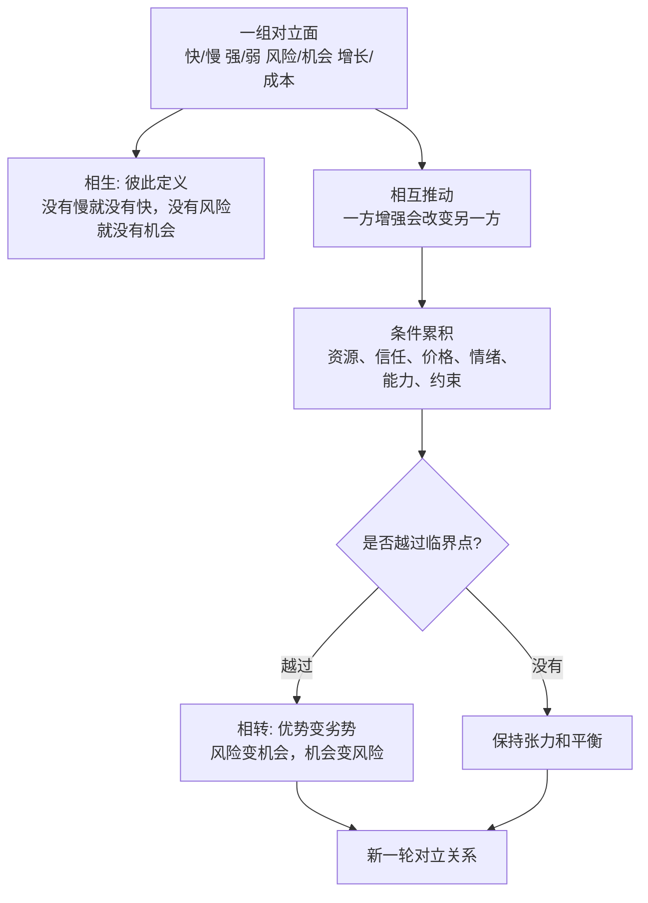
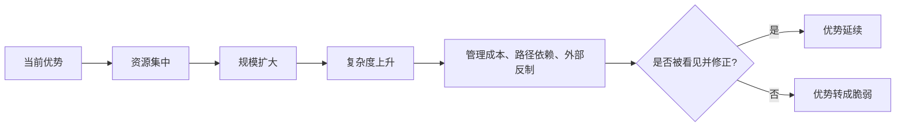
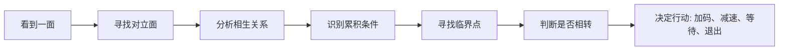

## 道家思维筑基课: 对立相生相转: 事物常在反面中生成

### 作者
digoal

### 日期
2026-05-18

### 标签
对立相生 , 对立相转 , 反面生成 , 临界点 , 复杂系统 , 产品复杂度 , 运营刺激 , 创业扩张 , 投资风险 , 承载力

----

## 背景

> 面向对象: 大学生、产品经理、运营经理、有投资需求的人  
> 核心问题: 世界表面变化太快，人很容易把“好/坏、快/慢、强/弱、风险/机会、增长/衰退”看成固定标签。这样会错过反转点，也会把优势用成劣势。  
> 先说结论: “对立相生相转”说的是: 许多事物不是孤立存在，而是在对立关系中被定义、被推动，并在条件变化时互相转化。判断未来，不能只看当前哪一面更强，还要看它是否正在制造自己的反面。

本文把“对立相生相转”当作一个认知公理来讲。它不能在道家系统内部被证明，而是道家观察世界时选择的基本出发点: 有和无、难和易、长和短、高和下、祸和福、强和弱，常常不是绝对分离，而是互相依赖、互相生成、互相转化。

## 一张图先看懂



一句话版:

```text
相生 = 对立双方互相定义、互相需要
相转 = 条件变化到一定程度后，一方会转向另一方

高增长可能生成高脆弱。
低关注可能生成低估机会。
强控制可能生成低创造力。
短期优势可能生成长期代价。
```

## 求真讲法

### 它到底说了什么

“对立相生相转”可以拆成三层。

第一层是相生。很多概念不是单独存在的，而是靠对立面才被理解。没有“慢”，就很难说什么叫“快”；没有“风险”，就很难说什么叫“安全”；没有“成本”，就很难说什么叫“收益”。

第二层是相互推动。对立双方不是静止摆在那里，而是会互相影响。一个产品追求更多功能，可能带来更高复杂度；一个公司追求更快增长，可能带来更高管理压力；一个资产价格越涨，可能越吸引资金，也可能越降低未来收益率。

第三层是相转。当一方发展到极端，或者外部条件变化，它可能转成自己的反面。高效率可能变成低韧性，高杠杆可能把收益放大成亏损，强品牌可能因傲慢变成信任危机。

这条公理的关键不是“凡事都会反转”这么简单，而是提醒你追问: 什么条件下会反转？反转信号是什么？当前的优势正在积累什么代价？

### 它是怎么来的

《道德经》第二章说: “有无相生，难易相成，长短相形，高下相倾，音声相和，前后相随。”这不是在讲文字对仗，而是在讲一种关系型世界观: 很多东西不是孤立实体，而是在关系中成立。

《道德经》第四十章又说“反者道之动”，强调事物运行中有返回、反向、转化的运动。强到极处会暴露脆弱，满到极处会失去余地，争到极处会增加对抗。

道家选择这条公理，是为了对抗一种线性幻觉: 以为好的会一直好，强的会一直强，快的会一直快，热的会一直热。

现实经常不是线性的。很多系统越成功，越会制造下一阶段的问题。



### 它依赖哪些假设

这条公理依赖五个假设。

第一，事物处在关系中。一个变量的意义常常取决于另一个变量，不存在完全孤立的好坏。

第二，系统有边界和承载力。增长、速度、控制、杠杆、曝光、补贴、情绪都不能无限增加。

第三，对立双方会互相制造条件。机会吸引竞争，增长带来成本，安全制造保守，自由带来不确定。

第四，时间会暴露代价。短期被遮住的反面，常常在长期重新出现。

第五，转化需要条件，不是自动发生。不是所有弱都会变强，也不是所有风险都会变机会；必须看资源、结构、节奏和临界点。

### 常见误解

| 误解 | 为什么不对 | 更准确的理解 |
|---|---|---|
| 对立相转就是玄学反转 | 不是看到好就说会坏，看到坏就说会好 | 要说明条件、机制和临界点 |
| 弱一定胜强 | 弱如果没有积累条件，只会继续弱 | 柔弱胜刚强的前提是有弹性、耐心和环境变化 |
| 风险就是机会 | 很多风险只会带来损失 | 只有被误定价、可承受、可理解的风险才可能是机会 |
| 增长越快越好 | 快增长会带来组织、质量和现金流压力 | 快要匹配承载力，否则增长会变成脆弱 |
| 平衡就是中庸保守 | 平衡不是平均用力 | 平衡是知道一方过强会制造反作用 |

## 求存讲法

### 它有什么用

这条公理最有用的地方，是帮你识别“反面正在生成”的时刻。

对个人，过度追求效率可能损害健康和创造力；过度追求稳定可能失去成长机会。

对产品，功能越多不一定价值越高，可能让新用户更难上手；极简也不一定更好，可能无法覆盖关键场景。

对运营，短期促销能拉动 GMV，也可能训练用户只在低价时购买；强刺激能拉活跃，也可能透支信任。

对创业，融资能加速，也可能让公司跳过需求验证；规模能降低成本，也可能提高组织复杂度。

对投融资，市场恐惧可能带来低估机会，市场狂热也可能把好资产变成差投资。好公司不等于好价格，差情绪不等于差价值。

### 它怎么迁移到熟悉领域

| 场景 | 表面优势 | 正在生成的反面 | 关键检查 |
|---|---|---|---|
| 学习 | 刷题速度快 | 概念理解变浅 | 能否解释给别人听，能否迁移到新题 |
| 产品 | 功能很全 | 使用门槛升高 | 新用户首日是否完成核心任务 |
| 运营 | 补贴带来增长 | 用户只为补贴而来 | 去掉补贴后留存和复购是否还在 |
| 创业 | 融资充足 | 纪律松动、成本刚性 | 单位经济模型是否成立，现金流是否可控 |
| 投融资 | 热门赛道、高增长 | 估值透支、竞争拥挤 | 增长能否转化为自由现金流，价格是否留安全边际 |

### 它的适用范围和边界

它适合处理动态系统: 职业成长、产品复杂度、运营指标、组织扩张、商业周期、资产定价、关系管理。

它不适合被滥用成三种错误。

第一，不能把它变成宿命论。不是所有成功都会失败，也不是所有失败都会成功。转化需要条件。

第二，不能把它变成唱反调。别人看多你就看空，别人看空你就看多，这不是洞察，只是情绪反向。

第三，不能只看反面而不行动。知道风险会生成，不等于拒绝增长、拒绝机会、拒绝投资。关键是控制条件、识别临界点、保留余地。

更准确地说: 对立相生相转不是教人悲观，而是教人不要被单边叙事控制。

### 正例: 怎么用它提升能力

假设你是产品经理，负责一个 B 端工具。老客户不断要求新功能，销售也说功能越多越容易成交。表面看，“功能多”是优势。

按对立相生相转的思路，你要同时看它正在生成的反面:

1. 功能多会不会让新用户学习成本上升？
2. 配置项增加会不会让交付和客服成本上升？
3. 定制化越多，会不会削弱产品标准化能力？
4. 销售短期更容易签单，长期续费是否真的更好？
5. 是否存在一个临界点，超过后每个新功能都在降低整体体验？

可执行做法是: 把功能分成核心闭环、行业扩展、客户定制三类。核心闭环保留清晰，扩展能力做成模块，定制需求必须经过复用率和维护成本评估。这样不是拒绝增长，而是避免“功能优势”转化为“复杂度劣势”。

### 反例: 前提不成立会怎样

一个投资者看到某行业连续上涨，就认为“强者恒强”，于是追高买入。他只看到强势，没有追问强势正在生成什么反面。

可能的反面包括: 估值已经透支未来多年增长，竞争者被高利润吸引进入，监管开始关注，客户开始寻找替代方案，公司的资本开支和库存压力上升。

这里失效的前提是“当前强势可以线性外推”。当这个前提不成立时，越强的表面可能越接近脆弱点。投资判断不能只看趋势，还要看趋势背后的代价、承载力和价格。

但反过来也不能简单说“涨多了一定跌”。如果公司仍有强护城河、现金流持续增长、估值没有明显透支，强势也可能继续。关键不是反着猜，而是找转化条件。

### 一个实用检查表

```text
看到一个明显优势时，问:
1. 这个优势依赖什么条件?
2. 它正在制造什么成本、风险或反作用?
3. 哪个变量继续增加会从好事变坏事?
4. 临界点可能出现在哪里?
5. 有没有早期信号: 留存下降、现金流变差、投诉上升、负债增加、估值过高?

看到一个明显劣势时，问:
1. 这个劣势是否被市场过度放大?
2. 它是否逼出了新的能力、纪律或低成本结构?
3. 外部条件变化后，它会不会变成优势?
4. 我是否能承受等待过程中的代价?
5. 如果判断错了，最大损失是什么?
```

## 思考

现代社会喜欢单边叙事: 越快越好、越大越好、越智能越好、越便宜越好、越安全越好、越增长越好。

但对立相生相转提醒我们: 每个“越”字背后，都可能有一个被遮住的反面。

越快，可能越脆。  
越大，可能越慢。  
越便宜，可能越低质。  
越安全，可能越保守。  
越增长，可能越烧钱。  
越成功，可能越听不见真实反馈。

真正成熟的判断，不是停在“好或坏”，而是继续问:



一个反事实问题值得长期保留:

如果你现在最依赖的优势继续放大十倍，它会让你更强，还是会变成你的负担？

如果答案是“可能变成负担”，就说明反面已经在里面生成了。

## 最后记住

1. 对立相生: 很多事物靠对立面才成立，不能脱离关系判断好坏。
2. 对立相转: 一方发展到一定条件，可能转化成自己的反面。
3. 优势最危险的地方，是它常常在成功中积累下一阶段的脆弱。
4. 风险不自动等于机会，机会也不自动安全；关键看条件、价格、承受力和临界点。
5. 每次看到单边叙事，都问一句: 它正在生成什么反面？

## 参考资料

- 《道德经》第二章: “有无相生，难易相成，长短相形，高下相倾，音声相和，前后相随”的思想线索。
- 《道德经》第四十章: “反者道之动，弱者道之用”的思想线索。
- 《道德经》第五十八章: 关于祸福相倚、正奇相转的思想线索。
- 《庄子·齐物论》: 关于彼此、是非和视角转换的讨论。
- 冯友兰《中国哲学简史》: 关于老庄辩证思维和相对视角的通行解释。
- 陈鼓应《老子今注今译》《庄子今注今译》: 关于相关章句和现代注释的参考。
- 本文未联网检索，主要基于经典文本、通行中国哲学史解释和常见产品/运营/创业/投资分析框架整理；投融资部分是原则教育，不构成具体投资建议。
  
#### [PostgreSQL 解决方案集合](../201706/20170601_02.md "40cff096e9ed7122c512b35d8561d9c8")
  
  
#### [德哥 / digoal's Github - 公益是一辈子的事.](https://github.com/digoal/blog/blob/master/README.md "22709685feb7cab07d30f30387f0a9ae")
  
  
#### [About 德哥](https://github.com/digoal/blog/blob/master/me/readme.md "a37735981e7704886ffd590565582dd0")
  
  

  
