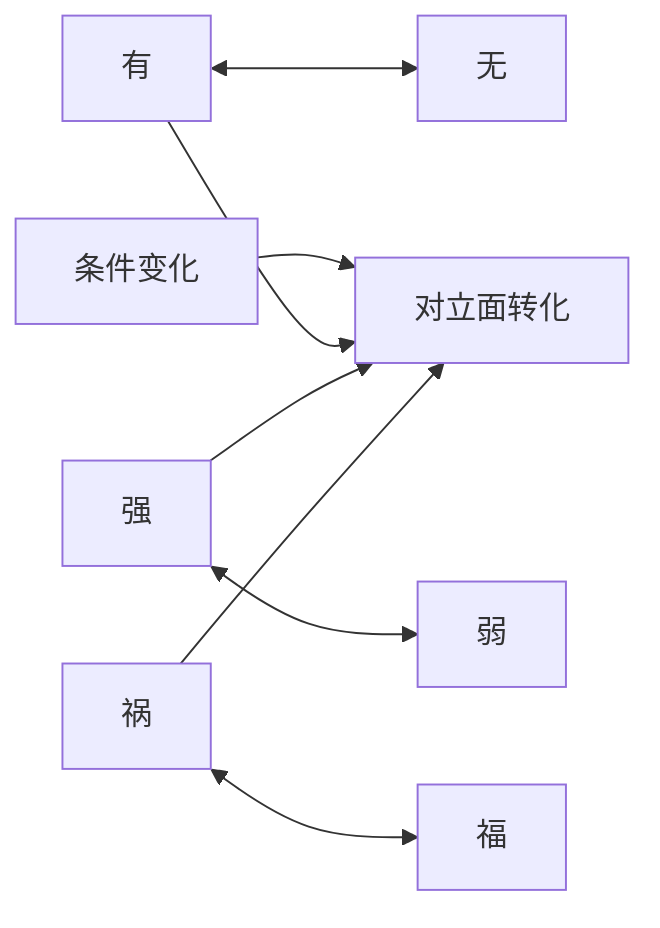

## 道家思维筑基课: 对立相生相转: 事物常在反面中生成

### 作者
digoal

### 日期
2026-05-18

### 标签
对立相生 , 对立转化 , 有无 , 强弱 , 祸福 , 反者道之动 , 动态平衡 , 道家 , 变化 , 系统思维

----

## 背景
> 面向对象: 高中生到普通读者  
> 核心问题: 为什么道家总把有无、难易、长短、祸福放在一起讲？  
> 先说结论: 对立相生相转是道家观察变化的底层公理。它认为许多对立面不是孤立敌人，而是互相定义、互相生成，并在条件变化时互相转化。

## 一张图先看懂

## 求真讲法

### 它到底说了什么

“长”要靠“短”来显出，“高”要靠“下”来显出，“难”要靠“易”来比较。很多概念不是单独成立的，而是在关系中成立。

更进一步，事物走到极端，可能向反面变化。太强可能变脆，太满可能外溢，太急可能变慢。

### 它是怎么来的

这是公理式观察，不是数学定理。道家从自然、社会和人生经验中看到: 对立不是固定不动的墙，而像跷跷板，条件一变，位置就变。

### 它依赖哪些假设

| 假设 | 说明 |
|---|---|
| 事物在关系中存在 | 强弱、得失、快慢都依赖比较 |
| 条件会变化 | 今天的优势可能变成明天的负担 |
| 极端会积累代价 | 过满、过强、过快都可能反噬 |

### 常见误解

| 误解 | 更准确的理解 |
|---|---|
| 任何坏事都会变好 | 转化需要条件，不是自动发生 |
| 道家否定努力 | 道家反对极端化努力 |
| 对立相生就是没有区别 | 正因为有区别，才有相生相转 |

## 求存讲法

### 它有什么用

它让人学会从“单点最优”转向“动态平衡”。

### 它怎么迁移到熟悉领域

| 领域 | 对立关系 | 启发 |
|---|---|---|
| 学习 | 速度/理解 | 快到不懂会变慢 |
| 工作 | 控制/授权 | 控制过度会降低责任感 |
| 金钱 | 收益/风险 | 高收益常伴随高波动 |

### 它的适用范围和边界

适合分析趋势、关系和系统副作用。不适合用作宿命论，不能说“坏到极点必然变好”。

### 正例: 怎么用它提升能力

复习时把“刷题量”和“错题复盘”配对看。只追题量，短期像进步，长期可能因为漏洞不补而停滞。

### 反例: 前提不成立会怎样

一个企业产品质量持续下降，却安慰自己“祸兮福所倚”，不修复质量问题。这里缺少转化条件，坏事不会自动变好。

## 思考

你现在追求的优势，会不会在某个条件下变成负担？

## 最后记住

1. 对立面常常互相定义。
2. 条件变化会带来方向变化。
3. 极端优势可能积累隐藏代价。
4. 道家看重动态平衡，而不是单边最大化。

## 参考资料

- 《道德经》第2章、第40章、第58章。
- 《庄子·齐物论》。
- 陈鼓应《老子今注今译》。
- 本文未联网检索，基于经典文本和通行解释整理。
  
#### [PostgreSQL 解决方案集合](../201706/20170601_02.md "40cff096e9ed7122c512b35d8561d9c8")
  
  
#### [德哥 / digoal's Github - 公益是一辈子的事.](https://github.com/digoal/blog/blob/master/README.md "22709685feb7cab07d30f30387f0a9ae")
  
  
#### [About 德哥](https://github.com/digoal/blog/blob/master/me/readme.md "a37735981e7704886ffd590565582dd0")
  
  

  
