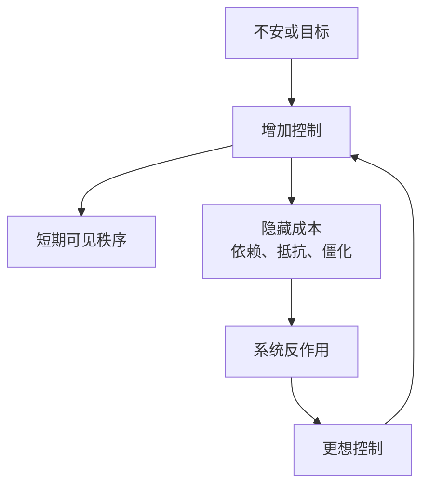

## 道家思维筑基课: 强控有反作用: 过度干预会制造新问题

### 作者
digoal

### 日期
2026-05-18

### 标签
强控有反作用 , 过度干预 , 无为 , 治理 , 控制 , 反作用 , 自组织 , 欲望 , 规则 , 系统风险

----

## 背景
> 面向对象: 高中生到普通读者  
> 核心问题: 为什么道家反复警惕欲望、机巧和过度治理？  
> 先说结论: 强控有反作用是道家关于行动代价的底层公理。它认为越想用硬控制消灭不确定，越可能破坏自发秩序，制造更大的反弹。

## 一张图先看懂

## 求真讲法

### 它到底说了什么

道家不是说控制一定错，而是说强控有成本。规则太密，人会只按规则钻空子；管理太细，人会失去判断；目标太满，人会牺牲长期健康。

### 它是怎么来的

这是公理式经验判断。乱世中，各家都在寻找秩序，道家看到另一面: 秩序工程本身也可能成为混乱来源。

### 它依赖哪些假设

| 假设 | 说明 |
|---|---|
| 系统有自组织能力 | 不是所有秩序都靠外部命令 |
| 人会响应激励 | 控制会改变人的行为 |
| 干预有副作用 | 看得见的改进可能伴随看不见的损耗 |

### 常见误解

| 误解 | 更准确的理解 |
|---|---|
| 道家反对规则 | 道家反对规则过密、过硬、过度替代判断 |
| 无控制最好 | 必要边界仍然重要 |
| 强控一定失败 | 强控可能短期有效，但长期代价要计算 |

## 求存讲法

### 它有什么用

它帮助人识别“我是在解决问题，还是在制造对问题的依赖”。

### 它怎么迁移到熟悉领域

| 场景 | 强控副作用 | 低干预替代 |
|---|---|---|
| 家庭教育 | 孩子只为检查而学 | 建立目标和复盘机制 |
| 团队管理 | 员工不再主动判断 | 明确边界后授权 |
| 时间管理 | 日程过满导致崩溃 | 留缓冲和恢复时间 |

### 它的适用范围和边界

适合复杂系统和长期协作。不适合用于高危场景的放任，比如实验室安全、医疗操作、财务合规。

### 正例: 怎么用它提升能力

老师不逐字改学生作文，而是指出最大结构问题，让学生自己重写。这样学生会形成判断力，而不是依赖老师。

### 反例: 前提不成立会怎样

如果化学实验涉及危险试剂，却说“少干预，学生自然会学会”，这就是误用。高风险场景需要明确规程和监督。

## 思考

你现在增加的控制，是让系统变强，还是让系统变得只能靠你维持？

## 最后记住

1. 控制不是免费工具。
2. 过度干预会削弱自发秩序。
3. 好规则要保留人的判断空间。
4. 少控制不等于无边界。

## 参考资料

- 《道德经》第37章、第48章、第57章、第60章。
- 《庄子·胠箧》。
- 冯友兰《中国哲学简史》。
- 本文未联网检索，基于经典文本和通行解释整理。
  
#### [PostgreSQL 解决方案集合](../201706/20170601_02.md "40cff096e9ed7122c512b35d8561d9c8")
  
  
#### [德哥 / digoal's Github - 公益是一辈子的事.](https://github.com/digoal/blog/blob/master/README.md "22709685feb7cab07d30f30387f0a9ae")
  
  
#### [About 德哥](https://github.com/digoal/blog/blob/master/me/readme.md "a37735981e7704886ffd590565582dd0")
  
  

  
