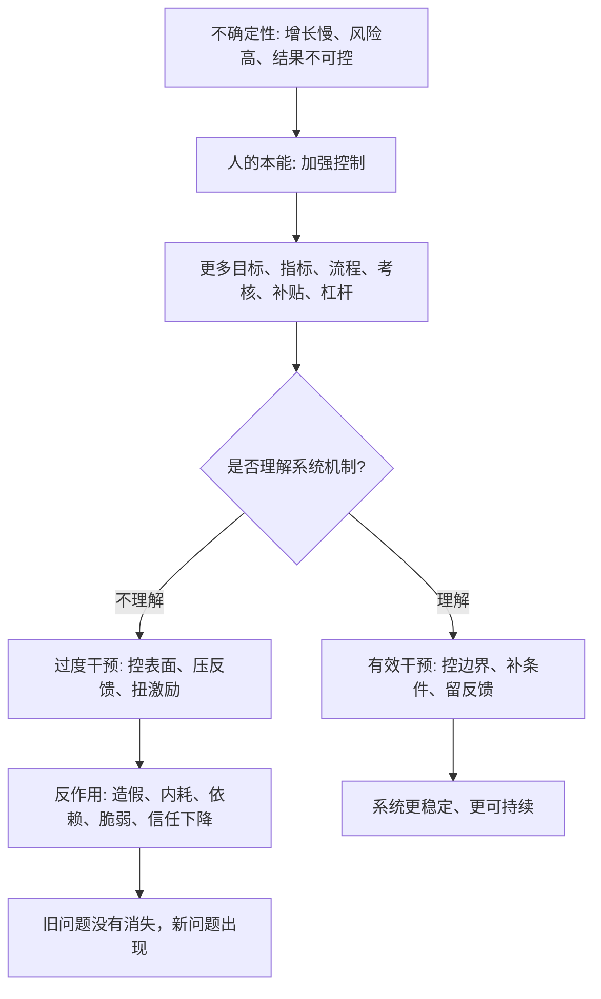
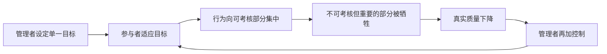
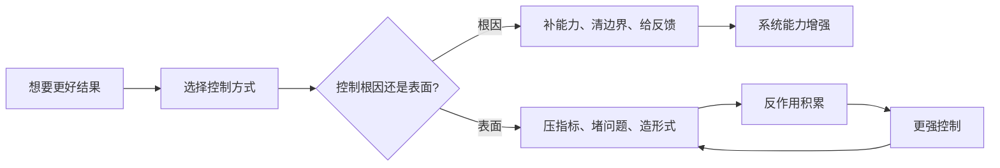

## 道家思维筑基课: 强控有反作用: 过度干预会制造新问题

### 作者
digoal

### 日期
2026-05-18

### 标签
强控反作用 , 过度干预 , 指标扭曲 , 激励机制 , 复杂系统 , 产品优化 , 运营KPI , 创业管理 , 投资风险 , 真实反馈

----

## 背景

> 面向对象: 大学生、产品经理、运营经理、有投资需求的人  
> 核心问题: 世界表面变化太快，人遇到不确定性时本能地想加强控制: 更多目标、更多指标、更多流程、更多投放、更多杠杆。但很多麻烦不是因为控制不够，而是因为控制方式破坏了系统本来的运行机制。  
> 先说结论: “强控有反作用”不是反对管理、规则和干预，而是提醒我们: 当控制超过系统承载力，或控制错了变量，就会扭曲激励、压制反馈、制造规避行为，并把旧问题改造成新问题。

本文把“强控有反作用”当作一个认知公理来讲。它不能在道家系统内部被证明，而是道家观察世界时选择的基本出发点: 复杂系统有自己的节律、反馈和自我调节能力；人的强行干预如果不理解这些机制，就会制造反作用。

## 一张图先看懂



一句话版:

```text
控制 = 人为设定目标、规则、资源和约束
反作用 = 系统为了适应控制而产生的新行为和新风险

控制得好，系统更清晰。
控制过度，系统会变形。
```

## 求真讲法

### 它到底说了什么

“强控有反作用”可以拆成四句话。

第一，控制本身不是问题。学习需要计划，产品需要规范，运营需要指标，创业需要预算，投资需要纪律。没有控制，复杂系统会混乱。

第二，问题出在“强控”: 不理解对象机制，只按人的意愿硬压结果。比如只看 GMV，不看利润和复购；只看上新速度，不看产品质量；只看短期涨幅，不看企业现金流。

第三，系统会对控制做出反应。学生会为了分数放弃理解，员工会为了 KPI 选择容易被计量的工作，用户会为了补贴而来，企业会为了融资叙事美化指标，市场会为了短期预期过度波动。

第四，反作用常常比原问题更隐蔽。表面指标好看了，但真实能力、信任、现金流、创造力、长期韧性可能被损坏。

所以，这条公理不是说“别管”，而是说: 管之前先问，你控制的是系统的根因，还是表面的影子？

### 它是怎么来的

《道德经》反复讨论“无为”与“有为”的边界。这里的“无为”不是不行动，而是不妄为、不强行替万物规定节奏。《道德经》中关于“治大国若烹小鲜”的说法，也可以理解为: 复杂系统不能频繁翻搅，过度扰动会破坏原有结构。

道家选择这条公理，是为了对抗一种控制幻觉: 只要目标更高、规则更细、奖惩更重、资源更多，结果就一定更好。

现实经常相反。很多系统不是线性机器，而是带反馈的复杂系统。你压一个变量，它会从别处弹回来。



这也是为什么很多组织越管越累，很多产品越优化越复杂，很多投资越想规避波动越做出错误交易。

### 它依赖哪些假设

这条公理依赖五个假设。

第一，许多对象是复杂系统。人、组织、产品、市场、关系、企业经营都有反馈、延迟和隐性变量。

第二，控制会改变被控制对象的行为。指标不是中立的，一旦成为考核目标，就会改变人的选择。

第三，表面变量不等于真实目标。分数不等于理解，点击不等于信任，GMV 不等于利润，股价不等于价值。

第四，反馈被压制后，系统会积累隐患。坏消息不敢上报，真实问题就不会消失，只会延后爆发。

第五，控制有成本。流程、审批、激励、补贴、杠杆、监督都会消耗资源，也会改变人和系统的行为方式。

### 常见误解

| 误解 | 为什么不对 | 更准确的理解 |
|---|---|---|
| 强控有反作用，所以不要管理 | 不管理会导致混乱和责任不清 | 需要管理，但要控制关键边界和真实变量 |
| 指标都是坏的 | 没有指标就难以观察和协作 | 指标要服务目标，不能替代目标 |
| 严格要求一定带来高质量 | 严格如果压错变量，会制造造假和内耗 | 高质量来自标准、反馈、能力和责任共同作用 |
| 补贴能买来增长 | 补贴能买来行为，不一定买来需求 | 要区分刺激性增长和真实留存 |
| 投资风险可以完全控制 | 风险只能识别、定价、分散和承受，不能消灭 | 过度避险也可能制造机会成本和错误交易 |

## 求存讲法

### 它有什么用

这条公理最有用的地方，是帮你识别“控制正在制造新问题”的时刻。

对个人，过度时间管理可能让你只完成清单，不再思考真正重要的事；过度自律可能压垮身体和情绪。

对产品，过度埋点和优化可能让团队只追局部转化率，却破坏整体体验。

对运营，过度 KPI 化可能让团队追求短期数据，牺牲用户信任和长期复购。

对创业，过度融资驱动可能让公司围着投资人叙事转，而不是围着客户价值转。

对投资，过度盯盘和止损规则可能让人被短期波动牵引，反而低卖高买。真正的风险控制不是每天控制价格，而是控制自己是否理解生意、价格是否合理、仓位是否能承受错误。

### 它怎么迁移到熟悉领域

| 场景 | 强控方式 | 反作用 | 更好的控制点 |
|---|---|---|---|
| 学习 | 每天排满任务、只看完成量 | 疲劳、机械刷题、理解变浅 | 控反馈质量、睡眠、复盘和薄弱点 |
| 产品 | 每个按钮都做转化率优化 | 页面碎片化、用户信任下降 | 控核心任务完成率和长期留存 |
| 运营 | 用补贴硬拉 GMV | 羊毛党、低复购、价格锚点下移 | 控真实复购、毛利和用户质量 |
| 创业 | 融资后强行多线扩张 | 组织失控、现金流压力、交付下降 | 控单位经济模型和现金消耗速度 |
| 投融资 | 用短期波动控制风险 | 频繁交易、错失复利、情绪化决策 | 控能力圈、估值、安全边际和仓位 |

### 它的适用范围和边界

它适合处理有反馈的系统: 学习、健康、产品体验、用户增长、组织管理、创业扩张、资本配置、投资纪律。

它不适合被滥用成三种借口。

第一，不能用它反对必要规则。安全、财务、合规、质量底线必须被控制。

第二，不能用它替懒惰辩护。减少过度干预不是减少责任，而是提高干预质量。

第三，不能用它否定短期动作。有些问题必须立刻止损，比如欺诈、重大事故、现金流断裂、产品安全漏洞。

更准确地说: 该强控的是底线、边界和风险暴露；不该强控的是人的每个动作、系统的每个波动和复杂问题的表面指标。

### 正例: 怎么用它提升能力

假设你是运营经理，负责提升电商平台的 GMV。老板要求本季度增长 50%。最直接的办法是大额补贴、强推优惠券、全员冲活动。

如果只看 GMV，短期可能达标。但强控单一指标会产生反作用: 用户只等低价，商家利润被压缩，平台毛利下降，客服压力上升，活动结束后复购回落。

按“强控有反作用”的方法，应该把控制点从单一 GMV 改成一组真实变量:

1. 新客中有多少来自目标人群，而不是羊毛党？
2. 去掉补贴后的 30 天复购是否还在？
3. 商家毛利是否能承受活动强度？
4. 客诉、退款、履约时效有没有恶化？
5. 活动是否沉淀了用户偏好、商品结构和运营能力？

更稳的做法是: 给 GMV 目标配上毛利、复购、退款率、用户质量和商家承压指标。这样不是不要增长，而是避免增长把系统带坏。

### 反例: 前提不成立会怎样

一个创业公司为了“提高执行力”，把所有团队都纳入细密日报、周报、OKR、打分排名和审批流程。管理层认为，只要过程可控，结果就会可控。

短期看，信息更多了，会议更多了，表格更完整了。长期看，团队开始把精力放在汇报上，没人愿意暴露坏消息，跨部门合作变慢，真正重要但难量化的探索被压缩。

这里失效的前提是“过程越可控，结果越可靠”。在探索型业务里，真实反馈、快速试错和一线判断比形式化控制更重要。过度流程化会把组织从解决问题的系统，变成证明自己在工作的系统。

投融资里也有类似反例。有人设定“亏 5% 必须止损”的机械规则，以为这样能控制风险。但如果他买入前没有理解企业价值，止损只是把研究不足变成频繁交易；如果他买的是优秀企业且价格合理，短期波动被强行卖出，反而破坏长期复利。真正该控制的是买入前的研究质量、仓位和安全边际，而不是每天的市场情绪。

### 一个实用检查表

```text
当你准备加强控制时，先问十个问题:

1. 我要控制的是真实目标，还是目标的影子?
2. 被控制的人或系统会如何适应这个指标?
3. 这个控制会不会鼓励造假、短期行为或规避行为?
4. 哪些重要变量没有被指标覆盖?
5. 控制成本是否超过它减少的问题?
6. 坏消息能不能被及时说出来?
7. 如果指标变好，真实体验、现金流、信任和能力是否也变好?
8. 是否有更低干预的办法: 改边界、补资源、减少阻力?
9. 哪些底线必须强控，哪些过程应该放权?
10. 如果三个月后出现反作用，最可能出现在哪里?
```

## 思考

现代社会对“可控”有很强迷恋。可控让人安心，让管理者觉得自己负责，让投资者觉得自己安全，让创业者觉得自己在推进。

但很多真正重要的东西，不能被强行拧出来: 信任、创造力、真实需求、组织默契、品牌心智、长期现金流、投资复利。它们需要条件、时间和反馈。

强控最危险的地方，是它常常能制造短期秩序，却损坏长期生命力。



一个反事实问题值得长期保留:

如果你取消一半流程、一半指标、一半短期刺激，系统会崩掉，还是会暴露出真正该解决的问题？

如果会崩掉，说明系统可能靠外部强控维持。  
如果会变清晰，说明之前很多控制可能只是噪音。

## 最后记住

1. 强控有反作用: 控制会改变被控制对象的行为，过度控制会制造新问题。
2. 管理不是越细越好，指标不是越多越好，风险控制不是越频繁越好。
3. 真正该控制的是底线、边界、关键风险和真实变量，不是每个动作和每个短期波动。
4. 生活、产品、运营、创业和投资里，很多失败来自把表面可控误认为真实可控。
5. 每次想加强控制时，先问: 这个控制会让系统更健康，还是只是让我更安心？

## 参考资料

- 《道德经》第三十七章: 关于“道常无为而无不为”的思想线索。
- 《道德经》第四十八章: 关于“为学日益，为道日损”与减少妄为的思想线索。
- 《道德经》第五十七章: 关于过度治理、禁令和机巧之间关系的思想线索。
- 《道德经》第六十章: “治大国若烹小鲜”的复杂系统治理启发。
- 《庄子·养生主》: 关于顺应对象纹理、避免强行用力的思想线索。
- Charles Goodhart 关于“当一个指标成为目标，它就不再是好指标”的思想，可作为指标反作用的现代参照。
- 本文未联网检索，主要基于经典文本、通行中国哲学史解释和常见产品/运营/创业/投资分析框架整理；投融资部分是原则教育，不构成具体投资建议。
  
#### [PostgreSQL 解决方案集合](../201706/20170601_02.md "40cff096e9ed7122c512b35d8561d9c8")
  
  
#### [德哥 / digoal's Github - 公益是一辈子的事.](https://github.com/digoal/blog/blob/master/README.md "22709685feb7cab07d30f30387f0a9ae")
  
  
#### [About 德哥](https://github.com/digoal/blog/blob/master/me/readme.md "a37735981e7704886ffd590565582dd0")
  
  

  
