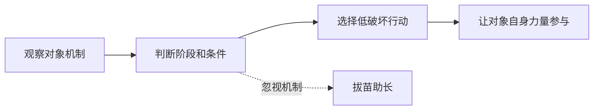

## 道家思维筑基课: 道法自然定律: 行动要顺着事物机制

### 作者
digoal

### 日期
2026-05-18

### 标签
道法自然 , 行动原则 , 顺势 , 机制 , 自然 , 低破坏行动 , 成长 , 治理 , 学习方法 , 道家定律

----

## 背景
> 面向对象: 高中生到普通读者  
> 核心问题: “道法自然”作为行动原则，具体要求人怎么做？  
> 先说结论: 道法自然定律从“自然公理”推出: 真正高明的行动不是把意志强加给对象，而是看清对象机制后顺势发力。

## 一张图先看懂

## 求真讲法

### 它到底说了什么

“道法自然”不是一句风景口号，而是一条行动定律: 先理解事物怎样自己运行，再决定怎样介入。

### 它是怎么来的

它主要从两个公理推出: 万物有自己的生长方式；强控有反作用。因此，行动要减少反结构动作。

### 它依赖哪些假设

| 假设 | 说明 |
|---|---|
| 对象有机制 | 学习、身体、组织不是任意塑造 |
| 人能观察机制 | 虽不完全，但可逐步接近 |
| 顺势比硬推成本低 | 借力比蛮力更稳 |

### 常见误解

| 误解 | 更准确的理解 |
|---|---|
| 顺其自然就是不努力 | 是换成符合机制的努力 |
| 自然就是旧状态 | 自然也包括变化和成长 |
| 道法自然拒绝技术 | 技术也可以顺机制 |

## 求存讲法

### 它有什么用

它让人避免用热情、焦虑和口号代替方法。

### 它怎么迁移到熟悉领域

| 任务 | 先看机制 | 行动 |
|---|---|---|
| 背单词 | 遗忘曲线 | 间隔复习 |
| 跑步 | 心肺和肌肉适应 | 逐步加量 |
| 团队合作 | 信任需要透明 | 少承诺，多兑现 |

### 它的适用范围和边界

适合成长、训练、治理、关系修复。不适合把现状合理化，坏机制本身也需要改变。

### 正例: 怎么用它提升能力

想提升英语听力，先从可理解输入开始，而不是直接听完全听不懂的材料。顺机制意味着让大脑在“略有挑战”的范围内学习。

### 反例: 前提不成立会怎样

如果一个班级存在霸凌，老师说“让孩子们自然相处”，就是误用。这里关系机制已经失衡，需要明确干预。

## 思考

真正的问题常常不是你不够努力，而是你努力的方向和对象机制相冲突。

## 最后记住

1. 道法自然是行动定律，不是放任口号。
2. 顺势之前要先观察机制。
3. 好行动会让对象自身力量参与。
4. 现状不等于自然，坏机制需要修复。

## 参考资料

- 《道德经》第25章。
- 《庄子·养生主》。
- 陈鼓应《老子今注今译》。
- 本文未联网检索，基于经典文本和通行解释整理。
  
#### [PostgreSQL 解决方案集合](../201706/20170601_02.md "40cff096e9ed7122c512b35d8561d9c8")
  
  
#### [德哥 / digoal's Github - 公益是一辈子的事.](https://github.com/digoal/blog/blob/master/README.md "22709685feb7cab07d30f30387f0a9ae")
  
  
#### [About 德哥](https://github.com/digoal/blog/blob/master/me/readme.md "a37735981e7704886ffd590565582dd0")
  
  

  
