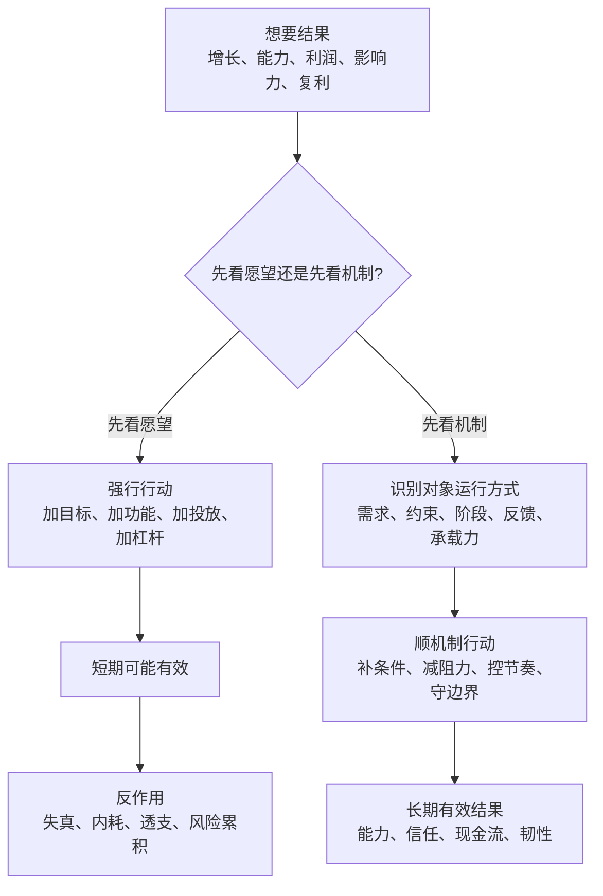
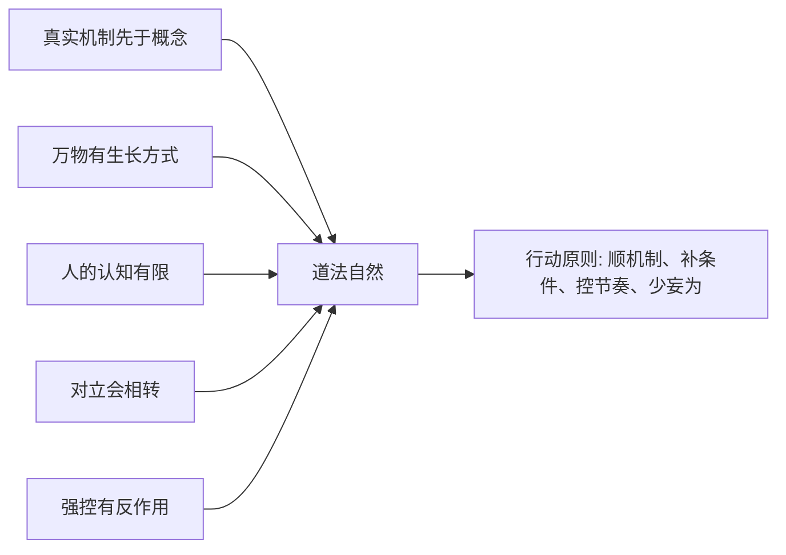
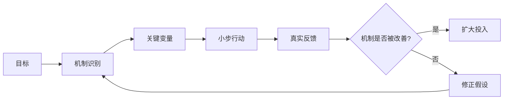

## 道家思维筑基课: 道法自然定律: 行动要顺着事物机制

### 作者
digoal

### 日期
2026-05-18

### 标签
道法自然 , 事物机制 , 顺势行动 , 关键变量 , 产品机制 , 运营增长 , 创业验证 , 投资价值 , 现金流 , 长期主义

----

## 背景

> 面向对象: 大学生、产品经理、运营经理、有投资需求的人  
> 核心问题: 世界表面变化太快，热点、工具、平台、价格和叙事不断变。人如果只凭愿望行动，就会把“我想要的结果”误当成“事物会按这个方式发生”。  
> 先说结论: “道法自然”不是随便、躺平或放任，而是行动要顺着事物自身机制。先看清对象怎么运行、靠什么生长、受什么约束，再决定介入方式、力度、节奏和边界。

本文把“道法自然”当作一个从道家底层公理推导出的行动定律来讲。它不是物理学定律，而是一条跨领域判断原则: 想得到长期有效的结果，行动必须符合对象的生成机制。

## 一张图先看懂



一句话版:

```text
愿望问: 我想让它怎样?
机制问: 它本来怎样运行?

道法自然 = 先尊重机制，再设计行动。
```

## 求真讲法

### 它到底说了什么

“道法自然”可以拆成四句话。

第一，任何对象都有自己的机制。学生能力有学习机制，产品增长有需求机制，运营转化有信任机制，企业价值有现金流机制，投资收益有价格和价值之间的机制。

第二，行动不是越多越好，而是越符合机制越好。方向错了，勤奋会放大错误；指标错了，管理会制造假象；买入价格错了，好公司也可能变成差投资。

第三，所谓“自然”，不是自然界，也不是放任，而是“按其自身方式如此”。道法自然，就是行动要合乎对象自己的结构、阶段、节律和约束。

第四，真正的高手不是不行动，而是少做违背机制的动作，把力用在能改变系统条件的关键处。

所以，这条定律解决的不是“做不做”的问题，而是“按什么机制做”的问题。

### 它是怎么来的

《道德经》第二十五章说: “人法地，地法天，天法道，道法自然。”这里的“法”可以理解为取法、效法、遵循；“自然”可以理解为自己如此、按其自身方式而然。

这条定律来自前面几条道家底层公理:

1. 道先于名: 世界不是被名字造出来的，先有真实机制，再有概念表达。
2. 自然公理: 万物有自己的生长方式，不是靠外部命令才运行。
3. 名与知有限: 人的概念和模型只能截取现实，不能替代现实。
4. 对立相生相转: 一方过度发展会生成反面，行动要看反作用。
5. 强控有反作用: 过度干预会扭曲激励、压制反馈、制造新问题。

由这些公理推出一个行动定律: 如果现实有自己的机制，而人的认知和控制都有限，那么高质量行动就必须先顺机制，再谈目标和控制。



### 它依赖哪些假设

这条定律依赖五个假设。

第一，事物存在可观察的运行机制。机制不是神秘力量，而是需求、供给、成本、激励、约束、反馈、时间和能力之间的关系。

第二，人的愿望不能直接改写机制。你可以想要快速成长、快速增长、快速盈利，但对象能不能承受，要看它的阶段和条件。

第三，行动会改变系统。任何管理、运营、融资、投资、激励和规则，都不只是“加一层工具”，还会改变人的行为。

第四，短期结果不等于长期有效。很多动作能制造短期数据，却损害真实能力、信任和现金流。

第五，机制可以被利用、调整和改善，但不能被随意否定。道法自然不是认命，而是承认你必须通过机制改变结果。

### 常见误解

| 误解 | 为什么不对 | 更准确的理解 |
|---|---|---|
| 道法自然就是顺其自然、什么都不做 | 放任也可能让问题恶化 | 不是不行动，而是不违背机制地行动 |
| 自然就是原始、反技术 | 技术也可以顺机制，比如降低真实成本 | 关键看技术是否服务真实需求和系统约束 |
| 只要努力就能改变结果 | 努力如果违背机制，会增加损耗 | 努力要落在关键变量上 |
| 机制就是固定不变 | 机制会随阶段和环境变化 | 不变的是“先理解机制再行动” |
| 投资就是看趋势 | 趋势只是表面路径 | 要看企业机制、现金流机制和价格机制 |

## 求存讲法

### 它有什么用

“道法自然”最有用的地方，是把行动从“愿望驱动”改成“机制驱动”。

对大学生，它提醒你别只问“哪个专业热门”，而要问自己适合积累什么能力、行业需要什么能力、能力如何被市场验证。

对产品经理，它提醒你别只问“要不要做 AI、社交、社区、私域”，而要问用户任务是什么、旧方案为什么不够好、产品如何嵌入真实场景。

对运营经理，它提醒你别只问“怎么拉高数据”，而要问数据来自真实需求还是短期刺激，增长是否损害信任和复购。

对创业者，它提醒你别只问“市场多大、融资多快”，而要问客户是否持续付费、交付是否可复制、现金流是否能撑过验证周期。

对投资者，它提醒你别只问“会不会涨”，而要问企业如何赚钱、护城河是否持续、管理层是否可靠、估值是否留有安全边际。

### 它怎么迁移到熟悉领域

| 领域 | 表面行动 | 机制追问 | 顺机制行动 |
|---|---|---|---|
| 学习 | 增加学习时长 | 我到底卡在理解、练习、反馈还是迁移? | 针对薄弱机制训练，而不是盲目堆时间 |
| 产品 | 追热点功能 | 用户任务是否真实，旧方案有什么缺口? | 做最小闭环，用真实行为验证 |
| 运营 | 冲转化和 GMV | 增长来自信任、需求还是补贴刺激? | 同时看留存、复购、毛利和用户质量 |
| 创业 | 快速扩张 | 单位经济模型和组织复制是否成立? | 先证明可重复，再扩大投入 |
| 投融资 | 追主题和价格 | 企业价值如何生成，价格是否透支? | 在能力圈内看现金流、护城河和安全边际 |

### 它的适用范围和边界

这条定律适合处理复杂系统: 学习成长、产品建设、运营增长、创业扩张、组织管理、投资判断。

它不适合被滥用成三种借口。

第一，不能用“顺机制”否定必要改变。有些机制本身已经失灵，比如欺诈、腐败、重大安全隐患、现金流断裂，这时必须干预。

第二，不能用“顺自然”合理化不公平和低效率。现实存在不代表合理存在，顺机制是为了找到改变杠杆，不是为现状辩护。

第三，不能把“等待条件成熟”变成拖延。道法自然要求观察、试错、修正和创造条件，不是被动等待。

更准确地说: 道法自然不是少做事，而是少做违背机制的事；不是放弃改变，而是通过机制改变。

### 正例: 怎么用它提升能力

假设你是产品经理，负责一个企业知识库产品。老板要求快速加入“智能体”功能，因为市场都在讲 AI Agent。

如果只看表面，你可能立刻做对话框、自动总结、任务执行和酷炫演示。短期看起来符合趋势，但可能没有真实使用。

按“道法自然”的方法，先回到产品机制:

1. 企业知识库的真实问题是什么: 找不到、没人维护、不可信、权限混乱，还是跨系统割裂？
2. 用户在什么场景下愿意使用: 客服答疑、销售支持、研发文档、培训，还是合规审计？
3. AI 能改变哪个关键成本: 检索成本、整理成本、验证成本、协作成本，还是交付成本？
4. 哪些环节不能自动化: 权限、责任、事实校验、敏感信息、最终决策？
5. 如果不叫“智能体”，这个功能是否仍然能提升任务完成率？

顺机制的行动不是“拒绝 AI”，而是选择一个真实场景，比如客服知识检索，把目标定为“减少一线客服查找答案时间，并保持答案可追溯”。先验证任务完成率、错误率和人工复核成本，再扩展到更多场景。

### 反例: 前提不成立会怎样

一个创业公司看到某赛道很热，认为“市场正在增长，所以公司应该快速扩张”。于是同时开多个城市、招大量销售、加大投放、讲更大的融资故事。

这个动作看似顺势，其实可能没有顺机制。行业增长是行业机制，公司增长还要看客户获取成本、交付能力、复购周期、毛利结构、团队管理和现金流。

这里失效的前提是“赛道机制等于公司机制”。当这个前提不成立时，行业越热，公司可能越容易被高成本获客、激烈竞争和组织失控拖垮。

投融资里也一样。一个资产处在热门主题里，不等于它的内在价值一定提高。真正要看的是: 企业是否能把行业机会转化为收入、利润和自由现金流；当前价格是否已经把未来好处提前透支。如果只顺着市场情绪行动，就不是道法自然，而是道法热闹。

### 一个实用检查表

```text
行动前，先问十个机制问题:

1. 这个对象真正靠什么运行?
2. 当前处于什么阶段: 验证、扩张、成熟，还是衰退?
3. 哪个变量是根因，哪个只是表面指标?
4. 我的行动会改变哪些人的激励?
5. 这个系统的承载力在哪里?
6. 哪些结果可以加速，哪些结果必须等待积累?
7. 如果短期数据变好，长期机制是否也变好?
8. 如果去掉补贴、流量、融资或情绪，结果还成立吗?
9. 有什么反作用会在三个月、半年、一年后出现?
10. 我是在补条件、减阻力，还是在拔苗助长?
```

## 思考

现代社会喜欢给人一种错觉: 只要有足够强的目标、资源、方法论和工具，就可以直接制造结果。

但道法自然提醒我们，结果不是被口号召唤出来的。它从机制里长出来。

学习结果长在理解和反馈里。  
产品结果长在真实任务和使用场景里。  
运营结果长在信任、复购和价值连接里。  
创业结果长在客户付费、交付能力和现金流里。  
投资结果长在企业价值、买入价格和时间复利里。

真正成熟的人，不是没有目标，而是知道目标必须经过机制才能变成现实。



一个反事实问题值得长期保留:

如果不能靠口号、补贴、热点、融资、杠杆和短期刺激，这件事还会不会因为自身机制而变好？

如果会，说明你可能顺着道。  
如果不会，说明你可能只是顺着表面热闹。

## 最后记住

1. 道法自然不是不行动，而是行动要顺着事物机制。
2. 真正的“自然”不是放任，而是对象自身的结构、阶段、节律和约束。
3. 高质量行动不是加大力度，而是找准关键变量、补足条件、减少阻力。
4. 生活、产品、运营、创业和投资里，短期有效不等于机制正确。
5. 每次行动前，先问: 我是在顺机制，还是在用愿望压现实？

## 参考资料

- 《道德经》第二十五章: “人法地，地法天，天法道，道法自然”的思想线索。
- 《道德经》第三十七章: 关于“道常无为而无不为”的思想线索。
- 《道德经》第四十八章: 关于减少妄为、回到根本机制的思想线索。
- 《道德经》第六十四章: 关于渐进积累、从小处开始的行动思想。
- 《庄子·养生主》: 关于顺应对象纹理、依其结构行动的思想线索。
- 冯友兰《中国哲学简史》: 关于老庄“自然”“无为”的通行解释。
- 陈鼓应《老子今注今译》《庄子今注今译》: 关于相关章句和现代注释的参考。
- 本文未联网检索，主要基于经典文本、通行中国哲学史解释和常见产品/运营/创业/投资分析框架整理；投融资部分是原则教育，不构成具体投资建议。
  
#### [PostgreSQL 解决方案集合](../201706/20170601_02.md "40cff096e9ed7122c512b35d8561d9c8")
  
  
#### [德哥 / digoal's Github - 公益是一辈子的事.](https://github.com/digoal/blog/blob/master/README.md "22709685feb7cab07d30f30387f0a9ae")
  
  
#### [About 德哥](https://github.com/digoal/blog/blob/master/me/readme.md "a37735981e7704886ffd590565582dd0")
  
  

  
