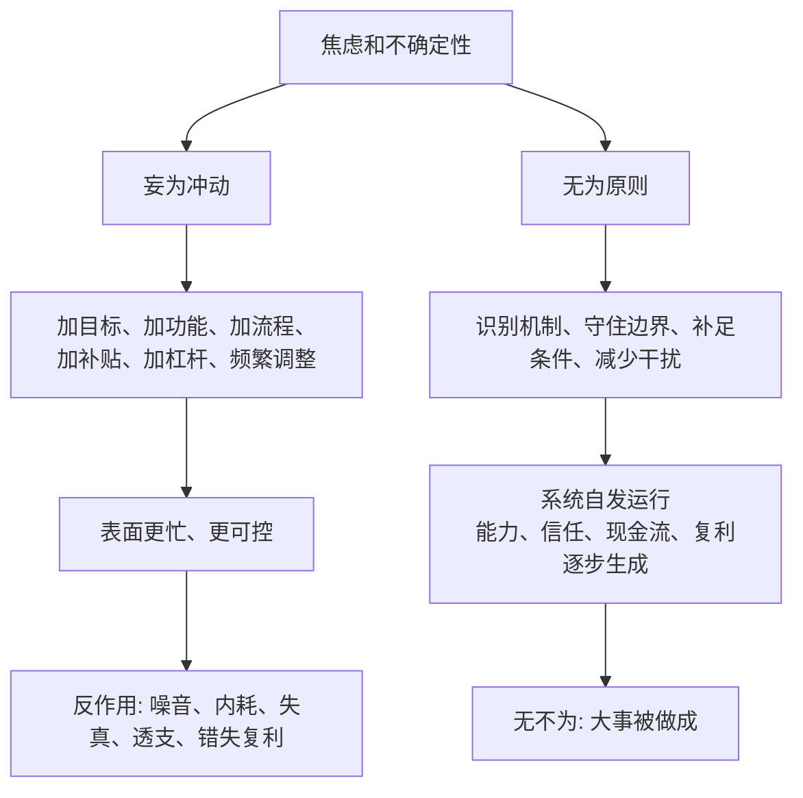
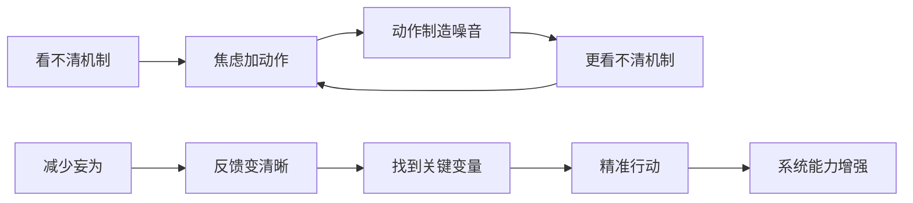

## 道家思维筑基课: 无为而无不为: 少做妄为，才能做成大事

### 作者
digoal

### 日期
2026-05-18

### 标签
无为而无不为 , 少做妄为 , 关键变量 , 真实反馈 , 产品留存 , 运营节奏 , 创业聚焦 , 投资耐心 , 复利 , 低干预

----

## 背景

> 面向对象: 大学生、产品经理、运营经理、有投资需求的人  
> 核心问题: 世界表面变化太快，人越焦虑，越容易用更多动作证明自己在努力: 加目标、加功能、加流程、加投放、加杠杆、频繁交易。但很多大事做不成，不是因为做得太少，而是因为妄为太多。  
> 先说结论: “无为而无不为”不是不做事，而是少做违背机制、破坏反馈、透支系统的妄为。少妄为，系统的真实力量才能发挥；抓住关键变量，反而能做成更大的事。

本文把“无为而无不为”当作从道家底层公理推导出的行动定律来讲。它不是消极避世，而是一种复杂系统里的高质量行动原则: 不用人的焦虑替代机制，不用动作数量替代行动质量。

## 一张图先看懂



一句话版:

```text
无为 = 不妄为，不乱作为，不用意志硬改机制
无不为 = 因为少做破坏性动作，关键事情反而能自然完成

少做无效动作，不是懒。
是把注意力留给真正决定结果的变量。
```

## 求真讲法

### 它到底说了什么

“无为而无不为”可以拆成四句话。

第一，无为不是不行动，而是不妄为。妄为就是不理解对象机制，却用人的欲望、焦虑和权力强行推进。

第二，很多系统本来有自我运行能力。学生会在正确反馈中理解，用户会在真实价值中留存，组织会在清晰边界中协作，企业会在好生意和好管理中积累现金流。

第三，过多动作会遮蔽真正问题。目标太多会让人不知道什么最重要，功能太多会让产品失焦，流程太多会让组织迟缓，交易太频繁会让投资者被波动牵着走。

第四，少做妄为之后，不是空着，而是把精力放到关键处: 设边界、补条件、留反馈、守节奏、等待复利。

所以，“无为而无不为”的核心不是“少做”，而是“少做破坏性动作，多做结构性动作”。

### 它是怎么来的

《道德经》第三十七章说“道常无为而无不为”，第四十八章说“为道日损，损之又损，以至于无为”。这里的“损”不是损失，而是减少不必要的妄动、执念和人为加戏。

这条定律来自几条底层公理:

1. 道先于名: 真实机制先于口号和概念。
2. 自然公理: 万物有自己的生长方式。
3. 名与知有限: 人的模型和指标不能穷尽现实。
4. 强控有反作用: 过度干预会制造新问题。
5. 对立相生相转: 动作过多可能从优势转成负担。

由此推出: 如果现实有自己的机制，而人的认知和控制有限，那么行动者首先要减少妄为，让系统的真实机制显现出来，再在关键处用力。



### 它依赖哪些假设

这条定律依赖五个假设。

第一，系统存在可利用的自发秩序。人、产品、组织、企业、市场不是完全靠外部命令才能运转。

第二，人的动作会带来干扰。每一个目标、指标、流程、补贴、融资、交易动作，都可能改变激励和反馈。

第三，关键变量少于表面动作。真正决定结果的变量通常不多，但它们不一定最显眼。

第四，反馈需要空间。系统如果被频繁打断，就很难暴露真实规律。

第五，大结果常来自复利。能力、信任、品牌、组织、现金流和投资收益，都需要稳定机制和时间积累。

### 常见误解

| 误解 | 为什么不对 | 更准确的理解 |
|---|---|---|
| 无为就是躺平 | 躺平是不承担责任 | 无为是减少妄为，保留高质量行动 |
| 无为就是不管理 | 不管理会导致边界不清 | 管边界、管关键变量、管反馈，不乱插手 |
| 少做就是效率低 | 很多动作只是噪音 | 少做无效动作，才能集中资源做关键动作 |
| 无为适合个人，不适合商业 | 商业系统更怕过度干预 | 产品、运营、创业、投资都需要少妄为 |
| 投资无为就是永远不卖 | 基本面恶化、价格极端、判断错误时要行动 | 少交易不是不判断，而是不被波动驱动 |

## 求存讲法

### 它有什么用

“无为而无不为”最有用的地方，是帮你从“动作崇拜”转向“机制治理”。

对大学生，它提醒你别把忙碌当成长。真正的成长不是排满日程，而是抓住能力短板、获得有效反馈、持续复盘。

对产品经理，它提醒你别把功能数量当产品能力。真正的产品能力来自清晰场景、核心闭环、低摩擦体验和稳定交付。

对运营经理，它提醒你别把活动频率当运营能力。真正的运营能力来自用户信任、内容资产、渠道效率和复购机制。

对创业者，它提醒你别把扩张速度当公司质量。真正的公司质量来自客户价值、单位经济模型、组织复制和现金流纪律。

对投资者，它提醒你别把频繁操作当风险控制。真正的投资能力来自理解企业、合理价格、安全边际、仓位控制和耐心。

### 它怎么迁移到熟悉领域

| 领域 | 妄为表现 | 无为动作 | 无不为结果 |
|---|---|---|---|
| 学习 | 排满计划、不断换资料 | 固定主线，减少切换，重视复盘 | 理解变深，迁移能力提高 |
| 产品 | 追热点、堆功能、频繁改版 | 聚焦核心任务，减少干扰 | 用户更容易完成关键动作 |
| 运营 | 天天活动、靠补贴拉数据 | 沉淀内容、用户分层、控制刺激 | 留存和复购更真实 |
| 创业 | 多线扩张、融资叙事先行 | 先验证需求和单位经济模型 | 扩张更稳，现金流更安全 |
| 投融资 | 追涨杀跌、频繁调仓 | 在能力圈内研究，等待合理价格 | 少犯错，让复利发挥作用 |

### 它的适用范围和边界

这条定律适合复杂系统和长期目标: 学习、职业、产品、运营、组织、创业、投资。

它不适合被滥用成三种借口。

第一，不能用无为逃避责任。欺诈、重大事故、现金流断裂、产品安全漏洞、组织腐败，都需要及时行动。

第二，不能用无为掩盖无能。少做的前提是知道什么不该做，什么必须做；没有判断力的少做只是懒。

第三，不能把等待当战略。等待必须伴随观察、学习、准备和触发条件，否则只是拖延。

更准确地说: 无为不是减少所有动作，而是减少妄为；不是放弃结果，而是让结果从正确机制中长出来。

### 正例: 怎么用它提升能力

假设你是产品经理，负责一个用户留存下降的 App。团队提出十几个动作: 新手任务、积分、弹窗、抽奖、社群、Push、AI 助手、会员礼包。

如果全部推进，团队会很忙，但用户真正流失原因可能更难看清。

按“无为而无不为”的方法，先减少妄为:

1. 暂停不确定的大改版和花哨功能。
2. 只追一个核心问题: 用户第一次使用后，是否完成了核心任务？
3. 回看行为路径、访谈流失用户、找出最大阻塞点。
4. 小范围测试一个动作，而不是同时上十个动作。
5. 用留存、任务完成率和用户反馈判断是否扩大。

结果可能发现，留存下降不是缺少激励，而是注册后无法找到合适内容。此时只需优化推荐和路径说明，就比十个活动更有效。少做妄为，反而做成了关键事。

### 反例: 前提不成立会怎样

一个创业团队相信“快速行动就是竞争力”，于是每天改方向、每周上新功能、每月调整组织，看到什么热就做什么。

短期看，团队很勤奋，项目很多，汇报很好看。长期看，用户不知道产品到底解决什么问题，研发被频繁打断，销售承诺无法交付，现金流持续消耗。

这里失效的前提是“动作越多，成功概率越高”。在复杂系统中，过多动作会破坏反馈，让团队无法知道到底什么有效。最终公司不是死于不努力，而是死于妄为太多。

投融资里也一样。投资者每天看盘、频繁交易、不断追热点，以为自己在积极管理风险。实际可能是在用交易制造成本，用情绪替代研究，用短期波动破坏长期复利。如果投资标的在能力圈外，频繁动作只会更快暴露认知缺口。

### 一个实用检查表

```text
判断一个动作是不是妄为，先问十个问题:

1. 这个动作解决的是根因，还是缓解焦虑?
2. 如果不做，会发生什么真实损失?
3. 这个动作会不会制造新的指标噪音?
4. 它会不会打断系统已有的有效反馈?
5. 它会不会改变用户、员工、客户或投资者的激励?
6. 它是否可验证，还是只让汇报更好看?
7. 有没有更小、更低干预的办法?
8. 它是否会透支信任、现金流、注意力或组织能力?
9. 如果三个月后失败，我能否知道是哪里错了?
10. 我是在做关键事，还是在用忙碌逃避关键判断?
```

## 思考

现代社会奖励可见的忙碌。开会、上线、投放、融资、调仓、发声，都很容易被看见。真正难的是判断哪些事不该做。

无为而无不为的难处，恰恰在于它要求人克制动作冲动。你要敢于不追热点，不乱加功能，不用补贴掩盖需求问题，不用融资掩盖商业模式问题，不用频繁交易掩盖研究不足。

它不是消极，而是一种更高阶的主动: 主动减少干扰，主动保护反馈，主动守住边界，主动等待复利。


一个反事实问题值得长期保留:

如果你停止一半动作，结果会变差，还是会更清楚地暴露真正重要的事？

如果结果不变，说明那一半动作可能只是噪音。  
如果结果变好，说明你过去可能在用妄为破坏系统。

## 最后记住

1. 无为不是不做事，而是不妄为、不乱作为、不破坏机制。
2. 无不为不是神奇结果，而是因为少做破坏动作，系统真实力量能发挥。
3. 产品、运营、创业和投资里，动作越多不一定越接近成功，可能越远离真实反馈。
4. 高质量行动通常是: 设边界、补条件、抓关键变量、减少干扰、等待复利。
5. 每次想做更多时，先问: 这是关键行动，还是焦虑伪装成勤奋？

## 参考资料

- 《道德经》第三十七章: “道常无为而无不为”的思想线索。
- 《道德经》第四十八章: “为学日益，为道日损，损之又损，以至于无为”的思想线索。
- 《道德经》第五十七章: 关于治理过密、机巧增多和反作用的思想线索。
- 《道德经》第六十四章: 关于慎终如始、从小处积累的行动思想。
- 《庄子·养生主》: 关于顺应对象纹理、少用蛮力的思想线索。
- 冯友兰《中国哲学简史》: 关于老庄“无为”“自然”的通行解释。
- 陈鼓应《老子今注今译》《庄子今注今译》: 关于相关章句和现代注释的参考。
- 本文未联网检索，主要基于经典文本、通行中国哲学史解释和常见产品/运营/创业/投资分析框架整理；投融资部分是原则教育，不构成具体投资建议。
  
#### [PostgreSQL 解决方案集合](../201706/20170601_02.md "40cff096e9ed7122c512b35d8561d9c8")
  
  
#### [德哥 / digoal's Github - 公益是一辈子的事.](https://github.com/digoal/blog/blob/master/README.md "22709685feb7cab07d30f30387f0a9ae")
  
  
#### [About 德哥](https://github.com/digoal/blog/blob/master/me/readme.md "a37735981e7704886ffd590565582dd0")
  
  

  
