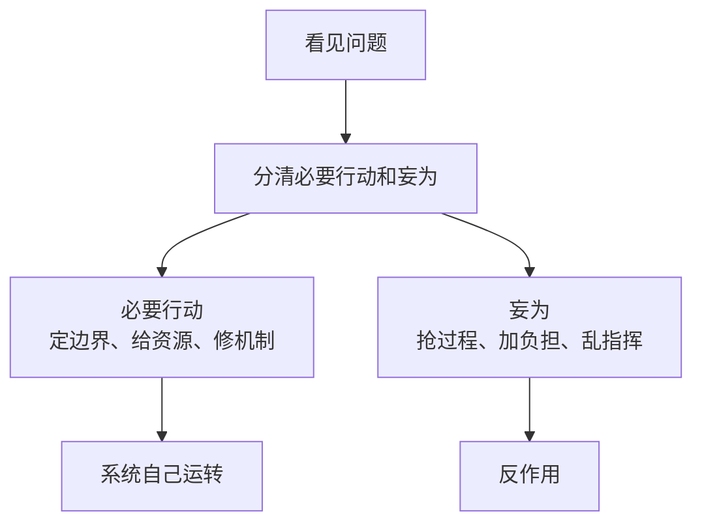

## 道家思维筑基课: 无为而无不为: 少做妄为，才能做成大事

### 作者
digoal

### 日期
2026-05-18

### 标签
无为 , 无为而无不为 , 不妄为 , 低干预 , 治理 , 边界 , 系统运行 , 授权 , 道德经 , 行动智慧

----

## 背景
> 面向对象: 高中生到普通读者  
> 核心问题: “无为”是不是不作为？  
> 先说结论: 无为不是不行动，而是不做违背机制、过度干预、满足控制欲的行动。它追求的是用更少破坏换来更稳定的结果。

## 一张图先看懂

## 求真讲法

### 它到底说了什么

“无为而无不为”的重点在前半句: 不妄为。后半句说的是效果: 因为不乱干预，反而让事情按机制完成。

### 它是怎么来的

它从“自然公理”和“强控有反作用”推出。既然对象有自身机制，过度插手会破坏机制，那么高明行动就要少做破坏性动作。

### 它依赖哪些假设

| 假设 | 说明 |
|---|---|
| 系统能部分自我运行 | 不是每一步都要上级推动 |
| 人能识别妄为 | 需要经验和反思 |
| 边界比微控更重要 | 管住关键处，放开过程 |

### 常见误解

| 误解 | 更准确的理解 |
|---|---|
| 无为就是躺平 | 无为是克制妄动，不是放弃责任 |
| 无为适合所有场景 | 高风险场景仍要直接干预 |
| 无为没有技术含量 | 分清该做和不该做很难 |

## 求存讲法

### 它有什么用

它让人在管理、学习、家庭教育中减少“越帮越忙”。

### 它怎么迁移到熟悉领域

| 场景 | 妄为 | 无为式行动 |
|---|---|---|
| 学习 | 家长全程盯作业 | 约定目标和复盘 |
| 管理 | 领导改每个细节 | 明确标准，让成员承担 |
| 关系 | 不停解释和追问 | 给对方空间，再沟通事实 |

### 它的适用范围和边界

适合有自我修复能力的系统。不适合危险、欺诈、暴力、重大失控场景。

### 正例: 怎么用它提升能力

练演讲时，老师只指出一个核心问题: 结构混乱。学生自己重排开头、论点和结尾，比老师逐句代改更能成长。

### 反例: 前提不成立会怎样

团队成员持续造假，领导却说“无为而治”。这里自我修复机制已经坏了，必须调查、止损和重建规则。

## 思考

你最近做的事里，有哪些只是为了缓解焦虑，并没有真正帮助系统变好？

## 最后记住

1. 无为不是不作为，而是不妄为。
2. 少干预的前提是系统仍有自我运行能力。
3. 无为强调边界、机制和节奏。
4. 该出手时不出手，不是道家，是失责。

## 参考资料

- 《道德经》第37章、第48章、第57章。
- 《庄子·应帝王》。
- 冯友兰《中国哲学简史》。
- 本文未联网检索，基于经典文本和通行解释整理。
  
#### [PostgreSQL 解决方案集合](../201706/20170601_02.md "40cff096e9ed7122c512b35d8561d9c8")
  
  
#### [德哥 / digoal's Github - 公益是一辈子的事.](https://github.com/digoal/blog/blob/master/README.md "22709685feb7cab07d30f30387f0a9ae")
  
  
#### [About 德哥](https://github.com/digoal/blog/blob/master/me/readme.md "a37735981e7704886ffd590565582dd0")
  
  

  
