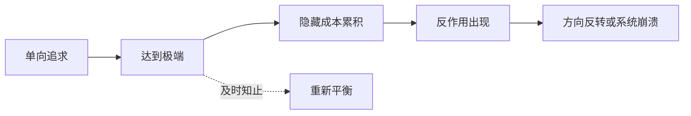

## 道家思维筑基课: 反者道之动: 极端会把事物推向反面

### 作者
digoal

### 日期
2026-05-18

### 标签
反者道之动 , 极端 , 反作用 , 知止 , 动态变化 , 风险 , 对立转化 , 道德经 , 系统平衡 , 边界

----

## 背景
> 面向对象: 高中生到普通读者  
> 核心问题: “反者道之动”是不是说坏事一定会变好？  
> 先说结论: 这条定律说的是变化方向常包含反向力量。事物走向极端时，会积累代价和反作用，但转化需要条件，不是自动许愿。

## 一张图先看懂

## 求真讲法

### 它到底说了什么

“反”不是简单反对，而是返回、反向、相反面。道家看到: 很多强大到极端的东西会暴露脆弱，很多追求到极端的目标会伤害目标本身。

### 它是怎么来的

它从“对立相生相转”和“强控有反作用”推出。对立面互相依存，极端行为又会制造反弹，于是变化里常有反向运动。

### 它依赖哪些假设

| 假设 | 说明 |
|---|---|
| 事物有边界 | 超过边界会失衡 |
| 极端会积累成本 | 成本不一定立刻显现 |
| 转化需要条件 | 不是任何坏事都会自然变好 |

### 常见误解

| 误解 | 更准确的理解 |
|---|---|
| 坏到极点必然变好 | 需要修复条件和新结构 |
| 成功越大越危险 | 危险在于成功后失去边界 |
| 反者道之动是宿命论 | 它更像风险提醒 |

## 求存讲法

### 它有什么用

它提醒人不要把某个指标推到极端，而要看系统代价。

### 它怎么迁移到熟悉领域

| 极端追求 | 可能反作用 |
|---|---|
| 只追分数 | 厌学和知识断层 |
| 只追效率 | 错误率和疲惫上升 |
| 只追安全 | 创造力和行动力下降 |

### 它的适用范围和边界

适合分析长期趋势和系统风险。不适合短期机械预测，比如不能据此判断明天股价一定反转。

### 正例: 怎么用它提升能力

备考时设置休息和复盘，避免“学得越久越低效”。这是在极端前知止，让系统保持可持续。

### 反例: 前提不成立会怎样

一个人长期拖延，却安慰自己“反者道之动，总会触底反弹”。如果没有行动、环境和反馈变化，拖延不会自动转化为自律。

## 思考

你现在最骄傲的优势，如果推到极端，会变成什么缺点？

## 最后记住

1. 反者道之动关注极端后的反作用。
2. 转化需要条件，不是自动发生。
3. 它提醒人及时知止和再平衡。
4. 它不是预测术，而是风险思维。

## 参考资料

- 《道德经》第40章、第58章。
- 《庄子·齐物论》。
- 陈鼓应《老子今注今译》。
- 本文未联网检索，基于经典文本和通行解释整理。
  
#### [PostgreSQL 解决方案集合](../201706/20170601_02.md "40cff096e9ed7122c512b35d8561d9c8")
  
  
#### [德哥 / digoal's Github - 公益是一辈子的事.](https://github.com/digoal/blog/blob/master/README.md "22709685feb7cab07d30f30387f0a9ae")
  
  
#### [About 德哥](https://github.com/digoal/blog/blob/master/me/readme.md "a37735981e7704886ffd590565582dd0")
  
  

  
