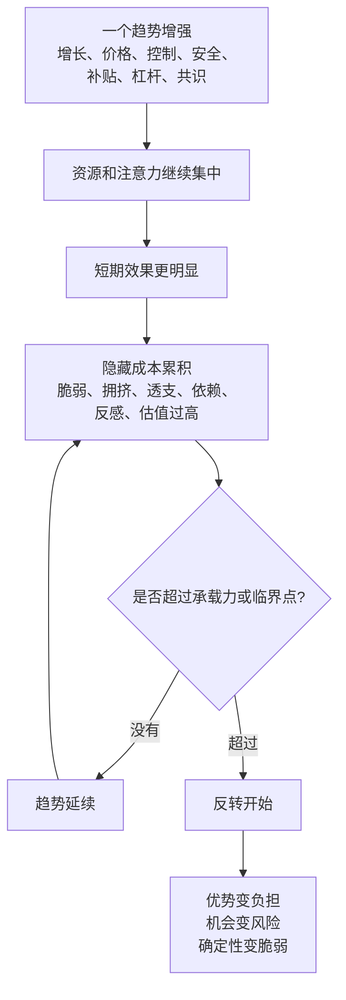
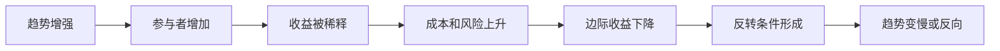
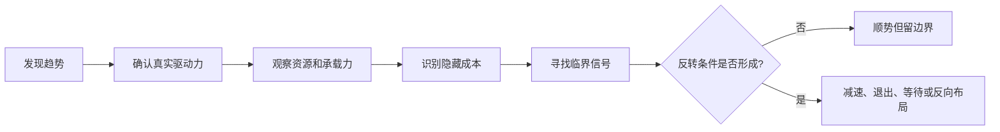

## 道家思维筑基课: 反者道之动: 极端会把事物推向反面

### 作者
digoal

### 日期
2026-05-18

### 标签
反者道之动 , 极端反转 , 反作用 , 临界点 , 承载力 , 产品刺激 , 运营频率 , 创业扩张 , 投资周期 , 风险识别

----

## 背景

> 面向对象: 大学生、产品经理、运营经理、有投资需求的人  
> 核心问题: 世界表面变化太快，人容易把正在强化的趋势当成永恒: 越涨越买、越忙越加任务、越增长越扩张、越安全越收缩。结果常常是在最确定的时候，埋下反转的种子。  
> 先说结论: “反者道之动”不是简单的“涨多必跌、坏了一定变好”，而是说事物走向极端时，会积累反作用、耗尽承载力、改变激励结构，最终把自己推向反面。判断未来，要看趋势是否正在制造自己的反转条件。

本文把“反者道之动”当作从道家底层公理推导出的行动定律来讲。它不是神秘预言，而是一种识别极端、临界点和反作用的判断工具。

## 一张图先看懂



一句话版:

```text
趋势不是直线。
极端会制造反作用。
反作用积累到临界点，趋势就可能转向反面。
```

## 求真讲法

### 它到底说了什么

“反者道之动”可以拆成四句话。

第一，很多事物不是直线运动，而是带有反馈和边界。增长有组织边界，价格有估值边界，安全有机会成本，控制有反作用，补贴有依赖性，杠杆有清算风险。

第二，趋势越强，越容易吸引更多资源。热门专业吸引更多人，热门赛道吸引更多资本，爆款产品吸引更多模仿者，上涨资产吸引更多追涨者。

第三，资源继续涌入会改变原来的收益结构。机会会变拥挤，利润会被竞争压低，用户会被过度打扰，价格会透支未来，组织会被规模压垮。

第四，当隐藏成本超过承载力，事物就会转向反面。增长变成失控，安全变成停滞，效率变成脆弱，热度变成泡沫，确定性变成最大的风险。

所以，这条定律最重要的不是“预测反转”，而是识别反转条件是否正在形成。

### 它是怎么来的

《道德经》第四十章说“反者道之动，弱者道之用”。这句话通常被理解为: 道的运动方式包含返回、反向、循环和转化；柔弱、低处、保留余地，往往比刚强和极端更有长期生命力。

它与《道德经》第二章“有无相生”、第五十八章“祸兮福之所倚，福兮祸之所伏”相互呼应。道家并不是说世界一定机械地来回摆动，而是提醒人: 当一面发展得太满、太硬、太极端，另一面往往已经在内部生成。

这条定律要对抗一种线性幻觉:

```text
现在涨，所以以后还会涨。
现在快，所以越快越好。
现在安全，所以越安全越好。
现在有效，所以加倍投入一定更有效。
```

现实中的复杂系统很少这样运行。越极端，越要看承载力和反作用。



### 它依赖哪些假设

这条定律依赖五个假设。

第一，系统有承载力。个人精力、用户注意力、组织管理、市场估值、债务偿还、社会信任都不是无限的。

第二，趋势会改变自身环境。一个策略有效，会吸引模仿者；一个资产上涨，会改变买入者结构；一个规则变严，会改变被管理者行为。

第三，边际收益会变化。前几次投放可能有效，继续加码可能变贵；早期功能增加价值，后期功能增加复杂度。

第四，隐藏成本会滞后出现。身体透支、品牌损伤、用户反感、债务压力、估值泡沫，常常不是立刻显现。

第五，反转需要条件。不是所有极端都会马上反转，也不是所有低谷都会自动修复。要看临界点、触发因素和系统修复能力。

### 常见误解

| 误解 | 为什么不对 | 更准确的理解 |
|---|---|---|
| 反者道之动就是凡事反着来 | 反着来只是情绪，不是判断 | 要看反转条件是否形成 |
| 涨多了一定跌 | 有些趋势背后有真实增长支撑 | 要看价格是否透支、竞争是否拥挤、现金流是否跟上 |
| 差的东西一定会变好 | 弱势如果没有修复机制，可能继续恶化 | 低谷变机会需要资源、能力和外部条件 |
| 极端都是坏的 | 某些阶段需要集中突破 | 问题在于是否超过承载力、是否积累反作用 |
| 稳定就没有风险 | 过度稳定可能牺牲适应能力 | 安全也有机会成本和僵化风险 |

## 求存讲法

### 它有什么用

“反者道之动”最有用的地方，是训练你在极端处保持清醒。

对大学生，它提醒你: 热门专业越热，竞争可能越拥挤；过度追求稳定，可能错过能力增长窗口。

对产品经理，它提醒你: 功能越多不一定越强，可能让产品复杂到用户不会用；极简过头也可能无法解决真实任务。

对运营经理，它提醒你: 补贴越强，用户越可能只为便宜而来；触达越频繁，用户越可能屏蔽你。

对创业者，它提醒你: 增长越快，组织、交付和现金流越容易被拉裂；融资越顺，纪律越容易松。

对投资者，它提醒你: 市场越一致，越要检查价格是否透支；恐慌越极端，也要检查资产是否真的有修复能力。反转机会不是来自“大家都错”，而是来自“价格和真实价值严重偏离，且你能承受等待”。

### 它怎么迁移到熟悉领域

| 场景 | 极端表现 | 可能生成的反面 | 关键检查 |
|---|---|---|---|
| 学习 | 每天学习到深夜 | 精力崩溃、理解下降 | 睡眠、复盘、长期可持续性 |
| 产品 | 功能越来越多 | 新手流失、维护成本上升 | 核心任务完成率、学习成本 |
| 运营 | 频繁促销触达 | 用户疲劳、价格锚点下移 | 去刺激后的留存和复购 |
| 创业 | 高速扩张 | 交付失控、现金流紧张 | 单位经济模型、组织承载力 |
| 投融资 | 热门资产持续上涨 | 估值透支、交易拥挤 | 自由现金流、护城河、买入价格 |

### 它的适用范围和边界

这条定律适合处理趋势、周期、拥挤交易、组织扩张、产品复杂度、运营刺激、个人成长和风险管理。

它不适合被滥用成三种错误。

第一，不能把它当成短期预测工具。反转条件形成，不等于明天就反转。

第二，不能把它当成唱反调的理由。市场共识不一定错，热门方向不一定坏，关键是价格、条件和承载力。

第三，不能忽略趋势的真实基础。有些趋势不是泡沫，而是技术、成本、制度、需求共同变化的结果。过早反向，也会犯错。

更准确地说: 反者道之动不是让你永远反向，而是让你在极端处检查反作用。

### 正例: 怎么用它提升能力

假设你是运营经理，发现某个活动玩法能显著提升转化率。团队决定加大频率，从每月一次变成每周一次，再变成每天弹窗提醒。

按线性思维看: 有效，就应该多用。  
按“反者道之动”看: 越有效，越要检查它是否正在制造反面。

你应该追问:

1. 用户是否开始对弹窗疲劳？
2. 转化率提升来自真实需求，还是来自打断和诱导？
3. 频率提高后，投诉、卸载、屏蔽通知是否上升？
4. 活动是否降低了用户对原价的接受度？
5. 如果减少触达，用户是否仍然愿意回来？

更稳的做法是: 给活动设置频率上限，把短期转化和长期留存、投诉率、复购率一起看。这样可以保留有效动作，同时避免“高转化”转成“高反感”。

### 反例: 前提不成立会怎样

一个投资者看到某只股票连续上涨，认为“反者道之动，涨多必跌”，于是盲目做空或过早卖出。

这个判断可能失败，因为他只看到了“涨得多”，没有看反转条件是否成立。价格上涨可能来自泡沫，也可能来自企业利润持续增长、竞争优势扩大、行业格局改善和现金流增强。

这里失效的前提是“极端表现本身足以推出反转”。真正要检查的是: 估值是否明显透支？增长是否可持续？竞争是否加剧？现金流是否跟得上利润？市场共识是否拥挤到没有安全边际？

反过来，一个跌得多的资产也不一定是机会。如果商业模式坏了、债务太重、管理层不可信、现金流无法修复，低价可能只是价值陷阱。极端只是提醒你检查，不是替你完成判断。

### 一个实用检查表

```text
看到极端趋势时，先问十个问题:

1. 这个趋势的真实驱动力是什么?
2. 它依赖的资源是否有限?
3. 它是否吸引了过多竞争者或资金?
4. 边际收益是否开始下降?
5. 隐藏成本在哪里累积?
6. 参与者行为是否已经被趋势改变?
7. 哪个信号说明承载力接近上限?
8. 如果趋势反向，谁最脆弱?
9. 如果我判断错，最大损失是什么?
10. 我是在识别临界点，还是只是想反着猜?
```

## 思考

很多人真正亏损或失败，不是在不确定的时候，而是在最确定的时候。

市场最热时，大家觉得上涨有无数理由。  
公司扩张最快时，大家觉得增长可以解决所有问题。  
产品数据最好时，大家觉得刺激策略应该继续加码。  
个人最拼时，大家觉得熬下去就是自律。  
组织控制最强时，大家觉得流程越密越安全。

但极端的危险在于: 它会让人把反作用当成噪音，把承载力当成悲观，把边际收益下降当成暂时问题。



一个反事实问题值得长期保留:

如果你现在相信的趋势继续放大十倍，它会让系统更健康，还是会把系统推向崩溃？

如果继续放大会破坏系统，说明“反者道之动”已经在内部启动。

## 最后记住

1. 反者道之动不是简单反向操作，而是识别极端如何制造反作用。
2. 趋势越强，越要检查承载力、边际收益、隐藏成本和拥挤程度。
3. 极端不必然马上反转，反转需要条件和触发因素。
4. 生活、产品、运营、创业和投资里，最危险的常常是把当前有效线性外推。
5. 每次看到“越多越好、越快越好、越安全越好、越涨越好”，都问一句: 它会在哪个点把自己推向反面？

## 参考资料

- 《道德经》第四十章: “反者道之动，弱者道之用”的思想线索。
- 《道德经》第二章: “有无相生，难易相成，长短相形，高下相倾”的关系型世界观。
- 《道德经》第五十八章: 关于祸福相倚、正奇相转的思想线索。
- 《道德经》第七十六章: 关于强大与柔弱、生死状态之间关系的思想线索。
- 《庄子·齐物论》: 关于彼此、是非和视角转换的讨论。
- 冯友兰《中国哲学简史》: 关于老庄哲学中反向、相对和转化思想的通行解释。
- 陈鼓应《老子今注今译》《庄子今注今译》: 关于相关章句和现代注释的参考。
- 本文未联网检索，主要基于经典文本、通行中国哲学史解释和常见产品/运营/创业/投资分析框架整理；投融资部分是原则教育，不构成具体投资建议。
  
#### [PostgreSQL 解决方案集合](../201706/20170601_02.md "40cff096e9ed7122c512b35d8561d9c8")
  
  
#### [德哥 / digoal's Github - 公益是一辈子的事.](https://github.com/digoal/blog/blob/master/README.md "22709685feb7cab07d30f30387f0a9ae")
  
  
#### [About 德哥](https://github.com/digoal/blog/blob/master/me/readme.md "a37735981e7704886ffd590565582dd0")
  
  

  
