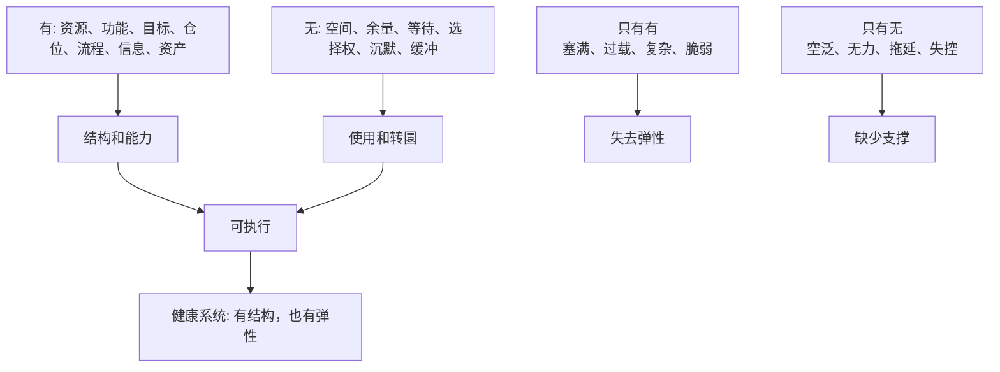
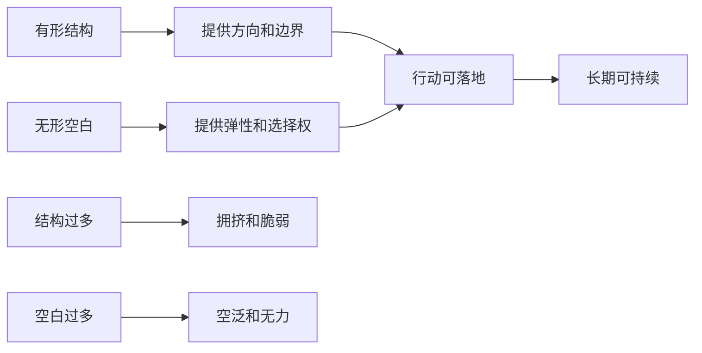

## 道家思维筑基课: 有无相生: 空白也是一种力量

### 作者
digoal

### 日期
2026-05-18

### 标签
有无相生 , 空白力量 , 选择权 , 系统余量 , 产品留白 , 运营节奏 , 创业缓冲 , 投资现金 , 安全边际 , 长期复利

----

## 背景

> 面向对象: 大学生、产品经理、运营经理、有投资需求的人  
> 核心问题: 世界表面变化太快，人很容易只崇拜“有”: 更多信息、更多功能、更多活动、更多资产、更多仓位、更多目标。但很多系统真正的力量，恰恰来自被保留下来的“无”: 空间、余量、选择权、等待能力和不被占满的注意力。  
> 先说结论: “有无相生”说的是: 有形的东西提供结构，无形的空白提供使用、转圜和生成的可能。杯子有用，不只因为有杯壁，也因为中间有空处；人生、产品、组织、创业和投资也是这样。

本文把“有无相生”当作从道家底层公理推导出的行动定律来讲。它不是鼓励空洞，而是提醒我们: 真正有效的系统，不是把一切填满，而是在结构和空白之间保持张力。

## 一张图先看懂



一句话版:

```text
有 = 看得见的结构
无 = 让结构发挥作用的空间

没有“有”，空白没有载体。
没有“无”，结构无法使用。
```

## 求真讲法

### 它到底说了什么

“有无相生”可以拆成四句话。

第一，有和无不是简单的存在与不存在，而是互相成就。杯壁是“有”，杯中空间是“无”；没有杯壁，水无处可装；没有空间，杯子不能装水。

第二，很多价值来自空白。时间表里的空档，能让人恢复和思考；产品界面的留白，能让用户看见重点；组织中的授权空间，能让一线判断发挥作用；投资组合里的现金，能让人在机会出现时行动。

第三，过度填满会损害系统。任务排满会降低创造力，功能堆满会增加使用门槛，活动排满会消耗用户信任，仓位打满会失去应对波动和机会的能力。

第四，空白不是没有价值，而是还没有被锁死的可能性。它可能表现为选择权、缓冲区、容错空间、等待能力和未来行动的自由。

所以，“有无相生”不是说“空就是好”，而是说: 有形结构和无形余量必须互相配合。

### 它是怎么来的

《道德经》第二章说“有无相生”，第十一章用车轮、器皿、房屋说明“有之以为利，无之以为用”。车轮有辐条，但中间空处让车轴能转；器皿有壁，但中间空处让它能装东西；房屋有墙壁门窗，但内部空间才让人居住。

这条定律来自道家对“名相”和“实用”的深刻区分: 人容易看到实体、数量和占有，却忽略空处、间隔和余量的作用。

现代社会尤其容易犯这个错误:

```text
把日程填满，以为等于高效。
把产品塞满，以为等于强大。
把组织管满，以为等于可控。
把资金投满，以为等于积极。
把信息看满，以为等于理解。
```

但真正能长期运转的系统，必须有空白来吸收波动、容纳反馈、等待机会。



### 它依赖哪些假设

这条定律依赖五个假设。

第一，系统需要结构。没有目标、边界、资源和能力，空白只会变成散漫。

第二，系统也需要余量。没有时间、空间、现金、注意力和选择权，结构会变得僵硬。

第三，未来有不确定性。正因为未来不能完全预测，空白才有价值。

第四，使用价值不等于占有数量。拥有更多功能、信息、资产和流程，不等于更能解决问题。

第五，空白有成本，也有收益。保留现金可能损失短期收益，保留时间可能少做一些任务，但它换来的是应对变化的能力。

### 常见误解

| 误解 | 为什么不对 | 更准确的理解 |
|---|---|---|
| 空白就是浪费 | 没有余量，系统会失去缓冲 | 空白是为反馈、恢复和机会保留空间 |
| 越多越强 | 多会带来复杂度、维护成本和脆弱性 | 多要服务目标，不是占满一切 |
| 留白就是不努力 | 高质量努力需要恢复和思考 | 留白是让努力可持续 |
| 现金闲着没用 | 现金有机会成本，但也有选择权价值 | 投资中的现金不是收益来源，而是行动能力 |
| 产品功能越全越好 | 功能越多，用户越难找到核心价值 | 好产品需要清晰主线和必要留白 |

## 求存讲法

### 它有什么用

“有无相生”最有用的地方，是让你从“占有更多”转向“保留可用空间”。

对大学生，它提醒你别把日程填满。真正的成长需要输入、练习、反思和休息之间的空白。

对产品经理，它提醒你别把界面和功能塞满。产品的重点需要被看见，用户路径需要留出清晰空间。

对运营经理，它提醒你别把用户触达排满。触达太多会制造疲劳，空白能保留期待和信任。

对创业者，它提醒你别把资源全部押满。组织、现金流、团队精力都需要缓冲，否则一次波动就可能击穿系统。

对投资者，它提醒你别把仓位、注意力和判断全部占满。能力圈外的空白、现金余量、等待机会的耐心，都是风险控制的一部分。

### 它怎么迁移到熟悉领域

| 领域 | “有”的价值 | “无”的价值 | 失衡风险 |
|---|---|---|---|
| 学习 | 课程、练习、笔记、计划 | 复盘时间、睡眠、消化空间 | 只输入不吸收 |
| 产品 | 功能、内容、入口、按钮 | 留白、默认值、清晰路径 | 功能多但用户迷路 |
| 运营 | 活动、触达、补贴、社群 | 间隔、节奏、期待、信任 | 用户疲劳和反感 |
| 创业 | 人员、资金、渠道、项目 | 现金缓冲、管理带宽、战略聚焦 | 扩张后失控 |
| 投融资 | 持仓、研究、模型、观点 | 现金、能力圈边界、等待、否决权 | 满仓冲动和被迫卖出 |

### 它的适用范围和边界

这条定律适合处理所有需要长期运行的系统: 学习、健康、产品体验、运营节奏、组织管理、创业现金流、投资组合。

它不适合被滥用成三种借口。

第一，不能用“留白”逃避行动。没有结构和行动，空白只是空转。

第二，不能用“现金为王”否定长期投资。长期不行动也有机会成本。现金的价值在于等待好机会，不是永远旁观。

第三，不能用“少即是多”替代真实判断。有些场景确实需要足够资源、足够功能、足够密度。关键不是少，而是恰到好处。

更准确地说: 有无相生不是崇拜空白，而是让结构和空白互相成就。

### 正例: 怎么用它提升能力

假设你是产品经理，负责一个数据分析后台。团队想在首页放上更多图表、更多筛选项、更多快捷入口，因为“用户可能都需要”。

如果只看“有”，首页会越来越满。功能都在，但用户找不到重点，加载变慢，新人不知道从哪里开始。

按“有无相生”的方法，应该先问:

1. 首页最核心的任务是什么？
2. 哪些信息必须第一眼看到？
3. 哪些功能可以折叠、延后或放到二级页面？
4. 哪些空白能帮助用户形成视觉层级？
5. 用户完成关键任务的路径是否更短？

更好的设计不是减少价值，而是用留白组织价值。首页只放关键指标、异常提醒和常用入口；复杂筛选进入二级页面；图表之间留出空间，让用户知道先看哪里。少一点拥挤，反而让核心功能更有力量。

### 反例: 前提不成立会怎样

一个投资者认为“现金没有收益，满仓才积极”，于是把所有资金都投入热门资产。市场上涨时，他觉得自己效率最高。

问题在市场波动时出现。因为没有现金余量，他无法在好资产大幅低估时买入；如果遇到生活用钱或风险事件，还可能被迫卖出。满仓的“有”，消灭了选择权的“无”。

这里失效的前提是“资金只要不买资产就是浪费”。实际上，现金确实有机会成本，但它也提供等待、选择、抗波动和避免被迫交易的能力。真正的问题不是永远持有现金，而是仓位是否超过自己的理解能力和承受能力。

创业里也一样。团队把预算、人力和路线全部排满，看似高效，一旦客户需求变化、融资延迟或产品延期，就没有缓冲空间。没有“无”，系统会被自己的“有”压垮。

### 一个实用检查表

```text
判断一个系统是否需要留白，先问十个问题:

1. 这个系统最核心的“有”是什么?
2. 哪些东西只是占用空间、注意力或现金流?
3. 有没有足够时间吸收反馈?
4. 有没有现金、人员或心理缓冲?
5. 如果外部条件突然变化，系统有没有转圜空间?
6. 用户、团队或自己是否已经感到过载?
7. 减少一部分功能、活动、任务或仓位，会不会让核心更清楚?
8. 当前的满负荷运行，是效率，还是脆弱?
9. 空白保留的是拖延，还是选择权?
10. 我是在追求更多，还是在追求更可用?
```

## 思考

现代人最容易低估的资产，是空白。

时间空白让人思考，注意力空白让人看见重点，产品空白让用户理解价值，组织空白让一线有判断空间，现金空白让投资者不被迫行动，战略空白让创业者能在环境变化时转向。

空白不是无能，不是保守，不是浪费。空白是尚未被锁死的可能性。


一个反事实问题值得长期保留:

如果你把日程、产品、组织、资金和注意力全部填满，下一次真正重要的机会出现时，你拿什么接住它？

如果没有余量，就算机会来了，也只是看见，而不是拥有。

## 最后记住

1. 有无相生: 有提供结构，无提供使用、缓冲和生成的空间。
2. 空白不是浪费，而是选择权、恢复力、反馈通道和未来可能性。
3. 产品、运营、创业和投资里，填满一切常常不是高效，而是脆弱。
4. 好系统不是只有更多资源，而是有结构、有余量、有转圜空间。
5. 每次想继续增加时，先问: 我增加的是力量，还是只是占满了空间？

## 参考资料

- 《道德经》第二章: “有无相生”的思想线索。
- 《道德经》第十一章: 关于车轮、器皿、房屋中“有之以为利，无之以为用”的经典说明。
- 《道德经》第四十八章: 关于减少妄为、回到根本的思想线索。
- 《庄子·齐物论》: 关于彼此、是非和视角边界的讨论。
- 冯友兰《中国哲学简史》: 关于老庄哲学中有无、自然、无为的通行解释。
- 陈鼓应《老子今注今译》《庄子今注今译》: 关于相关章句和现代注释的参考。
- Warren Buffett 投资思想中的能力圈、等待、现金选择权和安全边际，可作为“投资中的空白不是无用”的现代商业参照。
- 本文未联网检索，主要基于经典文本、通行中国哲学史解释和常见产品/运营/创业/投资分析框架整理；投融资部分是原则教育，不构成具体投资建议。
  
#### [PostgreSQL 解决方案集合](../201706/20170601_02.md "40cff096e9ed7122c512b35d8561d9c8")
  
  
#### [德哥 / digoal's Github - 公益是一辈子的事.](https://github.com/digoal/blog/blob/master/README.md "22709685feb7cab07d30f30387f0a9ae")
  
  
#### [About 德哥](https://github.com/digoal/blog/blob/master/me/readme.md "a37735981e7704886ffd590565582dd0")
  
  

  
