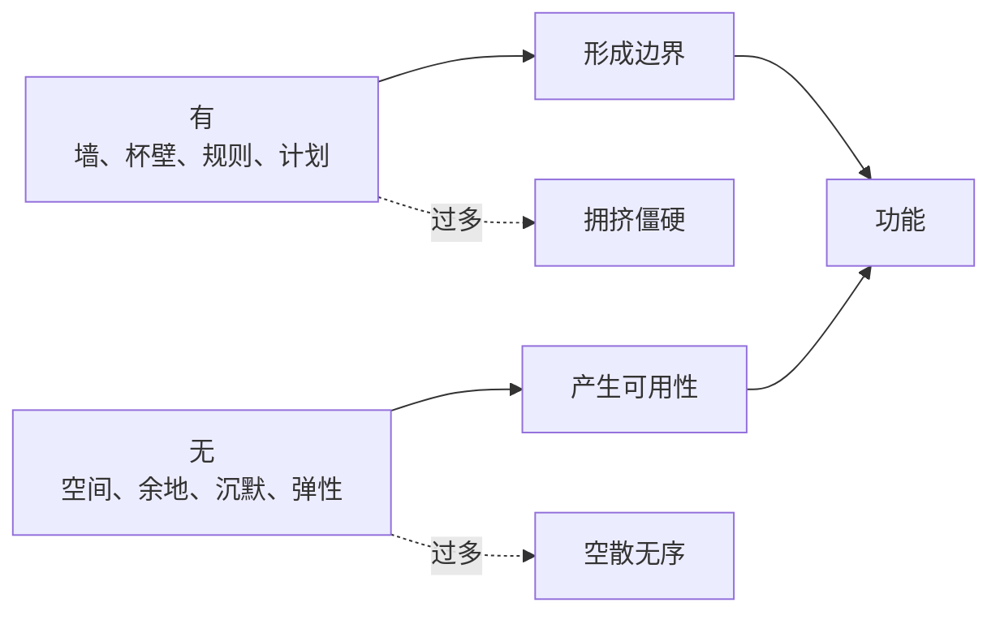

## 道家思维筑基课: 有无相生: 空白也是一种力量

### 作者
digoal

### 日期
2026-05-18

### 标签
有无相生 , 空白 , 余地 , 结构 , 功能 , 留白 , 弹性 , 道德经 , 设计思维 , 平衡

----

## 背景
> 面向对象: 高中生到普通读者  
> 核心问题: 为什么道家说“有”和“无”互相生成？  
> 先说结论: 有无相生说明，存在的东西和空出来的空间共同构成功能。看得见的结构重要，看不见的余地也重要。

## 一张图先看懂

## 求真讲法

### 它到底说了什么

杯子有杯壁，所以能成形；杯中有空处，所以能装水。房子有墙，所以能遮蔽；房里有空处，所以能居住。

这条定律把人从“只看见实体”的习惯中拉出来，让人看见空白、余地、间隔和沉默的作用。

### 它是怎么来的

它从“对立相生相转”推出。有和无不是互相消灭，而是互相成就。

### 它依赖哪些假设

| 假设 | 说明 |
|---|---|
| 功能来自关系 | 单看实体不够 |
| 空间有作用 | 无不是纯粹没有 |
| 有无要配比 | 只有空白或只有结构都不行 |

### 常见误解

| 误解 | 更准确的理解 |
|---|---|
| 无比有更重要 | 二者相生，不是单边崇拜无 |
| 什么都不安排最好 | 空白要服务于功能 |
| 有无相生只是玄学 | 它能直接解释空间、规则和节奏 |

## 求存讲法

### 它有什么用

它让人学会给事情留余地: 日程留空、表达留白、制度留弹性、关系留距离。

### 它怎么迁移到熟悉领域

| 领域 | 有 | 无 |
|---|---|---|
| 写作 | 观点和材料 | 停顿和留白 |
| 时间 | 计划任务 | 缓冲时间 |
| 管理 | 规则标准 | 自主判断空间 |

### 它的适用范围和边界

适合设计、沟通、管理、学习节奏。不适合用来美化缺失，比如缺少基础知识、缺少责任边界不能叫“留白”。

### 正例: 怎么用它提升能力

安排一天学习时，不把时间填满，每两小时留二十分钟复盘和休息。这个“无”让后面的“有”更有效。

### 反例: 前提不成立会怎样

写论文没有论据，却说“这是留白”。这里缺少的是必要支撑，不是有价值的空白。

## 思考

你现在的问题，是缺少更多东西，还是缺少让已有东西发挥作用的空间？

## 最后记住

1. 有无不是敌人，而是共同产生功能。
2. 空白、余地、间隔都可能有价值。
3. 有无需要配比，不能只要一边。
4. 留白不是偷懒，缺失也不是留白。

## 参考资料

- 《道德经》第2章、第11章。
- 陈鼓应《老子今注今译》。
- 冯友兰《中国哲学简史》。
- 本文未联网检索，基于经典文本和通行解释整理。
  
#### [PostgreSQL 解决方案集合](../201706/20170601_02.md "40cff096e9ed7122c512b35d8561d9c8")
  
  
#### [德哥 / digoal's Github - 公益是一辈子的事.](https://github.com/digoal/blog/blob/master/README.md "22709685feb7cab07d30f30387f0a9ae")
  
  
#### [About 德哥](https://github.com/digoal/blog/blob/master/me/readme.md "a37735981e7704886ffd590565582dd0")
  
  

  
