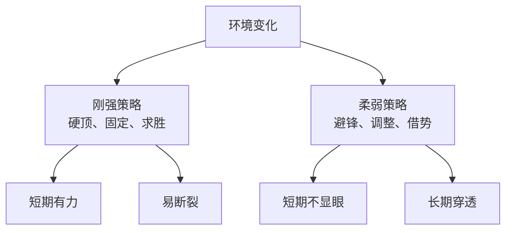

## 道家思维筑基课: 柔弱胜刚强: 弹性比硬碰硬更能穿越变化

### 作者
digoal

### 日期
2026-05-18

### 标签
柔弱胜刚强 , 柔性 , 弹性 , 刚强 , 冲突 , 借势 , 水 , 变化 , 策略 , 道家智慧

----

## 背景
> 面向对象: 高中生到普通读者  
> 核心问题: 为什么道家推崇柔弱，而不是强硬？  
> 先说结论: 柔弱胜刚强不是赞美软弱，而是说在变化环境中，弹性、低姿态和可调整性常比僵硬力量更持久。

## 一张图先看懂

## 求真讲法

### 它到底说了什么

柔不是没有力量，而是不把力量固定在一种姿态上。水柔，却能绕过石头；草柔，却能在风中不折。

### 它是怎么来的

它从“对立相生相转”和“反者道之动”推出。刚强到极端会变脆，柔弱保留变化空间，所以更能应对不确定。

### 它依赖哪些假设

| 假设 | 说明 |
|---|---|
| 环境会变化 | 固定姿态有风险 |
| 硬碰硬成本高 | 胜利也可能消耗过大 |
| 柔能保存力量 | 退让有时是战略 |

### 常见误解

| 误解 | 更准确的理解 |
|---|---|
| 柔弱就是没底线 | 柔是方法，不是放弃原则 |
| 强硬一定不好 | 必要时也要坚决 |
| 退让就是失败 | 有些退让是保存主动权 |

## 求存讲法

### 它有什么用

它帮助人处理冲突、竞争和变化，不把“赢一口气”当作唯一目标。

### 它怎么迁移到熟悉领域

| 场景 | 刚硬反应 | 柔性反应 |
|---|---|---|
| 争论 | 立即反击 | 先确认事实和目标 |
| 学习受挫 | 硬撑原方法 | 换路径补基础 |
| 谈判 | 只守立场 | 找共同约束和替代方案 |

### 它的适用范围和边界

适合复杂冲突和长期博弈。不适合面对侵害时无底线退让，底线问题需要明确保护。

### 正例: 怎么用它提升能力

被批评时先问“具体是哪一点需要改”，不急着辩解。这样柔性吸收信息，反而更快提高。

### 反例: 前提不成立会怎样

遭遇校园霸凌却一味忍让，说“柔弱胜刚强”。这里对方的侵害没有停止机制，必须求助、记录、制止。

## 思考

你的强硬是在保护原则，还是只是在保护面子？

## 最后记住

1. 柔弱是弹性，不是软弱。
2. 刚强到极端会变脆。
3. 柔性策略保留调整空间。
4. 底线问题不能用柔弱掩盖。

## 参考资料

- 《道德经》第36章、第43章、第76章、第78章。
- 《庄子》相关寓言。
- 陈鼓应《老子今注今译》。
- 本文未联网检索，基于经典文本和通行解释整理。
  
#### [PostgreSQL 解决方案集合](../201706/20170601_02.md "40cff096e9ed7122c512b35d8561d9c8")
  
  
#### [德哥 / digoal's Github - 公益是一辈子的事.](https://github.com/digoal/blog/blob/master/README.md "22709685feb7cab07d30f30387f0a9ae")
  
  
#### [About 德哥](https://github.com/digoal/blog/blob/master/me/readme.md "a37735981e7704886ffd590565582dd0")
  
  

  
