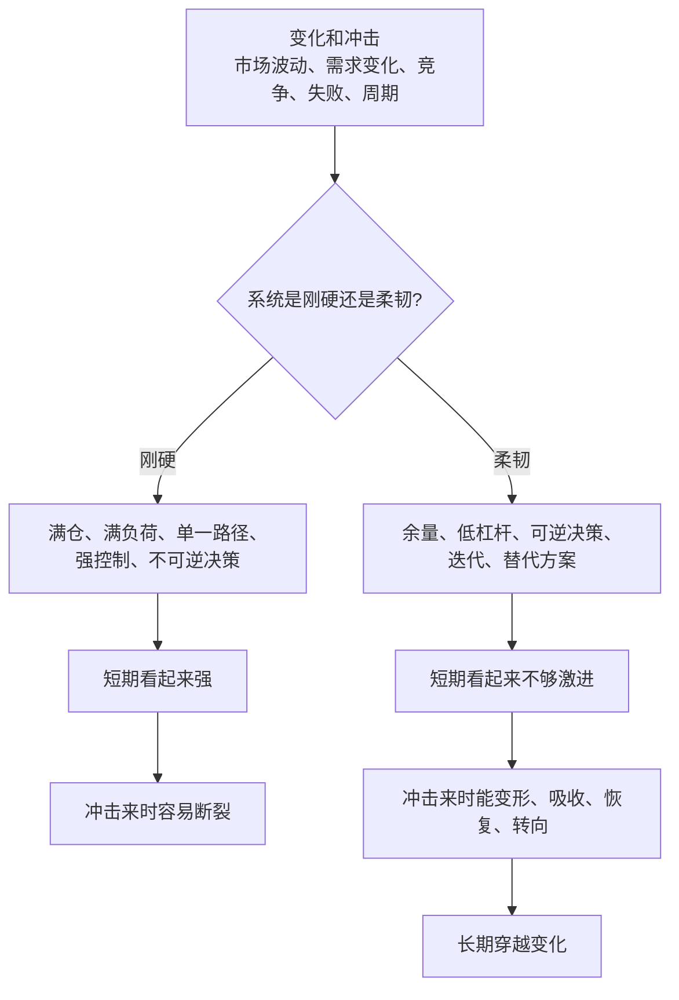
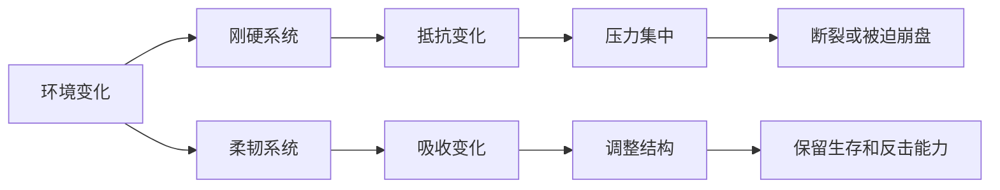
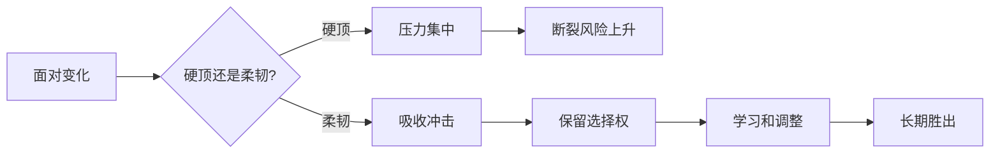

## 道家思维筑基课: 柔弱胜刚强: 弹性比硬碰硬更能穿越变化

### 作者
digoal

### 日期
2026-05-18

### 标签
柔弱胜刚强 , 弹性 , 低杠杆 , 可逆决策 , 适应能力 , 产品迭代 , 运营信任 , 创业韧性 , 投资安全边际 , 穿越变化

----

## 背景

> 面向对象: 大学生、产品经理、运营经理、有投资需求的人  
> 核心问题: 世界表面变化太快，人容易崇拜“刚强”: 更硬的目标、更猛的扩张、更满的仓位、更强的控制、更激烈的竞争。但变化越快，越僵硬的系统越容易被折断。  
> 先说结论: “柔弱胜刚强”不是软弱、退缩或没有原则，而是说在复杂变化中，保留弹性、余量、可逆性和适应能力，往往比硬碰硬更能长期存活并积累力量。

本文把“柔弱胜刚强”当作从道家底层公理推导出的行动定律来讲。它不是让人放弃力量，而是提醒我们: 真正耐久的力量，常常不是硬顶出来的，而是通过顺势、缓冲、迭代和不被一次冲击摧毁来实现的。

## 一张图先看懂



一句话版:

```text
刚强 = 靠硬度抵抗变化
柔弱 = 靠弹性吸收变化

硬度适合确定环境。
弹性适合不确定环境。
```

## 求真讲法

### 它到底说了什么

“柔弱胜刚强”可以拆成四句话。

第一，柔弱不是无力，而是不僵硬。水看起来柔，却能绕开障碍、填补低处、长期改变地形。柔弱的核心是适应性。

第二，刚强不是永远不好。明确原则、必要边界、执行纪律都需要“刚”。问题在于过度刚硬: 目标不可调整、仓位没有余量、组织不听反馈、产品路线不能转向。

第三，变化越快，弹性越值钱。一个系统如果能低成本试错、快速恢复、保留选择权，就更容易穿越环境变化。

第四，柔弱胜刚强的真正含义是: 用柔韧的结构承受变化，用低姿态获得空间，用可逆行动降低失败成本，用长期耐心赢过短期硬拼。

所以，这条定律不是教人输，而是教人不要用一次硬碰硬输掉未来。

### 它是怎么来的

《道德经》第七十六章说，人活着时身体柔软，死后才僵硬；草木活着时柔脆，死后才枯硬。第七十八章又说“天下莫柔弱于水，而攻坚强者莫之能胜”。这不是单纯赞美水，而是在说明一种深层机制: 柔韧代表生命、适应和持续性；僵硬代表失去反馈和失去调整能力。

这条定律与“反者道之动”“强控有反作用”“有无相生”相连。过度刚强会把系统推向反面；过度控制会制造反作用；没有空白就没有缓冲。柔弱之所以能胜刚强，是因为它保留了变化中的行动空间。



### 它依赖哪些假设

这条定律依赖五个假设。

第一，环境会变化。需求、技术、竞争、政策、价格、身体状态和人际关系都不会永远按你的计划运行。

第二，系统有承压上限。没有余量的系统，在冲击到来时更容易失去恢复能力。

第三，失败不可完全避免。真正重要的不是永不犯错，而是错误发生时不被一次击穿。

第四，适应能力有长期价值。能学习、能转向、能保留选择权的系统，长期更可能存活。

第五，柔弱需要底线。没有原则的软弱不是柔韧，而是随波逐流；真正的柔韧是核心不散，外形可变。

### 常见误解

| 误解 | 为什么不对 | 更准确的理解 |
|---|---|---|
| 柔弱就是软弱 | 软弱是不敢承担，柔弱是保留弹性 | 柔弱有底线，只是不硬碰硬 |
| 刚强一定不好 | 必要边界和纪律需要刚 | 问题是僵硬，不是原则 |
| 弹性就是没有计划 | 弹性需要预案、余量和反馈 | 好计划本身就包含调整机制 |
| 低杠杆太保守 | 高杠杆会在极端情境下消灭未来 | 不被迫出局本身就是力量 |
| 产品快速改就是柔 | 频繁乱改是妄动 | 真正柔韧是基于反馈迭代 |

## 求存讲法

### 它有什么用

“柔弱胜刚强”最有用的地方，是帮你在不确定环境中设计更不容易断裂的行动方式。

对大学生，它提醒你别把自己训练成单一路径的人。真正的竞争力不是只会一个热门技能，而是有可迁移能力、学习能力和心理恢复力。

对产品经理，它提醒你别把产品路线做成不可调整的铁轨。需求变化时，小步迭代、模块化设计和反馈机制比一次性大方案更稳。

对运营经理，它提醒你别只靠强刺激。柔韧的运营不是天天硬推，而是通过内容、节奏、分层和信任，让用户关系可持续。

对创业者，它提醒你别用融资、扩张和高固定成本把公司变成刚性机器。创业最怕不是慢，而是现金流和组织结构僵硬到不能转向。

对投资者，它提醒你别满仓、重杠杆、押单一叙事。长期能活下来，才有机会等到复利和低估机会。能力圈、现金余量、安全边际和低杠杆，都是投资中的柔韧。

### 它怎么迁移到熟悉领域

| 领域 | 刚硬做法 | 柔韧做法 | 穿越变化的原因 |
|---|---|---|---|
| 学习 | 只押一个证书或热点技能 | 建立底层能力和迁移能力 | 热点变了，能力仍可复用 |
| 产品 | 一次性大改版、路线不可变 | 小步验证、模块化、看反馈 | 错了可调整，成本可控 |
| 运营 | 高频硬推、强刺激 | 节奏运营、用户分层、内容沉淀 | 不透支信任 |
| 创业 | 高固定成本、盲目扩张 | 现金缓冲、轻资产验证、可逆决策 | 环境变差时能活下来 |
| 投融资 | 满仓、杠杆、追热点 | 能力圈、安全边际、现金余量 | 不被波动强迫出局 |

### 它的适用范围和边界

这条定律适合不确定性高、反馈复杂、冲击不可预测的场景: 职业选择、产品创新、运营增长、创业扩张、投资组合、组织管理。

它不适合被滥用成三种借口。

第一，不能用柔弱逃避关键决策。有些时候必须明确选择、停止错误项目、裁撤无效投入、保护底线。

第二，不能把弹性变成摇摆。频繁变方向、没有主线、没有标准，不是柔韧，而是缺乏判断。

第三，不能只追求安全。过度安全会变成停滞。柔弱胜刚强不是不冒险，而是让风险可承受、可恢复、可学习。

更准确地说: 柔弱不是没有力量，而是让力量不被一次变化折断。

### 正例: 怎么用它提升能力

假设你是创业公司的产品负责人，正在做一个新工具。市场反馈不稳定，客户说法也不一致。团队有人主张一次性投入半年，做一个“全功能平台”。

按刚硬思路，你会把路线锁死，投入大量研发，等半年后一次发布。如果方向错了，损失很大。

按“柔弱胜刚强”的方法，应该设计一个更柔韧的路径:

1. 先找一个最痛的核心任务，而不是做全平台。
2. 用最小可用版本验证客户是否愿意持续使用或付费。
3. 把功能做成模块，避免需求变化时推倒重来。
4. 保留研发和现金余量，不把所有资源押在单一假设上。
5. 设定停止条件: 如果关键指标不成立，及时转向。

这样不是不努力，而是让努力可逆、可验证、可恢复。柔韧路径让团队在不确定中活得更久，也更容易找到真实机会。

### 反例: 前提不成立会怎样

一个投资者认为自己判断很准，于是满仓加杠杆买入一个热门方向。他的理由是: 趋势强、故事好、别人也在买。

短期上涨时，这种刚硬策略看起来很强。但一旦市场波动、融资环境变化、行业估值回落，他可能被迫卖出，甚至在资产长期价值没有完全消失前就被清算。

这里失效的前提是“只要方向对，就可以承受任何路径”。现实中，路径也会杀人。投资不是只判断终点，还要保证自己能活到终点。没有现金余量、没有安全边际、没有低杠杆，刚强会变成脆弱。

个人成长也一样。一个学生为了快速成功，把睡眠、健康、关系和思考时间全部压缩，只追求短期成绩。短期看很拼，长期可能身体和心态崩掉。没有柔韧的节奏，努力本身会变成伤害。

### 一个实用检查表

```text
判断你的系统是否足够柔韧，先问十个问题:

1. 如果外部条件突然变化，我还有几个选择?
2. 当前决策是否可逆? 如果不可逆，证据是否足够?
3. 我有没有现金、时间、精力或组织余量?
4. 失败一次会不会让我出局?
5. 我是否过度依赖单一客户、单一渠道、单一技能或单一资产?
6. 我是否有反馈机制，能及时知道哪里错了?
7. 我是在坚持原则，还是在维护僵硬的面子?
8. 我有没有为了短期强势牺牲长期恢复力?
9. 如果冲击持续半年，我能不能活下来?
10. 哪些地方需要刚，哪些地方必须柔?
```

## 思考

很多人误解力量，以为力量就是不弯、不退、不变、不认错。但在真实世界里，最强的系统往往不是最硬的，而是最能承受变化的。

身体需要恢复，组织需要缓冲，产品需要迭代，关系需要余地，投资需要现金和耐心。没有这些柔韧结构，短期强大很容易变成长期脆弱。

柔弱胜刚强不是让你放弃进攻，而是让你不要把所有未来押在一次硬碰硬上。



一个反事实问题值得长期保留:

如果明天环境突然变化，你现在最骄傲的强项，会帮你转身，还是会把你锁死？

如果它让你无法转身，那不是强项，而是僵硬。

## 最后记住

1. 柔弱不是软弱，而是弹性、余量、可逆性和适应能力。
2. 刚强有价值，但过度刚硬会在变化中变成脆弱。
3. 产品、运营、创业和投资里，活下来并能调整，比短期硬拼更重要。
4. 真正的柔韧有底线: 核心原则不散，外部形态可变。
5. 每次想硬碰硬时，先问: 我是在坚持原则，还是在制造不可恢复的脆弱？

## 参考资料

- 《道德经》第七十六章: 关于柔弱与刚强、生与死状态之间关系的思想线索。
- 《道德经》第七十八章: 关于“天下莫柔弱于水，而攻坚强者莫之能胜”的经典表达。
- 《道德经》第四十章: “弱者道之用”的思想线索。
- 《庄子·养生主》: 关于顺应纹理、避免蛮力硬碰的思想线索。
- 冯友兰《中国哲学简史》: 关于老庄柔弱、无为、自然思想的通行解释。
- 陈鼓应《老子今注今译》《庄子今注今译》: 关于相关章句和现代注释的参考。
- Warren Buffett 投资思想中的能力圈、低杠杆、现金余量、安全边际和长期主义，可作为“投资中的柔韧性”的现代商业参照。
- 本文未联网检索，主要基于经典文本、通行中国哲学史解释和常见产品/运营/创业/投资分析框架整理；投融资部分是原则教育，不构成具体投资建议。
  
#### [PostgreSQL 解决方案集合](../201706/20170601_02.md "40cff096e9ed7122c512b35d8561d9c8")
  
  
#### [德哥 / digoal's Github - 公益是一辈子的事.](https://github.com/digoal/blog/blob/master/README.md "22709685feb7cab07d30f30387f0a9ae")
  
  
#### [About 德哥](https://github.com/digoal/blog/blob/master/me/readme.md "a37735981e7704886ffd590565582dd0")
  
  

  
