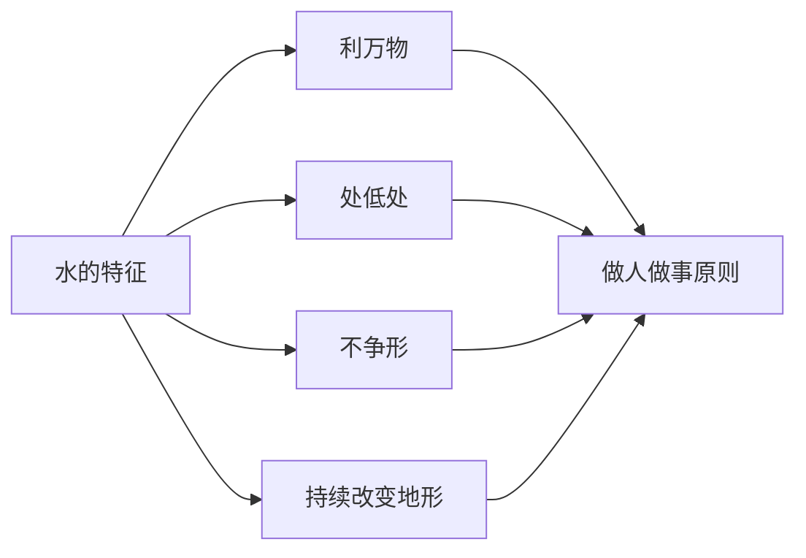

## 道家思维筑基课: 上善若水: 最高明的力量不必站在最高处

### 作者
digoal

### 日期
2026-05-18

### 标签
上善若水 , 水德 , 不争 , 处低 , 利他 , 柔性力量 , 长期主义 , 合作 , 道德经 , 影响力

----

## 背景
> 面向对象: 高中生到普通读者  
> 核心问题: 为什么《道德经》用水来比喻最高的善？  
> 先说结论: 上善若水强调一种低处、利他、不争、随形而不失方向的力量。它不是软弱，而是低阻力、高适应、长期有效的行动方式。

## 一张图先看懂

## 求真讲法

### 它到底说了什么

水有三种重要特征: 它滋养万物而不抢功；它流向低处而不争高位；它随容器改变形态，却始终向下流动、汇聚成势。

### 它是怎么来的

它从“道法自然”“柔弱胜刚强”“有无相生”推出。水是道家最喜欢的模型，因为它具体展示了柔、低、顺势和持续。

### 它依赖哪些假设

| 假设 | 说明 |
|---|---|
| 低处有力量 | 不处中心也能产生影响 |
| 不争可减少阻力 | 少争名位，多做实效 |
| 柔性能积累长期效果 | 持续比爆发更重要 |

### 常见误解

| 误解 | 更准确的理解 |
|---|---|
| 不争就是不要结果 | 不争虚名，不是不做事 |
| 处低就是自卑 | 低处是减少阻力和接近真实 |
| 像水就是没有原则 | 水有方向，只是不执着固定形状 |

## 求存讲法

### 它有什么用

它给人一种低摩擦的成长方式: 少抢中心，多创造价值；少争面子，多积累势能。

### 它怎么迁移到熟悉领域

| 水的特征 | 迁移做法 |
|---|---|
| 利万物 | 让合作方也受益 |
| 处低处 | 从基础问题做起 |
| 随形 | 根据场景调整表达 |
| 持续 | 用小步长期积累 |

### 它的适用范围和边界

适合长期影响力、合作、服务型领导。不适合面对剥削时无限退让，也不适合隐藏必要贡献导致资源被误配。

### 正例: 怎么用它提升能力

新进团队时，先解决大家都嫌麻烦的小问题，建立可靠性。你不急着抢话语权，反而更快获得信任。

### 反例: 前提不成立会怎样

长期承担团队关键工作却从不说明贡献，导致责任和资源都分配错误。这不是上善若水，而是让系统失真。

## 思考

你追求的是被看见，还是让事情真的变好？这两者有时一致，有时不一致。

## 最后记住

1. 上善若水强调利他、处低、不争和持续。
2. 不争虚名不等于不要结果。
3. 低处不是卑微，而是接近真实和减少阻力。
4. 必要时仍要清楚表达贡献和边界。

## 参考资料

- 《道德经》第8章、第78章。
- 陈鼓应《老子今注今译》。
- 冯友兰《中国哲学简史》。
- 本文未联网检索，基于经典文本和通行解释整理。
  
#### [PostgreSQL 解决方案集合](../201706/20170601_02.md "40cff096e9ed7122c512b35d8561d9c8")
  
  
#### [德哥 / digoal's Github - 公益是一辈子的事.](https://github.com/digoal/blog/blob/master/README.md "22709685feb7cab07d30f30387f0a9ae")
  
  
#### [About 德哥](https://github.com/digoal/blog/blob/master/me/readme.md "a37735981e7704886ffd590565582dd0")
  
  

  
