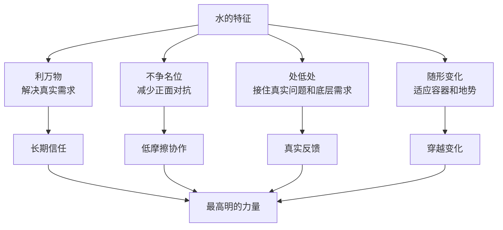
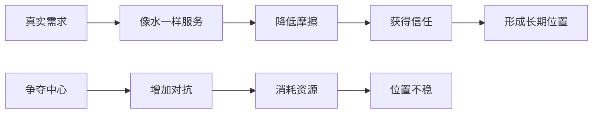
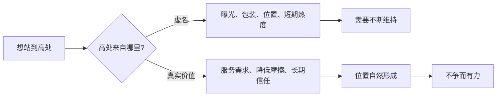

## 道家思维筑基课: 上善若水: 最高明的力量不必站在最高处

### 作者
digoal

### 日期
2026-05-18

### 标签
上善若水 , 不争 , 处低处 , 真实需求 , 低摩擦 , 产品体验 , 运营信任 , 创业价值 , 投资现金流 , 长期位置

----

## 背景

> 面向对象: 大学生、产品经理、运营经理、有投资需求的人  
> 核心问题: 世界表面变化太快，人容易把“站在最高处”误认为成功: 更高曝光、更大声量、更强控制、更中心位置、更短期排名。但很多真正持久的力量，来自像水一样服务真实需求、降低摩擦、处在低处、长期渗透。  
> 先说结论: “上善若水”不是叫人低姿态讨好别人，而是说最高明的力量不一定靠占据中心和压倒对手实现。像水一样利万物而不争、处低处、随形而变、长期积累，反而更能穿越变化。

本文把“上善若水”当作从道家底层公理推导出的行动定律来讲。它不是道德鸡汤，而是一套关于力量如何长期生效的结构判断: 真正强的系统，不一定最显眼，但一定能持续连接真实需求、降低阻力、适应环境。

## 一张图先看懂



一句话版:

```text
高处 = 显眼、中心、控制、排名、声量
低处 = 需求、反馈、服务、承接、流动

上善若水 = 不必占最高位置，也能形成最长久的力量。
```

## 求真讲法

### 它到底说了什么

“上善若水”可以拆成四句话。

第一，水的价值在于利万物。水不是靠宣称自己重要来证明价值，而是因为植物、动物、人和土地都离不开它。迁移到现代世界，就是价值来自真实需求，而不是来自自我包装。

第二，水善于处低处。低处不是低级，而是能接住流动、沉淀真实信息、触达别人不愿碰的问题。很多机会不在台面最亮处，而在最基础、最辛苦、最不被炫耀的地方。

第三，水不硬争形状。水进杯为杯形，入河为河形，遇石绕石，遇低则聚。这不是没有原则，而是外形可变，方向不丢。

第四，水的力量来自长期。滴水穿石不是一次冲击，而是持续、低摩擦、顺结构的积累。

所以，“上善若水”的核心不是“谦虚一点”这么简单，而是: 真正高明的力量，先让自己成为真实系统需要的东西。

### 它是怎么来的

《道德经》第八章说“上善若水。水善利万物而不争，处众人之所恶，故几于道。”这句话把水作为“善”的模型，不是因为水柔弱好欺负，而是因为水有四种结构优势。

1. 它提供基础价值。
2. 它不把争名位放在第一位。
3. 它能处在低处，承接真实流动。
4. 它能随环境变化而保持作用。

这条定律与“道法自然”“柔弱胜刚强”“无为而无不为”相连。水不违背地势，所以能流远；水不硬碰硬，所以能绕过障碍；水不争中心，所以能进入更多地方。



### 它依赖哪些假设

这条定律依赖五个假设。

第一，长期价值来自真实需求。没有真实需求，再高的位置、再大的声量也难以持续。

第二，低摩擦比高姿态更容易进入系统。越能减少别人的成本，越容易被长期使用和信任。

第三，低处有信息优势。真正的问题常常在用户抱怨、售后、交付、供应链、现金流、基础设施、组织边界这些不显眼的地方。

第四，不争不是没有竞争，而是减少无效竞争。避开名位之争，把资源放到价值创造上。

第五，适应不是没有原则。水随形，但不失向下流动、汇聚成势的方向。人和组织也要外形灵活、核心稳定。

### 常见误解

| 误解 | 为什么不对 | 更准确的理解 |
|---|---|---|
| 上善若水就是低姿态讨好 | 讨好没有原则，也未必创造价值 | 像水是服务真实需求，不是迎合所有人 |
| 不争就是不竞争 | 商业和人生都需要竞争 | 不争无效名位，争真实价值和长期位置 |
| 处低处就是没出息 | 低处常有真实问题和信息优势 | 高明的人愿意接触基础、脏活、难活 |
| 随形就是没有主见 | 没主见是随波逐流 | 随形是方法灵活，方向稳定 |
| 投资只要找显眼龙头 | 显眼不等于低风险 | 要看真实现金流、护城河、价格和长期需求 |

## 求存讲法

### 它有什么用

“上善若水”最有用的地方，是帮你从“争高位”转向“做底层价值”。

对大学生，它提醒你别只追最显眼的 title、证书和热点，而要让自己成为别人真正需要的人: 能解决问题、能协作、能学习、能交付。

对产品经理，它提醒你别只做炫目的功能，而要像水一样进入真实场景，减少用户完成任务的摩擦。

对运营经理，它提醒你别只追短期声量，而要沉到用户反馈、内容质量、履约体验和复购原因里。

对创业者，它提醒你别急着做平台、生态和入口。很多公司真正的机会在低处: 交付、供应链、工具、基础设施、客户成功、成本下降。

对投资者，它提醒你别只看最热、最显眼、最会讲故事的资产。长期价值常来自能持续服务真实需求、拥有低摩擦商业模式、现金流可靠、价格合理的企业。

### 它怎么迁移到熟悉领域

| 领域 | 争高处的做法 | 若水的做法 | 长期力量来源 |
|---|---|---|---|
| 学习 | 追热点证书和人设 | 打磨可交付能力 | 被真实问题需要 |
| 产品 | 做炫技功能和复杂概念 | 降低核心任务摩擦 | 用户持续使用 |
| 运营 | 追曝光、活动和声量 | 做反馈、分层、履约和信任 | 复购和口碑 |
| 创业 | 先讲平台和生态 | 先解决低处的具体痛点 | 现金流和客户黏性 |
| 投融资 | 追热门标签和市场中心 | 看基础需求、护城河、现金流和价格 | 长期复利和安全边际 |

### 它的适用范围和边界

这条定律适合长期主义场景: 职业成长、产品设计、用户运营、创业定位、组织协作、投资研究。

它不适合被滥用成三种借口。

第一，不能用“不争”逃避竞争。真正的不争，是不争虚名，不是不争价值。

第二，不能用“处低处”固化低水平。处低处是接触真实问题，不是停留在低能力。

第三，不能用“随形”放弃底线。没有原则的适应会变成迎合，最终失去信任。

更准确地说: 上善若水不是让你变低，而是让你从低处获得真实反馈和长期力量。

### 正例: 怎么用它提升能力

假设你是产品经理，负责一个企业软件。团队希望在首页突出“AI 战略升级”，做炫酷演示和复杂概念，以便显得先进。

按“上善若水”的方法，你要先沉到低处:

1. 一线用户每天最烦的任务是什么？
2. 他们在哪个环节花最多时间？
3. 哪些错误会导致返工、投诉或收入损失？
4. 哪些功能不显眼，却每天被高频使用？
5. 哪些售后问题反复出现，说明产品没有真正降低摩擦？

你可能发现，用户最需要的不是炫酷首页，而是更稳定的数据同步、更少的手工录入、更清楚的权限提示和更快的导出速度。这些东西不站在最高处，却像水一样进入日常流程，长期创造信任。

### 反例: 前提不成立会怎样

一个创业公司一开始就要做“行业平台”和“生态入口”，把大量资源投入品牌、发布会、媒体和宏大叙事，却没有沉到客户真实工作流里。

短期看，公司站在很高的位置，故事大、声量强。长期看，客户不持续付费，交付成本高，产品不能嵌入日常流程，现金流越来越紧。

这里失效的前提是“站在高处就能获得长期权力”。现实中，平台地位不是喊出来的，而是从低处的真实价值长出来的。没有客户成功、供应链能力、交付能力和现金流，所谓高处只是悬空。

投资里也一样。一个资产很显眼、叙事很强、市场关注度很高，不代表它是好投资。若水式判断要问: 它是否持续服务真实需求？是否降低用户成本？是否拥有可持续现金流？买入价格是否合理？如果答案不成立，站在市场中心反而可能意味着拥挤和高估。

### 一个实用检查表

```text
判断一件事是否有“若水之力”，先问十个问题:

1. 它服务的真实需求是什么?
2. 它是否降低了别人的时间、金钱、风险或认知成本?
3. 它是否进入了高频、基础、难替代的流程?
4. 它是否愿意处理不显眼但关键的问题?
5. 它的价值是否不依赖短期声量也能成立?
6. 它是否减少摩擦，而不是增加理解成本?
7. 它是否有长期信任和复购?
8. 它是否能随环境变化调整形态?
9. 它是否有底线，而不是无原则迎合?
10. 它是在争虚名，还是在积累真实位置?
```

## 思考

很多人把“高”理解成位置高、声量高、估值高、排名高、曝光高。道家用水提醒我们: 另一种更深的高，是你不在最高处，却让系统离不开你。

水不争树的高度，却让树能生长。  
水不争道路的中心，却让城市能运转。  
水不争形状，却能进入各种容器。  
水不争一时胜负，却能长期改变地形。

现代世界同样如此。真正厉害的人、产品、公司和投资，往往不是最会抢中心，而是最能降低摩擦、连接需求、承接问题、长期复利。



一个反事实问题值得长期保留:

如果去掉 title、曝光、估值、排名和口号，你还被谁需要？

如果仍然被需要，你就有若水之力。  
如果立刻没人需要，所谓高处可能只是表面位置。

## 最后记住

1. 上善若水不是低姿态讨好，而是像水一样服务真实需求、降低摩擦、长期积累。
2. 最高明的力量不一定站在最高处，它常在基础、低处、日常和不显眼的问题里形成。
3. 不争不是不竞争，而是不争虚名，把资源用于真实价值。
4. 产品、运营、创业和投资里，长期位置常来自低摩擦、强需求、现金流和信任。
5. 每次想站到高处时，先问: 我是在抢位置，还是在成为系统真正需要的水？

## 参考资料

- 《道德经》第八章: “上善若水。水善利万物而不争，处众人之所恶，故几于道”的思想线索。
- 《道德经》第七十八章: 关于水的柔弱与攻坚力量的思想线索。
- 《道德经》第六十六章: 关于江海处下而为百谷王的思想线索。
- 《庄子·养生主》: 关于顺应对象纹理、减少硬碰的思想线索。
- 冯友兰《中国哲学简史》: 关于老庄自然、无为、不争思想的通行解释。
- 陈鼓应《老子今注今译》《庄子今注今译》: 关于相关章句和现代注释的参考。
- Warren Buffett 投资思想中的能力圈、长期主义、真实现金流和安全边际，可作为“投资中不争短名、重长期价值”的现代商业参照。
- 本文未联网检索，主要基于经典文本、通行中国哲学史解释和常见产品/运营/创业/投资分析框架整理；投融资部分是原则教育，不构成具体投资建议。
  
#### [PostgreSQL 解决方案集合](../201706/20170601_02.md "40cff096e9ed7122c512b35d8561d9c8")
  
  
#### [德哥 / digoal's Github - 公益是一辈子的事.](https://github.com/digoal/blog/blob/master/README.md "22709685feb7cab07d30f30387f0a9ae")
  
  
#### [About 德哥](https://github.com/digoal/blog/blob/master/me/readme.md "a37735981e7704886ffd590565582dd0")
  
  

  
