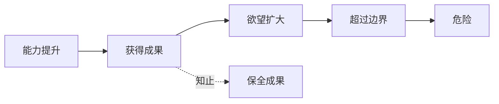

## 道家思维筑基课: 知止不殆: 会停止，才不会被成功反噬

### 作者
digoal

### 日期
2026-05-18

### 标签
知止不殆 , 边界 , 停止条件 , 风险管理 , 欲望 , 成功反噬 , 节制 , 道德经 , 长期稳定 , 决策

----

## 背景
> 面向对象: 高中生到普通读者  
> 核心问题: 为什么道家把“知道停止”看得这么重要？  
> 先说结论: 知止不殆是一条边界定律。很多危险不是来自失败，而是来自成功后继续扩张，超过了身体、关系、组织或风险承受力。

## 一张图先看懂

## 求真讲法

### 它到底说了什么

知止不是没志气，而是知道系统边界在哪里。水满会溢，弓满易折，话说太尽会伤关系，日程排太满会毁效率。

### 它是怎么来的

它从“反者道之动”和“强控有反作用”推出。过度追求会积累反作用，所以停止不是失败，而是风险管理。

### 它依赖哪些假设

| 假设 | 说明 |
|---|---|
| 任何系统有承载上限 | 身体、时间、信用都有边界 |
| 欲望会自我扩张 | 成功后更容易过度 |
| 停止能保全成果 | 不把已有成果押上赌桌 |

### 常见误解

| 误解 | 更准确的理解 |
|---|---|
| 知止就是没追求 | 知止是让追求可持续 |
| 停止就是失败 | 停止可能是保护胜利 |
| 边界固定不变 | 边界可提高，但不能假装不存在 |

## 求存讲法

### 它有什么用

它能帮助人设置停止条件，避免情绪化加码。

### 它怎么迁移到熟悉领域

| 场景 | 停止条件 |
|---|---|
| 学习 | 连续低效时休息复盘 |
| 争论 | 开始人身攻击就暂停 |
| 投资 | 亏损或盈利到预设线就复盘 |
| 工作 | 质量下降时停止加班 |

### 它的适用范围和边界

适合欲望管理、风险控制、长期规划。不适合用来逃避必要挑战，真正的成长也需要穿过舒适区。

### 正例: 怎么用它提升能力

准备考试时规定晚上 11 点后不再刷题，只做错题标记和睡觉。保住睡眠，第二天效率更高。

### 反例: 前提不成立会怎样

遇到稍微困难的题就说“知止”，立刻放弃。这是把边界管理误用成逃避训练，因为困难还没超过承载上限。

## 思考

你有没有把“还能继续”误认为“应该继续”？

## 最后记住

1. 知止是边界意识，不是没有追求。
2. 成功后最容易过度扩张。
3. 停止条件要提前设，不要等情绪最高时再决定。
4. 边界可以训练提高，但不能被忽视。

## 参考资料

- 《道德经》第9章、第32章、第44章。
- 陈鼓应《老子今注今译》。
- 冯友兰《中国哲学简史》。
- 本文未联网检索，基于经典文本和通行解释整理。
  
#### [PostgreSQL 解决方案集合](../201706/20170601_02.md "40cff096e9ed7122c512b35d8561d9c8")
  
  
#### [德哥 / digoal's Github - 公益是一辈子的事.](https://github.com/digoal/blog/blob/master/README.md "22709685feb7cab07d30f30387f0a9ae")
  
  
#### [About 德哥](https://github.com/digoal/blog/blob/master/me/readme.md "a37735981e7704886ffd590565582dd0")
  
  

  
