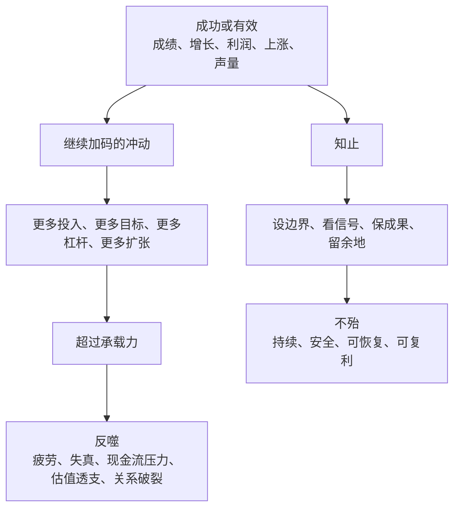
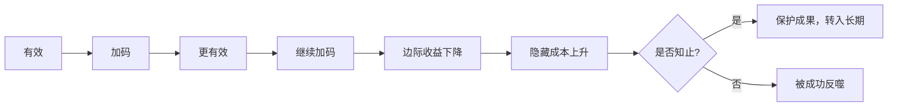
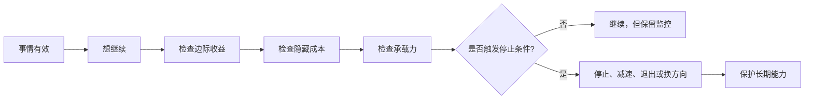

## 道家思维筑基课: 知止不殆: 会停止，才不会被成功反噬

### 作者
digoal

### 日期
2026-05-18

### 标签
知止不殆 , 停止条件 , 边界意识 , 止损止盈 , 产品复杂度 , 运营加码 , 创业扩张 , 投资纪律 , 风险管理 , 长期安全

----

## 背景

> 面向对象: 大学生、产品经理、运营经理、有投资需求的人  
> 核心问题: 世界表面变化太快，人容易把“继续”当成进取: 继续努力、继续扩张、继续投放、继续追涨、继续优化。但很多危险不是来自失败，而是来自成功之后不知道停止。  
> 先说结论: “知止不殆”不是保守和退缩，而是知道什么地方该停、该减速、该退出、该换方向。能停止，才能保护已经得到的成果，避免被欲望、惯性和成功反噬。

本文把“知止不殆”当作从道家底层公理推导出的行动定律来讲。它不是消极不作为，而是一种边界意识: 所有增长、控制、优化、扩张和投资，都有承载力和停止条件。

## 一张图先看懂



一句话版:

```text
不会停止的人，常常不是输给失败，而是输给成功后的贪多。

知止 = 事先知道边界和停止条件。
不殆 = 不把已经拥有的东西推入危险。
```

## 求真讲法

### 它到底说了什么

“知止不殆”可以拆成四句话。

第一，任何行动都有边界。学习有身体和注意力边界，产品有复杂度边界，运营有用户信任边界，创业有现金流边界，投资有估值和风险承受边界。

第二，成功会制造继续加码的诱惑。成绩提高了就想再熬一点，活动有效就想更频繁，融资顺利就想更快扩张，股票上涨就想更重仓。

第三，超过边界后，原来的优势会变成风险。努力变成透支，增长变成失控，优化变成复杂，扩张变成负担，收益变成贪婪。

第四，“知止”不是等到崩了才停，而是在行动之前就设定停止条件: 什么信号说明该停，什么代价不能承受，什么成果必须保护。

所以，这条定律的核心是: 停止不是失败，而是风险管理和长期主义的一部分。

### 它是怎么来的

《道德经》第四十四章说“知足不辱，知止不殆，可以长久”。这句话把“知足”和“知止”放在一起，不是劝人没有追求，而是提醒人: 过度占有、过度追求、过度加码，会把已经拥有的东西带入危险。

它与“反者道之动”“有无相生”“强控有反作用”相连。事物过度发展会转向反面；系统需要余量；过度干预会制造新问题。知止，就是在反转前看见边界。



### 它依赖哪些假设

这条定律依赖五个假设。

第一，系统有承载力。身体、团队、用户、现金流、估值、关系和信用都不能无限承压。

第二，边际收益会下降。最初有效的动作，继续加码后未必仍然有效。

第三，隐藏成本会滞后出现。疲劳、反感、债务、组织内耗、估值透支和信用损伤，常常晚于表面增长出现。

第四，人会被成功强化。越成功，越容易相信自己的方法永远有效。

第五，停止需要提前设计。人在情绪高涨、利益诱惑和群体共识中，很难临时做出清醒停止。

### 常见误解

| 误解 | 为什么不对 | 更准确的理解 |
|---|---|---|
| 知止就是不进取 | 不进取是不行动，知止是控制边界 | 知止保护长期行动能力 |
| 停止就是失败 | 很多停止是主动保成果 | 停止可以是减速、换方向、等待或退出 |
| 成功了就该继续加码 | 成功会改变环境和风险 | 要看边际收益和隐藏成本 |
| 投资止损越快越好 | 机械止损可能被波动牵着走 | 要区分价格波动和基本面错误 |
| 创业就必须赌到最后 | 赌到最后可能消灭未来 | 保留现金和团队，才有下一次机会 |

## 求存讲法

### 它有什么用

“知止不殆”最有用的地方，是帮你把停止变成制度，而不是情绪。

对大学生，它提醒你别把努力变成透支。学习需要强度，也需要睡眠、复盘和恢复。

对产品经理，它提醒你别无限加功能。功能增加到一定程度，会让产品复杂、维护变贵、用户迷路。

对运营经理，它提醒你别无限打扰用户。触达、补贴、活动有效，不代表频率越高越好。

对创业者，它提醒你别把扩张当成唯一答案。现金流、组织能力、交付质量和客户续费，都是停止或减速信号。

对投资者，它提醒你别把上涨当成永远正确。要事先知道什么时候不买、什么时候不加仓、什么时候卖出、什么时候承认自己不懂。

### 它怎么迁移到熟悉领域

| 领域 | 该继续的信号 | 该停止/减速的信号 | 知止动作 |
|---|---|---|---|
| 学习 | 理解加深、反馈改善 | 熬夜、低效重复、情绪崩溃 | 停止硬刷，改复盘和休息 |
| 产品 | 核心任务更顺畅 | 功能增加但留存不升 | 暂停加功能，清理复杂度 |
| 运营 | 复购和口碑改善 | 投诉上升、补贴依赖 | 降低刺激，重建信任 |
| 创业 | 单位经济模型变好 | 现金消耗过快、交付失控 | 减速扩张，保护现金流 |
| 投融资 | 价值低估且逻辑清楚 | 价格透支、基本面恶化、超出能力圈 | 停止追涨、减仓或退出 |

### 它的适用范围和边界

这条定律适合所有容易被成功、欲望和惯性推着走的场景: 学习、职业、产品、运营、创业、投资、关系管理。

它不适合被滥用成三种借口。

第一，不能用知止逃避困难。难，不等于该停；关键是判断困难是成长阻力，还是系统边界。

第二，不能把停止变成过早放弃。很多事情需要穿过冷启动期，不能一遇到波动就退出。

第三，不能用“我知止”掩盖缺乏目标。知止的前提是知道目标、边界和代价，而不是没有追求。

更准确地说: 知止不是少做事，而是知道什么时候继续会把成果推入危险。

### 正例: 怎么用它提升能力

假设你是运营经理，某次促销活动让 GMV 明显增长。团队很兴奋，准备把活动频率从每月一次改成每周一次。

按“知止不殆”的方法，不应只问“还能不能再涨”，还要问:

1. 去掉补贴后，用户还会不会复购？
2. 商家毛利是否还能承受？
3. 客诉、退款和履约压力有没有上升？
4. 用户是否开始只等低价？
5. 活动频率增加后，品牌信任是否被透支？

更稳的做法是: 事先设停止条件。比如补贴后 30 天复购低于某水平、退款率超过某水平、商家毛利被压到不可持续，就暂停加码。这样不是不要增长，而是保护增长不被反噬。

### 反例: 前提不成立会怎样

一个创业公司融资顺利，第一批客户反馈也不错，于是快速扩张城市、团队和产品线。创始人认为“窗口期必须抢”，没有设置现金流和交付质量的停止条件。

半年后，销售增长了，但交付跟不上，客户续费下降，团队管理混乱，现金消耗速度远超计划。原来的成功反而把公司推入危险。

这里失效的前提是“早期成功可以线性外推”。早期成功常常只证明一个局部假设，不等于组织、现金流和交付系统已经成熟。不会停止的扩张，会把好苗头变成坏结构。

投资里也一样。一个投资者因为某股票上涨而不断加仓，直到仓位超过自己的承受能力。后来价格波动并不一定代表企业变坏，但仓位太重让他心理和现金流承受不了，最后被迫卖出。真正的问题不是资产波动，而是买入前没有知止边界。

### 一个实用检查表

```text
行动前，先写下十个停止条件:

1. 什么信号说明这件事的边际收益开始下降?
2. 什么成本一旦出现，就不能继续加码?
3. 我最多能承受多少时间、金钱、精力或声誉损失?
4. 如果成功，我是否会被诱惑继续加码?
5. 继续做会不会损害健康、信任、现金流或长期能力?
6. 哪些指标变好，可能只是短期刺激?
7. 哪些坏信号不能被解释成“暂时困难”?
8. 如果停止，是暂停、减速、换方向，还是彻底退出?
9. 我有没有预设复盘时间，而不是每天被情绪推着走?
10. 我是在保护长期，还是在害怕短期损失?
```

## 思考

很多人以为停止需要勇气，其实继续也需要判断。最危险的是不知道自己为什么继续。

继续努力，可能是成长；也可能是透支。  
继续优化，可能是进步；也可能是复杂化。  
继续投放，可能是扩张；也可能是买假增长。  
继续融资，可能是加速；也可能是掩盖商业模式。  
继续持有，可能是长期主义；也可能是沉没成本。  
继续加仓，可能是理性判断；也可能是贪婪。

知止的难点在于: 它常常发生在别人觉得你应该继续的时候。因为表面还在好，掌声还在，数据还在，趋势还在。真正的判断力，是能看见继续背后的边界。



一个反事实问题值得长期保留:

如果你现在最成功的事情继续扩大十倍，它会让你更强，还是会把你拖入危险？

如果答案是危险，说明你需要的不是更努力，而是知止。

## 最后记住

1. 知止不是保守，而是知道继续的边界和停止条件。
2. 很多危险不是来自失败，而是来自成功之后继续加码。
3. 产品、运营、创业和投资里，停止可以是保护成果、保留现金流、降低复杂度和避免反噬。
4. 停止条件要事先写下，不能等情绪最强时再决定。
5. 每次想继续加码时，先问: 我是在扩大成果，还是在把成果推向危险？

## 参考资料

- 《道德经》第四十四章: “知足不辱，知止不殆，可以长久”的思想线索。
- 《道德经》第九章: 关于“持而盈之，不如其已；揣而锐之，不可长保”的边界意识。
- 《道德经》第三十三章: 关于“知足者富，强行者有志”的思想线索。
- 《道德经》第四十章: “反者道之动”的反作用思想。
- 《庄子·养生主》: 关于顺应限度、避免过度用力的思想线索。
- Warren Buffett 投资思想中的能力圈、卖出条件、低杠杆、安全边际和不预测市场，可作为“投资中知止”的现代商业参照。
- 本文未联网检索，主要基于经典文本、通行中国哲学史解释和常见产品/运营/创业/投资分析框架整理；投融资部分是原则教育，不构成具体投资建议。
  
#### [PostgreSQL 解决方案集合](../201706/20170601_02.md "40cff096e9ed7122c512b35d8561d9c8")
  
  
#### [德哥 / digoal's Github - 公益是一辈子的事.](https://github.com/digoal/blog/blob/master/README.md "22709685feb7cab07d30f30387f0a9ae")
  
  
#### [About 德哥](https://github.com/digoal/blog/blob/master/me/readme.md "a37735981e7704886ffd590565582dd0")
  
  

  
