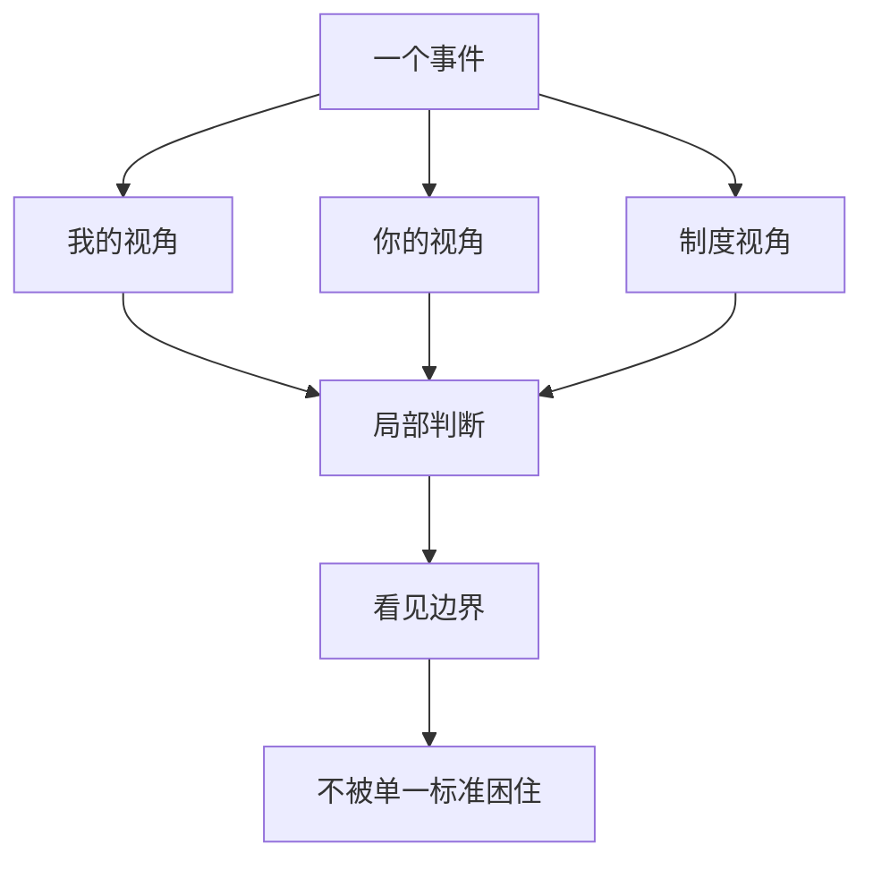

## 道家思维筑基课: 齐物逍遥: 看见视角边界，才有精神自由

### 作者
digoal

### 日期
2026-05-18

### 标签
齐物逍遥 , 齐物论 , 逍遥游 , 庄子 , 视角边界 , 精神自由 , 价值判断 , 多元尺度 , 认知 , 人生选择

----

## 背景
> 面向对象: 高中生到普通读者  
> 核心问题: 《庄子》讲“齐物”和“逍遥”，是不是说一切都无所谓？  
> 先说结论: 齐物不是取消差别，逍遥不是逃避现实。它们合起来提醒人: 判断有视角，价值有条件；看见边界后，人才能不被单一评价体系绑死。

## 一张图先看懂

## 求真讲法

### 它到底说了什么

“齐物”不是把万物说成完全一样，而是把人的绝对化判断放回具体位置。许多“是非”“贵贱”“有用无用”，都依赖场景和尺度。

“逍遥”不是想干什么就干什么，而是在看见这些限制后，心不被单一标准牵走。

### 它是怎么来的

它从“名与知有限”推出。既然语言、知识和评价都有限，人就要警惕把某个局部标准当成宇宙真理。

### 它依赖哪些假设

| 假设 | 说明 |
|---|---|
| 人总从位置出发 | 没有全知视角 |
| 价值依赖尺度 | 大小、快慢、成功都要看标准 |
| 精神痛苦常来自执着单一评价 | 被一个标准绑死会失去自由 |

### 常见误解

| 误解 | 更准确的理解 |
|---|---|
| 齐物就是没有是非 | 是警惕绝对化，不是取消事实 |
| 逍遥就是逃避责任 | 是不被虚假标准困住 |
| 所有观点都一样 | 观点仍有证据和后果差异 |

## 求存讲法

### 它有什么用

它帮助人从排名、评价、身份焦虑中退出一步，重新选择真正重要的尺度。

### 它怎么迁移到熟悉领域

| 压力 | 齐物式追问 |
|---|---|
| 成绩排名 | 这个排名衡量了什么，没衡量什么？ |
| 职业比较 | 我比较的是收入、自由、成长，还是面子？ |
| 他人评价 | 评价者站在什么位置，有多少信息？ |

### 它的适用范围和边界

适合精神自由、价值选择、减少比较焦虑。不适合用来逃避事实检验和道德责任。

### 正例: 怎么用它提升能力

你没有进入热门专业，但发现自己更适合长期研究和写作。齐物逍遥让你不只用“热门/冷门”评价人生，而是重新看能力、兴趣和长期路径。

### 反例: 前提不成立会怎样

一个人抄袭后说“是非都是相对的”。这是误用。抄袭破坏明确规则和他人权益，不是视角差异。

## 思考

你现在痛苦的原因，是事情本身，还是你把某一种评价体系当成了唯一世界？

## 最后记住

1. 齐物不是万物一样，而是看见判断的视角边界。
2. 逍遥不是逃避，而是不被单一标准绑死。
3. 多视角不等于取消事实和责任。
4. 精神自由来自更大的尺度感。

## 参考资料

- 《庄子·逍遥游》。
- 《庄子·齐物论》。
- 冯友兰《中国哲学简史》。
- 陈鼓应《庄子今注今译》。
- 本文未联网检索，基于经典文本和通行解释整理。
  
#### [PostgreSQL 解决方案集合](../201706/20170601_02.md "40cff096e9ed7122c512b35d8561d9c8")
  
  
#### [德哥 / digoal's Github - 公益是一辈子的事.](https://github.com/digoal/blog/blob/master/README.md "22709685feb7cab07d30f30387f0a9ae")
  
  
#### [About 德哥](https://github.com/digoal/blog/blob/master/me/readme.md "a37735981e7704886ffd590565582dd0")
  
  

  
