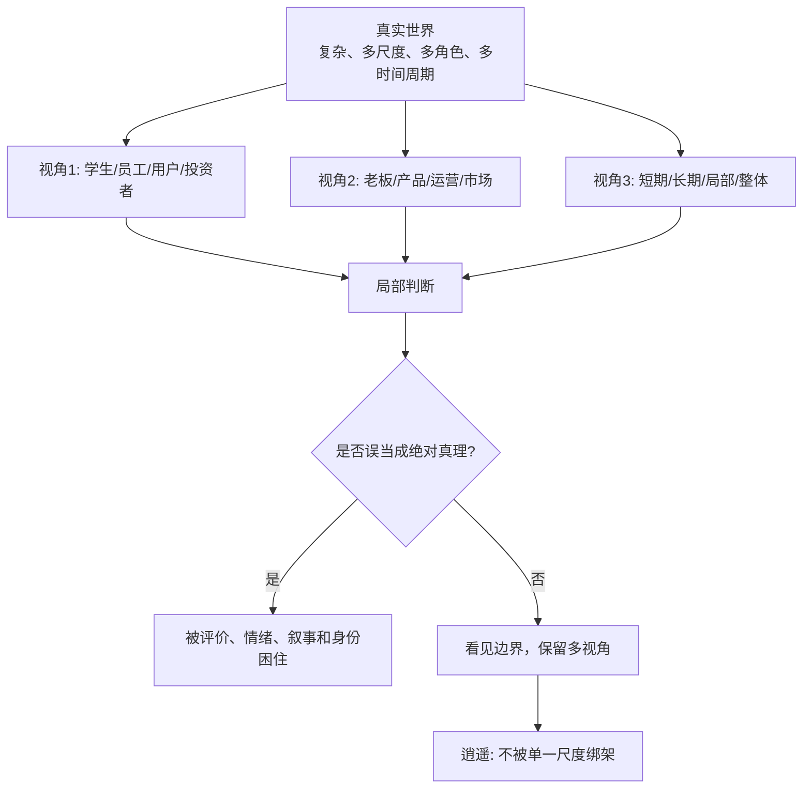
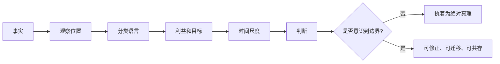

## 道家思维筑基课: 齐物逍遥: 看见视角边界，才有精神自由

### 作者
digoal

### 日期
2026-05-18

### 标签
齐物逍遥 , 视角边界 , 精神自由 , 多视角判断 , 产品视角 , 运营指标 , 创业角色 , 投资情绪 , 能力圈 , 独立判断

----

## 背景

> 面向对象: 大学生、产品经理、运营经理、有投资需求的人  
> 核心问题: 世界表面变化太快，评价体系、热点概念、市场情绪、职业标签、用户画像和投资叙事不断变化。人如果被单一视角绑架，就会把局部判断当成真理，把外部评价当成自己。  
> 先说结论: “齐物逍遥”不是说万物完全一样、没有事实和是非，而是提醒我们: 每个判断都有视角、尺度、位置和边界。看见这些边界，人才不会被单一评价体系困住，才有真正的精神自由和判断自由。

本文把“齐物逍遥”当作从《庄子》思想中提炼出的认知定律来讲。它不是逃避现实，而是训练人在复杂世界中同时看见多个视角，并知道自己当前站在哪里、受什么限制、能判断什么、不能判断什么。

## 一张图先看懂



一句话版:

```text
齐物 = 看见不同事物、不同判断背后的视角条件
逍遥 = 不被单一视角、单一评价、单一身份困住

不是没有判断。
而是知道判断从哪里来、到哪里止。
```

## 求真讲法

### 它到底说了什么

“齐物逍遥”可以拆成四句话。

第一，人看到的世界不是世界全体，而是从某个位置看到的世界。学生看专业，老板看产出，用户看体验，投资者看风险收益，监管者看秩序。

第二，很多冲突不是因为一方完全错，而是因为尺度不同。短期看低效的事，长期可能是能力建设；局部看漂亮的数据，整体可能在透支信任；市场短期看坏的资产，长期可能仍有价值。

第三，齐物不是取消差别，而是看见差别如何被视角制造。你说“大”，是和什么比？你说“贵”，是用什么价值估算？你说“成功”，是按收入、自由、健康、影响力，还是长期复利？

第四，逍遥不是逃离责任，而是精神不被单一评价体系绑死。一个人能使用评价体系，但不把自己交给评价体系。

所以，这条定律的核心不是“都一样”，而是“别把局部视角绝对化”。

### 它是怎么来的

《庄子·齐物论》讨论“彼此”“是非”“成心”。庄子看到，人们常常从自己的立场出发，把自己的分类和判断当成绝对真理。于是“彼”与“此”、“是”与“非”不断对立。

《逍遥游》则用大鹏、蜩与学鸠等形象说明尺度差异。小鸟用自己的飞行尺度评价大鹏，会觉得不可理解；但尺度不同，世界就不同。

这不是说事实不存在，而是说: 事实进入人的判断时，总会经过位置、尺度、语言、利益、经验和时间周期。



### 它依赖哪些假设

这条定律依赖五个假设。

第一，人的观察是有限的。没有人能从所有位置、所有时间尺度、所有利益关系同时观察世界。

第二，概念和评价都有尺度。好坏、快慢、贵贱、成功失败，都依赖比较对象和评价标准。

第三，不同视角能揭示不同真实。用户投诉、财务报表、员工反馈、市场价格、长期现金流，都可能各自揭示一部分现实。

第四，单一视角会制造精神束缚。只按成绩、工资、职位、估值、排名、流量来理解自己，人会失去更大的判断空间。

第五，多视角不等于相对主义。看见视角边界，不代表所有说法同样可靠。事实、证据、逻辑和后果仍然重要。

### 常见误解

| 误解 | 为什么不对 | 更准确的理解 |
|---|---|---|
| 齐物就是万物一样 | 万物当然有差异 | 齐物是看见判断背后的视角和尺度 |
| 逍遥就是逃避现实 | 逃避是不承担后果 | 逍遥是不被单一评价体系绑架 |
| 多视角就是没有是非 | 有些判断证据更强、后果更好 | 多视角是为了更准确，不是取消判断 |
| 看见边界就不用行动 | 行动仍然必要 | 只是行动前知道自己的判断可能不完整 |
| 投资中市场错了我就对 | 市场情绪会错，但自己也可能错 | 要用事实、现金流、能力圈和价格校验 |

## 求存讲法

### 它有什么用

“齐物逍遥”最有用的地方，是帮你从单一评价体系中抽身出来。

对大学生，它提醒你别只用学校排名、热门专业、同龄人比较定义自己。你需要知道自己所处的资源、兴趣、承受力、长期能力曲线。

对产品经理，它提醒你别只站在产品视角看用户。用户不是“画像”，而是在具体场景中有压力、替代方案和使用成本的人。

对运营经理，它提醒你别只站在指标视角看增长。DAU、GMV、转化率是一种视角，用户信任、复购动机、内容质量和履约体验也是视角。

对创业者，它提醒你别只站在融资和叙事视角看公司。投资人看增长，客户看价值，员工看组织，现金流看生存，长期竞争看护城河。

对投资者，它提醒你别只站在市场价格和新闻情绪里。价格是市场视角，价值是企业视角，风险是自己承受力视角，机会是价格与价值偏离后的行动视角。

### 它怎么迁移到熟悉领域

| 场景 | 单一视角 | 被遮蔽的视角 | 更自由的判断 |
|---|---|---|---|
| 学习 | 分数和排名 | 理解深度、迁移能力、身心状态 | 分数重要，但不是全部能力 |
| 产品 | 功能和 Roadmap | 用户任务、使用成本、替代方案 | 功能服务任务，不服务自嗨 |
| 运营 | GMV 和转化 | 信任、毛利、复购、疲劳度 | 指标必须和质量一起看 |
| 创业 | 融资估值 | 客户付费、现金流、组织能力 | 估值不是公司生命力 |
| 投融资 | 涨跌和新闻 | 企业基本面、能力圈、估值边界 | 价格不是价值本身 |

### 它的适用范围和边界

这条定律适合处理复杂判断、价值冲突、身份焦虑、产品理解、组织协作、创业取舍和投资决策。

它不适合被滥用成三种借口。

第一，不能用多视角掩盖事实错误。事实错误不是视角差异。

第二，不能用逍遥逃避责任。看见不同视角后，仍然要选择、行动、承担后果。

第三，不能把“别人也有视角”变成讨好所有人。产品不可能满足所有用户，投资不可能适合所有人，人生也不需要满足所有评价体系。

更准确地说: 齐物逍遥不是没有立场，而是知道自己的立场不是宇宙中心。

### 正例: 怎么用它提升能力

假设你是产品经理，用户反馈“这个功能太复杂”。研发说功能逻辑没问题，运营说这个功能能提升转化，老板说竞品也有。

如果只站在内部视角，你可能会认为用户“不懂”。按“齐物逍遥”的方法，先把视角拆开:

1. 用户视角: 他在什么场景下使用？时间压力多大？
2. 研发视角: 功能逻辑是否完整？维护成本多高？
3. 运营视角: 转化提升是短期刺激，还是长期价值？
4. 商业视角: 这个功能服务收入，还是服务噱头？
5. 长期视角: 它会让产品更清晰，还是更复杂？

这样做不是谁都听，而是把每个判断放回它的视角边界。最后你可能决定: 保留功能，但改成默认简单、高级设置折叠，并用新手路径验证核心任务完成率。

### 反例: 前提不成立会怎样

一个投资者看到市场连续上涨，周围人都在赚钱，媒体也在讲某个主题，于是把“市场共识”当成真理。他认为自己错过就是失败，开始追高。

这里的问题不是市场共识一定错，而是他被单一视角绑架了。他只站在价格和群体情绪视角，没有回到企业基本面、估值、现金流、风险承受力和自己的能力圈。

这个反例失效的前提是“大家都这么看，所以它就是真的”。现实中，市场价格是一种重要信息，但不是世界本身。投资者如果看不见视角边界，就会把别人的情绪当成自己的判断。

生活里也一样。一个大学生只用“同龄人收入排名”评价自己，可能忽略健康、学习曲线、行业周期、家庭责任和长期复利。单一评价体系会让人失去精神自由。

### 一个实用检查表

```text
遇到一个强判断时，先问十个问题:

1. 这个判断是谁说的?
2. 他站在什么位置、承担什么风险、追求什么目标?
3. 这个判断使用的时间尺度是什么?
4. 它依赖哪些概念和指标?
5. 哪些事实支持它，哪些事实反驳它?
6. 有没有其他角色会得出不同结论?
7. 我是否把局部视角当成了全局真理?
8. 如果换一个尺度，结论会不会改变?
9. 我是在独立判断，还是在借别人的评价定义自己?
10. 看见所有视角后，我愿意承担哪个选择的后果?
```

## 思考

现代世界最大的精神束缚之一，是评价体系太多、更新太快。今天你被成绩评价，明天被工资评价，后天被流量评价，再后来被资产收益评价。

每个评价体系都有用，但每个评价体系都不完整。

成绩能衡量一部分学习结果，但不能衡量全部人生能力。  
工资能衡量一部分市场交换价值，但不能衡量全部人格价值。  
DAU 能衡量一部分活跃，但不能衡量全部信任。  
估值能衡量一部分市场预期，但不能衡量全部公司质量。  
股价能衡量一部分市场情绪和预期，但不能直接等于企业价值。

齐物逍遥的难处，是你既要认真使用这些评价，又不能被它们完全定义。


一个反事实问题值得长期保留:

如果明天你失去一个标签、一个排名、一个头衔、一个市场价格，你还知道自己是谁、要做什么、凭什么判断吗？

如果知道，你就有一点逍遥。  
如果不知道，说明你可能被某个视角暂时接管了。

## 最后记住

1. 齐物不是万物一样，而是看见判断背后的视角、尺度和边界。
2. 逍遥不是逃避现实，而是不被单一评价体系定义。
3. 产品、运营、创业和投资里，很多误判来自把局部指标、市场情绪或角色立场当成全局真理。
4. 多视角不是取消判断，而是让判断更准确、更谦逊、更能修正。
5. 每次被一个评价刺痛或诱惑时，先问: 这是世界本身，还是某个视角下的局部判断？

## 参考资料

- 《庄子·齐物论》: 关于彼此、是非、成心和视角边界的核心文本。
- 《庄子·逍遥游》: 关于大小尺度、自由境界和精神不受限的经典文本。
- 《道德经》第一章: 关于“道”与“名”的区分，可作为概念边界的思想线索。
- 《道德经》第二章: 关于有无、难易、长短等关系性判断的思想线索。
- 冯友兰《中国哲学简史》: 关于庄子相对视角、精神自由和逍遥思想的通行解释。
- 陈鼓应《庄子今注今译》《老子今注今译》: 关于相关章句和现代注释的参考。
- Warren Buffett 投资思想中的能力圈、市场先生、长期主义和独立判断，可作为投资中识别市场视角边界的现代商业参照。
- 本文未联网检索，主要基于经典文本、通行中国哲学史解释和常见产品/运营/创业/投资分析框架整理；投融资部分是原则教育，不构成具体投资建议。
  
#### [PostgreSQL 解决方案集合](../201706/20170601_02.md "40cff096e9ed7122c512b35d8561d9c8")
  
  
#### [德哥 / digoal's Github - 公益是一辈子的事.](https://github.com/digoal/blog/blob/master/README.md "22709685feb7cab07d30f30387f0a9ae")
  
  
#### [About 德哥](https://github.com/digoal/blog/blob/master/me/readme.md "a37735981e7704886ffd590565582dd0")
  
  

  
