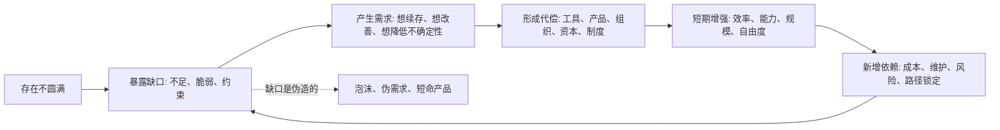

## 王东岳思维筑基课: 本体公理: 存在本身是不圆满的

### 作者
digoal

### 日期
2026-05-18

### 标签
王东岳 , 本体公理 , 存在不圆满 , 物演通论 , 递弱代偿 , 形而上学 , 存在论 , 演化动力 , 哲学公理 , 思维筑基

----

## 背景


> 面向对象: 大学生、产品经理、运营经理、有投资需求的人  
> 核心问题: 世界表面变化太快，怎样穿透热点、概念、价格和叙事，看到更稳定的底层规律？  
> 先说结论: “存在本身是不圆满的”不是一个可在体系内部被证明的结论，而是一个本体论公理。它的意思是: 任何具体存在都带着缺口、约束和脆弱性，因此必须通过结构、能力、工具、制度、关系和叙事进行代偿。谁能识别真实缺口，谁就更容易判断真伪、预判趋势、做出产品、组织和投资决策。

## 一张图先看懂



## 求真讲法

### 它到底说了什么

“存在本身是不圆满的”可以翻译成一句更日常的话:

> 任何人、产品、组织、行业和文明，都不是自足的；它们必须靠外部条件和内部结构维持自己。

人需要食物、睡眠、社会关系和意义感。产品需要用户需求、技术能力、渠道、定价和交付体系。企业需要现金流、组织能力、供应链、信任和法规空间。投资标的需要真实需求、竞争优势、管理能力和资本纪律。

如果一个存在物完全自足、完全稳定、完全无缺，它就不需要变化、不需要工具、不需要市场、不需要组织，也不需要学习。现实恰好相反: 所有持续存在的东西，都在不断补自己的缺口。

### 它是怎么来的

这是一个哲学公理，不是一个实验公式。它的选择动机是解释三个问题:

1. 为什么世界总在变化？  
   因为具体存在不圆满，必须不断寻找代偿方式。

2. 为什么需求会反复出现？  
   因为缺口不是偶然噪声，而是存在结构的一部分。

3. 为什么“增强”常常带来新的脆弱？  
   因为代偿工具本身也需要条件维持。工具越强，依赖链往往越长。

在王东岳《物演通论》的语境里，这个公理常和“存在度”“代偿度”“存在阈”“递弱代偿”等概念连在一起。简化表达如下:

```text
存在不圆满 -> 存在度不足 -> 需要代偿
代偿增强 -> 功能增强 -> 依赖也增强
依赖增强 -> 新脆弱出现 -> 继续代偿
```

### 它依赖哪些假设

| 假设 | 含义 | 如果不成立会怎样 |
| --- | --- | --- |
| 具体存在有限 | 人、组织、产品、行业都受资源、时间、信息、能力限制 | 如果存在完全无限，就无所谓缺口 |
| 缺口会转化为压力 | 缺口不是静止概念，会表现为焦虑、成本、效率低、风险高 | 如果缺口不产生压力，就不会形成稳定需求 |
| 代偿能暂时有效 | 工具、组织、资本、制度能缓解缺口 | 如果代偿无效，文明和市场都难以解释 |
| 代偿会产生新依赖 | 新工具和新结构本身也需要维护 | 如果代偿没有代价，就不会有系统性风险 |
| 表面现象背后有约束结构 | 价格、热点、流量、情绪背后有更慢变量 | 如果没有慢变量，预测只能靠猜 |

### 常见误解

第一，不圆满不是悲观主义。它不是说“世界越来越坏”，而是说: 变化、需求、创新、组织和文明都来自缺口。

第二，不圆满不是“缺点思维”。它不是让人盯着坏处，而是训练人识别真实约束。真实约束会持续制造需求，伪造痛点只会制造短期噪声。

第三，不圆满不是万能解释。它不能替代行业研究、财务分析、用户访谈、实验数据和产品验证。它只提供一个起点: 先问缺口在哪里，再看解决方案是否真实有效。

## 求存讲法

### 它有什么用

这条公理最有用的地方，是把注意力从“表面变化”拉回“结构缺口”。

```text
看热点的人问:
现在什么火？

看底层规律的人问:
什么缺口长期存在？
谁在代偿这个缺口？
代偿方式能否规模化？
代偿之后新增了什么依赖？
```

这四个问题，比追热点更适合生活、创业、运营和投资。

### 它怎么迁移到生活

生活里的很多麻烦，不是因为人不努力，而是因为人误判了自己的缺口。

一个大学生以为缺口是“没有更多资料”，于是收藏大量课程；但真实缺口可能是注意力、反馈、练习密度和长期节律。资料只是代偿，不等于能力。

一个职场人以为缺口是“不会表达”，于是学话术；但真实缺口可能是没有稳定交付、没有业务理解、没有可信记录。话术能短期代偿，不能长期替代实力。

判断方法很简单: 如果一个补救动作只能带来短期情绪缓解，却不能减少长期约束，它大概率只是浅层代偿。

### 它怎么迁移到产品和运营

产品经理要找的不是“用户喜欢什么”，而是“用户为了继续生活、工作、社交、赚钱、避险，必须补什么缺口”。

运营经理要看的不是一次点击、一次转化、一次裂变，而是用户是否存在反复出现的缺口。只有反复出现的缺口，才可能形成留存、复购和口碑。

| 业务现象 | 表面解释 | 底层解释 |
| --- | --- | --- |
| 用户愿意付费 | 用户喜欢功能 | 功能代偿了高成本、高风险或高焦虑 |
| 用户持续使用 | 体验不错 | 缺口持续存在，产品进入工作流或生活流 |
| 用户流失 | 活动不够 | 缺口消失、替代品更强、代偿成本过高 |
| 增长停滞 | 流量不够 | 真实缺口太窄，或解决方案没有形成结构优势 |

### 它怎么迁移到创业

创业不是“做一个新东西”，而是找到一个足够真实、足够高频、足够昂贵、足够难被旧系统解决的缺口。

一个创业机会通常要经过四层判断:

1. 缺口是否真实: 用户是否已经在用笨办法解决？
2. 缺口是否稳定: 这是长期约束，还是短期情绪？
3. 代偿是否有效: 你的方案是否显著降低成本、风险或复杂度？
4. 依赖是否可控: 你的方案会不会制造用户无法承受的新成本？

如果四层都成立，机会才可能从“点子”变成“生意”。

### 它怎么迁移到投融资

投资时，不能只看增长率和故事。增长率可能来自一次性红利，故事可能来自市场情绪。更底层的问题是:

```text
公司解决了什么长期缺口？
这个缺口会不会扩大？
公司是不是最有效的代偿结构？
它的代偿方式有没有规模优势？
新增依赖会不会反噬公司？
```

好的公司往往不是“看起来最热”的公司，而是卡住了某个长期不圆满之处: 降低交易成本、提高生产效率、缓解信息不对称、减少不确定性、提升安全性、节约时间、扩展能力边界。

但同样要看反面: 有些公司增长很快，是因为它把新的依赖转嫁给用户、员工、供应商或金融系统。这样的代偿可能短期有效，长期脆弱。

### 正例: 怎么用它提升能力

假设你要判断一个 AI 产品有没有长期价值。

浅层看法是: 它能不能生成更漂亮的内容。  
底层看法是: 它代偿了什么真实缺口。

如果它只是让用户短期觉得新鲜，缺口很浅。  
如果它能持续降低知识工作中的搜索成本、表达成本、代码调试成本、客服响应成本、运营分析成本，它就进入了更深的代偿层。  
如果它还能嵌入组织流程，减少人力瓶颈和交付不确定性，它就可能从工具变成基础设施。

这时你还要继续问: 它新增了哪些依赖？比如模型成本、数据安全、幻觉风险、组织能力退化、供应商锁定。能回答这些问题，判断才更完整。

### 反例: 前提不成立会怎样

反例一: 伪需求产品。

某团队做了一个“帮助年轻人记录每天心情颜色”的 App。界面很好看，初期下载也不错。但用户没有长期焦虑必须靠它解决，也没有高频任务必须通过它完成。这里的“缺口”不稳定，压力不够强，所以留存很差。

失败不是因为设计不努力，而是因为“缺口会转化为稳定压力”这个假设不成立。

反例二: 投资中的伪成长。

某公司靠补贴快速增长，用户大量涌入。表面看是需求强劲，底层看却可能只是价格代偿。补贴一停，用户离开，说明公司没有解决长期缺口，只是暂时降低了购买成本。

失败不是因为增长数据不存在，而是因为增长没有对应真实、可持续的代偿结构。

## 思考

这条公理真正训练的是一种判断习惯:

> 不要先相信叙事，要先寻找缺口；不要只看增强，要看增强背后的依赖。

可以用下面这张检查表做日常判断:

| 问题 | 用在生活 | 用在产品/运营 | 用在投资 |
| --- | --- | --- | --- |
| 缺口是什么 | 我真正缺的是资料、方法、反馈还是时间？ | 用户真实痛点是什么？ | 公司解决的长期约束是什么？ |
| 谁在代偿 | 工具、老师、同伴、制度？ | 功能、内容、社区、流程？ | 技术、品牌、渠道、资本、管理？ |
| 代偿是否有效 | 是否减少长期约束？ | 是否提升留存和复购？ | 是否改善利润、现金流或壁垒？ |
| 新依赖是什么 | 是否更焦虑、更分散？ | 是否增加使用成本？ | 是否引入债务、监管、供应链或平台风险？ |
| 是否可持续 | 我能否长期维持？ | 用户是否愿意持续付费？ | 竞争者能否轻易复制？ |

## 最后记住

1. “存在本身是不圆满的”是本体论公理，不是体系内部证明出来的定理。
2. 它的实用价值在于逼你寻找真实缺口，而不是追逐表面热点。
3. 需求、产品、组织、资本和文明，都可以看作对缺口的代偿结构。
4. 代偿会带来能力增强，也会带来新的依赖和脆弱性。
5. 判断未来，不是看什么最热，而是看什么缺口最深、最稳、最难被旧系统解决。

## 参考资料

- 王东岳: 《物演通论》第十九章，东岳哲学学会在线版。https://www.wuyantonglun.org/2022/655.html
- 王东岳: 《物演通论》第三十章，东岳哲学学会在线版。https://www.wuyantonglun.org/2023/1700.html
- 王东岳: 《物演通论》第三十六章，东岳哲学学会在线版。https://www.wuyantonglun.org/2023/1768.html
- 王东岳: 《物演通论》名词及概念注释，爱智思享会。https://www.aizhisx.com/post/758.html
- 王东岳思想录: 《物演通论》卷一自然哲学卷导读。https://wuyantonglun.com/post/688.html
  
#### [PostgreSQL 解决方案集合](../201706/20170601_02.md "40cff096e9ed7122c512b35d8561d9c8")
  
  
#### [德哥 / digoal's Github - 公益是一辈子的事.](https://github.com/digoal/blog/blob/master/README.md "22709685feb7cab07d30f30387f0a9ae")
  
  
#### [About 德哥](https://github.com/digoal/blog/blob/master/me/readme.md "a37735981e7704886ffd590565582dd0")
  
  

  
