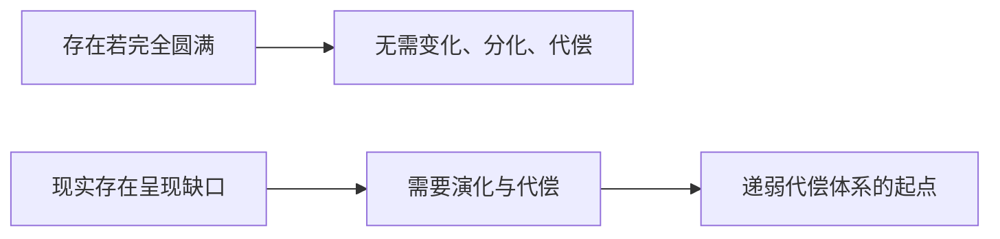

## 王东岳思维筑基课: 王东岳思想之01: 本体公理: 存在本身是不圆满的

### 作者
digoal

### 日期
2026-05-18

### 标签
王东岳 , 本体公理 , 存在不圆满 , 物演通论 , 递弱代偿 , 形而上学 , 存在论 , 演化动力 , 哲学公理 , 思维筑基

----

## 背景

> 面向对象: 高中生到大学通识读者  
> 核心问题: 为什么王东岳要从“存在的不圆满”开始，而不是从“世界越来越进步”开始？  
> 先说结论: 本体公理认为，存在不是自足圆满的实体，而是带着缺口和张力展开的过程。正因为存在不圆满，后续的演化、分化、代偿才有必要。

## 一张图先看懂



## 求真讲法

### 它到底说了什么

它说的是: 不要把存在理解成一个已经完成、完全自足、永远稳定的东西。王东岳体系先假定存在内部带有不圆满性，所以存在物才会表现为展开、分化、演化和补偿。

为了便于理解，可以把它先当成一个观察模型，而不是已经完成实证检验的自然科学定律。王东岳体系的强项在于把自然、生命、精神、社会放进同一条解释链；它的边界也在这里: 统一解释越强，具体测量就越需要谨慎。

### 它是怎么来的

作为公理，它不是在体系内部被证明出来的，而是整套体系的出发点。选择这个公理，是为了回答一个基础问题: 如果世界本来完满，为什么还会有漫长的自然演化、生命演化、精神演化和社会演化？

如果用最简推理表示，就是:

```text
存在不自足 -> 出现续存压力 -> 形成代偿结构 -> 获得暂时续存 -> 新依赖继续出现
```

### 它依赖哪些假设

- 存在可以被理解为一个动态过程，而不是静止物件。
- “不圆满”不是道德评价，而是结构上缺少绝对自足性。
- 演化不是额外装饰，而是存在为了维持自身而展开的必要路径。

| 维度 | 前提成立 | 前提不成立时的风险 |
| --- | --- | --- |
| 核心判断 | 本体公理认为，存在不是自足圆满的实体，而是带着缺口和张力展开的过程。正因为存在不圆满，后续的演化、分化、代偿才有必要。 | 容易把哲学模型误当成事实结论 |
| 实践迁移 | 可用于识别缺口、依赖和代价 | 可能变成套话，遮蔽具体问题 |
| 学习方法 | 先看假设，再看推论 | 只背结论，无法判断边界 |

### 常见误解

- 误解一: 不圆满等于世界很坏。这里说的是形上结构，不是情绪判断。
- 误解二: 不圆满已经被科学证明。它是哲学元假设，不是实验定律。
- 误解三: 不圆满就意味着必然悲观。它也解释了创造、学习和组织形成的动力。

## 求存讲法

### 它有什么用

它给整套物演论提供了第一块地基: 先有存在的不自足，才有后续的递弱、代偿、复杂化和文明风险。

它训练的不是背诵结论，而是一种检查方式: 看到能力增强时，同时追问它补了什么缺口、增加了什么依赖、留下了什么边界。

### 它怎么迁移到熟悉领域

学习中，一个人承认自己有知识缺口，才会建立笔记、练习、请教和复盘系统。组织中，承认单个岗位不自足，才会有流程、协作和制度。

### 它的适用范围和边界

它适合做哲学解释和反思，不适合拿来直接替代物理学、生命科学或社会科学的具体机制研究。

### 正例: 怎么用它提升能力

做项目时，先承认方案不可能天然完满，于是预留测试、灰度、监控和回滚机制。这不是悲观，而是把“不圆满”转化为工程能力。

### 反例: 前提不成立会怎样

如果把“不圆满”误读成“什么都没意义”，就会放弃行动。这个反例失败，是因为它把结构性缺口误读成价值虚无。

## 思考

如果一个系统宣称自己完全自足、没有缺口，你更应该问: 它把依赖藏在哪里了？

也可以把这个问题写成一个小练习:

```text
我看到的增强是什么？
它代偿的缺口是什么？
新增的依赖是什么？
如果依赖中断，系统会怎样？
```

## 最后记住

1. 本体公理是物演论的出发点，不是体系内部的结论。
2. 不圆满不是道德贬义，而是存在的不自足。
3. 正因为不自足，演化和代偿才有必要。
4. 它能训练我们寻找系统背后的缺口和依赖。

## 参考资料

- 王东岳: 《物演通论》之跋，爱智思享会，2019-12-11。https://www.aizhisx.com/post/759.html
- 王东岳: 《物演通论》名词及概念注释，爱智思享会，2019-12-11。https://www.aizhisx.com/post/758.html
- 王东岳: 递弱演化的自然律纲要，爱智思享会，2019-10-09。https://www.aizhisx.com/post/315.html
- 《物演通论》第十九章，东岳哲学学会在线版。https://www.wuyantonglun.org/2022/655.html
- 《物演通论》第三十章，东岳哲学学会在线版。https://www.wuyantonglun.org/2023/1700.html
- 说明: 以下文章把王东岳体系当作哲学解释模型来讲解，不把相关命题表述为现代自然科学中已完成实证检验的定律。
  
#### [PostgreSQL 解决方案集合](../201706/20170601_02.md "40cff096e9ed7122c512b35d8561d9c8")
  
  
#### [德哥 / digoal's Github - 公益是一辈子的事.](https://github.com/digoal/blog/blob/master/README.md "22709685feb7cab07d30f30387f0a9ae")
  
  
#### [About 德哥](https://github.com/digoal/blog/blob/master/me/readme.md "a37735981e7704886ffd590565582dd0")
  
  

  
