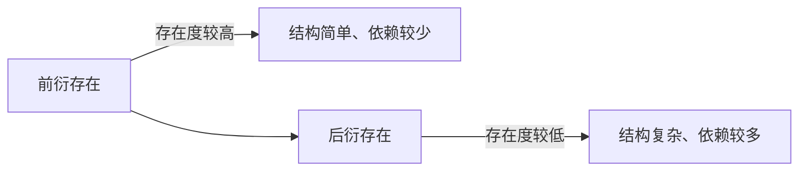

## 王东岳思维筑基课: 王东岳思想之02: 演化公理: 存在度不可逆地递减

### 作者
digoal

### 日期
2026-05-18

### 标签
王东岳 , 演化公理 , 存在度 , 递弱演化 , 物演通论 , 稳定性 , 后衍存在 , 演化哲学 , 依赖结构 , 思维筑基

----

## 背景

> 面向对象: 高中生到大学通识读者  
> 核心问题: 为什么王东岳说后来的存在物并不是更稳固，而是存在度更低？  
> 先说结论: 演化公理认为，越后衍的存在形态，原初稳定性越低，越不能单靠自身存在。它们看似高级，实则更依赖条件。

## 一张图先看懂



## 求真讲法

### 它到底说了什么

“存在度”可以通俗理解为一个东西凭自身维持存在的稳定程度。演化公理说，后来的东西不是天然更强，而是在存在度下降的背景下出现。

为了便于理解，可以把它先当成一个观察模型，而不是已经完成实证检验的自然科学定律。王东岳体系的强项在于把自然、生命、精神、社会放进同一条解释链；它的边界也在这里: 统一解释越强，具体测量就越需要谨慎。

### 它是怎么来的

这个公理是为了反转普通进步叙事。普通说法容易把复杂、智能、文明看成单向增强；王东岳则把它们解释为存在度下降后的代偿结果。

如果用最简推理表示，就是:

```text
存在不自足 -> 出现续存压力 -> 形成代偿结构 -> 获得暂时续存 -> 新依赖继续出现
```

### 它依赖哪些假设

- 可以把不同层级存在物放在同一条演化链上比较。
- “稳定性”和“复杂功能”不是同一个指标。
- 后衍存在需要更多外部条件才能维持。

| 维度 | 前提成立 | 前提不成立时的风险 |
| --- | --- | --- |
| 核心判断 | 演化公理认为，越后衍的存在形态，原初稳定性越低，越不能单靠自身存在。它们看似高级，实则更依赖条件。 | 容易把哲学模型误当成事实结论 |
| 实践迁移 | 可用于识别缺口、依赖和代价 | 可能变成套话，遮蔽具体问题 |
| 学习方法 | 先看假设，再看推论 | 只背结论，无法判断边界 |

### 常见误解

- 误解一: 递弱等于后来的东西没价值。递弱说的是存在稳定性，不是否定功能价值。
- 误解二: 递弱就是退化论。它并不否认功能增强，而是强调功能增强背后的代价。
- 误解三: 存在度可以像温度一样精确测量。这里更多是哲学指标。

## 求存讲法

### 它有什么用

它让我们重新理解自然史: 从基本粒子到生命、意识、社会，越往后能力越多，依赖链也越长。

它训练的不是背诵结论，而是一种检查方式: 看到能力增强时，同时追问它补了什么缺口、增加了什么依赖、留下了什么边界。

### 它怎么迁移到熟悉领域

看现代人时，不只看智能手机、医疗、教育让人更强，也要看现代人离开电力、网络、城市系统后的独立维生能力下降。

### 它的适用范围和边界

不能把它粗暴套到所有局部过程。某些局部系统可能更稳定，递弱公理讨论的是王东岳体系中的宏观演化方向。

### 正例: 怎么用它提升能力

企业数字化后效率提高，同时识别出网络、云服务、账号权限这些新增依赖，主动做备份和应急演练。

### 反例: 前提不成立会怎样

如果只说“我们工具更多，所以一定更安全”，就忽略了停电、断网、供应链中断的风险。这个反例失败，是因为把功能增强误认为存在度增强。

## 思考

越高级的能力，是否越需要一个看不见的支撑系统？

也可以把这个问题写成一个小练习:

```text
我看到的增强是什么？
它代偿的缺口是什么？
新增的依赖是什么？
如果依赖中断，系统会怎样？
```

## 最后记住

1. 演化公理的关键词是“存在度递减”。
2. 复杂功能不等于原初稳定性。
3. 后衍存在更能动，也更依赖。
4. 它提醒我们把能力和依赖一起看。

## 参考资料

- 王东岳: 《物演通论》之跋，爱智思享会，2019-12-11。https://www.aizhisx.com/post/759.html
- 王东岳: 《物演通论》名词及概念注释，爱智思享会，2019-12-11。https://www.aizhisx.com/post/758.html
- 王东岳: 递弱演化的自然律纲要，爱智思享会，2019-10-09。https://www.aizhisx.com/post/315.html
- 《物演通论》第十九章，东岳哲学学会在线版。https://www.wuyantonglun.org/2022/655.html
- 《物演通论》第三十章，东岳哲学学会在线版。https://www.wuyantonglun.org/2023/1700.html
- 说明: 以下文章把王东岳体系当作哲学解释模型来讲解，不把相关命题表述为现代自然科学中已完成实证检验的定律。
  
#### [PostgreSQL 解决方案集合](../201706/20170601_02.md "40cff096e9ed7122c512b35d8561d9c8")
  
  
#### [德哥 / digoal's Github - 公益是一辈子的事.](https://github.com/digoal/blog/blob/master/README.md "22709685feb7cab07d30f30387f0a9ae")
  
  
#### [About 德哥](https://github.com/digoal/blog/blob/master/me/readme.md "a37735981e7704886ffd590565582dd0")
  
  

  
