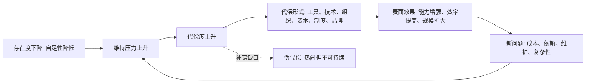

## 王东岳思维筑基课: 代偿公理: 代偿度随存在度下降而上升

### 作者
digoal

### 日期
2026-05-18

### 标签
王东岳 , 代偿公理 , 代偿度 , 存在度 , 递弱代偿 , 属性增益 , 功能补偿 , 续存压力 , 系统复杂性 , 思维筑基

----

## 背景

> 面向对象: 大学生、产品经理、运营经理、有投资需求的人  
> 核心问题: 为什么世界越发展，工具越多、流程越多、组织越复杂、资本越密集、技术越先进，但人和企业反而越来越离不开这些东西？  
> 先说结论: “代偿度随存在度下降而上升”是递弱代偿体系里的关键公理。它说的是: 当一个存在物自身稳定性下降、依赖条件增加时，它必须发展出更多外部补偿和内部结构来维持自己。产品、运营、创业和投资的核心判断，就是分清哪些代偿解决真实缺口，哪些代偿只是制造表面繁荣。

## 一张图先看懂



## 求真讲法

### 它到底说了什么

先把两个词讲清楚。

“存在度”可以理解为一个系统靠自身维持稳定存在的程度。存在度越高，越不需要复杂外部条件；存在度越低，越依赖环境、工具、组织、信息和协作。

“代偿度”可以理解为系统为了弥补自身不足而投入的补偿结构。代偿可以是身体器官、感知能力、语言、工具、制度、资本、流程、品牌、数据、算法，也可以是个人学习、组织管理和社会协作。

因此，“代偿度随存在度下降而上升”的意思是:

```text
越不能靠自身稳定存在
越需要外部补偿和内部结构
越需要工具、组织、技术、资本和制度
```

人类比普通动物更聪明，但人类也更需要教育、语言、家庭、市场、法律、能源、医疗和技术系统。现代企业比个体摊贩规模更大，但它更需要融资、财务、法务、人力、供应链、IT 系统、品牌和合规。能力上升的背后，是代偿结构上升。

### 它是怎么来的

这是一个公理，不是在体系内部被证明出来的定理。它的选择动机，是解释一个常见但容易被误判的现象:

> 为什么越高级、越复杂、越强大的系统，反而越需要更多支撑？

如果只看表面，我们会以为工具、技术、制度和资本越多，系统越强。递弱代偿视角会多问一步: 这些东西为什么必须出现？

答案是: 因为底层存在度下降，系统无法靠原始稳定性维持自己，只能通过代偿维持在存在阈之上。

在王东岳《物演通论》的表达中，存在性涉及“存在度、代偿度、存在阈”之间的关系。可以用一个极简模型辅助理解:

```text
存在阈 Ts = 存在度 Ed + 代偿度 Pb

当 Ed 下降时，
如果系统还要维持在 Ts 之上，
Pb 就必须上升。
```

这个表达是哲学模型，不是可以直接拿来做数学测量的工程公式。它的价值在于提供一个判断方向: 看见能力增强时，同时检查它补偿了什么弱点，又制造了什么依赖。

### 它依赖哪些假设

| 假设 | 含义 | 如果不成立会怎样 |
| --- | --- | --- |
| 存在物有维持阈值 | 人、产品、组织、企业都必须维持基本生存条件 | 如果没有阈值，就无所谓失存和续存 |
| 存在度会下降 | 后衍系统更复杂、更依赖、更难自足 | 如果存在度不下降，就不需要持续增加代偿 |
| 代偿能弥补缺口 | 工具、制度、资本、组织可以缓解不足 | 如果代偿无效，复杂文明无法运行 |
| 代偿不能等同于本体增强 | 外部补偿不等于自身稳定性恢复 | 如果混同二者，就会误把热闹当强大 |
| 代偿有成本 | 每一种补偿结构都需要维护和支付代价 | 如果代偿没有成本，就不会出现复杂性风险 |

### 常见误解

第一，代偿度上升不是绝对好事。它带来能力增强，也带来依赖增强。一个公司上了很多系统、搭了很多团队、融了很多钱，不必然更健康；它可能只是用更重的代偿维持更弱的基本盘。

第二，代偿度上升不是绝对坏事。没有代偿，人类没有语言、医学、教育、市场和科技。问题不是要不要代偿，而是代偿是否对应真实缺口，是否降低长期约束，是否可持续。

第三，代偿不是装饰。真正的代偿能减少痛苦、成本、风险、时间、误差或不确定性。不能减少这些东西的功能、活动、流程和故事，大概率只是表层噪声。

## 求存讲法

### 它有什么用

这条公理最适合用来识别三类事情:

```text
真需求: 真实缺口推动代偿上升
伪需求: 营销制造焦虑推动代偿上升
过度代偿: 小缺口配了大系统，成本超过收益
```

普通人看见“更多”，容易以为是“更强”。这条公理提醒你: 更多工具、更多流程、更多融资、更多活动、更多功能，首先说明系统需要更多代偿。接下来必须判断: 这是有效代偿，还是无效负担？

### 它怎么迁移到生活

个人成长中，代偿最常见的形式是工具、课程、证书、社群和方法论。

这些东西可以有用，但要看它补什么缺口。比如一个大学生写论文困难，真实缺口可能是文献阅读能力、问题意识、论证结构和写作反馈。如果他只是不断购买写作课、收藏模板、安装效率软件，代偿度确实上升了，但存在度没有提高。

生活判断可以用一句话:

> 好代偿让你逐步摆脱依赖，坏代偿让你越来越离不开它。

如果一个工具帮助你形成能力，它是有效代偿。  
如果一个工具让你逃避训练，它是依赖放大器。

### 它怎么迁移到产品经理

产品的本质是代偿结构。用户买产品，不是因为产品存在，而是因为产品替他补了某个缺口。

产品经理要问:

```text
用户原来靠什么笨办法代偿？
这个笨办法的成本在哪里？
我的产品是否显著降低这个成本？
用户是否愿意把旧代偿迁移到新代偿？
新代偿是否制造了更难接受的新依赖？
```

例如企业买客服系统，表面买的是软件，底层买的是响应速度、服务一致性、人员管理、知识沉淀和客户满意度。软件如果不能降低这些方面的成本，只是多了一个后台，就不是有效代偿。

### 它怎么迁移到运营经理

运营动作本质上也是代偿: 用内容代偿信任不足，用活动代偿转化不足，用补贴代偿价格阻力，用社群代偿关系弱，用会员体系代偿复购弱。

但运营最危险的误区，是把“代偿手段有效”误判为“业务本体健康”。

| 运营动作 | 它在代偿什么 | 需要警惕什么 |
| --- | --- | --- |
| 补贴 | 价格阻力、初始尝试成本 | 补贴停后需求是否还在 |
| 内容种草 | 信任不足、理解成本高 | 内容热度是否能转化为复购 |
| 社群运营 | 关系弱、陪伴弱、反馈弱 | 社群是否变成高人力负担 |
| 会员权益 | 复购不足、用户黏性不足 | 权益成本是否吞掉利润 |
| 私域触达 | 平台流量不稳定 | 是否形成骚扰和退订 |

好的运营不是一直加码代偿，而是让有效代偿沉淀为低成本机制。

### 它怎么迁移到创业

创业早期的公司存在度很低，因此代偿度会非常高。创始人要代偿品牌不足、信任不足、产品不完整、组织不成熟、现金流不稳定和渠道缺失。

这解释了为什么创业早期往往很累: 不是因为事情多而已，而是因为公司还没有稳定结构，很多代偿靠人肉硬扛。

创业判断有一个关键分界:

```text
早期人肉代偿可以接受；
但如果规模扩大后仍然必须靠人肉代偿，
说明商业模式或组织系统没有真正成立。
```

真正的进展，不是代偿越来越多，而是关键代偿逐步系统化:

| 阶段 | 低级代偿 | 更好的代偿 |
| --- | --- | --- |
| 获客 | 创始人到处求人试用 | 明确场景和可复制渠道 |
| 交付 | 创始人手工盯每个项目 | 标准流程、工具和培训 |
| 信任 | 靠个人背书 | 案例、品牌、口碑、合规 |
| 现金流 | 靠融资续命 | 复购、预收、健康毛利 |
| 管理 | 靠吼、靠盯、靠加班 | 目标、责任、反馈和机制 |

### 它怎么迁移到投融资

投资时，这条公理能帮你识别“好公司”和“被代偿堆起来的公司”。

好公司也需要代偿，但它的代偿能形成结构优势。比如技术降低单位成本，品牌降低信任成本，网络效应降低获客成本，规模降低采购成本，数据提升匹配效率。

差公司也可能看起来很强，但它的强来自不断加码代偿: 补贴换增长，融资换现金流，营销换复购，压供应商换利润，讲故事换估值。

投资检查表:

```text
这家公司代偿了谁的真实缺口？
这种代偿是否比旧方案更便宜、更快、更稳？
代偿结构是否随着规模扩大而更轻？
还是规模越大，补贴、销售、合规、维护和债务越重？
如果外部资本停止，业务还能不能维持？
```

最值得警惕的是“代偿度上升但存在度没有上升”的企业。它们看起来资源更多、动作更大、故事更完整，但每一步都需要更重外部支撑。

### 它的适用范围和边界

适用场景:

| 场景 | 如何使用 |
| --- | --- |
| 判断个人成长 | 看工具和课程是否形成真实能力 |
| 判断产品价值 | 看产品是否代偿用户真实、高频、昂贵的缺口 |
| 判断运营质量 | 看运营动作能否沉淀为机制，而不是持续烧资源 |
| 判断创业进展 | 看人肉代偿是否逐步系统化 |
| 判断投资标的 | 看代偿结构是否形成护城河，还是形成负担 |

边界也很重要: 这不是一个可以直接算出“代偿度数值”的公式。现实中，代偿度常常只能通过成本结构、依赖链、流程复杂度、人员配置、技术栈、资本消耗和用户留存来间接判断。

### 正例: 怎么用它提升能力

假设你要评估一个企业知识库产品。

表面看，它提供文档管理、AI 搜索、权限控制和协作功能。递弱代偿视角会问:

```text
企业的真实缺口是什么？
是信息找不到、经验无法沉淀、新人培训慢、客服回答不一致，还是跨部门协作成本高？
这个产品是否降低了这些缺口的长期成本？
使用后员工是否更独立，组织是否更少依赖少数老员工？
系统维护成本是否低于它节省的沟通成本？
```

如果答案成立，这个产品是有效代偿: 它让组织从“靠人记住”转向“靠系统沉淀”。  
如果答案不成立，它只是多了一个文档库，反而增加录入和维护负担。

### 反例: 前提不成立会怎样

反例一: 过度管理系统。

一家 20 人公司还没有稳定业务，却上了复杂的 OKR、绩效、审批、BI、CRM、项目管理和知识库系统。管理工具很多，代偿度很高，但真实问题可能只是目标不清、客户不稳、产品未验证。

失败原因是: “存在度下降需要更高代偿”这个前提被误用。公司并不是因为规模复杂而需要重系统，而是用重系统掩盖战略和业务不清。

反例二: 补贴型增长。

一个平台用高额补贴让用户和商家迅速入驻。数据很好看，资本市场也兴奋。但补贴一降，用户流失、商家沉默、订单下降。

失败原因是: 补贴代偿的是价格阻力，不是产品价值不足。它没有把用户需求、供给效率、信任机制和履约能力做强，只是临时把系统托起来。

## 思考

“代偿度随存在度下降而上升”最适合训练一个判断习惯:

> 看到系统变复杂时，不要先赞叹先进，要先问它在补什么弱。

很多未来趋势都可以用这句话重新理解。

| 表面趋势 | 代偿视角 |
| --- | --- |
| AI 工具爆发 | 代偿知识工作中的搜索、表达、编码、分析和客服成本 |
| 企业 SaaS 增长 | 代偿组织复杂化后的流程、权限、数据和协作成本 |
| 医疗消费升级 | 代偿身体脆弱、寿命延长、慢病增加和健康焦虑 |
| 私域运营兴起 | 代偿公域流量不稳定和用户关系薄弱 |
| 金融工具复杂化 | 代偿时间错配、风险分散、信用不足和流动性需求 |

但每个趋势都要继续追问:

```text
它补的是深层缺口，还是制造焦虑？
它降低了总成本，还是只是转移成本？
它让系统更稳，还是让系统更依赖？
它能沉淀为能力，还是只能靠持续投入维持？
```

## 最后记住

1. 代偿度上升，是因为存在度下降后系统需要更多补偿结构来维持自己。
2. 工具、技术、组织、资本、制度和品牌，都是常见的代偿形式。
3. 有效代偿会降低长期约束，无效代偿只会制造热闹和依赖。
4. 产品、运营、创业和投资，都要识别真实缺口和可持续代偿。
5. 越复杂的系统，越要检查代偿成本、依赖链和失效后果。

## 参考资料

- 王东岳: 《物演通论》第十九章，东岳哲学学会在线版。https://www.wuyantonglun.org/2022/655.html
- 王东岳: 《物演通论》第三十六章，东岳哲学学会在线版。https://www.wuyantonglun.org/2023/1768.html
- 王东岳: 《物演通论》名词及概念注释，爱智思享会。https://www.aizhisx.com/post/758.html
- 王东岳思想录: 《物演通论》卷一自然哲学卷导读。https://wuyantonglun.com/post/688.html
  
#### [PostgreSQL 解决方案集合](../201706/20170601_02.md "40cff096e9ed7122c512b35d8561d9c8")
  
  
#### [德哥 / digoal's Github - 公益是一辈子的事.](https://github.com/digoal/blog/blob/master/README.md "22709685feb7cab07d30f30387f0a9ae")
  
  
#### [About 德哥](https://github.com/digoal/blog/blob/master/me/readme.md "a37735981e7704886ffd590565582dd0")
  
  

  
