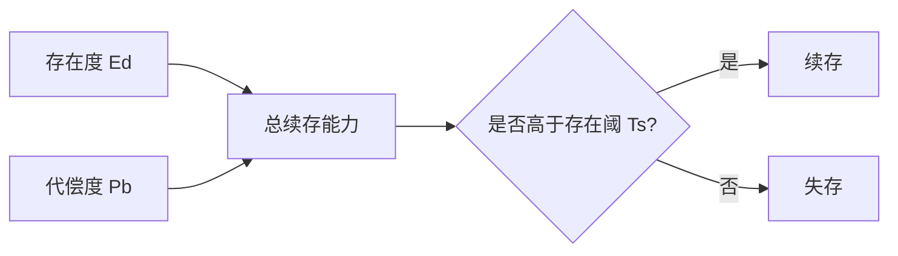

## 王东岳思维筑基课: 王东岳思想之04: 阈值公理: 存在必须维持在存在阈上

### 作者
digoal

### 日期
2026-05-18

### 标签
王东岳 , 阈值公理 , 存在阈 , 续存条件 , 存在度 , 代偿度 , 临界点 , 系统生存 , 风险底线 , 思维筑基

----

## 背景

> 面向对象: 高中生到大学通识读者  
> 核心问题: 为什么递弱之后还没有立刻消失？  
> 先说结论: 阈值公理认为，存在物只要能通过自身存在度和代偿度的合力维持在存在阈之上，就还能续存；低于阈值，就会失存。

## 一张图先看懂



## 求真讲法

### 它到底说了什么

阈值就是底线。王东岳体系里，存在物不是因为完美才存在，而是因为暂时还没有跌破存在底线。

为了便于理解，可以把它先当成一个观察模型，而不是已经完成实证检验的自然科学定律。王东岳体系的强项在于把自然、生命、精神、社会放进同一条解释链；它的边界也在这里: 统一解释越强，具体测量就越需要谨慎。

### 它是怎么来的

这个公理把“递弱”和“代偿”接起来: 如果只有递弱，世界会直接崩塌；如果只有代偿，递弱就没有压力。阈值解释了为什么弱化系统仍可暂时存在。

如果用最简推理表示，就是:

```text
存在不自足 -> 出现续存压力 -> 形成代偿结构 -> 获得暂时续存 -> 新依赖继续出现
```

### 它依赖哪些假设

- 存在有一个最低维持条件。
- 存在度和代偿度都能影响是否越过底线。
- 阈值不是具体数值，而是哲学模型中的临界概念。

| 维度 | 前提成立 | 前提不成立时的风险 |
| --- | --- | --- |
| 核心判断 | 阈值公理认为，存在物只要能通过自身存在度和代偿度的合力维持在存在阈之上，就还能续存；低于阈值，就会失存。 | 容易把哲学模型误当成事实结论 |
| 实践迁移 | 可用于识别缺口、依赖和代价 | 可能变成套话，遮蔽具体问题 |
| 学习方法 | 先看假设，再看推论 | 只背结论，无法判断边界 |

### 常见误解

- 误解一: 存在阈是一个可精确测量的数字。它更像概念模型。
- 误解二: 高于阈值就安全。高于阈值只说明暂时可续存，不说明长期稳固。
- 误解三: 代偿越多越好。过度代偿也可能制造新风险。

## 求存讲法

### 它有什么用

它让物演论避免简单悲观: 即使存在度下降，只要代偿足够，系统仍能在一定时间内维持。

它训练的不是背诵结论，而是一种检查方式: 看到能力增强时，同时追问它补了什么缺口、增加了什么依赖、留下了什么边界。

### 它怎么迁移到熟悉领域

学生考试不是每科都完美才通过，而是总分过线；公司不是每个环节都无缺陷才运行，而是整体能力暂时压过风险阈值。

### 它的适用范围和边界

现实系统有多个阈值，且阈值会变化。不能用一个抽象阈值替代具体的健康线、现金流线、安全线、生态红线。

### 正例: 怎么用它提升能力

创业公司知道现金流是生存阈值，于是控制开支、缩小产品范围、寻找付费客户，让公司先活过临界期。

### 反例: 前提不成立会怎样

如果公司只追求曝光和估值，却忽略现金流底线，市场转冷时会迅速失存。这个反例失败，是因为把表层代偿误当成越过真正阈值。

## 思考

你所在的学习、工作或家庭系统，真正的存在阈是什么？它可能不是你平时最关注的指标。

也可以把这个问题写成一个小练习:

```text
我看到的增强是什么？
它代偿的缺口是什么？
新增的依赖是什么？
如果依赖中断，系统会怎样？
```

## 最后记住

1. 阈值公理解释“为什么弱者还能存在”。
2. 续存取决于存在度和代偿度的合力。
3. 高于阈值不是永久安全。
4. 判断系统时要先找真正的生存底线。

## 参考资料

- 王东岳: 《物演通论》之跋，爱智思享会，2019-12-11。https://www.aizhisx.com/post/759.html
- 王东岳: 《物演通论》名词及概念注释，爱智思享会，2019-12-11。https://www.aizhisx.com/post/758.html
- 王东岳: 递弱演化的自然律纲要，爱智思享会，2019-10-09。https://www.aizhisx.com/post/315.html
- 《物演通论》第十九章，东岳哲学学会在线版。https://www.wuyantonglun.org/2022/655.html
- 《物演通论》第三十章，东岳哲学学会在线版。https://www.wuyantonglun.org/2023/1700.html
- 说明: 以下文章把王东岳体系当作哲学解释模型来讲解，不把相关命题表述为现代自然科学中已完成实证检验的定律。
  
#### [PostgreSQL 解决方案集合](../201706/20170601_02.md "40cff096e9ed7122c512b35d8561d9c8")
  
  
#### [德哥 / digoal's Github - 公益是一辈子的事.](https://github.com/digoal/blog/blob/master/README.md "22709685feb7cab07d30f30387f0a9ae")
  
  
#### [About 德哥](https://github.com/digoal/blog/blob/master/me/readme.md "a37735981e7704886ffd590565582dd0")
  
  

  
