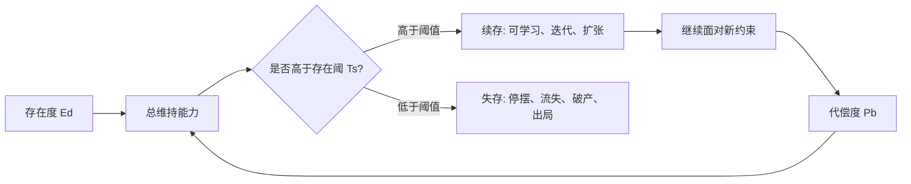

## 王东岳思维筑基课: 阈值公理: 存在必须维持在存在阈上

### 作者
digoal

### 日期
2026-05-18

### 标签
王东岳 , 阈值公理 , 存在阈 , 续存条件 , 存在度 , 代偿度 , 临界点 , 系统生存 , 风险底线 , 思维筑基

----

## 背景

> 面向对象: 大学生、产品经理、运营经理、有投资需求的人  
> 核心问题: 为什么很多人、产品、公司和投资标的不是慢慢变差，而是突然崩掉？为什么“看起来还行”不等于“真正安全”？  
> 先说结论: “存在必须维持在存在阈上”是递弱代偿体系中的阈值公理。它说的是: 一个系统只要低于维持自身存在的最低线，就会失存、出局或崩溃；高于阈值才有资格继续演化。生活、产品、运营、创业和投资中，最重要的不是表面热闹，而是关键指标是否过了生存线。

## 一张图先看懂



## 求真讲法

### 它到底说了什么

“阈值”就是最低有效线。低于这条线，系统不是“差一点”，而是不能维持自身。

把它放到不同场景里，很容易理解:

| 场景 | 存在阈是什么 |
| --- | --- |
| 个人健康 | 生命体征、睡眠、营养、心理承受力的最低线 |
| 大学生成长 | 基础能力、长期训练、反馈系统的最低线 |
| 产品 | 用户愿意持续使用或付费的最低价值线 |
| 运营 | 留存、复购、转化、信任的最低可持续线 |
| 创业公司 | 现金流、交付能力、客户信任、团队稳定的最低线 |
| 投资 | 安全边际、现金流质量、偿债能力、竞争壁垒的最低线 |

王东岳体系中的“存在阈”可以简化理解为: 存在度和代偿度共同维持出来的存在最低线。粗略写成:

```text
存在阈 Ts = 存在度 Ed + 代偿度 Pb

Ed 不够，就必须靠 Pb 补；
Ed + Pb 仍然低于 Ts，就失存。
```

这不是工程学公式，而是哲学模型。它提醒我们: 判断一个系统时，不能只问它有没有亮点，要问它有没有过线。

### 它是怎么来的

这条公理的选择动机，是解释一个常见现象:

> 为什么很多系统长期看似正常，却会在某个点突然崩溃？

因为系统不是只要“有一些资源、有一些努力、有一些增长”就能活。它必须维持在最低线之上。

一个学生每天都学习一点，但如果练习密度、反馈质量和基础概念一直不过线，成绩不会稳定提高。  
一个产品有功能、有界面、有活动，但如果核心留存不过线，它不是“差一点成功”，而是没有真正成立。  
一家公司有营收、有融资、有曝光，但如果现金流、毛利、复购和组织交付不过线，它可能随时出局。  
一个投资标的有故事、有增长、有估值，但如果偿债能力、利润质量和竞争壁垒不过线，风险迟早显性化。

阈值公理把我们从“线性幻觉”里拉出来。现实中很多事不是 60 分比 59 分好一点，而是 60 分能活，59 分出局。

### 它依赖哪些假设

| 假设 | 含义 | 如果不成立会怎样 |
| --- | --- | --- |
| 系统存在最低维持条件 | 活着、运转、留存、盈利、偿债都有最低线 | 如果没有最低线，任何弱系统都能无限拖延 |
| 低于阈值会发生质变 | 低一点不只是差一点，而是进入失存状态 | 如果没有质变，阈值概念就没有意义 |
| 阈值由场景决定 | 不同人、产品、公司、行业的阈值不同 | 如果阈值固定不变，具体判断会失真 |
| 代偿可以帮助过线 | 工具、组织、资本、制度能补足不足 | 如果代偿不能补，所有弱系统都无法续存 |
| 过线不等于安全永久化 | 今天过线，不代表明天仍然过线 | 如果过线后永久安全，就不需要持续代偿 |

### 常见误解

第一，存在阈不是平均水平。平均水平是比较出来的，存在阈是生存所需的最低条件。一个行业整体很差，不代表低于现金流阈值的公司还能活。

第二，存在阈不是单一指标。创业公司不能只看收入，产品不能只看下载量，投资不能只看利润增长。阈值通常是多个关键条件共同构成的。

第三，存在阈不是越高越好。阈值是最低维持线，不是目标上限。真正优秀的系统要高于阈值并留有缓冲，但过度追求所有指标都满分，会浪费资源。

## 求存讲法

### 它有什么用

这条公理的实用价值，是帮助你从“看起来不错”转向“是否过线”。

```text
表面判断:
它有没有增长？
它有没有融资？
它有没有流量？
它有没有故事？

阈值判断:
关键生存线在哪里？
现在是否过线？
过线靠自身能力还是外部输血？
缓冲区够不够？
如果环境变差，会不会跌破线？
```

判断真伪和预言未来，往往不是靠看谁声量大，而是看谁先跌破阈值。

### 它怎么迁移到生活

个人生活里，很多问题不是能力不够，而是长期低于基础阈值。

睡眠不足、饮食混乱、缺少运动、情绪长期透支，会让一个人低于健康阈值。此时再学时间管理、效率工具、表达技巧，效果都很有限。

大学生也是一样。如果基础概念不过线、练习反馈不过线、阅读能力不过线，收藏再多资料也没用。真正有效的成长，是先找最低短板，让自己回到阈值之上。

生活版检查表:

| 问题 | 阈值判断 |
| --- | --- |
| 我很焦虑 | 是信息少，还是睡眠、现金流、关系支持低于阈值？ |
| 我学不会 | 是不够聪明，还是基础概念和练习反馈不过线？ |
| 我效率低 | 是工具不够，还是精力和任务切分不过线？ |
| 我决策差 | 是经验少，还是没有最低信息质量和反思机制？ |

### 它怎么迁移到产品经理

产品经理最容易被“功能完成”欺骗。功能上线不等于产品成立。产品必须越过用户价值阈值。

一个产品至少有几条阈值线:

```text
用户能否理解它
用户是否愿意第一次使用
用户是否愿意第二次回来
用户是否愿意付费或投入迁移成本
用户是否愿意推荐给别人
```

如果一个产品在核心留存上不过线，功能越多，可能只是维护负担越重。  
如果一个产品在付费意愿上不过线，用户夸它好用也不等于商业成立。  
如果一个产品在迁移成本上不过线，企业客户试用很多也不等于能成交。

产品阈值的关键不是“有没有功能”，而是“有没有让用户改变行为的最低价值”。

### 它怎么迁移到运营经理

运营要警惕“短期过线”和“结构过线”的区别。

活动、投放、补贴可以让数据短期过线，但如果停掉后立刻跌破，说明业务本体没有过线。

| 指标 | 短期过线 | 结构过线 |
| --- | --- | --- |
| 新增用户 | 靠投放买来 | 自然搜索、转介绍、品牌认知稳定带来 |
| 留存 | 靠打卡奖励维持 | 用户真的离不开产品 |
| 复购 | 靠优惠券刺激 | 用户认可价值和质量 |
| 转化 | 靠限时焦虑 | 用户理解产品并信任交付 |
| 社群活跃 | 靠运营人员硬聊 | 用户之间有真实议题和互助 |

好的运营不是把指标暂时推过线，而是让系统在更低刺激下仍能过线。

### 它怎么迁移到创业

创业公司最重要的不是把所有指标做漂亮，而是先过几个生死阈值:

1. 需求阈值: 是否有人真的痛到愿意试？
2. 价值阈值: 是否有人用完后愿意再用？
3. 付费阈值: 是否有人愿意付真实的钱？
4. 交付阈值: 是否能稳定交付，而不是每单都靠创始人救火？
5. 现金流阈值: 是否能撑到下一轮验证，不因现金断裂出局？
6. 组织阈值: 是否有最低协作能力，能避免团队内耗吞掉业务进展？

很多创业项目不是死于没有想象力，而是死于某条阈值线长期没过。更危险的是，融资和媒体曝光会掩盖阈值问题，让团队误以为自己已经成立。

### 它怎么迁移到投融资

投资里的“存在阈”可以理解为最低安全线。不是公司有增长就值得买，而是它必须越过几条关键阈值:

```text
现金流是否能覆盖基本经营和债务压力
毛利是否足以支撑销售、研发和管理费用
客户需求是否稳定，而非一次性订单
竞争壁垒是否足以抵抗价格战
资产负债表是否能承受周期下行
估值是否留有安全边际
```

一个投资者如果只看表面增长，很容易买到“低于阈值但被叙事托住”的公司。它们的风险不是没有数据，而是关键生存线没过。

投资中的阈值思维接近安全边际思想: 不要只问上行空间，也要问下行时是否会跌破生存线。

### 它的适用范围和边界

适用场景:

| 场景 | 阈值问题 |
| --- | --- |
| 个人成长 | 哪个基础条件不过线，导致其他努力无效？ |
| 产品判断 | 核心留存、付费、迁移价值是否过线？ |
| 运营判断 | 数据是靠刺激过线，还是靠结构过线？ |
| 创业判断 | 需求、交付、现金流、组织是否过生死线？ |
| 投资判断 | 现金流、债务、壁垒、估值是否有安全边际？ |

边界也必须清楚: 存在阈不是一个放之四海而皆准的固定数值。不同阶段、行业、商业模式和个人处境，阈值不同。它是一种判断框架，具体阈值必须通过数据、经验、行业研究和现实反馈来确定。

### 正例: 怎么用它提升能力

假设你是产品经理，要判断一个新工具是否可以继续投入。

不要先问“用户有没有夸”。要先设定阈值:

```text
7 日留存是否达到最低线？
核心任务完成率是否达到最低线？
用户是否愿意导入真实数据？
是否有人主动要求继续使用？
是否有人愿意付费或推荐？
```

如果这些阈值没过，就算界面漂亮、媒体报道好、试用人数多，也不能证明产品成立。  
如果这些阈值过了，即使规模还小，也说明存在真实价值，可以继续迭代。

这就是阈值思维的力量: 它把判断从情绪、叙事和热闹拉回生存线。

### 反例: 前提不成立会怎样

反例一: 把下载量当成产品过线。

一个 App 通过短视频投放获得大量下载，首日新增很好看。但 7 日留存极低，用户没有形成第二次使用。团队继续加功能、做活动、找融资，结果成本越来越高，留存仍不过线。

失败原因是: 团队把“获客过线”误当成“产品价值过线”。真正的存在阈在留存和复用，不在下载。

反例二: 把融资当成公司过线。

一家创业公司拿到大额融资，办公室变大，团队扩张，媒体报道增加。但核心客户续约率低，交付高度依赖创始人，毛利无法覆盖服务成本。融资只是把公司暂时托在阈值之上，一旦资本停止，真实问题暴露。

失败原因是: 公司靠外部代偿过线，而不是靠商业模式和组织能力过线。

## 思考

阈值公理真正训练的是一种临界点意识:

> 很多事情不是越多越好，而是先要知道最低线在哪里；过线之前谈扩张，往往是在放大风险。

这句话对未来判断很重要。表面变化越快，越要抓住阈值。

| 判断对象 | 不看表面，看阈值 |
| --- | --- |
| 个人 | 精力、现金流、心理承受力是否过线 |
| 学习 | 基础概念、练习密度、反馈质量是否过线 |
| 产品 | 留存、付费、任务完成率是否过线 |
| 运营 | 停止刺激后，指标是否仍能过线 |
| 创业 | 需求、交付、现金流、组织是否过线 |
| 投资 | 现金流、债务、壁垒、估值安全边际是否过线 |

看未来，不是预测每个细节，而是判断谁会跌破阈值，谁有足够缓冲继续迭代。

## 最后记住

1. 存在阈是系统维持存在的最低有效线，低于它就会失存或出局。
2. 判断一个人、产品、公司或投资标的，先问关键生存线在哪里。
3. 短期数据过线不等于结构过线，外部输血过线不等于自身能力过线。
4. 好的代偿能帮助系统稳定越过阈值，坏的代偿只会掩盖阈值问题。
5. 越是表面变化快的世界，越要用阈值思维识别真伪和风险。

## 参考资料

- 王东岳: 《物演通论》第十九章，东岳哲学学会在线版。https://www.wuyantonglun.org/2022/655.html
- 王东岳: 《物演通论》第三十六章，东岳哲学学会在线版。https://www.wuyantonglun.org/2023/1768.html
- 王东岳: 递弱演化的自然律纲要，物演研究会。https://wuyantonglun.com/post/315.html
- 王东岳: 《物演通论》名词及概念注释，爱智思享会。https://www.aizhisx.com/post/758.html
- 王东岳: 读懂物演坐标示意图，爱智思享会。https://www.aizhisx.com/post/668.html
  
#### [PostgreSQL 解决方案集合](../201706/20170601_02.md "40cff096e9ed7122c512b35d8561d9c8")
  
  
#### [德哥 / digoal's Github - 公益是一辈子的事.](https://github.com/digoal/blog/blob/master/README.md "22709685feb7cab07d30f30387f0a9ae")
  
  
#### [About 德哥](https://github.com/digoal/blog/blob/master/me/readme.md "a37735981e7704886ffd590565582dd0")
  
  

  
