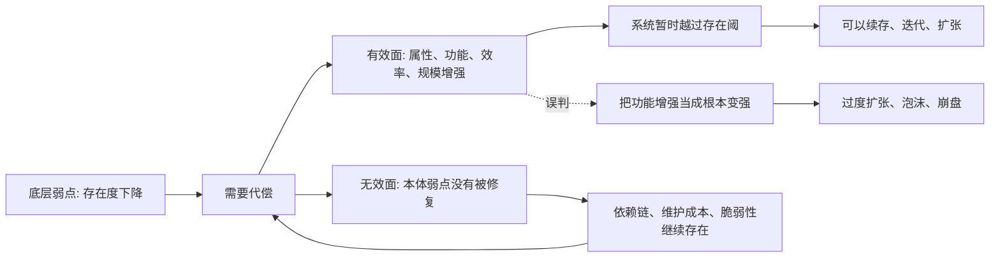

## 王东岳思维筑基课: 两重性公理: 代偿有效又无效

### 作者
digoal

### 日期
2026-05-18

### 标签
王东岳 , 两重性公理 , 代偿有效 , 代偿无效 , 递弱代偿 , 依赖风险 , 工具理性 , 能力增强 , 根本缺口 , 思维筑基

----

## 背景

> 面向对象: 大学生、产品经理、运营经理、有投资需求的人  
> 核心问题: 为什么很多工具、产品、组织、融资、营销和技术明明有效，却又不能真正解决根本问题？为什么短期变强，长期反而更依赖、更脆弱？  
> 先说结论: “代偿有效又无效”是递弱代偿体系里最容易误解、也最有现实价值的公理。它的意思是: 代偿在功能层面有效，能让系统续存、扩张、过线；但在本体层面无效，不能消除导致系统需要代偿的底层弱点。判断生活、产品、创业和投资，关键就是分清“有效于什么”和“无效于什么”。

## 一张图先看懂



## 求真讲法

### 它到底说了什么

“代偿有效又无效”听起来矛盾，其实是在说两个不同层面。

有效，是指代偿能在属性和功能层面产生作用。眼镜能让近视的人看清东西，药物能控制症状，工具能提高效率，组织能放大个体能力，融资能延长创业公司的生命，运营能提升短期转化。

无效，是指代偿不能真正恢复底层存在度。眼镜不能让近视本身自动消失，融资不能让商业模式自动成立，补贴不能让伪需求变成真需求，流程不能让战略错误变正确，AI 工具不能让没有判断力的人自动拥有判断力。

一句话:

```text
代偿有效于功能，不一定有效于本体；
代偿有效于续存，不一定有效于根治；
代偿有效于过线，不一定有效于变强。
```

这就是两重性公理的核心。

### 它是怎么来的

这是一个公理性判断，不是在体系内部被证明出来的定理。它的选择动机，是解释现实中一种普遍现象:

> 为什么很多解决方案确实有效，但问题并没有真正消失？

王东岳《物演通论》第十九章讨论代偿时，强调代偿既要能把弱存者维持在存在阈之上，又不能等同于存在效价本身。也就是说，代偿必须有效，否则弱存者无法续存；代偿又终极无效，否则存在度递弱就被取消了。

可以把这套逻辑简化成一个三层模型:

```text
第一层: 底层弱点存在
第二层: 代偿结构出现
第三层: 功能增强、暂时续存

但第三层的增强
并不等于第一层的弱点被消除
```

这能解释很多现实悖论:

| 现象 | 有效在哪里 | 无效在哪里 |
| --- | --- | --- |
| 眼镜 | 让人看清 | 不消除近视本身 |
| 止痛药 | 缓解疼痛 | 不一定治疗病因 |
| 补贴 | 提升短期成交 | 不证明产品价值成立 |
| 融资 | 延长公司生命 | 不证明现金流健康 |
| 流程 | 降低协作混乱 | 不替代战略判断 |
| AI 工具 | 提高产出速度 | 不自动生成理解力 |

### 它依赖哪些假设

| 假设 | 含义 | 如果不成立会怎样 |
| --- | --- | --- |
| 本体弱点和功能补偿不同 | 底层问题与表层能力不是一回事 | 如果二者相同，代偿有效就等于根治 |
| 代偿能产生真实功能 | 工具、组织、资本、制度能帮助续存 | 如果代偿完全无效，人类文明无法解释 |
| 代偿不能完全恢复存在度 | 补偿不能把系统带回原始自足状态 | 如果能完全恢复，就不存在终极无效 |
| 代偿有成本和依赖 | 补偿结构需要资源维护 | 如果没有成本，就不会有脆弱性累积 |
| 观察者容易被表面功能欺骗 | 人常把短期增强误判为长期变强 | 如果不会误判，这条公理的现实价值会降低 |

### 常见误解

第一，不能因为代偿终极无效，就否定代偿。眼镜不能治好近视，但它仍然有用；融资不能保证公司成功，但它能争取验证时间；运营不能替代产品价值，但它能帮助用户理解价值。

第二，不能因为代偿短期有效，就迷信代偿。补贴能带来订单，但不能自动带来复购；AI 能提高写作速度，但不能自动提高思想质量；管理工具能生成报表，但不能自动产生管理能力。

第三，不能把“有效”和“无效”混在一个层面争论。问代偿是否有效，必须补一句: 对什么有效？对什么无效？短期有效还是长期有效？对指标有效还是对结构有效？

## 求存讲法

### 它有什么用

这条公理的最大用处，是防止你被“有效”骗了。

现实中最危险的东西，往往不是完全无效的东西。完全无效很快会被淘汰。真正危险的是:

```text
短期有效
局部有效
指标有效
叙事有效
但对底层问题无效
```

生活、产品、运营、创业和投资中的大麻烦，常常来自把这类“有效”误认为根本改善。

判断代偿，要分四层:

| 层级 | 问题 | 例子 |
| --- | --- | --- |
| 症状层 | 是否缓解了表面问题？ | 疼痛少了、数据涨了、流量来了 |
| 功能层 | 是否提高了某种能力？ | 效率提升、转化提升、交付更快 |
| 结构层 | 是否改变了长期约束？ | 成本下降、复购提高、组织更稳 |
| 本体层 | 是否减少了对代偿的依赖？ | 不再靠补贴、不再靠创始人救火 |

越往下，越接近真实改善。

### 它怎么迁移到生活

个人生活里，最常见的错误是用“有效工具”掩盖“底层能力不足”。

一个学生用 AI 写作，短期作业质量提高，这是有效代偿。但如果他不理解概念、不训练论证、不积累表达能力，AI 对他的思想能力是无效的，甚至会削弱训练机会。

一个职场人靠话术、模板和包装获得机会，短期有效。但如果交付能力、行业理解和可信记录没有提高，这些代偿对职业存在度无效。

生活里的判断句:

> 代偿能帮你过关，但不能替你成长；能帮你省力，但不能替你形成底层能力。

所以，好的代偿应该服务于能力生成，而不是替代能力生成。

### 它怎么迁移到产品经理

产品经理要识别“产品有效”和“产品成立”的区别。

一个功能可能有效: 用户点了、试了、夸了、分享了。  
但产品是否成立，还要看它是否改变用户的长期行为。

| 产品信号 | 可能只是有效代偿 | 更接近真实成立 |
| --- | --- | --- |
| 用户觉得新鲜 | 情绪代偿 | 形成稳定复用 |
| 用户愿意试用 | 低成本尝试 | 愿意导入真实数据 |
| 用户夸体验好 | 审美或流畅性有效 | 愿意迁移旧流程 |
| 用户被活动拉回 | 刺激有效 | 无刺激也自然回来 |
| 用户愿意付小钱 | 低价有效 | 愿意承担长期成本 |

产品里最危险的是“功能有效，但场景无效”。功能能解决一个小问题，却没有进入用户真实工作流或生活流。这样的产品容易热闹一阵，然后流失。

### 它怎么迁移到运营经理

运营本来就是代偿工作: 代偿信任不足、理解不足、触达不足、转化不足、复购不足。

问题在于，运营的有效性很容易被指标放大。

补贴有效，GMV 上升。  
裂变有效，新增上升。  
直播有效，成交上升。  
社群有效，互动上升。  
但这些指标上升不等于业务底层变强。

运营经理要问:

```text
这个动作停止后，用户还在吗？
这个刺激撤掉后，复购还在吗？
这个内容不推后，搜索和口碑还在吗？
这个活动结束后，用户关系更深了吗？
这个社群减少人工后，还能自运转吗？
```

如果答案是否定的，运营只是有效代偿，没有形成结构改善。

### 它怎么迁移到创业

创业公司早期必须依赖代偿。创始人亲自销售、亲自交付、亲自客服、亲自融资，这些都有效。没有这些，公司活不到验证阶段。

但创业的危险也在这里: 早期有效的人肉代偿，可能掩盖商业模式无效。

| 创业动作 | 有效面 | 无效风险 |
| --- | --- | --- |
| 创始人强销售 | 能拿到首批客户 | 不证明渠道可复制 |
| 定制化交付 | 能满足关键客户 | 不证明产品可规模化 |
| 融资续命 | 能延长验证时间 | 不证明现金流成立 |
| 媒体曝光 | 能建立认知 | 不证明需求稳定 |
| 高强度加班 | 能短期交付 | 不证明组织能力成熟 |

创业判断的关键不是“代偿有没有用”，而是“代偿能否逐步退出”。如果一家公司规模越大，越离不开创始人硬扛、补贴输血和定制救火，说明有效代偿没有转化为真实结构。

### 它怎么迁移到投融资

投资中，最容易把“代偿有效”误判为“公司优秀”。

一家公司靠补贴增长，说明补贴有效，不说明产品强。  
靠债务扩张，说明融资能力有效，不说明经营质量强。  
靠并购做大收入，说明资本运作有效，不说明内生增长强。  
靠压供应商提高利润，说明议价有效，不说明长期生态健康。  
靠政策窗口爆发，说明环境有效，不说明公司有长期壁垒。

投资者要把公司能力拆开:

```text
经营能力: 不靠外部刺激也能赚钱
财务能力: 不靠持续融资也能维持
产品能力: 不靠低价也能留住客户
组织能力: 不靠少数关键人也能交付
壁垒能力: 不靠短期窗口也能抵抗竞争
```

如果一个公司只有代偿能力，没有底层能力，它可能在景气期很强，在压力期很脆。

### 它的适用范围和边界

适用场景:

| 场景 | 如何使用“两重性” |
| --- | --- |
| 个人成长 | 判断工具是训练能力，还是替代能力 |
| 产品判断 | 区分功能有效、场景有效、商业有效 |
| 运营判断 | 区分短期指标有效和长期结构有效 |
| 创业判断 | 区分人肉代偿和可复制系统 |
| 投资判断 | 区分外部刺激增长和内生质量增长 |

边界也要清楚: 这条公理不能替代具体分析。它只能提示你不要把“有效”看得太粗。真正判断还需要用户数据、财务报表、行业结构、竞争格局、现金流质量和实际访谈。

### 正例: 怎么用它提升能力

假设你在评估一家 AI 客服公司。

表面上，AI 客服能降低人工成本、提高响应速度、覆盖更多用户，这是有效代偿。  
但你不能就此判断它是好公司。还要问:

```text
它是否真正降低客户的总服务成本？
它是否提高问题解决率，而不只是提高回复速度？
它是否减少企业对人工客服的依赖？
它是否需要大量人工标注和维护，导致成本转移？
它是否在复杂问题上仍然需要人工兜底？
它的模型、数据和渠道是否可控？
```

如果它能降低总成本、提高解决率，并把人工依赖转化为系统能力，它就是有效且结构改善的代偿。  
如果它只是把“慢回复”变成“快但错的回复”，那它只在表面指标上有效，对真实客户服务无效。

### 反例: 前提不成立会怎样

反例一: 把融资当成商业模式成立。

一家创业公司连续融资，团队扩大，品牌声量上升，客户也愿意试用。创始人认为公司已经进入快车道。但真实情况是: 获客成本高于毛利，续约率低，交付严重依赖创始团队，产品无法标准化。

融资在“续命”上有效，在“证明商业模式”上无效。失败原因是把代偿的有效面误认为本体改善。

反例二: 把 AI 产出当成学习能力提升。

一个学生用 AI 快速完成报告，分数提高，效率提高。他因此减少阅读、推理和写作训练。短期看，AI 对作业完成有效；长期看，他的概念理解和表达能力没有形成，甚至更依赖外部工具。

AI 在“完成任务”上有效，在“形成能力”上无效。失败原因是代偿替代了训练，而不是服务于训练。

## 思考

两重性公理真正训练的是一种分层判断能力:

> 不要问“有没有效果”，要问“效果发生在哪一层”。

这句话能帮你穿透很多表面现象。

| 表面现象 | 应该追问 |
| --- | --- |
| 数据涨了 | 是刺激有效，还是价值有效？ |
| 用户来了 | 是好奇有效，还是需求有效？ |
| 公司融资了 | 是资本有效，还是经营有效？ |
| 工具提升效率 | 是任务完成了，还是能力形成了？ |
| 政策带来增长 | 是窗口有效，还是壁垒有效？ |
| 组织流程变多 | 是协作改善，还是复杂性增加？ |

看未来时，最重要的不是判断某种代偿有没有短期作用，而是判断它是否能转化为更低依赖、更强结构、更好现金流、更稳定复购和更可复制能力。

如果不能，它就是有效但无效: 能让系统暂时跑起来，不能让系统真正站住。

## 最后记住

1. 代偿的有效性在于功能增强和暂时续存，代偿的无效性在于不能消除底层弱点。
2. 判断代偿，必须问“对什么有效、对什么无效、短期还是长期、指标还是结构”。
3. 工具、融资、补贴、流程、运营和 AI 都可能有效，但不一定代表本体变强。
4. 好代偿会逐步沉淀为能力和结构，坏代偿会制造更深依赖。
5. 生活、产品、创业和投资中最大的误判，是把“有效代偿”当成“根本改善”。

## 参考资料

- 王东岳: 《物演通论》第十九章，东岳哲学学会在线版。https://www.wuyantonglun.org/2022/655.html
- 王东岳: 《物演通论》第三十六章，东岳哲学学会在线版。https://www.wuyantonglun.org/2023/1768.html
- 王东岳思想录: 《物演通论》卷一自然哲学卷导读。https://wuyantonglun.com/post/688.html
- 王东岳: 有效代偿与无效代偿与代偿律的基本规定，爱智思享会。https://www.aizhisx.com/post/669.html
- 王东岳: 《物演通论》名词及概念注释，爱智思享会。https://www.aizhisx.com/post/758.html
  
#### [PostgreSQL 解决方案集合](../201706/20170601_02.md "40cff096e9ed7122c512b35d8561d9c8")
  
  
#### [德哥 / digoal's Github - 公益是一辈子的事.](https://github.com/digoal/blog/blob/master/README.md "22709685feb7cab07d30f30387f0a9ae")
  
  
#### [About 德哥](https://github.com/digoal/blog/blob/master/me/readme.md "a37735981e7704886ffd590565582dd0")
  
  

  
