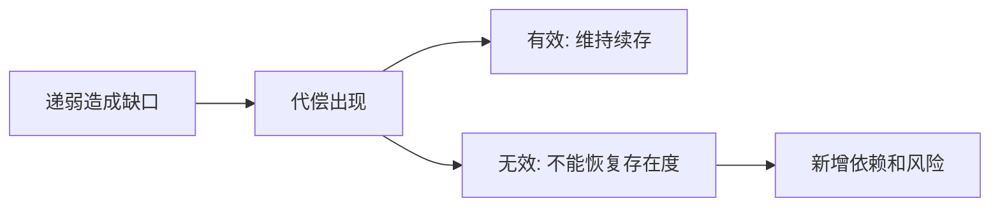

## 王东岳思维筑基课: 王东岳思想之05: 两重性公理: 代偿有效又无效

### 作者
digoal

### 日期
2026-05-18

### 标签
王东岳 , 两重性公理 , 代偿有效 , 代偿无效 , 递弱代偿 , 依赖风险 , 工具理性 , 能力增强 , 根本缺口 , 思维筑基

----

## 背景

> 面向对象: 高中生到大学通识读者  
> 核心问题: 为什么代偿既能救命，又不能从根本上解决递弱？  
> 先说结论: 两重性公理认为，代偿在短期和局部上有效，能让存在物继续维持；但在根本上无效，因为它不能恢复已经下降的存在度，还会制造新的依赖。

## 一张图先看懂



## 求真讲法

### 它到底说了什么

眼镜让近视者看清，这是有效；但眼镜没有让近视消失，这是无效。技术让人类更强，这是有效；人类离不开技术系统，这是无效。

为了便于理解，可以把它先当成一个观察模型，而不是已经完成实证检验的自然科学定律。王东岳体系的强项在于把自然、生命、精神、社会放进同一条解释链；它的边界也在这里: 统一解释越强，具体测量就越需要谨慎。

### 它是怎么来的

这个公理防止把代偿理解成万能补丁。它承认代偿的现实功能，同时提醒人们不要把功能增强误当作根基恢复。

如果用最简推理表示，就是:

```text
存在不自足 -> 出现续存压力 -> 形成代偿结构 -> 获得暂时续存 -> 新依赖继续出现
```

### 它依赖哪些假设

- 代偿能在某个层面弥补弱点。
- 代偿不能取消弱点产生的根本趋势。
- 每一种代偿都可能形成新的依赖。

| 维度 | 前提成立 | 前提不成立时的风险 |
| --- | --- | --- |
| 核心判断 | 两重性公理认为，代偿在短期和局部上有效，能让存在物继续维持；但在根本上无效，因为它不能恢复已经下降的存在度，还会制造新的依赖。 | 容易把哲学模型误当成事实结论 |
| 实践迁移 | 可用于识别缺口、依赖和代价 | 可能变成套话，遮蔽具体问题 |
| 学习方法 | 先看假设，再看推论 | 只背结论，无法判断边界 |

### 常见误解

- 误解一: 既然无效，就不用代偿。错，无效指根本层面，不是否定现实作用。
- 误解二: 既然有效，就说明问题解决了。错，问题可能只是被转移和延后。
- 误解三: 两重性等于矛盾混乱。它强调的是不同层级上的有效与无效。

## 求存讲法

### 它有什么用

它是理解王东岳思想的关键: 文明、理性、技术、社会都是必要代偿，但又不能被误读成绝对进步。

它训练的不是背诵结论，而是一种检查方式: 看到能力增强时，同时追问它补了什么缺口、增加了什么依赖、留下了什么边界。

### 它怎么迁移到熟悉领域

用 AI 写作能提高速度，但如果基础判断力下降，就会更依赖 AI。这种代偿在产出层面有效，在能力根基上可能无效。

### 它的适用范围和边界

不能因为代偿有副作用就拒绝所有代偿。成熟做法是承认其两面性，管理依赖，而不是幻想没有代价的增强。

### 正例: 怎么用它提升能力

学生用错题本代偿遗忘，同时定期回到教材和原理，避免只依赖答案模板。

### 反例: 前提不成立会怎样

如果学生只背模板，短期分数可能提高，但换题型就失效。这个反例失败，是因为代偿没有回补理解能力。

## 思考

你最依赖的一种代偿工具，是否正在悄悄削弱你原本该训练的能力？

也可以把这个问题写成一个小练习:

```text
我看到的增强是什么？
它代偿的缺口是什么？
新增的依赖是什么？
如果依赖中断，系统会怎样？
```

## 最后记住

1. 代偿在现实层面有效。
2. 代偿在根本层面无效。
3. 有效与无效发生在不同层级。
4. 成熟判断要同时看收益和新增依赖。

## 参考资料

- 王东岳: 《物演通论》之跋，爱智思享会，2019-12-11。https://www.aizhisx.com/post/759.html
- 王东岳: 《物演通论》名词及概念注释，爱智思享会，2019-12-11。https://www.aizhisx.com/post/758.html
- 王东岳: 递弱演化的自然律纲要，爱智思享会，2019-10-09。https://www.aizhisx.com/post/315.html
- 《物演通论》第十九章，东岳哲学学会在线版。https://www.wuyantonglun.org/2022/655.html
- 《物演通论》第三十章，东岳哲学学会在线版。https://www.wuyantonglun.org/2023/1700.html
- 说明: 以下文章把王东岳体系当作哲学解释模型来讲解，不把相关命题表述为现代自然科学中已完成实证检验的定律。
  
#### [PostgreSQL 解决方案集合](../201706/20170601_02.md "40cff096e9ed7122c512b35d8561d9c8")
  
  
#### [德哥 / digoal's Github - 公益是一辈子的事.](https://github.com/digoal/blog/blob/master/README.md "22709685feb7cab07d30f30387f0a9ae")
  
  
#### [About 德哥](https://github.com/digoal/blog/blob/master/me/readme.md "a37735981e7704886ffd590565582dd0")
  
  

  
