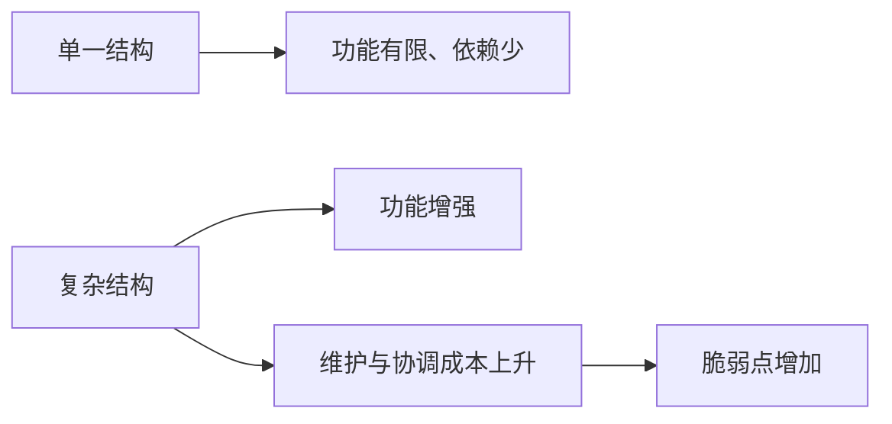

## 王东岳思维筑基课: 王东岳思想之07: 复杂化增益律: 复杂带来能力也带来成本

### 作者
digoal

### 日期
2026-05-18

### 标签
王东岳 , 复杂化增益律 , 复杂系统 , 功能增益 , 维护成本 , 协调成本 , 系统风险 , 代偿结构 , 效率边界 , 思维筑基

----

## 背景

> 面向对象: 高中生到大学通识读者  
> 核心问题: 为什么复杂系统看起来更强，却常常更难维护？  
> 先说结论: 复杂化增益律认为，复杂结构能带来功能增益，但这种增益来自代偿，也必然带来维护成本、协调成本和失稳风险。

## 一张图先看懂



## 求真讲法

### 它到底说了什么

复杂不是单纯高级。复杂意味着系统包含更多部件、关系和规则，因此能完成更多任务，也更容易因为某个环节出错而受影响。

为了便于理解，可以把它先当成一个观察模型，而不是已经完成实证检验的自然科学定律。王东岳体系的强项在于把自然、生命、精神、社会放进同一条解释链；它的边界也在这里: 统一解释越强，具体测量就越需要谨慎。

### 它是怎么来的

它从代偿公理推出: 代偿需要新增属性和结构，新增结构带来功能，同时带来新的连接和依赖。

如果用最简推理表示，就是:

```text
存在不自足 -> 出现续存压力 -> 形成代偿结构 -> 获得暂时续存 -> 新依赖继续出现
```

### 它依赖哪些假设

- 复杂性主要服务于补偿某种不足。
- 新增结构需要资源维护。
- 连接越多，局部故障扩散的路径越多。

| 维度 | 前提成立 | 前提不成立时的风险 |
| --- | --- | --- |
| 核心判断 | 复杂化增益律认为，复杂结构能带来功能增益，但这种增益来自代偿，也必然带来维护成本、协调成本和失稳风险。 | 容易把哲学模型误当成事实结论 |
| 实践迁移 | 可用于识别缺口、依赖和代价 | 可能变成套话，遮蔽具体问题 |
| 学习方法 | 先看假设，再看推论 | 只背结论，无法判断边界 |

### 常见误解

- 误解一: 复杂就一定好。复杂只有在对应真实问题时才有价值。
- 误解二: 简单就一定低级。简单系统可能更稳。
- 误解三: 复杂化可以无限增加。现实中复杂性受资源和管理能力限制。

## 求存讲法

### 它有什么用

它解释为什么从生命体到社会组织，能力提升常常伴随结构复杂化。

它训练的不是背诵结论，而是一种检查方式: 看到能力增强时，同时追问它补了什么缺口、增加了什么依赖、留下了什么边界。

### 它怎么迁移到熟悉领域

软件系统增加微服务、权限、消息队列、自动化部署后，吞吐和扩展能力提升，但排障和治理难度也上升。

### 它的适用范围和边界

复杂化是否值得，取决于收益是否大于维护成本。不是所有小问题都需要复杂方案。

### 正例: 怎么用它提升能力

学校为大型活动建立报名、分工、物资、应急和复盘流程，复杂度增加，但解决了多人协作的真实问题。

### 反例: 前提不成立会怎样

三个人的小组项目却设计十层审批，效率反而下降。这个反例失败，是因为复杂化没有对应足够大的续存压力。

## 思考

你正在使用的复杂方案，是在解决真实问题，还是在制造管理对象？

也可以把这个问题写成一个小练习:

```text
我看到的增强是什么？
它代偿的缺口是什么？
新增的依赖是什么？
如果依赖中断，系统会怎样？
```

## 最后记住

1. 复杂化能带来功能增益。
2. 复杂化也带来维护和协调成本。
3. 复杂不是天然高级。
4. 好复杂必须服务真实缺口。

## 参考资料

- 王东岳: 《物演通论》之跋，爱智思享会，2019-12-11。https://www.aizhisx.com/post/759.html
- 王东岳: 《物演通论》名词及概念注释，爱智思享会，2019-12-11。https://www.aizhisx.com/post/758.html
- 王东岳: 递弱演化的自然律纲要，爱智思享会，2019-10-09。https://www.aizhisx.com/post/315.html
- 《物演通论》第十九章，东岳哲学学会在线版。https://www.wuyantonglun.org/2022/655.html
- 《物演通论》第三十章，东岳哲学学会在线版。https://www.wuyantonglun.org/2023/1700.html
- 说明: 以下文章把王东岳体系当作哲学解释模型来讲解，不把相关命题表述为现代自然科学中已完成实证检验的定律。
  
#### [PostgreSQL 解决方案集合](../201706/20170601_02.md "40cff096e9ed7122c512b35d8561d9c8")
  
  
#### [德哥 / digoal's Github - 公益是一辈子的事.](https://github.com/digoal/blog/blob/master/README.md "22709685feb7cab07d30f30387f0a9ae")
  
  
#### [About 德哥](https://github.com/digoal/blog/blob/master/me/readme.md "a37735981e7704886ffd590565582dd0")
  
  

  
