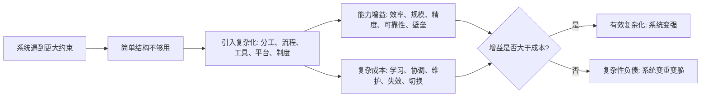

## 王东岳思维筑基课: 复杂化增益律: 复杂带来能力也带来成本

### 作者
digoal

### 日期
2026-05-18

### 标签
王东岳 , 复杂化增益律 , 复杂系统 , 功能增益 , 维护成本 , 协调成本 , 系统风险 , 代偿结构 , 效率边界 , 思维筑基

----

## 背景

> 面向对象: 大学生、产品经理、运营经理、有投资需求的人  
> 核心问题: 为什么一个系统变复杂后，常常能力更强，但也更难维护、更容易失控、更依赖专业分工？  
> 先说结论: 复杂化增益律说的是: 复杂结构能带来新的能力、效率、规模和壁垒，但复杂本身不是免费的。它同时带来学习成本、协调成本、维护成本、失效成本和切换成本。真正值得追求的复杂，是能力增益大于复杂成本；否则复杂就是负债。

## 一张图先看懂



## 求真讲法

### 它到底说了什么

复杂化不是“高级”的同义词。复杂化的本质，是为了处理简单结构处理不了的问题。

一个人可以靠记忆管理几件事，但管理几十个项目就需要清单、日历、看板和复盘。  
一个小团队可以靠口头沟通协作，但几十人、几百人之后就需要岗位、流程、文档、权限和系统。  
一个产品可以先做一个核心功能，但服务更多场景、更多客户、更高可靠性时，就需要账户体系、支付、风控、数据、客服、权限、审计和合规。

复杂化的收益是:

```text
能处理更多变量
能承载更大规模
能降低局部不确定性
能形成更强协作和壁垒
```

复杂化的代价是:

```text
学习成本上升
协调成本上升
维护成本上升
故障传播路径变长
改变方向更困难
```

所以，这条规律不是“越复杂越好”，而是:

> 复杂必须购买能力；买不到能力的复杂，都是负债。

### 它是怎么来的

从递弱代偿的角度看，复杂化是一种代偿。系统越弱、越依赖、越面对多变量约束，就越需要增加结构来补。

王东岳递弱代偿体系中有“属性丰化”“结构化繁复”“依存条件递繁”等表达。它们共同指向一个现象: 后衍系统为了维持存在，会发展出更多属性、更复杂结构和更多依赖关系。

把它迁移到现实世界，就是:

```text
约束增加 -> 简单方式失效 -> 引入复杂结构
复杂结构 -> 能力增强 -> 维持成本上升
成本上升 -> 继续要求更强管理和代偿
```

这不是一个可直接量化的自然科学公式，而是一条观察复杂系统、组织、产品和投资标的的判断规律。

### 它依赖哪些假设

| 假设 | 含义 | 如果不成立会怎样 |
| --- | --- | --- |
| 简单结构有能力边界 | 简单方式处理不了无限变量 | 如果简单万能，就不需要复杂化 |
| 复杂结构能带来新能力 | 分工、工具、制度、平台能提升处理能力 | 如果复杂没有增益，就只是负担 |
| 复杂结构有维护成本 | 每个新增模块、流程、角色都要被理解和维护 | 如果复杂没有成本，系统可以无限加功能 |
| 成本和收益不总是同步 | 有些复杂带来高收益，有些只带来高负担 | 如果二者总同步，就不需要判断 |
| 环境会变化 | 今天有效的复杂，明天可能变成包袱 | 如果环境不变，复杂结构不易过时 |

### 常见误解

第一，复杂不等于专业。很多东西看起来很专业，只是术语多、流程多、界面多、会议多。真正的专业复杂，必须降低关键风险或提升关键能力。

第二，简单不等于低级。在早期产品、早期创业、个人学习和小团队协作中，简单常常更强，因为它响应快、成本低、反馈直接。

第三，复杂不是一次性成本。复杂系统上线之后，还要持续培训、维护、解释、迁移、兼容、修复和治理。很多人只看到建设成本，看不到生命周期成本。

## 求存讲法

### 它有什么用

复杂化增益律最适合用来判断:

```text
这个复杂，买来了什么能力？
这个能力是否真实重要？
这个复杂的全生命周期成本是多少？
如果砍掉它，系统会变弱还是变轻？
```

很多表面变化都可以用这条规律看透。

| 表面现象 | 底层判断 |
| --- | --- |
| 功能越来越多 | 是覆盖真实场景，还是补核心价值不足？ |
| 流程越来越细 | 是降低风险，还是制造审批摩擦？ |
| 组织越来越大 | 是承载规模，还是稀释责任？ |
| 金融工具越来越复杂 | 是分散风险，还是隐藏风险？ |
| 商业模式越来越绕 | 是创造效率，还是包装故事？ |

### 它怎么迁移到生活

个人成长中，复杂化最常见的陷阱是“系统太重”。

很多人为了学习，搭建复杂笔记系统、任务系统、打卡系统、知识库系统。短期很有掌控感，但真正学习时间被系统维护吃掉。

判断一个个人系统是否值得保留，可以问:

```text
它是否减少遗忘？
它是否增加复盘质量？
它是否帮助我完成真实作品？
它是否降低决策疲劳？
它是否比纸笔或简单清单更有效？
```

如果答案是否定的，复杂系统只是在代偿焦虑，不是在提升能力。

### 它怎么迁移到产品经理

产品经理最容易遇到复杂化问题: 要不要加功能、加权限、加配置、加流程、加平台能力。

新增复杂度必须回答三个问题:

1. 它解决的是主流用户的关键问题，还是少数客户的边缘要求？
2. 它带来的价值是否大于学习、使用、维护和客服成本？
3. 它是否会破坏核心路径的简洁性？

产品复杂度可以分成三类:

| 类型 | 特征 | 判断 |
| --- | --- | --- |
| 必要复杂 | 没它就无法完成关键任务 | 应该做，但要隐藏好 |
| 可选复杂 | 高级用户需要，普通用户可忽略 | 做成渐进式、配置式 |
| 虚假复杂 | 为了显得强大而加 | 应该砍掉 |

好的产品不是没有复杂度，而是把复杂度放在系统内部，让用户感受到能力，而不是负担。

### 它怎么迁移到运营经理

运营复杂化常表现为活动越来越多、渠道越来越多、标签越来越细、规则越来越绕、报表越来越厚。

这些复杂化可能有价值，比如精细化运营能提升匹配效率、减少浪费、提高留存。但它也可能把团队拖进“运营内耗”。

运营经理要看两个指标:

```text
复杂度是否提高了单位投入产出？
复杂度是否沉淀了可复用机制？
```

如果一个活动体系越来越复杂，但每次都要重新策划、重新拉人、重新解释、重新救火，它不是能力系统，而是人力消耗系统。

好的运营复杂化，是把经验变成机制。坏的运营复杂化，是把机制变成负担。

### 它怎么迁移到创业

创业早期尤其要警惕过早复杂化。

很多创业公司还没有验证需求，就开始搭复杂组织、复杂中台、复杂流程、复杂 OKR、复杂品牌体系。这样会让公司看起来像成熟公司，但它可能还没有找到真正客户。

创业阶段的复杂化原则:

| 阶段 | 应该简单 | 允许复杂 |
| --- | --- | --- |
| 需求验证 | 产品形态、团队结构、流程 | 用户访谈和反馈记录 |
| 首批付费 | 定价、交付、合同 | 关键客户成功机制 |
| 可复制增长 | 组织沟通、任务管理 | 渠道、销售、交付标准化 |
| 规模化 | 核心战略 | 权限、财务、法务、数据和合规 |

复杂化的时机很重要。太早复杂，会降低速度；太晚复杂，会撑不住规模。

### 它怎么迁移到投融资

投资时，复杂化增益律能帮助你识别三种公司:

| 公司类型 | 复杂化表现 | 投资判断 |
| --- | --- | --- |
| 高质量复杂 | 复杂结构带来规模经济、网络效应、风控能力、供应链效率 | 复杂形成壁垒 |
| 低质量复杂 | 商业模式绕、财务结构绕、关联交易多、指标口径多 | 复杂隐藏风险 |
| 过度复杂 | 产品线太多、组织臃肿、并购过多、系统难整合 | 复杂吞噬效率 |

投资者要问:

```text
公司的复杂结构是否降低单位成本？
是否提高客户黏性？
是否提升风控和交付稳定性？
是否形成竞争壁垒？
还是只是在隐藏利润质量、债务风险和增长放缓？
```

真正优秀的复杂公司，复杂在后台，价值在前台。用户感觉更简单，企业获得更强能力，财务表现更稳。  
危险的复杂公司，复杂在故事，风险在账上，成本在未来。

### 它的适用范围和边界

适用场景:

| 场景 | 关键问题 |
| --- | --- |
| 个人成长 | 系统复杂度是否超过学习收益？ |
| 产品设计 | 功能复杂度是否换来关键任务完成率？ |
| 运营管理 | 精细化是否提升单位效率，而不是制造内耗？ |
| 创业扩张 | 复杂化是否匹配阶段，而不是过早成熟化？ |
| 投资分析 | 复杂结构是壁垒，还是风险遮蔽？ |

边界也要说清楚: 复杂化增益律不是反复杂。现代社会、金融、医疗、供应链、软件和 AI 都离不开复杂系统。它反对的是无增益复杂、过早复杂、不可解释复杂和不可维护复杂。

### 正例: 怎么用它提升能力

假设你是产品经理，要判断是否给企业协作工具增加“多级权限系统”。

简单看，这是一个复杂功能。递弱代偿视角会问:

```text
客户是否因为权限不足无法采购？
权限问题是否造成真实安全风险？
多级权限是否提升大客户交付能力？
普通用户是否会被复杂配置干扰？
客服和实施是否能承受解释成本？
```

如果目标客户是大中型企业，多级权限能解决安全、合规、审计和组织协作问题，并且普通用户默认不感知，那么这是有效复杂化。  
如果目标客户主要是小团队，多级权限会拖慢使用、增加客服、制造配置错误，那么它就是复杂性负债。

### 反例: 前提不成立会怎样

反例一: 功能堆叠型产品。

一个 SaaS 产品为了显得强大，不断增加看板、报表、标签、自动化、权限、模板和 AI 功能。但用户核心任务只是快速记录、分配和跟进。功能越多，新用户越难上手，客服问题越多，留存反而下降。

失败原因是: 复杂没有购买关键能力，只购买了展示感。复杂成本超过了能力增益。

反例二: 复杂金融产品。

一个金融产品通过多层嵌套、复杂收益结构和专业术语包装成“稳健高收益”。投资者看不懂底层资产、杠杆水平和流动性风险，只看到收益曲线平滑。市场一波动，复杂结构放大损失，流动性也消失。

失败原因是: 复杂不是分散风险，而是遮蔽风险。复杂带来的不是能力增益，而是信息不对称和风险滞后暴露。

## 思考

复杂化增益律真正训练的是一种成本意识:

> 每增加一层复杂，都必须问它买来了什么能力，又留下了什么维护账单。

这句话能帮你看穿很多表面现象。

| 表面说法 | 深层追问 |
| --- | --- |
| 我们要做平台 | 平台复杂度是否带来生态效率？ |
| 我们要精细化运营 | 精细化是否提升单位产出？ |
| 我们要多元化 | 多元化是否分散风险，还是分散注意力？ |
| 我们要上系统 | 系统是否降低沟通成本，还是增加录入负担？ |
| 这个金融结构很创新 | 创新是否提高风险定价，还是隐藏风险？ |

真正成熟的判断，不是崇拜复杂，也不是迷信简单，而是根据阶段、约束和收益选择复杂度。

## 最后记住

1. 复杂化能带来能力、效率、规模、精度和壁垒，但也带来学习、协调、维护、失效和切换成本。
2. 有效复杂化的标准是: 能力增益大于复杂成本。
3. 个人、产品、运营和创业早期要警惕过早复杂化。
4. 投资中要分清复杂是壁垒、效率系统，还是风险遮蔽和财务包装。
5. 好复杂让用户更简单、系统更稳；坏复杂让用户更累、系统更脆。

## 参考资料

- 王东岳: 《物演通论》第五十五章，东岳哲学学会在线版。https://www.wuyantonglun.org/2023/1998.html
- 王东岳: 递弱演化的自然律纲要，爱智思享会。https://www.aizhisx.com/post/315.html
- 东岳哲学学会: 《物演通论》的整体结构、概念关系及逻辑脉络梳理。https://www.wuyantonglun.org/2024/3339.html
- 王东岳思想录: 《物演通论》卷一自然哲学卷导读。https://wuyantonglun.com/post/688.html
- Frederick P. Brooks Jr.: No Silver Bullet, 1986。用于理解软件复杂度中“本质复杂度”和“偶然复杂度”的区分。
- Herbert A. Simon: The Architecture of Complexity, 1962。用于理解复杂系统的层级结构与近可分解性。
  
#### [PostgreSQL 解决方案集合](../201706/20170601_02.md "40cff096e9ed7122c512b35d8561d9c8")
  
  
#### [德哥 / digoal's Github - 公益是一辈子的事.](https://github.com/digoal/blog/blob/master/README.md "22709685feb7cab07d30f30387f0a9ae")
  
  
#### [About 德哥](https://github.com/digoal/blog/blob/master/me/readme.md "a37735981e7704886ffd590565582dd0")
  
  

  
