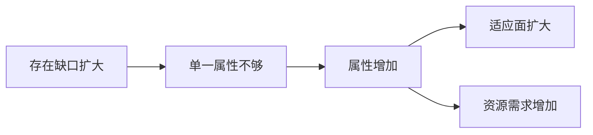

## 王东岳思维筑基课: 王东岳思想之08: 属性繁化律: 能力越多，依赖越深

### 作者
digoal

### 日期
2026-05-18

### 标签
王东岳 , 属性繁化律 , 属性增多 , 能力组合 , 适应能力 , 资源消耗 , 后衍存在 , 代偿机制 , 学习迁移 , 思维筑基

----

## 背景

> 面向对象: 高中生到大学通识读者  
> 核心问题: 为什么后来的生命和人类拥有越来越多属性？  
> 先说结论: 属性繁化律认为，后衍存在物为了维持续存，会发展出越来越多属性: 感知、运动、记忆、意识、语言、理性和制度能力。

## 一张图先看懂



## 求真讲法

### 它到底说了什么

属性就是一个存在物能够表现出来的能力和特征。属性繁化不是锦上添花，而是为了处理更复杂环境和更低存在度的代偿。

为了便于理解，可以把它先当成一个观察模型，而不是已经完成实证检验的自然科学定律。王东岳体系的强项在于把自然、生命、精神、社会放进同一条解释链；它的边界也在这里: 统一解释越强，具体测量就越需要谨慎。

### 它是怎么来的

它由代偿公理和复杂化增益律推出: 代偿要落实为具体属性，属性越多，系统能处理的问题越多。

如果用最简推理表示，就是:

```text
存在不自足 -> 出现续存压力 -> 形成代偿结构 -> 获得暂时续存 -> 新依赖继续出现
```

### 它依赖哪些假设

- 属性可以服务续存。
- 后衍存在物面对的条件更复杂。
- 属性增加会消耗资源并增加组织难度。

| 维度 | 前提成立 | 前提不成立时的风险 |
| --- | --- | --- |
| 核心判断 | 属性繁化律认为，后衍存在物为了维持续存，会发展出越来越多属性: 感知、运动、记忆、意识、语言、理性和制度能力。 | 容易把哲学模型误当成事实结论 |
| 实践迁移 | 可用于识别缺口、依赖和代价 | 可能变成套话，遮蔽具体问题 |
| 学习方法 | 先看假设，再看推论 | 只背结论，无法判断边界 |

### 常见误解

- 误解一: 属性越多越好。多余属性会消耗资源。
- 误解二: 属性繁化等于单个能力变强。它更强调能力种类增加。
- 误解三: 人类所有能力都只由代偿解释。具体能力还需要生物学和社会科学研究。

## 求存讲法

### 它有什么用

它解释从简单感应到神经系统、意识、语言、文化的连续扩展。

它训练的不是背诵结论，而是一种检查方式: 看到能力增强时，同时追问它补了什么缺口、增加了什么依赖、留下了什么边界。

### 它怎么迁移到熟悉领域

一个学生从只会背诵，到会提问、检索、写作、表达、协作，属性变多，学习系统更强，但时间管理也更重要。

### 它的适用范围和边界

属性繁化需要匹配环境。环境简单时，过多属性可能成为负担；环境复杂时，属性不足才是风险。

### 正例: 怎么用它提升能力

产品经理不仅会写需求，还懂用户访谈、数据分析、技术边界和商业模型，能更好地协调复杂项目。

### 反例: 前提不成立会怎样

一个人同时学习十种技能，却没有主线任务，最后每项都浅。这个反例失败，是因为属性繁化没有围绕续存目标组织起来。

## 思考

真正有价值的能力组合，不是最多，而是刚好覆盖你的关键缺口。

也可以把这个问题写成一个小练习:

```text
我看到的增强是什么？
它代偿的缺口是什么？
新增的依赖是什么？
如果依赖中断，系统会怎样？
```

## 最后记住

1. 属性繁化是代偿的具体展开。
2. 能力种类增加能扩大适应面。
3. 属性越多，资源和管理要求越高。
4. 属性要围绕真实环境和目标组织。

## 参考资料

- 王东岳: 《物演通论》之跋，爱智思享会，2019-12-11。https://www.aizhisx.com/post/759.html
- 王东岳: 《物演通论》名词及概念注释，爱智思享会，2019-12-11。https://www.aizhisx.com/post/758.html
- 王东岳: 递弱演化的自然律纲要，爱智思享会，2019-10-09。https://www.aizhisx.com/post/315.html
- 《物演通论》第十九章，东岳哲学学会在线版。https://www.wuyantonglun.org/2022/655.html
- 《物演通论》第三十章，东岳哲学学会在线版。https://www.wuyantonglun.org/2023/1700.html
- 说明: 以下文章把王东岳体系当作哲学解释模型来讲解，不把相关命题表述为现代自然科学中已完成实证检验的定律。
  
#### [PostgreSQL 解决方案集合](../201706/20170601_02.md "40cff096e9ed7122c512b35d8561d9c8")
  
  
#### [德哥 / digoal's Github - 公益是一辈子的事.](https://github.com/digoal/blog/blob/master/README.md "22709685feb7cab07d30f30387f0a9ae")
  
  
#### [About 德哥](https://github.com/digoal/blog/blob/master/me/readme.md "a37735981e7704886ffd590565582dd0")
  
  

  
