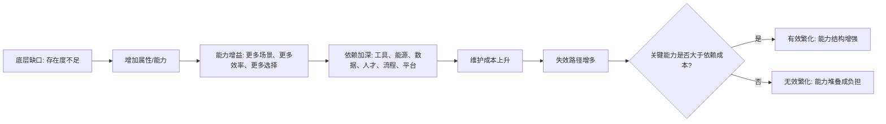

## 王东岳思维筑基课: 属性繁化律: 能力越多，依赖越深

### 作者
digoal

### 日期
2026-05-18

### 标签
王东岳 , 属性繁化律 , 属性增多 , 能力组合 , 适应能力 , 资源消耗 , 后衍存在 , 代偿机制 , 学习迁移 , 思维筑基

----

## 背景

> 面向对象: 大学生、产品经理、运营经理、有投资需求的人  
> 核心问题: 为什么能力、功能、资源、渠道、工具越多，一个人、产品、组织或公司反而可能越难保持稳定？  
> 先说结论: 属性繁化律说的是: 系统为了补偿自身不足，会不断增加能力、功能、工具、流程和关系。能力越多，能处理的场景越多；但每一种能力都会绑定新的条件、成本、维护和失效路径。真正的强，不是能力项越多，而是关键能力越准、依赖越可控。

## 一张图先看懂



## 求真讲法

### 它到底说了什么

“属性”可以先理解为一个系统拥有的能力、功能、特征、接口和关系。

一个人会写作、编程、演讲、销售、投资、管理，这些是能力属性。  
一个产品有搜索、推荐、支付、权限、协作、报表、AI 助手，这些是功能属性。  
一个企业有品牌、渠道、供应链、数据、算法、销售团队、合规体系，这些是组织属性。  
一个国家有法律、金融、教育、医疗、军队、科研、基础设施，这些是社会属性。

属性繁化律说的是:

```text
为了处理更多约束
系统会增加更多属性
属性带来能力
能力同时带来依赖
```

所以，能力越多，并不自动等于存在越稳。它可能只是说明系统面对的约束更多，必须靠更多属性维持自己。

### 它是怎么来的

在递弱代偿框架里，属性繁化是代偿有效性的表现。存在度下降后，系统如果还要续存，就必须增加属性: 更复杂的结构、更敏锐的感应、更强的能动性、更密的协作关系。

王东岳《物演通论》相关材料中反复出现“属性丰化”“感应属性”“结构属性”“代偿属性”等表达。其基本方向是: 后衍存在物表面上能力更丰富，但这些丰富属性不是免费赠品，而是对底层递弱的补偿。

可以把它转成现实判断:

```text
缺口越多 -> 需要能力越多
能力越多 -> 依赖条件越多
依赖越多 -> 维护和失效风险越高
```

这就是为什么现代人拥有更多工具，却更容易焦虑；现代产品功能更多，却更难上手；现代企业资源更多，却更依赖系统、人才、资本和合规。

### 它依赖哪些假设

| 假设 | 含义 | 如果不成立会怎样 |
| --- | --- | --- |
| 属性是代偿形式 | 能力、功能、工具、制度都是补缺口的结构 | 如果属性不是代偿，就无法解释能力为何伴随依赖 |
| 属性能带来真实能力 | 多一个有效属性，就能处理更多场景 | 如果属性无效，它只是装饰 |
| 属性不是免费资产 | 每个属性都要学习、维护、协调和更新 | 如果属性没有成本，能力越多就必然越好 |
| 属性之间会相互耦合 | 功能、流程、团队、渠道之间会彼此影响 | 如果互不影响，复杂系统不会失控 |
| 关键属性比属性数量重要 | 少数关键能力决定系统能否过阈值 | 如果数量比质量重要，堆功能就是正确策略 |

### 常见误解

第一，能力越多不等于越强。一个人会很多浅技能，不如少数关键能力足够深。一个产品功能很多，不如核心任务完成得好。一个公司业务很多，不如一条主航道现金流稳。

第二，依赖越多不一定越差。依赖本身不是问题，不可控依赖才是问题。现代社会不可能无依赖，关键是依赖是否稳定、可替代、可维护。

第三，属性繁化不是反对成长、反对功能、反对多元化。它反对的是无目标堆能力、无收益堆功能、无协同扩业务。

## 求存讲法

### 它有什么用

属性繁化律最适合用来识别“能力幻觉”。

很多东西看起来更强，是因为属性更多:

```text
人: 证书更多、技能更多、工具更多
产品: 功能更多、模块更多、配置更多
运营: 渠道更多、活动更多、标签更多
公司: 业务更多、团队更多、融资更多
投资标的: 故事更多、生态更多、概念更多
```

但你要继续问:

```text
这些属性是否对应真实缺口？
是否形成核心能力？
是否增加不可控依赖？
是否提高维护成本？
是否让系统更容易失效？
```

### 它怎么迁移到生活

个人成长里，属性繁化常见于“全都想学”。

大学生看到 AI、金融、编程、运营、写作、短视频、考证、英语都重要，于是每个都学一点。表面能力项增加，底层却可能没有任何一项过阈值。

更有效的做法是区分三类能力:

| 能力类型 | 作用 | 策略 |
| --- | --- | --- |
| 核心能力 | 决定长期竞争力 | 深练到可交付 |
| 辅助能力 | 放大核心能力 | 用到够用即可 |
| 噪声能力 | 只缓解焦虑或追热点 | 克制投入 |

个人不是能力越多越强，而是核心能力越清楚，辅助能力越低成本，噪声能力越少。

### 它怎么迁移到产品经理

产品经理经常面对功能繁化。

用户提需求，销售提需求，老板提需求，竞品也有类似功能。每个功能都有理由，但产品最终可能变成难用的大杂烩。

产品功能要分三层:

| 功能属性 | 判断标准 | 处理方式 |
| --- | --- | --- |
| 核心属性 | 没有它，用户核心任务不能完成 | 优先做到极致 |
| 场景属性 | 部分用户、部分场景高价值 | 分层、插件化或配置化 |
| 展示属性 | 主要为了显得强大 | 谨慎添加，必要时砍掉 |

产品的高级，不是把所有能力都摆在用户面前，而是让关键能力可靠、默认路径简单、复杂能力按需出现。

### 它怎么迁移到运营经理

运营中的属性繁化表现为渠道、活动、内容、用户标签、会员权益、社群、私域工具越来越多。

这可能是精细化，也可能是复杂化失控。

运营经理要问:

```text
每个新增渠道是否带来增量用户，还是分散团队注意力？
每个用户标签是否提升转化，还是只是让报表更复杂？
每个会员权益是否促进复购，还是增加履约成本？
每个活动玩法是否沉淀机制，还是一次性消耗人力？
```

好的运营属性繁化，是让触达更准、成本更低、复购更稳。  
坏的运营属性繁化，是让动作更多、团队更累、用户更困惑。

### 它怎么迁移到创业

创业公司最怕过早属性繁化。

还没验证需求，就想做平台。  
还没跑通单一客户群，就想覆盖多个行业。  
还没形成标准交付，就加定制服务。  
还没找到主航道，就扩产品线。

这些动作都会增加能力项，但也会增加依赖:

```text
多行业 -> 多套销售话术和交付知识
多产品 -> 多条研发、测试、客服和维护线
多渠道 -> 多套运营节奏和数据归因
多团队 -> 更多管理、沟通和文化成本
```

创业早期真正重要的不是能力多，而是少数关键能力过阈值: 找到真需求、做出可付费产品、稳定交付、形成复购、控制现金流。

### 它怎么迁移到投融资

投资中，属性繁化律能帮助识别“多元化能力”和“多元化负担”。

有些公司能力多，是因为它们形成了可复用底层能力。例如供应链能力、品牌能力、数据能力、渠道能力、算法能力可以迁移到多个产品线，这种属性繁化可能形成平台优势。

有些公司能力多，只是因为主业增长乏力，不断讲新故事、进新赛道、做新概念。这种属性繁化很可能稀释管理层注意力，拉低资本回报率。

投资者要问:

```text
新增业务是否共享核心能力？
新增属性是否提高客户黏性或单位经济模型？
新增能力是否降低长期成本？
新增依赖是否可控？
管理层是否有能力驾驭更复杂的结构？
```

好公司是能力复用，差公司是能力堆叠。  
好属性让系统更强，坏属性让系统更散。

### 它的适用范围和边界

适用场景:

| 场景 | 关键问题 |
| --- | --- |
| 个人成长 | 能力项是否服务核心竞争力？ |
| 产品设计 | 功能是否服务核心任务？ |
| 运营管理 | 渠道和活动是否提升单位效率？ |
| 创业扩张 | 新业务是否共享底层能力？ |
| 投资分析 | 多元化是平台优势，还是主业焦虑？ |

边界也要说清楚: 属性繁化律不是主张极简主义。现实中，复杂环境确实需要多属性系统。问题不在于属性多，而在于属性是否必要、是否协同、是否可维护、是否让系统更接近存在阈之上的稳定状态。

### 正例: 怎么用它提升能力

假设你要评估一个企业 AI 办公套件。

它有写作、表格、会议纪要、知识库、搜索、客服、数据分析等能力。表面看属性很多。真正要判断的是:

```text
这些能力是否共享同一套企业知识和权限体系？
是否减少员工在多个工具之间切换？
是否降低培训、搜索、协作和交付成本？
是否让企业数据更安全、更可控？
是否增加了模型成本、数据治理和供应商锁定？
```

如果多个能力共享底层知识库、权限、工作流和数据治理，它们就是协同属性，能形成平台能力。  
如果每个功能彼此割裂，只是把多个工具塞在一起，它就是属性堆叠，能力多但依赖更乱。

### 反例: 前提不成立会怎样

反例一: 全能型个人定位。

一个大学生同时学习金融、编程、短视频、设计、运营、AI、考研和创业。简历看起来丰富，但没有一项能力能交付真实成果。面试时，他什么都懂一点，但无法解决具体问题。

失败原因是: 属性数量增加，没有形成核心属性。能力繁化没有带来能力增益，只带来注意力分散。

反例二: 产品功能膨胀。

一个工具产品原本以“简单好用”获得用户。后来为了对标竞品，不断加入社群、直播、商城、积分、AI、报表和自动化。老用户觉得越来越重，新用户不知道从哪里开始，客服成本上升，留存下降。

失败原因是: 新属性没有服务核心任务，反而破坏原有优势。能力越多，依赖越深，用户负担越重。

## 思考

属性繁化律真正训练的是一种克制能力:

> 看到能力变多，不要先兴奋，要问它是否让系统更稳、更准、更可持续。

这句话能帮助你看穿很多表面变化。

| 表面变化 | 深层追问 |
| --- | --- |
| 个人技能越来越多 | 是否形成一项可交付的核心能力？ |
| 产品功能越来越多 | 是否提升核心任务完成率？ |
| 运营玩法越来越多 | 是否降低获客和复购成本？ |
| 公司业务越来越多 | 是否共享底层能力，还是分散资源？ |
| 投资故事越来越多 | 是否提高现金流质量，还是遮蔽主业问题？ |

判断未来，不是看谁能力项最多，而是看谁的关键能力最不可替代，谁的依赖链最可控，谁能用更少属性完成更大价值。

## 最后记住

1. 属性繁化律的核心是: 能力越多，通常依赖也越深。
2. 属性可以带来能力增益，也会带来学习、维护、协调和失效成本。
3. 个人、产品、运营和创业都要区分核心属性、辅助属性和噪声属性。
4. 投资中要分清能力复用和能力堆叠，多元化不等于平台化。
5. 真正强的系统，不是属性最多，而是关键属性最强、依赖最可控。

## 参考资料

- 王东岳: 《物演通论》第十八章，东岳哲学学会在线版。https://www.wuyantonglun.org/2022/505.html
- 东岳哲学学会: 《物演通论》的整体结构、概念关系及逻辑脉络梳理。https://www.wuyantonglun.org/2024/3339.html
- 王东岳思想录: 《物演通论》卷一自然哲学卷导读。https://wuyantonglun.com/post/688.html
- 王东岳思想录: 《物演通论》卷二精神哲学卷导读。https://www.aizhisx.com/post/689.html
- 王东岳思想录: 《物演通论》卷三社会哲学卷导读及答疑。https://wuyantonglun.com/post/690.html
  
#### [PostgreSQL 解决方案集合](../201706/20170601_02.md "40cff096e9ed7122c512b35d8561d9c8")
  
  
#### [德哥 / digoal's Github - 公益是一辈子的事.](https://github.com/digoal/blog/blob/master/README.md "22709685feb7cab07d30f30387f0a9ae")
  
  
#### [About 德哥](https://github.com/digoal/blog/blob/master/me/readme.md "a37735981e7704886ffd590565582dd0")
  
  

  
