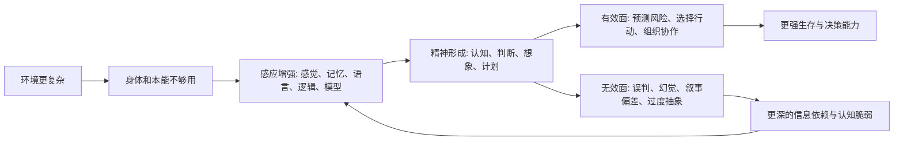

## 王东岳思维筑基课: 感应代偿律: 精神是高级感应的补偿形态

### 作者
digoal

### 日期
2026-05-18

### 标签
王东岳 , 感应代偿律 , 精神哲学 , 意识 , 理性 , 感知系统 , 认知代偿 , 信息处理 , 物演通论 , 思维筑基

----

## 背景

> 面向对象: 大学生、产品经理、运营经理、有投资需求的人  
> 核心问题: 为什么知识、理性、判断、模型和信息处理能力越重要，人却越容易被信息、情绪、叙事和幻觉困住？  
> 先说结论: 感应代偿律说的是: 精神不是脱离物质世界的神秘实体，而是高级感应能力的代偿形态。环境越复杂，个体越脆弱，就越需要感知、记忆、语言、逻辑、模型和理性来补偿自身不足。但精神能帮助我们应对世界，也会扭曲世界；它是补偿，也是风险源。

## 一张图先看懂



## 求真讲法

### 它到底说了什么

“感应”可以先理解为一个系统对外界变化作出反应的能力。低层感应是物理、化学、生物层面的反应，比如细胞对环境刺激作出趋避。高级感应则发展为感觉、记忆、情绪、语言、逻辑、模型、推理和价值判断。

“精神是高级感应的补偿形态”的意思是:

```text
身体能力不足 -> 需要感知外部
即时反应不足 -> 需要记忆和经验
个体经验不足 -> 需要语言和知识
现实太复杂 -> 需要模型和理性
未来不可见 -> 需要预测和想象
```

精神不是凭空出现的装饰，而是为了帮助弱小个体处理更复杂环境。人类跑不过很多动物，力量也不突出，但能通过感知、语言、工具、制度和知识体系组织行动。这就是高级感应代偿。

### 它是怎么来的

在王东岳《物演通论》的精神哲学框架中，人类精神现象和感知能力被解释为自然物质“感应属性代偿增益”的结果。也就是说，精神并不是突然从自然之外降临，而是在递弱代偿过程中，由感应属性不断增益、分化、抽象而来。

可以把推导链写成:

```text
存在度递弱
-> 身体和本能不足以直接维持存在
-> 感应属性增强
-> 感知、记忆、意识、语言、理性出现
-> 精神成为高级代偿结构
```

这套说法是哲学解释框架，不是现代神经科学的完整实证模型。它的价值在于提供一个判断角度: 精神能力既是优势，也是补偿；认知越发达，越说明主体要面对更复杂的生存条件。

### 它依赖哪些假设

| 假设 | 含义 | 如果不成立会怎样 |
| --- | --- | --- |
| 感应是自然连续过程 | 从物理反应、生物感知到理性认知有连续性 | 如果精神完全超自然，就不能用代偿解释 |
| 精神服务于求存 | 认知、语言、逻辑首先帮助主体处理环境 | 如果精神不服务行动，就难以解释其演化价值 |
| 高级感应会扭曲对象 | 我们看到的是被感知结构加工后的世界 | 如果感知完全透明，就不会有认知偏差 |
| 感应越强，依赖越深 | 越依赖信息、模型、语言、符号和系统 | 如果无依赖，就不会有信息过载和叙事操控 |
| 精神有效又无效 | 能帮助决策，也可能制造幻觉 | 如果只有效或只无效，都无法解释现实悖论 |

### 常见误解

第一，感应代偿律不是否定精神价值。理性、知识、模型、语言和想象力极其重要。没有这些，人类无法组织社会、发展科学、创造产品、管理风险和进行投资。

第二，它也不是崇拜精神能力。越高级的认知越可能出现抽象过度、叙事自洽、模型错配、信息茧房和集体幻觉。精神能看远，也能看偏。

第三，它不是简单的唯心论。这里的精神不是决定一切的神秘力量，而是主体应对世界的一种高级感应和行动准备系统。

## 求存讲法

### 它有什么用

这条规律最适合用来判断信息时代的真伪。

表面上，我们获得的信息越来越多，模型越来越强，工具越来越智能，知识越来越丰富。但感应代偿律提醒我们:

```text
信息更多，不等于判断更好
模型更强，不等于现实更清楚
叙事更完整，不等于事实更可靠
理性更复杂，不等于行动更有效
```

精神和信息能力越强，越要检查它们是否对应真实世界，是否能改善行动，而不是只在符号系统里自洽。

### 它怎么迁移到生活

大学生常见的问题不是信息太少，而是感应过载。

每天看大量课程、观点、短视频、行业分析、榜单和经验贴，感觉自己接触了很多知识。但如果这些信息没有转化为行动、练习、反馈和作品，它们只是精神层面的刺激，不是能力。

生活判断可以用三问:

```text
我知道的东西，是否改变了我的行动？
我相信的观点，是否经得起现实反馈？
我收藏的信息，是否进入了我的能力结构？
```

如果答案是否定的，精神代偿就变成了信息依赖。

### 它怎么迁移到产品经理

产品经理的核心能力之一，就是感应用户和市场。但“感应”不等于听到声音，也不等于收集需求。

用户会表达愿望，但不一定知道自己的真实约束。数据会显示行为，但不自动解释原因。竞品会展示功能，但不说明底层需求。行业叙事会制造方向感，但可能只是短期情绪。

产品经理要把感应分成三层:

| 层级 | 表现 | 风险 |
| --- | --- | --- |
| 表层感应 | 听用户说什么、看数据涨跌 | 被噪声牵着走 |
| 结构感应 | 找到用户任务、成本、约束和替代方案 | 需要访谈、实验和分析 |
| 行动感应 | 用 MVP、实验、留存、付费验证判断 | 成本更高，但更接近真实 |

好的产品判断，不是感觉敏锐，而是能把感应转化为可验证行动。

### 它怎么迁移到运营经理

运营经理每天都在处理信息: 用户反馈、转化漏斗、内容热度、投放数据、社群情绪、销售反馈。感应能力越强，运营越能快速调整。

但运营也最容易被表面信号骗:

```text
热度高 -> 不等于需求强
评论多 -> 不等于信任深
点击高 -> 不等于转化好
社群活跃 -> 不等于复购稳
数据上涨 -> 不等于结构改善
```

运营中的精神代偿，必须落到可验证指标: 留存、复购、转介绍、客单价、履约成本、投诉率和自然增长。否则，运营只是被情绪和数据波动牵引。

### 它怎么迁移到创业

创业早期，创始人最缺的不是想法，而是对真实世界的准确感应。

创始人容易被三类精神幻觉困住:

| 幻觉 | 表现 | 纠偏方式 |
| --- | --- | --- |
| 叙事幻觉 | 觉得逻辑自洽就一定有市场 | 找真实客户付费验证 |
| 技术幻觉 | 觉得技术先进就一定有人买 | 验证使用场景和购买路径 |
| 增长幻觉 | 觉得数据上涨就说明产品成立 | 看留存、复购和单位经济模型 |

创业中的感应代偿，不能停留在想象和推演。它必须通过客户访谈、原型测试、真实成交、交付反馈和现金流来校正。

真正强的创业者，不是最会讲故事的人，而是最能让自己的判断接受现实修正的人。

### 它怎么迁移到投融资

投资本质上是对未来的感应和判断。财报、行业数据、管理层表述、价格走势、政策信号、舆论情绪，都是投资者感应世界的输入。

问题是，投资最容易被高级精神代偿欺骗:

```text
模型很精致，但假设错了
故事很完整，但现金流不支持
估值很复杂，但安全边际不足
行业很热，但竞争格局恶化
管理层表达很好，但资本配置很差
```

投资者需要把精神判断落到几个硬问题:

| 判断对象 | 硬问题 |
| --- | --- |
| 叙事 | 是否能转化为收入、利润和现金流？ |
| 增长 | 是真实需求，还是周期、补贴、并表或价格因素？ |
| 壁垒 | 是结构性优势，还是暂时领先？ |
| 估值 | 是否留有安全边际？ |
| 风险 | 如果核心假设错了，会损失多少？ |

感应代偿律提醒投资者: 市场不是缺故事，而是缺能抵抗幻觉的反馈机制。

### 它的适用范围和边界

适用场景:

| 场景 | 关键问题 |
| --- | --- |
| 个人成长 | 信息是否转化为行动和能力？ |
| 产品判断 | 用户声音是否被验证为真实需求？ |
| 运营管理 | 数据波动是否对应结构改善？ |
| 创业决策 | 叙事是否经过真实客户和现金流验证？ |
| 投资分析 | 模型和故事是否受财务事实约束？ |

边界也必须说清楚: 感应代偿律不是神经科学定律，也不能替代心理学、认知科学、行为金融和数据分析。它更像一个跨领域提醒: 越依赖精神、信息和模型，就越要防止感应失真。

### 正例: 怎么用它提升能力

假设你要判断一个 AI 投研工具是否有价值。

表面看，它能快速整理公告、新闻、财报、研报和行业资料，这是高级感应代偿。它提升了信息获取和初步分析效率。

但真正要问:

```text
它是否减少漏看重要风险？
它是否区分事实、观点和假设？
它是否把信息连接到现金流、竞争格局和估值？
它是否提示不确定性，而不是给出虚假的确定答案？
它是否帮助投资者形成判断，还是让投资者更依赖摘要？
```

如果它让人更快接近事实、更清楚地识别假设、更严谨地验证风险，它是有效代偿。  
如果它只是生成流畅叙事，让人更快相信一个未经验证的故事，它就是感应幻觉放大器。

### 反例: 前提不成立会怎样

反例一: 信息收藏型学习。

一个大学生每天收藏大量课程、论文、工具和方法论。他的知识库越来越大，标签越来越细，但没有固定练习、没有输出作品、没有反馈闭环。几个月后，他感觉知道很多，却解决不了具体问题。

失败原因是: 精神感应没有转化为行动代偿。信息只刺激了认知，没有形成能力。

反例二: 叙事型投资。

一个投资者看到某个行业处在风口，研究了大量宏大叙事: 技术革命、政策支持、空间巨大、长期趋势不可逆。但他没有拆现金流、竞争格局、资本开支、估值和安全边际。最后买在高位，行业确实发展了，公司和股价却没有兑现。

失败原因是: 感应停留在宏观叙事，没有被经营事实和估值约束。精神代偿变成了自我说服。

## 思考

感应代偿律真正训练的是一种反幻觉能力:

> 精神越强，越要让精神接受现实校正；模型越漂亮，越要检查它有没有改变行动和结果。

这句话可以帮助我们看清信息时代的很多困境。

| 表面增强 | 深层风险 |
| --- | --- |
| 信息更多 | 注意力更分散，判断更依赖筛选能力 |
| 模型更多 | 假设错误时，错得更系统 |
| AI 更强 | 产出更快，但幻觉也可能更快传播 |
| 叙事更完整 | 自我说服更容易 |
| 数据更细 | 局部指标可能遮蔽整体结构 |

未来的竞争，不只是资源竞争、技术竞争，也是感应质量的竞争。谁能更准确地感应现实、校正模型、识别幻觉、转化行动，谁就更能穿透表面变化。

## 最后记住

1. 感应代偿律的核心是: 精神、认知、理性和模型，是高级感应的补偿形态。
2. 精神能力能帮助我们预测、协作、决策和创造，但也会带来误判、幻觉和叙事偏差。
3. 信息越多，越要看它是否转化为行动、反馈和能力。
4. 产品、运营、创业和投资中的判断，都要从表层信号走向现实验证。
5. 好的精神代偿不是让人更会想象，而是让人更接近真实、更能行动、更能修正错误。

## 参考资料

- 王东岳: 《物演通论》第七十三章，东岳哲学学会在线版。https://www.wuyantonglun.org/2023/2272.html
- 王东岳: 《物演通论》第七十六章，东岳哲学学会在线版。https://www.wuyantonglun.org/2023/2288.html
- 王东岳: 《物演通论》第七十七章，东岳哲学学会在线版。https://www.wuyantonglun.org/2023/2298.html
- 王东岳: 《物演通论》第八十九章，东岳哲学学会在线版。https://www.wuyantonglun.org/2023/2548.html
- 王东岳: 《物演通论》提要——精神哲学论，物演研究会。https://wuyantonglun.com/post/756.html
- 王东岳思想录: 《物演通论》卷二精神哲学卷导读。https://www.aizhisx.com/post/689.html
- 王东岳: 《物演通论》名词及概念注释，爱智思享会。https://www.aizhisx.com/post/758.html
  
#### [PostgreSQL 解决方案集合](../201706/20170601_02.md "40cff096e9ed7122c512b35d8561d9c8")
  
  
#### [德哥 / digoal's Github - 公益是一辈子的事.](https://github.com/digoal/blog/blob/master/README.md "22709685feb7cab07d30f30387f0a9ae")
  
  
#### [About 德哥](https://github.com/digoal/blog/blob/master/me/readme.md "a37735981e7704886ffd590565582dd0")
  
  

  
