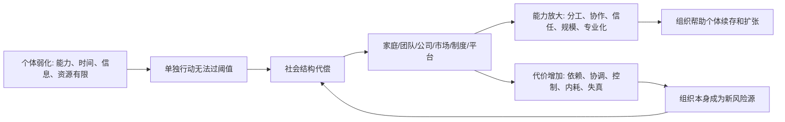

## 王东岳思维筑基课: 社会结构代偿律: 个体弱化催生组织

### 作者
digoal

### 日期
2026-05-18

### 标签
王东岳 , 社会结构代偿律 , 组织 , 制度 , 分工协作 , 个体弱化 , 社会哲学 , 结构代偿 , 文明系统 , 思维筑基

----

## 背景

> 面向对象: 大学生、产品经理、运营经理、有投资需求的人  
> 核心问题: 为什么个人越来越离不开团队、平台、公司、市场、制度和国家？为什么组织能放大个体能力，也会压缩个体自由、制造内耗和系统性风险？  
> 先说结论: 社会结构代偿律说的是: 当单个个体无法独立应对复杂环境时，就必须通过家庭、团队、公司、市场、制度、平台和国家等社会结构来代偿。组织不是凭空出现的管理装置，而是个体弱化后的协同补偿系统。它能放大能力，也会带来分工依赖、协调成本、信息失真、权力代理和结构性脆弱。

## 一张图先看懂



## 求真讲法

### 它到底说了什么

“社会结构代偿律”可以用一句话讲:

> 个体越难独自生存，越需要组织结构来代偿；组织越强，个体越依赖组织。

一个人不可能自己种粮、造药、修路、写软件、建医院、发电、做金融、制定法律、维护安全。所以现代人表面上选择更多、能力更强，实际上越来越依赖学校、公司、银行、医院、平台、供应链、法律和基础设施。

组织的作用，是把很多弱个体组合成一个强系统:

```text
个体有限 -> 分工协作 -> 结构放大 -> 集体能力增强
```

但组织不是免费的。它会带来:

```text
角色分化
流程约束
信息层级
协调成本
代理问题
权力结构
系统依赖
```

所以组织既是代偿，也是新的脆弱来源。

### 它是怎么来的

从递弱代偿的角度看，社会不是人类凭空发明的外部装置，而是自然结构化代偿的延伸。

王东岳《物演通论》社会哲学相关材料中，把社会结构放进一个连续序列里理解: 粒子结构、原子结构、分子结构、细胞结构、机体结构、社会结构。这个解释意在说明，社会存在不是脱离自然的特殊存在，而是结构化代偿走到高阶阶段后的表现。

把它迁移到现实世界，就是:

```text
个体弱化
-> 单体能力不足
-> 必须分工
-> 分工需要协作
-> 协作需要组织、规则、信任和制度
-> 社会结构出现
```

这不是组织管理学的实证公式，而是一条跨领域解释框架。它帮助我们看到: 组织不是单纯为了效率，而是为了让个体在复杂世界里继续存在。

### 它依赖哪些假设

| 假设 | 含义 | 如果不成立会怎样 |
| --- | --- | --- |
| 个体能力有限 | 单个个体无法处理全部生存和发展问题 | 如果个体全能，就不需要组织 |
| 分工能带来能力放大 | 不同人承担不同功能，可以提高整体效率 | 如果分工无效，组织只是负担 |
| 协作需要结构 | 信任、规则、流程、权责、激励是协作条件 | 如果协作自然无摩擦，制度就不重要 |
| 组织会制造新依赖 | 个体依赖组织，组织依赖成员和外部环境 | 如果没有依赖，组织不会变成风险源 |
| 组织有效又无效 | 能补个体不足，不能消除个体弱化 | 如果组织能根治弱化，个体不会越来越依赖结构 |

### 常见误解

第一，组织不是天然压迫。家庭、公司、学校、市场、国家、平台都可以为个体提供保护、协作、资源、身份和机会。

第二，组织也不是天然正义。组织一旦形成，就会追求自身延续，可能把原本服务人的结构变成让人服务结构的机器。

第三，个体自由不是脱离组织。现代自由往往依赖组织和制度提供的稳定条件: 法律、教育、货币、交通、网络、医疗和市场。问题不在于要不要组织，而在于组织是否让个体更有能力，还是更被动依附。

## 求存讲法

### 它有什么用

这条规律最适合帮助你判断组织、平台、公司和制度的真实价值。

不要只问:

```text
这个组织有多大？
这个平台有多少用户？
这家公司有多少人？
这个制度看起来多完整？
```

要问:

```text
它代偿了个体什么弱点？
它是否降低了协作成本？
它是否提高了信任和交付稳定性？
它是否让个体能力被放大？
它是否制造了更深的依赖和内耗？
```

组织真正的价值，不是规模本身，而是是否把个体无法单独完成的事，变成稳定可重复的协作能力。

### 它怎么迁移到生活

大学生和职场人常常低估组织的重要性。

一个人再聪明，也需要老师、同伴、项目、平台、实习、公司和行业网络来训练能力。很多能力不是靠独自阅读形成的，而是在协作中被逼出来的: 沟通、交付、反馈、责任、边界、信用。

但也要警惕组织依赖。一个人如果只能在大平台、大公司、大流程里工作，一旦离开结构支持，就无法独立判断、独立学习、独立交付，说明组织代偿没有内化成个人能力。

生活里的判断句:

> 好组织让你被支撑，也让你长出能力；坏组织让你被安排，却让你失去判断。

### 它怎么迁移到产品经理

很多产品本质上是在做社会结构代偿。

协作软件代偿团队沟通弱。  
CRM 代偿客户关系记忆弱。  
项目管理工具代偿任务协调弱。  
交易平台代偿陌生人信任弱。  
社区产品代偿个体连接弱。  
企业 SaaS 代偿组织流程和数据治理弱。

产品经理要问:

```text
这个产品是在代偿个体弱点，还是组织弱点？
它让协作更简单，还是只把流程搬到线上？
它降低信任成本，还是制造新的审核成本？
它让个体更能行动，还是更依赖系统审批？
它能否形成稳定网络，而不是一次性工具？
```

好的组织型产品，不只是提供功能，而是重构协作关系。

### 它怎么迁移到运营经理

运营经常在做“临时组织化”: 把分散用户组织成社群，把一次性购买组织成会员，把松散流量组织成私域，把内容互动组织成长期关系。

但运营要警惕一种误判: 社群热闹不等于组织有效。

| 运营结构 | 代偿什么 | 风险 |
| --- | --- | --- |
| 社群 | 用户连接弱、反馈弱 | 变成运营人员单向维持 |
| 会员体系 | 复购弱、关系弱 | 权益成本吞掉利润 |
| 私域 | 公域流量不稳定 | 触达过度导致反感 |
| 用户共创 | 产品感应弱 | 只听少数高声量用户 |
| 分销裂变 | 获客弱 | 信任透支和质量失控 |

好的运营结构，能让用户之间、用户和产品之间形成低成本关系。坏的运营结构，只是把短期流量包进一个更重的壳。

### 它怎么迁移到创业

创业公司早期不是缺人多，而是缺结构。

很多创业团队靠创始人个人能力推进: 创始人销售、创始人交付、创始人客服、创始人融资、创始人拍板。这在早期可以活命，但不能长期支撑。

创业的关键，是把个人代偿逐步转成组织代偿:

| 阶段 | 个体代偿 | 组织代偿 |
| --- | --- | --- |
| 找客户 | 创始人熟人销售 | 清晰客户画像和销售流程 |
| 做交付 | 核心成员手工救火 | 标准交付、文档、培训和质检 |
| 管产品 | 创始人口头决策 | 路线图、数据、反馈机制 |
| 管团队 | 靠情义和加班 | 目标、权责、激励、淘汰 |
| 管现金流 | 靠融资和个人信用 | 预算、回款、毛利和经营纪律 |

创业公司真正长大，不是人数增加，而是关键能力从个人身上迁移到组织结构里。

### 它怎么迁移到投融资

投资时，社会结构代偿律能帮助你识别公司的组织质量和平台质量。

一个公司真正有价值，不只是因为有明星创始人、爆款产品或短期增长，而是因为它形成了可复制的组织能力:

```text
销售不是靠少数高手
交付不是靠临时救火
研发不是靠个人英雄
风控不是靠经验拍脑袋
文化不是靠口号维持
现金流不是靠融资续命
```

平台型公司更要看结构代偿。平台的价值来自连接、匹配、信任、规则和网络效应。但平台也可能制造依赖、垄断、劣币驱逐和治理成本。

投资检查表:

| 问题 | 判断 |
| --- | --- |
| 公司能力是否离开创始人仍能运行？ | 判断组织是否成熟 |
| 增长是否来自可复制流程？ | 判断增长质量 |
| 平台是否降低交易成本？ | 判断平台价值 |
| 规则是否维护生态信任？ | 判断网络是否健康 |
| 规模扩大后协调成本是否失控？ | 判断结构是否可持续 |

好公司把个体能力组织化。差公司把组织表面化，实际仍靠少数人硬扛。

### 它的适用范围和边界

适用场景:

| 场景 | 关键问题 |
| --- | --- |
| 个人成长 | 组织是否帮助我形成能力，而不是只让我依赖？ |
| 产品设计 | 产品是否重构协作关系，而非只堆功能？ |
| 运营管理 | 社群、会员、私域是否降低关系成本？ |
| 创业管理 | 创始人能力是否迁移为组织能力？ |
| 投资分析 | 公司是否有可复制组织系统和健康平台结构？ |

边界也要说清楚: 社会结构代偿律不是组织万能论。小事、小团队、早期探索，过度组织化会压低速度。组织只有在协作复杂度足够高、重复任务足够多、信任成本足够大时，才值得建立更重结构。

### 正例: 怎么用它提升能力

假设你要判断一个 B2B 协作平台有没有长期价值。

表面看，它有任务、审批、文档、IM、日历、项目看板和数据报表。社会结构代偿视角会问:

```text
它代偿了组织中的什么弱点？
是信息散落、责任不清、交付不可追踪，还是跨部门信任不足？
它是否降低沟通成本？
它是否让新人更快进入协作？
它是否减少关键人依赖？
它是否增加了额外录入、审批和管理负担？
```

如果它能把分散沟通转为可追踪协作，把个人记忆转为组织知识，把口头承诺转为明确责任，它就是有效的社会结构代偿。  
如果它只是多一个打卡和审批系统，让员工花更多时间填表，它就是组织复杂性的放大器。

### 反例: 前提不成立会怎样

反例一: 过早组织化的创业团队。

一个 8 人创业团队还没有找到稳定客户，就设置多层岗位、周报体系、复杂 OKR、审批流程和中台建设。每个人看起来很专业，但客户访谈少了，产品试错慢了，团队开始为流程服务。

失败原因是: 组织结构没有代偿真实协作复杂度，反而制造了新复杂度。个体弱化并没有到需要重组织代偿的程度。

反例二: 平台只连接，不治理。

一个交易平台快速聚集买家和卖家，但没有有效评价、担保、风控、处罚和纠纷处理机制。短期交易量上升，随后假货、欺诈、服务争议增加，用户信任下降。

失败原因是: 平台只做了连接代偿，没有做信任代偿。社会结构没有越过信任阈值，规模越大，问题越大。

## 思考

社会结构代偿律真正训练的是一种组织判断力:

> 看到组织变大、平台变强、制度变密，不要先判断它先进，要先问它代偿了什么个体弱点，又制造了什么结构依赖。

这句话能看穿很多现实现象。

| 表面变化 | 深层追问 |
| --- | --- |
| 公司规模变大 | 组织能力是否增强，还是协调成本上升？ |
| 平台用户变多 | 信任和治理是否跟上？ |
| 制度流程变细 | 风险是否下降，还是行动变慢？ |
| 社群很活跃 | 用户关系是否自运转，还是靠运营硬撑？ |
| 创始人很强 | 能力是否迁移到团队和流程？ |

未来的竞争，不只是个体能力竞争，更是组织结构竞争。谁能用更低的协作成本组织更多弱个体，谁就能获得更强的系统能力。但如果组织不能降低依赖、信任和协调成本，它就会从代偿结构变成系统负担。

## 最后记住

1. 社会结构代偿律的核心是: 个体越难独自应对复杂环境，越需要组织结构来补偿。
2. 组织能放大个体能力，也会带来依赖、协调、信息失真和代理问题。
3. 好组织让个体能力被放大并沉淀为结构，坏组织让个体为结构消耗。
4. 产品、运营、创业和投资中，要判断组织是否降低协作和信任成本。
5. 真正强的公司和平台，不是人多、流程多、规则多，而是能用更低结构成本完成更高质量协作。

## 参考资料

- 王东岳: 《物演通论》提要——社会哲学论，爱智思享会。https://www.aizhisx.com/post/757.html
- 王东岳: 《物演通论》第一百四十四章，东岳哲学学会在线版。https://www.wuyantonglun.org/2024/3489.html
- 王东岳思想录: 《物演通论》卷三社会哲学卷导读及答疑。https://wuyantonglun.com/post/690.html
- 王东岳: 《物演通论》名词及概念注释，爱智思享会。https://www.aizhisx.com/post/758.html
- 东岳哲学学会: 《物演通论》的整体结构、概念关系及逻辑脉络梳理。https://www.wuyantonglun.org/2024/3339.html
  
#### [PostgreSQL 解决方案集合](../201706/20170601_02.md "40cff096e9ed7122c512b35d8561d9c8")
  
  
#### [德哥 / digoal's Github - 公益是一辈子的事.](https://github.com/digoal/blog/blob/master/README.md "22709685feb7cab07d30f30387f0a9ae")
  
  
#### [About 德哥](https://github.com/digoal/blog/blob/master/me/readme.md "a37735981e7704886ffd590565582dd0")
  
  

  
