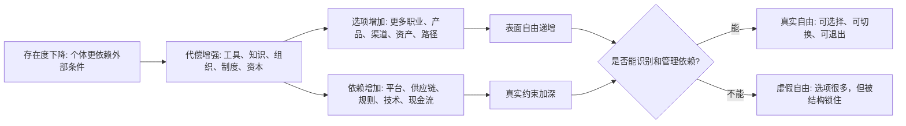

## 王东岳思维筑基课: 自由递增律: 自由是依赖中的选择能力

### 作者
digoal

### 日期
2026-05-18

### 标签
王东岳 , 自由递增律 , 自由 , 选择能力 , 能动性 , 依赖条件 , 社会结构 , 感应代偿 , 现代性 , 思维筑基

----

## 背景

> 面向对象: 大学生、产品经理、运营经理、有投资需求的人  
> 核心问题: 为什么现代人选择越来越多，却越来越焦虑、越来越依赖系统？为什么企业和投资看起来更自由，实际却被平台、资本、供应链、监管和技术条件约束？  
> 先说结论: 自由递增律说的是: 自由不是摆脱一切依赖，而是在更多依赖关系中获得更强的识别、选择、组合、切换和退出能力。越复杂的系统，表面自由越多，底层依赖也越深。真正的自由，不是选项数量多，而是关键约束可见、关键能力可控、关键依赖可替代。

## 一张图先看懂



## 求真讲法

### 它到底说了什么

日常语言里，自由常被理解成“想做什么就做什么”。但在复杂世界里，这个说法太粗。

一个大学生看起来有很多选择: 考研、就业、创业、出国、转行、做自媒体、学 AI、做投资。  
一个产品经理看起来有很多方案: 做平台、做工具、做社区、做付费、做免费、做增长、做留存。  
一个企业看起来有很多增长路径: 融资、投放、并购、出海、上云、接入 AI、做生态。  
一个投资者看起来有很多资产可选: 股票、债券、基金、ETF、黄金、加密资产、REITs、期权。

但选项多，不等于自由大。关键要看:

```text
你是否理解每个选项的约束？
你是否有能力承担选择后的成本？
你是否能在错误时切换路径？
你是否能退出不利依赖？
```

所以，自由递增律的核心不是“选择越多越自由”，而是:

> 自由是依赖结构中的有效选择能力。

### 它是怎么来的

从递弱代偿视角看，后衍存在物越来越依赖外部条件，但也发展出更多代偿能力。精神能力、工具系统、社会组织、市场制度、资本网络和技术平台，都让个体拥有更多可选动作。

王东岳《物演通论》精神哲学相关材料中，把意志、逻辑和感应代偿联系起来讨论；卷二导读也提到“知”的限度和精神代偿的位相问题。把这个框架迁移到现实生活，可以得到一个判断:

```text
依赖增加 -> 需要更多代偿
代偿增加 -> 选项增加
选项增加 -> 自由感增加
但依赖不消失 -> 自由必须在依赖中实现
```

这就是为什么现代社会一方面给人更多职业、信息、工具和资产选择，另一方面也让人更依赖教育、平台、金融、网络、算法、供应链和制度。

### 它依赖哪些假设

| 假设 | 含义 | 如果不成立会怎样 |
| --- | --- | --- |
| 自由需要选择空间 | 没有可选路径，就谈不上自由 | 如果只有一条路，自由只是口号 |
| 选择需要能力支撑 | 选择不是点击按钮，而是承担后果 | 如果没有能力，选项只是幻觉 |
| 选择发生在依赖中 | 任何选择都依赖资源、规则、工具和环境 | 如果完全无依赖，自由就变成抽象幻想 |
| 退出能力是自由核心 | 不能退出的选择会变成锁定 | 如果无法退出，选择只是被动绑定 |
| 选项越多，判断成本越高 | 自由增加会带来认知负担 | 如果判断没有成本，选择越多必然越好 |

### 常见误解

第一，自由不是没有约束。没有约束的状态通常不是自由，而是混乱。真正的自由需要规则、能力、资源和边界。

第二，自由不是选项数量。一个人有十个不懂的选项，不如有三个理解清楚、能承担、能退出的选项。

第三，自由不是平台给你的按钮。平台给你创作、交易、投放和连接的能力，也可能用规则、流量、抽成和数据把你锁住。

## 求存讲法

### 它有什么用

自由递增律最适合用来判断“选择幻觉”。

现代世界最常见的误判是:

```text
我能选很多课程 -> 我更自由
我能用很多工具 -> 我更自由
我能做很多渠道 -> 我更自由
我能投很多资产 -> 我更自由
我能接入很多平台 -> 我更自由
```

真实判断应该是:

```text
这些选择是否提高我的核心能力？
是否降低关键依赖？
是否增加可替代路径？
是否保留退出权？
是否让我更能承受错误？
```

如果答案是否定的，选项越多，可能只是依赖越多、注意力越碎、切换成本越高。

### 它怎么迁移到生活

大学生最容易被“自由选择”困住。

课程很多、信息很多、路径很多、榜样很多，看起来很自由。但如果没有基本判断能力、时间管理能力、经济缓冲和真实反馈，人会在选项中漂移。

生活中的自由可以分成三层:

| 层级 | 表现 | 真实问题 |
| --- | --- | --- |
| 表层自由 | 选项多、信息多、工具多 | 容易焦虑和分散 |
| 能力自由 | 有技能、有作品、有信用 | 能承担选择后果 |
| 结构自由 | 有现金流、有关系支持、有退出路径 | 能在错误时不崩溃 |

真正值得追求的，不是每天换选择，而是让自己拥有更强的能力自由和结构自由。

### 它怎么迁移到产品经理

产品设计中，自由常被误解为“给用户更多选项”。

但很多时候，选项越多，用户越累。配置越多，决策越慢。路径越多，核心任务完成率越低。

产品里的自由，应该是:

```text
默认路径简单
高级选项可见但不打扰
用户能理解后果
用户能撤回、切换、退出
系统帮助用户减少错误
```

好的产品不是把复杂性全部扔给用户，而是在后台吸收复杂性，让用户获得可控选择。

产品经理要问:

| 问题 | 判断 |
| --- | --- |
| 这个选项是否真的服务用户目标？ | 判断是否必要 |
| 用户是否理解选项后果？ | 判断是否可用 |
| 用户选错后是否可撤回？ | 判断是否安全 |
| 这个功能是否增加平台锁定？ | 判断是否有依赖风险 |
| 自由配置是否破坏核心体验？ | 判断是否过度复杂 |

### 它怎么迁移到运营经理

运营中的自由，常表现为渠道自由、内容自由、用户触达自由和活动玩法自由。

但运营经理必须警惕平台依赖。一个品牌如果所有增长都依赖某个平台流量，表面上每天可以投放、直播、种草、裂变，实际自由很低。平台规则一变，成本一涨，账号一封，系统就受冲击。

运营自由要看三件事:

```text
流量来源是否多元
用户关系是否沉淀
触达是否可持续
平台变化时是否有替代路径
```

好的运营不是到处追流量，而是把外部平台代偿逐步转化为用户资产、品牌信任和复购机制。

### 它怎么迁移到创业

创业者经常以为融资越多、赛道越热、机会越多，公司越自由。但现实可能相反。

融资带来自由，也带来增长承诺。  
平台带来用户，也带来规则依赖。  
大客户带来收入，也带来定制牵引。  
供应链带来产能，也带来断供风险。  
团队扩大带来能力，也带来管理和现金流压力。

创业里的真实自由，是战略选择权:

| 自由类型 | 真实含义 |
| --- | --- |
| 产品自由 | 不被单一客户完全定制绑架 |
| 渠道自由 | 不被单一平台控制获客 |
| 财务自由 | 不因现金流断裂被迫低价融资 |
| 组织自由 | 不因关键人离开而停摆 |
| 战略自由 | 有时间和资源修正方向 |

创业公司最宝贵的自由，不是想象空间，而是 runway、现金流、可复制交付和可替代渠道。

### 它怎么迁移到投融资

投资中的自由，可以理解为选择权和安全边际。

一个投资者如果满仓押注单一叙事，看起来很果断，实际自由很低。因为一旦判断错了，他没有调整空间。一个公司如果高度依赖单一客户、单一供应商、单一政策、单一平台或单一融资渠道，它的经营自由也很低。

投资检查表:

```text
公司是否有定价权？
是否能选择客户，而不是被客户选择？
是否有多个供应链和渠道备份？
是否有现金流缓冲？
是否能在周期下行时不被迫做坏决策？
估值是否给投资者留下纠错空间？
```

真正好的投资，不只是押中未来，而是即使未来不完全按预期发生，也有调整余地。

### 它的适用范围和边界

适用场景:

| 场景 | 自由问题 |
| --- | --- |
| 个人成长 | 我是否有能力承担选择后果？ |
| 产品设计 | 用户是否获得可控选择，而非选择负担？ |
| 运营管理 | 增长是否被单一平台和单一玩法锁住？ |
| 创业决策 | 公司是否保留战略选择权和退出路径？ |
| 投资分析 | 标的和投资组合是否有安全边际和调整空间？ |

边界也要说清楚: 自由递增律不是反依赖。现代社会不可能完全无依赖。问题不是“有没有依赖”，而是依赖是否可见、可谈判、可替代、可退出。

### 正例: 怎么用它提升能力

假设你要评估一家创作者工具平台。

表面看，它给创作者提供剪辑、发布、分发、商业化和数据分析能力，创作者自由度提高。自由递增律会继续追问:

```text
创作者是否能导出内容和用户数据？
收入是否过度依赖平台分成规则？
流量是否完全依赖算法推荐？
账号风险是否可控？
创作者是否能沉淀自己的品牌、私域和复购关系？
平台工具是否提升创作者能力，还是让创作者更被平台锁定？
```

如果平台让创作者获得更强生产能力，同时保留数据、品牌、用户关系和商业路径的可迁移性，它就是提高真实自由。  
如果平台只是提供便利，却把内容、用户、流量和收入全部锁在平台里，它提供的是虚假自由。

### 反例: 前提不成立会怎样

反例一: 选项过多导致行动瘫痪。

一个大学生同时研究考研、考公、就业、创业、出国、自媒体和投资。每个方向都收藏资料，每个方向都浅尝辄止。半年后，他知道的路径更多，但没有任何可交付能力，也没有明确成果。

失败原因是: 选项增加没有转化为选择能力。表层自由增加，能力自由没有增加。

反例二: 平台依赖型创业。

一家消费品牌靠单一内容平台起量。早期增长很快，团队以为自己掌握了流量自由。后来平台算法调整，投放成本上升，账号限流，品牌没有私域、没有复购、没有多渠道，销售迅速下滑。

失败原因是: 平台给了短期自由，但公司没有管理依赖、保留退出和替代路径。自由其实建立在单一结构上。

## 思考

自由递增律真正训练的是一种反直觉判断:

> 真自由不是没有依赖，而是看见依赖、管理依赖，并保留切换和退出能力。

这句话可以穿透很多表面现象。

| 表面自由 | 深层追问 |
| --- | --- |
| 工具很多 | 是否形成能力，还是形成工具依赖？ |
| 平台很多 | 用户和数据是否可迁移？ |
| 资产很多 | 是否理解风险，是否有流动性？ |
| 职业路径很多 | 是否有核心能力支撑选择？ |
| 商业模式很灵活 | 是否有稳定现金流和战略定力？ |

未来的竞争，不只是选项数量竞争，而是选择质量竞争。谁能识别真实约束、降低关键依赖、保留纠错空间，谁才拥有更高层次的自由。

## 最后记住

1. 自由不是无依赖，而是在依赖结构中的有效选择能力。
2. 选项越多，不一定越自由；没有判断、能力和退出路径，选项会变成负担。
3. 产品、运营、创业和投资都要检查依赖是否可见、可替代、可退出。
4. 真自由包括选择能力、承担能力、切换能力和退出能力。
5. 越复杂的世界，越要用依赖视角识别虚假自由。

## 参考资料

- 王东岳: 《物演通论》提要——精神哲学论，物演研究会。https://wuyantonglun.com/post/756.html
- 王东岳: 《物演通论》第七十六章，东岳哲学学会在线版。https://www.wuyantonglun.org/2023/2288.html
- 王东岳: 《物演通论》第八十九章，东岳哲学学会在线版。https://www.wuyantonglun.org/2023/2548.html
- 王东岳思想录: 《物演通论》卷二精神哲学卷导读。https://www.aizhisx.com/post/689.html
- 王东岳: 递弱演化的自然律纲要，物演研究会。https://wuyantonglun.com/post/315.html
- 王东岳: 《物演通论》名词及概念注释，爱智思享会。https://www.aizhisx.com/post/758.html
  
#### [PostgreSQL 解决方案集合](../201706/20170601_02.md "40cff096e9ed7122c512b35d8561d9c8")
  
  
#### [德哥 / digoal's Github - 公益是一辈子的事.](https://github.com/digoal/blog/blob/master/README.md "22709685feb7cab07d30f30387f0a9ae")
  
  
#### [About 德哥](https://github.com/digoal/blog/blob/master/me/readme.md "a37735981e7704886ffd590565582dd0")
  
  

  
