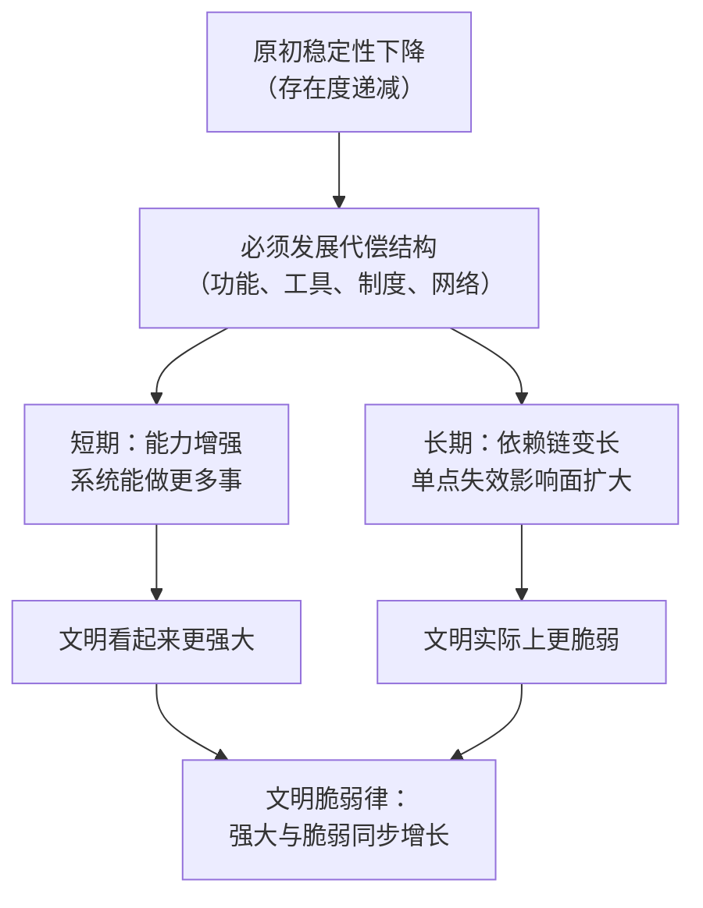
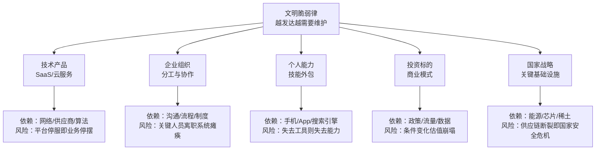
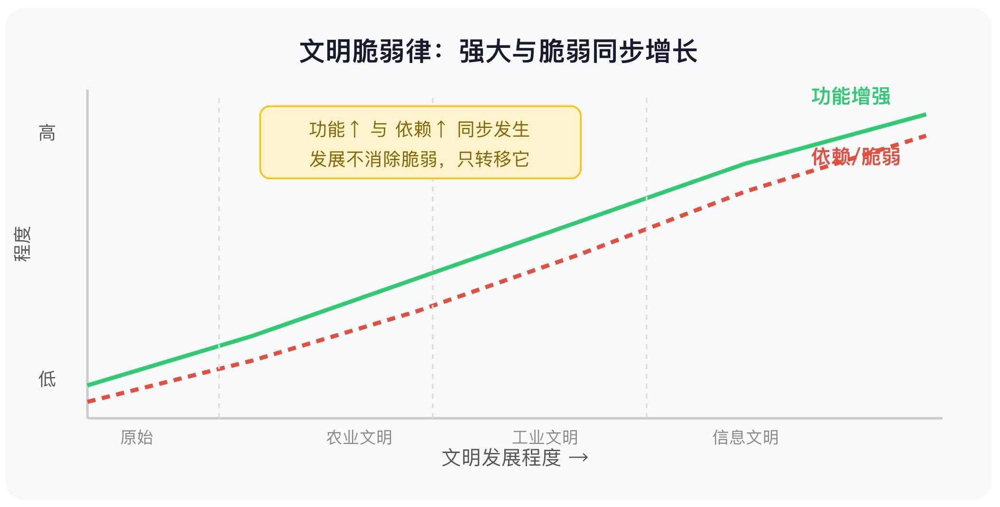

## 王东岳思维筑基课: 文明脆弱律：越发达，越需要维护

### 作者
digoal

### 日期
2026-05-18

### 标签
王东岳 , 文明脆弱律 , 文明系统 , 系统韧性 , 技术依赖 , 供应链 , 基础设施 , 风险管理 , 复杂社会 , 思维筑基

----

## 背景

> **一句话核心摘要**：文明能力越强，依赖的条件越多，任何一个环节断裂，都可能引发系统性崩溃——这不是悲观论，而是一条可以用来做决策的底层规律。

---

## 🔍 求真讲法：这条规律从哪里来？

### 背景与动机

你有没有想过这样一个问题：

古代游牧民族，一个人骑马就能跨越草原，带着全部家当迁徙。现代人出门旅行，却需要手机、充电宝、网络、银行卡、出行App、护照……少了任何一个，就可能在机场动弹不得。

我们分明变得"更强"了——更快、更远、更高效。可为什么感觉"越来越脆"？

王东岳在《物演通论》里给了一个系统性回答，他称之为**递弱代偿**原理。而**文明脆弱律**，正是这套哲学体系在文明演化层面的展开：

> **文明越发达，工具、制度、能源、信息网络越繁盛；但这也意味着任何单点故障都可能放大为系统性风险。**

这不是王东岳发明的，而是他从自然、生命、精神、社会的演化规律中**归纳**出来的，并给出了底层解释。

---

### 核心假设

要接受"文明脆弱律"，需要先接受以下几个前提：

- **假设 1**：每一代存在物（粒子→分子→细胞→动物→人→社会）的**原初稳定性是递减的**。越往后，越不能靠自身维持存在。
- **假设 2**：为了维持续存，存在物必须发展出更多**代偿属性**（结构、功能、工具、制度、网络）来补偿稳定性的下降。
- **假设 3**：代偿能让你继续存在，但**不能消除弱化本身**——它只是让你活下去，不是让你变得更"硬"。
- **假设 4**：代偿属性越多，对外部条件的**依赖链**越长，系统整体的**失稳成本**越高。

这四个假设加在一起，就产生了文明脆弱律：

```
发达 = 强功能 + 长依赖链 + 高失稳成本
```

> ⚠️ 注意：这些假设是哲学层面的元假设，不是已经完成实验验证的自然科学定律。它们是一套解释框架，而不是计算公式。

---

### 推导过程



用一个更具体的推导路线来看：

| 阶段 | 发生了什么 | 获得了什么 | 失去了什么 |
|------|-----------|------------|------------|
| 原始人 | 靠采集和狩猎 | 自给自足 | 效率极低 |
| 农业文明 | 依赖土地+季节+水源 | 粮食稳定 | 一旦旱涝即崩溃 |
| 工业文明 | 依赖煤炭+蒸汽+市场 | 大规模生产 | 能源断供即停摆 |
| 信息文明 | 依赖电力+网络+数据+算法 | 极高效率 | 任一节点故障即系统性危机 |

每一步都是**能力的增强**，但每一步也是**依赖链的延长**。

---

### 直觉理解

想象你在搭一座积木塔：

```
        [顶层：AI、算法]
       [云计算、数据中心]
      [互联网、光纤网络]
     [电力系统、发电站]
    [工业制造、供应链]
   [金融系统、货币体系]
  [政治制度、法律体系]
 [农业、食物、水资源]
[土地、气候、自然环境]
```

塔越搭越高，你能站在上面的高度越来越惊人——可以做到古人无法想象的事。

但是，**底层任何一块积木松动，上面全部倒塌**。

文明脆弱律说的就是这个：**塔越高，越不能动底层**。

---

## 🛠️ 求存讲法：这条规律能做什么？

### 核心用途

文明脆弱律不是要让人"回到原始"，而是提供一种**反直觉的分析视角**：

> 看到一个系统"功能更强"时，不只问它强在哪里，还要问它**弱在哪里**，需要依赖什么才能维持这种强。

这对四类人尤其有用：

- **产品经理**：你的产品依赖哪些基础设施？哪条依赖链最脆？
- **运营经理**：你的运营流程里，哪个单点故障会让整个系统瘫痪？
- **创业者**：你的商业模式依赖哪些外部条件？这些条件本身是否稳定？
- **投资者**：你投资的标的，代偿成本是否可持续？依赖链是否过于集中？

---

### 跨领域迁移

文明脆弱律的思想，可以迁移到很多我们日常接触的领域：



---

### 适用边界

| 情境 | 文明脆弱律成立吗？ | 备注 |
|------|-------------------|------|
| 高度分工的现代企业 | ✅ 成立 | 分工越细，单点风险越大 |
| 全球化供应链 | ✅ 成立 | 疫情/战争即刻暴露脆弱性 |
| 个人对数字工具的依赖 | ✅ 成立 | 手机没电时你还能做什么？ |
| 原始部落 | ❌ 成立但程度低 | 依赖链短，失稳成本低 |
| 孤立系统/自给自足 | ❌ 不典型 | 功能弱但韧性高 |
| "发展=倒退"的悲观结论 | ❌ 误读 | 规律描述的是两面性，不是否定发展 |

---

### ✅ 正例：生活、工作、投资中的真实案例

**例 1：2021 年全球芯片荒**

汽车、手机、家电行业因芯片短缺同步停产。芯片是现代工业文明最典型的"代偿节点"——一个厂商（台积电）的产能限制，让全球几十个行业集体陷入危机。这正是文明脆弱律的活教材：**越发达，对某个关键节点的依赖就越深**。

**例 2：SaaS 企业的 AWS 依赖**

很多互联网公司把核心业务部署在 AWS 上，一旦 AWS 某区域故障，大量知名 App 同步崩溃。这不是偶发事件，而是"高功能 = 高依赖"的结构性宿命。

**例 3：教育内卷与家庭脆弱化**

补习班、学区房、国际课程、才艺培训——这些都是面向升学竞争的代偿结构。代偿越重，家庭的财务压力、时间压力越大，生育意愿反而下降。教育系统功能增强了，但家庭系统的稳定性却在下降。

**例 4：个人技能的"App化"**

你还记得怎么用纸质地图找路吗？还会心算大额分账吗？我们把越来越多的基础能力外包给 App，效率确实提升了，但一旦手机没电或没有网络，很多现代人会陷入真实的无助。

**例 5：投资中的"护城河陷阱"**

很多人以为平台类企业护城河宽、壁垒高，但平台依赖的是：用户规模、网络效应、监管友好、数据垄断。一旦政策收紧（如中国互联网监管收严）或技术路线变化（如 AI 替代搜索），护城河瞬间变成负债。**越强大的平台，失守时跌得越快**。

---

### ❌ 反例：当假设不成立时

**反例 1：把"脆弱"等于"应该拒绝发展"**

有人读完文明脆弱律，得出结论："现代文明不值得发展，不如回归田园。"

这是错误的迁移。文明脆弱律描述的是**两面性**，不是价值判断。依赖链的增长是发展的必然伴随物，正确应对是**识别脆弱点并做冗余备份**，而不是停止发展。

**反例 2：忽略系统的自修复能力**

文明脆弱律强调失稳风险，但真实的复杂系统也有自修复机制——生物免疫系统、市场的价格机制、互联网的路由冗余。把"脆弱"理解为"必然崩溃"是过度悲观，现实中许多系统在局部断裂后能重组。

**反例 3：把哲学框架当科学预测**

"这家公司依赖太多，所以一定会崩"——这种推断跳跃太大。文明脆弱律是识别风险结构的工具，不是预测具体时间节点的算法。投资决策还需要结合财务数据、行业趋势、管理层能力等实证信息。

---

## 💡 思考：值得深究的问题

1. **你自己的"依赖链"有多长？**
   如果明天手机、网络、银行系统同时失效，你还能维持基本生活多少天？这个数字，就是你个人层面的"文明脆弱度"。

2. **"抗脆弱"是否真的可能？**
   塔勒布在《反脆弱》里说，有些系统不只能抵御冲击，还能从冲击中变得更强。这与文明脆弱律是矛盾的吗？还是说它们描述的是不同层面的现象？

3. **AI 是新的代偿，还是新的脆弱点？**
   AI 提升了人类的信息处理和决策效率，但同时让更多决策依赖算法、数据、算力。当 AI 模型出现系统性偏差时，会不会制造一场"智能文明的脆弱危机"？

4. **为什么人类明知依赖越深越危险，还是无法停止？**
   这是个体理性和集体行为之间的悖论——每个企业单独看都在做"正确的降成本决策"，但集体结果是整个供应链的脆弱化。这是市场失灵，还是文明本身的必然宿命？

5. **如何在"高功能"和"高韧性"之间找到平衡？**
   投资一家公司、选择一种生活方式、设计一套系统——如何判断它的代偿成本是否合理，依赖链是否过长？有没有可操作的评估框架？

---

## 一张图记住全部


<svg viewBox="0 0 600 300" xmlns="http://www.w3.org/2000/svg" font-family="sans-serif">
  <!-- 背景 -->
  <rect width="600" height="300" fill="#f8f9fa" rx="12"/>
  <!-- 标题 -->
  <text x="300" y="32" text-anchor="middle" font-size="16" font-weight="bold" fill="#1a1a2e">文明脆弱律：强大与脆弱同步增长</text>
  <!-- 左轴标签 -->
  <text x="20" y="80" font-size="11" fill="#555">高</text>
  <text x="20" y="230" font-size="11" fill="#555">低</text>
  <!-- X轴 -->
  <line x1="50" y1="250" x2="570" y2="250" stroke="#ccc" stroke-width="1.5"/>
  <text x="310" y="278" text-anchor="middle" font-size="12" fill="#555">文明发展程度 →</text>

  <!-- Y轴 -->
  <line x1="50" y1="50" x2="50" y2="250" stroke="#ccc" stroke-width="1.5"/>
  <text x="14" y="155" font-size="11" fill="#555" transform="rotate(-90,14,155)">程度</text>
  <!-- 功能增强曲线（上升） -->
  <polyline points="50,230 150,200 250,165 350,130 450,95 560,65"
            fill="none" stroke="#2ecc71" stroke-width="2.5" stroke-dasharray="0"/>
  <text x="490" y="58" font-size="12" fill="#2ecc71" font-weight="bold">功能增强</text>
  <!-- 脆弱性增长曲线（也上升，略低） -->
  <polyline points="50,240 150,215 250,185 350,150 450,112 560,78"
            fill="none" stroke="#e74c3c" stroke-width="2.5" stroke-dasharray="5,4"/>
  <text x="490" y="95" font-size="12" fill="#e74c3c" font-weight="bold">依赖/脆弱</text>
  <!-- 阶段标注 -->
  <line x1="130" y1="55" x2="130" y2="250" stroke="#ddd" stroke-width="1" stroke-dasharray="3,3"/>
  <text x="70" y="265" font-size="10" fill="#888">原始</text>
  <line x1="260" y1="55" x2="260" y2="250" stroke="#ddd" stroke-width="1" stroke-dasharray="3,3"/>
  <text x="195" y="265" font-size="10" fill="#888">农业文明</text>
  <line x1="390" y1="55" x2="390" y2="250" stroke="#ddd" stroke-width="1" stroke-dasharray="3,3"/>
  <text x="308" y="265" font-size="10" fill="#888">工业文明</text>
  <text x="430" y="265" font-size="10" fill="#888">信息文明</text>
  <!-- 核心注解 -->
  <rect x="155" y="60" width="195" height="44" rx="6" fill="#fff3cd" stroke="#ffc107" stroke-width="1"/>
  <text x="252" y="78" text-anchor="middle" font-size="11" fill="#856404">功能↑ 与 依赖↑ 同步发生</text>
  <text x="252" y="96" text-anchor="middle" font-size="11" fill="#856404">发展不消除脆弱，只转移它</text>
</svg>
  
  


---

## 📚 延伸阅读

- **王东岳《物演通论》**：本律的哲学根源，尤其第十九章和第三十章，系统推导递弱代偿体系。
- **纳西姆·塔勒布《反脆弱》**：与文明脆弱律形成对话——什么样的系统能在冲击中变强？两者一起读，视角更完整。
- **贾雷德·戴蒙德《崩溃》**：历史上文明崩溃的案例研究，印证了依赖链断裂导致文明失存的真实轨迹。

---

*本文基于王东岳《物演通论》的递弱代偿框架整理，面向大学生、产品经理、运营经理及有投资需求的读者。文明脆弱律是哲学解释框架，不替代自然科学或社会科学的实证研究。*
  
#### [PostgreSQL 解决方案集合](../201706/20170601_02.md "40cff096e9ed7122c512b35d8561d9c8")
  
  
#### [德哥 / digoal's Github - 公益是一辈子的事.](https://github.com/digoal/blog/blob/master/README.md "22709685feb7cab07d30f30387f0a9ae")
  
  
#### [About 德哥](https://github.com/digoal/blog/blob/master/me/readme.md "a37735981e7704886ffd590565582dd0")
  
  

  
