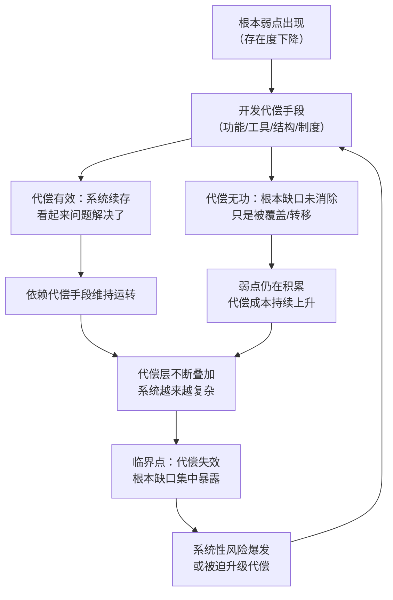
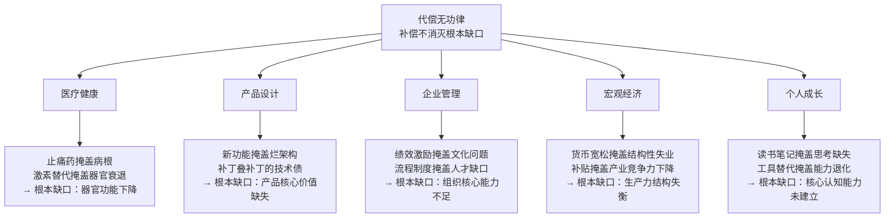
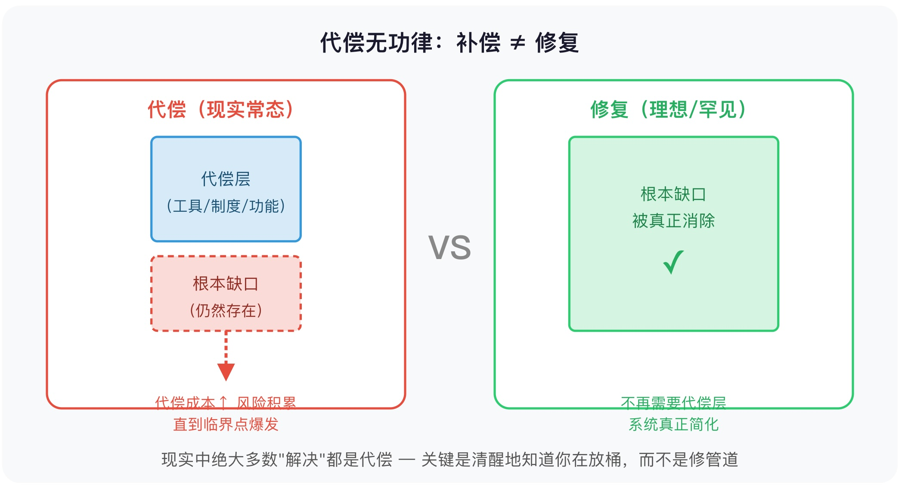

## 王东岳思维筑基课: 代偿无功律：补偿不能消灭根本缺口

### 作者
digoal

### 日期
2026-05-18

### 标签
王东岳 , 代偿无功律 , 根本缺口 , 递弱代偿 , 依赖转移 , 系统风险 , 工具代偿 , 文明反思 , 存在论 , 思维筑基

----

## 背景


> **一句话核心摘要**：你能用代偿手段让自己继续撑下去，但你无法用代偿手段消灭让你需要代偿的那个根本弱点——这不是失败，而是一条支配所有系统的底层规律。

---

## 🔍 求真讲法：这条规律从哪里来？

### 背景与动机

你有没有遇到过这些情况：

- 配了眼镜，近视并没有好转，反而度数越来越深
- 公司引入了更多管理层，沟通成本反而上升了
- 政府补贴了新能源汽车，石油依赖并没有消失，电力依赖悄悄接班
- 吃了止痛药，疼痛消失了——但造成疼痛的病根还在那里

这些现象背后有一条共同的规律。王东岳在《物演通论》里把它系统化，称之为**代偿无功律**：

> **代偿可以让弱者继续存在，却不能消除弱化本身。**

代偿（compensation），字面意思是"用别的东西来填补"。代偿无功，不是说代偿没用——眼镜确实让你看清楚了，止痛药确实让你不那么痛了。它说的是：**代偿的功效止步于"续存"，它无法溯源消灭产生需求的那个根本缺口。**

这条规律不只是医学现象，而是贯穿自然、生命、社会、文明演化的底层逻辑。

---

### 核心假设

要理解代偿无功律，需要先接受以下前提：

- **假设 1**：存在物（粒子、生命、组织、文明）的原初稳定性是不断递减的——越后衍的存在物，自身越难稳定维持。
- **假设 2**：为了续存，存在物必须发展出代偿属性（结构、功能、工具、制度、网络）来补偿这种不稳定。
- **假设 3**：代偿属性的增加，**不等于原初稳定性的恢复**——它只是叠加了新能力，无法逆转已经下降的根基。
- **假设 4**：原初缺口（根本弱点）持续存在，甚至因代偿结构的叠加而被掩盖，不易被察觉，但不会消失。

这四个假设合在一起，得出代偿无功律的核心命题：

```
代偿 ≠ 修复
代偿 = 在原有缺口上盖一层能用的东西
缺口本身 = 始终存在，且可能在代偿层累积到临界时集中爆发
```

> ⚠️ 同样需要声明：这是哲学层面的元假设，是王东岳用来统一解释自然与社会演化的框架，而非已完成实验验证的自然科学公理。接受这套假设，才能进入这套逻辑体系。

---

### 推导过程



用更直观的对比来看：

| 对比维度 | 修复（Repair） | 代偿（Compensation） |
|----------|--------------|-------------------|
| 作用对象 | 根本缺口本身 | 缺口产生的症状/影响 |
| 结果 | 缺口消除，不再需要补偿 | 缺口仍在，需要持续补偿 |
| 对系统的影响 | 简化，恢复原初稳定 | 复杂化，叠加新依赖 |
| 现实中的案例 | 极少——多数"修复"其实是代偿 | 大多数技术、制度、政策都是代偿 |

---

### 直觉理解

想象你的浴室水管漏水：

```
❌ 代偿做法：
   在漏水处放一个桶 → 水不会漫到地板了
   → 但水管还在漏，你每天要倒桶
   → 桶满了你忘记倒 → 淹了地板

✅ 修复做法：
   找到漏水原因，换掉破损管段
   → 根本缺口消除，不需要桶了
```

现实中，绝大多数"解决方案"都是**放桶**——让问题不那么显眼，而不是修管道。

因为修管道往往更难、更贵、有时候在当前技术条件下根本做不到。所以代偿是理性选择——但必须清醒地知道：**你放的是桶，不是修了管道**。

---

## 🛠️ 求存讲法：这条规律能做什么？

### 核心用途

代偿无功律的最大价值，是帮你**区分"真正解决"和"暂时压住"**。

这在以下四类场景中尤其重要：

- **产品经理**：功能迭代是在解决根本问题，还是在用新功能掩盖产品底层缺陷？
- **运营经理**：发奖励、搞活动是在提升真实用户价值，还是在用激励掩盖留存率下降的本质原因？
- **创业者**：融资续命是在赢得时间做正确的事，还是在用钱推迟面对商业模式的根本漏洞？
- **投资者**：这家公司靠政策补贴/流量红利续命，还是真的有可持续的竞争优势？

---

### 跨领域迁移



---

### 适用边界

| 情境 | 代偿无功律适用吗？ | 说明 |
|------|-------------------|------|
| 医疗/生理层面的慢性病管理 | ✅ 高度适用 | 大多数慢性病是管理而非治愈 |
| 企业用补贴拉用户 | ✅ 高度适用 | 补贴停止即留存崩溃 |
| 技术债管理 | ✅ 高度适用 | 补丁叠加直到系统重写 |
| 急性危机的应急处置 | ⚠️ 部分适用 | 短期代偿是必要的，但不能当长期策略 |
| 真正的技术突破/范式转移 | ❌ 不适用 | 如果新技术真正解决了根本问题，那不是代偿，是修复 |
| "发展=放弃代偿"的激进结论 | ❌ 误读 | 代偿是演化的必然形态，问题是要清醒地知道自己在代偿 |

---

### ✅ 正例：真实场景中的代偿无功

**例 1：教育培训 App 的留存陷阱**

某在线教育 App 发现用户7日留存低，解决方案是：打卡签到领积分、限时优惠券、学习排行榜。留存数据好看了，但用户真实的学习完成率依然在 5% 以下。

根本缺口是：**课程内容没有解决用户真正的学习动力问题**。
代偿手段（积分、排行）让数据好看，没有让学习真正发生。
最终结局：用户薅完羊毛走人，代偿成本越来越高，商业模式无法持续。

---

**例 2：共享单车的"运维代偿"困局**

共享单车的根本缺口是：**单车的物理磨损、用户乱停、乱骑无法被商业模式内化**。
代偿手段：增加运维人员、App 报修流程、押金制度、信用分系统。
代偿无功：每一层代偿都增加了运营成本，却没有消除"单车会坏、会乱放"这个物理事实。
最终：所有玩家都陷入代偿成本的泥潭，没有盈利。

---

**例 3：国企改革的"制度代偿"循环**

每次发现国有企业效率低下，解决方案是：增加考核指标、引入绩效奖金、设立督察组、推行信息化系统。
根本缺口是：**所有权结构决定了激励机制的根本错位**，这个缺口制度层面的代偿无法消除。
代偿层叠加越多，管理系统越复杂，根本问题越被遮盖。

---

**例 4：投资中的"故事代偿"**

一家公司核心业务增长停滞，路演时讲的是：AI转型、出海战略、元宇宙布局……
这些新叙事，是在用"增长故事"代偿"核心业务衰退"这个根本缺口。
代偿无功律提示投资者：**先问核心业务的根本缺口是什么，再评估新故事能否真正修复它，还是只是让估值撑更久一点。**

---

**例 5：个人用"工具"代偿"能力"**

你用 AI 写报告——效率确实提升了。但如果你的结构化思维、判断力、表达逻辑从来没有建立，AI 是在代偿这个能力缺口，而不是在消除它。

一旦 AI 消失（或你在没有工具的场合需要当众表达），根本缺口立刻暴露。

---

### ❌ 反例：当假设不成立时

**反例 1："既然代偿无功，索性不代偿"**

有人读完这条规律，得出结论：代偿没有意义，不如直面根本问题。

这是错误的。很多根本缺口**在当前技术/认知条件下根本无法修复**。
眼镜不能治近视，但你不能为了"拒绝代偿"而不戴眼镜。
代偿无功律的意义是：**清醒地知道你在代偿，而不是停止代偿**。

**反例 2：把"代偿"和"进步"混为一谈**

技术真正解决了某个根本问题时，那不是代偿，是修复。比如疫苗真正消灭了天花，不是在"代偿"免疫缺陷，而是在生物层面消除了致病源。

代偿无功律不否认真正的修复存在，它说的是：**大多数我们以为是"解决"的东西，其实只是代偿**。如何区分两者，正是这条规律的实用价值所在。

**反例 3：把哲学框架当成精准预测工具**

"这家公司在代偿，所以一定会倒"——这种推断跳跃太大。代偿可以持续很久，有些代偿结构极其稳定（比如货币制度）。这条规律是**风险识别框架**，不是时间节点预测器。

---

## 💡 思考：值得深究的问题

1. **你生活里哪些"解决方案"其实是代偿？**
   你用来应对工作压力的方法（刷短视频、喝咖啡、换工作），有没有真正消除压力的根源？还是在持续放桶？

2. **代偿的临界点在哪里？**
   代偿层叠到多厚，根本缺口才会"穿透"代偿层爆发出来？有没有方法在临界点到来之前识别信号？

3. **"技术进步"究竟有多少是真正的修复，有多少只是更高效的代偿？**
   互联网代偿了信息不对称，但信息过载的新缺口随之而来。AI 代偿了人类的信息处理瓶颈，但判断力和批判性思维的缺口是否在扩大？

4. **对一家公司来说，如何判断它的护城河是真实竞争优势，还是代偿叠加的幻觉？**
   当补贴停止、政策收紧、技术路线切换时，还剩下什么？

5. **如果代偿无法消除根本缺口，那么什么样的努力才算是"真正的改变"？**
   对个人成长来说，这个问题尤其值得思考：你在建立核心能力，还是在用工具和方法论代偿核心能力的缺失？

---

## 一张图记住全部


<svg viewBox="0 0 600 320" xmlns="http://www.w3.org/2000/svg" font-family="sans-serif">
  <!-- 背景 -->
  <rect width="600" height="320" fill="#f8f9fa" rx="12"/>
  <!-- 标题 -->
  <text x="300" y="30" text-anchor="middle" font-size="15" font-weight="bold" fill="#1a1a2e">代偿无功律：补偿 ≠ 修复</text>
  <!-- 左侧：代偿模型 -->
  <rect x="30" y="50" width="240" height="220" rx="10" fill="#fff" stroke="#e74c3c" stroke-width="1.5"/>
  <text x="150" y="74" text-anchor="middle" font-size="13" font-weight="bold" fill="#e74c3c">代偿（现实常态）</text>
  <!-- 桶 + 漏水示意 -->
  <rect x="100" y="88" width="100" height="70" rx="4" fill="#d6eaf8" stroke="#3498db" stroke-width="1.5"/>
  <text x="150" y="120" text-anchor="middle" font-size="11" fill="#1a5276">代偿层</text>
  <text x="150" y="138" text-anchor="middle" font-size="10" fill="#1a5276">（工具/制度/功能）</text>
  <!-- 裂缝 -->
  <rect x="100" y="168" width="100" height="50" rx="4" fill="#fadbd8" stroke="#e74c3c" stroke-width="1.5" stroke-dasharray="4,3"/>
  <text x="150" y="190" text-anchor="middle" font-size="11" fill="#922b21">根本缺口</text>
  <text x="150" y="208" text-anchor="middle" font-size="10" fill="#922b21">（仍然存在）</text>
  <!-- 向下箭头（缺口渗漏） -->
  <line x1="150" y1="218" x2="150" y2="240" stroke="#e74c3c" stroke-width="2" stroke-dasharray="3,2"/>
  <polygon points="144,240 156,240 150,252" fill="#e74c3c"/>
  <text x="150" y="270" text-anchor="middle" font-size="10" fill="#e74c3c">代偿成本↑ 风险积累</text>
  <text x="150" y="284" text-anchor="middle" font-size="10" fill="#e74c3c">直到临界点爆发</text>
  <!-- 右侧：修复模型 -->
  <rect x="330" y="50" width="240" height="220" rx="10" fill="#fff" stroke="#2ecc71" stroke-width="1.5"/>
  <text x="450" y="74" text-anchor="middle" font-size="13" font-weight="bold" fill="#27ae60">修复（理想/罕见）</text>
  <!-- 完整结构 -->
  <rect x="380" y="88" width="140" height="130" rx="4" fill="#d5f5e3" stroke="#2ecc71" stroke-width="1.5"/>
  <text x="450" y="130" text-anchor="middle" font-size="11" fill="#1e8449">根本缺口</text>
  <text x="450" y="148" text-anchor="middle" font-size="11" fill="#1e8449">被真正消除</text>
  <text x="450" y="180" text-anchor="middle" font-size="22" fill="#27ae60">✓</text>
  <text x="450" y="270" text-anchor="middle" font-size="10" fill="#27ae60">不再需要代偿层</text>
  <text x="450" y="284" text-anchor="middle" font-size="10" fill="#27ae60">系统真正简化</text>
  <!-- 中间 vs -->
  <text x="300" y="170" text-anchor="middle" font-size="22" font-weight="bold" fill="#888">VS</text>
  <!-- 底部提示 -->
  <text x="300" y="308" text-anchor="middle" font-size="11" fill="#555">现实中绝大多数"解决"都是代偿 — 关键是清醒地知道你在放桶，而不是修管道</text>
</svg>
  
  


---

## 📚 延伸阅读

- **王东岳《物演通论》**：代偿无功律的哲学根源，尤其"代偿有效性与无效性"两重性的系统阐述。
- **纳西姆·塔勒布《反脆弱》**：从另一视角思考：哪些系统能把冲击转化为成长？与代偿无功律对话，形成更立体的风险认知。
- **克莱顿·克里斯坦森《创新者的窘境》**：成熟企业用"制度代偿"掩盖创新能力缺失的典型案例集，是代偿无功律在商业领域的实证研究。

---

*本文基于王东岳《物演通论》的递弱代偿框架整理，面向大学生、产品经理、运营经理及有投资需求的读者。代偿无功律是哲学解释框架，不替代自然科学或社会科学的实证研究。*
  
#### [PostgreSQL 解决方案集合](../201706/20170601_02.md "40cff096e9ed7122c512b35d8561d9c8")
  
  
#### [德哥 / digoal's Github - 公益是一辈子的事.](https://github.com/digoal/blog/blob/master/README.md "22709685feb7cab07d30f30387f0a9ae")
  
  
#### [About 德哥](https://github.com/digoal/blog/blob/master/me/readme.md "a37735981e7704886ffd590565582dd0")
  
  

  
