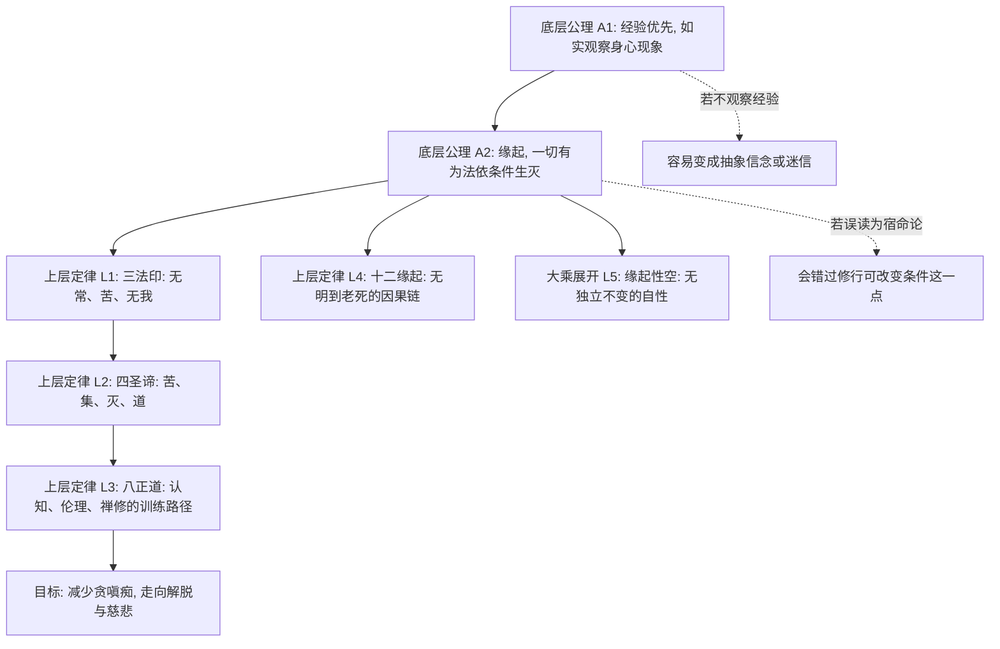

## 佛学思维筑基课: 佛学思想的底层公理和经典上层定律: 从缘起看懂整套系统

### 作者
digoal

### 日期
2026-05-18

### 标签
佛学 , 缘起 , 公理 , 三法印 , 四圣谛 , 八正道 , 空性 , 无我 , 苦 , 修行

----

## 背景

> 面向对象: 高中生到普通读者  
> 核心问题: 佛学思想看起来有很多名词: 缘起、无常、无我、苦、四圣谛、八正道、空性、业力。它们到底谁是底层, 谁是推论?  
> 先说结论: 如果用现代知识体系来重构, 佛学的底层公理可以概括为“经验可观察、万法依条件而起、执著会制造苦、苦的机制可以被修正”。经典上层定律则是这些公理展开后的诊断模型和修行路径, 例如三法印、四圣谛、十二缘起、八正道、空性。

说明: “公理”和“定律”不是佛教传统的原生分类, 这里是为了学习而做的结构化重述。佛教内部有早期佛教、部派佛教、大乘中观、唯识、禅宗、净土等不同传统, 下文抓的是各传统中较核心、较可迁移的共同骨架。

## 一张图先看懂



## 求真讲法

### 它到底说了什么

把佛学当作一套“苦的诊断与改造系统”来看, 它的核心不是先证明宇宙由什么实体构成, 而是追问:

1. 人为什么会不安、焦虑、执著、痛苦?
2. 这些痛苦是不是有条件、有机制?
3. 如果条件被看清并改变, 痛苦能不能减少甚至止息?
4. 怎样训练认知、行为和注意力, 才能改变这套机制?

因此, 佛学不是只讲“相信什么”, 而是讲“观察什么、理解什么、训练什么、放下什么”。

### 底层公理: 六个基本预设

| 编号 | 教学性公理 | 通俗解释 | 对应经典思想 |
|---|---|---|---|
| A1 | 经验优先公理 | 从身心经验出发, 观察痛苦、欲望、注意力、行为后果 | 如实知见、正见 |
| A2 | 缘起公理 | 任何现象都不是孤立自生, 而是依条件出现、依条件消失 | 缘起、因缘 |
| A3 | 无常公理 | 依条件而生的事物必然变化, 不能永久保持同一状态 | 诸行无常 |
| A4 | 非我公理 | 身心不是一个永恒、独立、绝对可控的“我”; 它更像五类过程的组合 | 无我、五蕴 |
| A5 | 苦的机制公理 | 把无常、非我的东西误认成“我”和“我所有”, 就会产生抓取、失落和不安 | 苦、取、爱 |
| A6 | 可修正公理 | 痛苦既然依条件而生, 就能通过改变条件而减少; 修行不是祈求, 而是训练 | 灭谛、道谛、八正道 |

这六条里, 最像“总公理”的是 A2: 缘起。它的意思可以压缩成一句话: 有这个条件, 才有那个结果; 条件变了, 结果也会变。

### 上层定律: 由公理推出的经典命题

| 上层定律 | 从哪些公理推出 | 它解决什么问题 |
|---|---|---|
| 三法印 | A2 + A3 + A4 + A5 | 判断一种认识是否符合佛法核心: 无常、苦、无我 |
| 四圣谛 | A5 + A6 | 把人生问题变成诊断模型: 苦是什么、原因是什么、能否止息、路径是什么 |
| 十二缘起 | A2 + A5 | 细化痛苦如何从无明、行、识、名色、六入、触、受、爱、取、有、生、老死逐步展开 |
| 八正道 | A1 + A6 | 给出可训练路径: 正见、正思维、正语、正业、正命、正精进、正念、正定 |
| 业力法则 | A2 + A5 | 说明意图、行为、习惯会反过来塑造未来经验和人格倾向 |
| 中道 | A1 + A6 | 避免两个极端: 放纵感官和自我折磨; 避免常见和断见 |
| 缘起性空 | A2 + A4 | 大乘尤其是中观的展开: 既然诸法依条件成立, 就没有独立不变的自性 |
| 慈悲与不害 | A4 + A5 + A6 | 既然“我”和“他者”都在苦的条件链中, 修行自然转向减苦和利他 |

### 它是怎么来的

佛学的推理链大致是这样:

```text
观察: 人会老、病、死, 会失去所爱, 会求不得, 会被欲望牵引
  ↓
追问: 苦是不是偶然事件?
  ↓
发现: 苦依赖条件, 尤其依赖无明、贪爱、执取
  ↓
推广: 一切有为法都依条件生灭, 因此无常、不可绝对主宰
  ↓
诊断: 把无常过程误认成固定的“我”和“我所有”, 苦就会反复发生
  ↓
治疗: 改变认知、行为、注意力和欲望结构, 苦的条件链可以被削弱
```

所以, 四圣谛不是悲观口号, 更像医学模型:

| 医学模型 | 佛学模型 | 含义 |
|---|---|---|
| 症状 | 苦谛 | 先承认不安、失控、缺憾真实存在 |
| 病因 | 集谛 | 苦不是无缘无故, 主要由无明、贪爱、执取聚合而成 |
| 康复可能 | 灭谛 | 如果病因能被去除, 苦可以止息 |
| 治疗方案 | 道谛 | 用八正道训练认知、伦理和禅定 |

### 它依赖哪些假设

第一, 它假设人的痛苦不是纯粹外部事件, 而与认知、欲望、注意力和行为习惯有关。

第二, 它假设身心可以被观察和训练。没有这个假设, 正念、禅定、持戒、智慧都失去意义。

第三, 它假设因果不是机械宿命。缘起不是“注定如此”, 而是“依条件如此”。条件可变, 所以修行有意义。

第四, 它假设“我”的直觉需要被检查。佛学不是简单否认日常语言中的“我”, 而是否认一个永恒、独立、绝对主宰的实体我。

### 常见误解

误解一: “无常”就是消极。  
不对。无常既意味着失去, 也意味着改变可能。坏习惯能改, 痛苦能减, 关系能修复, 都因为无常。

误解二: “无我”就是我不存在。  
不对。佛学否定的是永恒独立的实体我, 不是否定日常层面的责任、人格、记忆和行动。

误解三: “业力”就是命中注定。  
不对。业力更接近“有意图的行为会形成后果和倾向”。如果它是宿命, 修行就没有意义。

误解四: “空”是什么都没有。  
不对。空不是虚无, 而是无自性: 事物不是独立不变地存在, 而是在条件关系中暂时成立。

## 求存讲法

### 它有什么用

佛学的底层结构最有用的地方, 是把人生问题从“我为什么这么倒霉”改写成“哪些条件正在制造这个结果”。

这会带来三个转变:

1. 从责怪命运, 转向分析条件。
2. 从压抑情绪, 转向观察情绪如何产生。
3. 从追求绝对控制, 转向训练对变化的清醒回应。

### 它怎么迁移到熟悉领域

学习中, “我就是学不会”是实体化的自我判断; 用缘起来看, 它变成“方法、时间、反馈、注意力、情绪、环境这些条件哪里不对”。

工作中, “这个人就是讨厌我”是固定化叙事; 用缘起来看, 它变成“沟通信息、利益压力、角色期待、历史误会这些条件如何互动”。

亲密关系中, “你应该永远这样对我”违背无常; 用无常来看, 关系需要持续维护, 不能靠一次承诺冻结未来。

情绪管理中, “我很愤怒所以必须立刻行动”忽略了触、受、爱、取的链条; 用十二缘起来看, 愤怒从感受发展到执取之前, 有观察和停顿的空间。

### 它的适用范围和边界

佛学适合处理痛苦、执著、欲望、注意力、伦理行为、生命无常等问题。它不应该被粗暴替代为医学、法律、工程、经济学或自然科学结论。

例如, 抑郁症、焦虑症等严重心理问题不能只靠“看破放下”处理, 需要专业医疗和心理支持。缘起的正确用法不是否定疾病, 而是承认疾病也有生理、心理、社会等条件。

再比如, 面对不公, “无我”和“放下”不能被用来要求受害者沉默。佛学中的慈悲、不害、正语、正业, 反而要求减少伤害的条件。

### 正例: 怎么用它提升能力

假设一个学生考试失利。他可以有两种解释:

| 解释方式 | 结果 |
|---|---|
| 实体化解释: “我太笨了, 我不行。” | 把暂时结果当成本质, 增加羞耻和逃避 |
| 缘起式解释: “复习策略、睡眠、错题反馈、考试焦虑共同造成了这次结果。” | 找到可改变条件, 下次调整行动 |

这就是缘起的现实价值: 它不让人逃避责任, 也不让人把自己钉死在一次失败里。

### 反例: 前提不成立会怎样

如果一个人把“空”误解为“反正什么都没有意义”, 他可能逃避承诺、伤害他人、放弃行动。这不是空性, 而是虚无主义。

它失败的原因是: 空性依赖缘起公理。既然一切依条件互相影响, 行为当然有后果; 正因为没有孤立自足的个体, 才更需要谨慎对待自己和他人的痛苦。

## 思考

如果用一句现代话概括佛学, 可以说: 它是一套关于“条件如何制造痛苦, 以及如何改变条件”的实践哲学。

它最锋利的地方, 不是告诉你“人生很苦”, 而是告诉你: 苦不是铁板一块。苦有结构, 有入口, 有燃料, 有熄灭燃料的方法。

可以继续思考三个问题:

1. 如果“我”不是固定实体, 那责任还成立吗? 佛学的回答是: 成立, 但责任落在因果连续和行为后果上, 不是落在永恒灵魂上。
2. 如果一切无常, 爱还有意义吗? 佛学的回答是: 正因为无常, 爱才需要清醒、慈悲和不占有。
3. 如果一切皆空, 为什么还要努力? 佛学的回答是: 空不是没有因果, 而是没有固定本质; 正因为没有固定本质, 努力才可能改变结果。

## 最后记住

1. 佛学的底层公理不是“相信神秘力量”, 而是“观察经验、承认缘起、看见执著如何制造苦”。
2. 缘起是总枢纽: 条件生, 现象生; 条件灭, 现象灭。
3. 三法印是世界观: 无常、苦、无我。
4. 四圣谛是诊断法: 苦、集、灭、道。
5. 八正道是训练法: 用正见、伦理行为和禅修改变苦的条件链。

## 参考资料

- 《杂阿含经》, CBETA 电子佛典集成, 尤其缘起、五蕴、无常、无我相关经文: https://tripitaka.cbeta.org/T02n0099_012
- 《南传转法轮经》, CBETA 电子佛典集成, 四圣谛与八正道相关内容: https://tripitaka.cbeta.org/B07n0010_001
- *Dhammacakkappavattana Sutta*, SN 56.11, SuttaCentral/Dhammatalks 版本, 四圣谛与八正道: https://dhammatalks.net/suttacentral/sc2016/sc/en/sn56.11.html
- Encyclopaedia Britannica, “The Four Noble Truths”: https://www.britannica.com/topic/Four-Noble-Truths
- Encyclopaedia Britannica, “Buddhism - The Four Noble Truths”: https://www.britannica.com/topic/Buddhism/The-Four-Noble-Truths
  
#### [PostgreSQL 解决方案集合](../201706/20170601_02.md "40cff096e9ed7122c512b35d8561d9c8")
  
  
#### [德哥 / digoal's Github - 公益是一辈子的事.](https://github.com/digoal/blog/blob/master/README.md "22709685feb7cab07d30f30387f0a9ae")
  
  
#### [About 德哥](https://github.com/digoal/blog/blob/master/me/readme.md "a37735981e7704886ffd590565582dd0")
  
  

  
