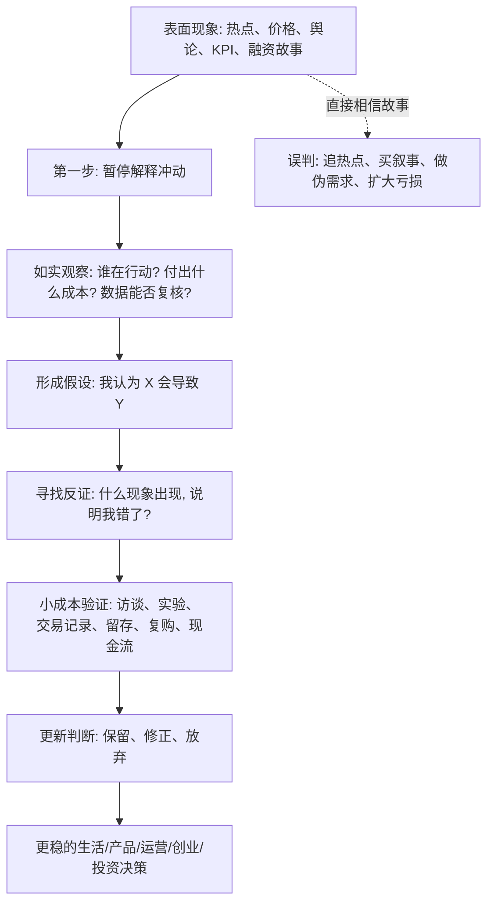

## 佛学思维筑基课: 经验优先与如实观察: 在变化世界里抓住判断的地基

### 作者
digoal

### 日期
2026-05-18

### 标签
经验优先 , 如实观察 , 认识论 , 事实判断 , 可证伪 , 小成本验证 , 产品经理 , 运营增长 , 创业决策 , 投资判断

----

## 背景

> 面向对象: 大学生、产品经理、运营经理、有投资需求的人  
> 核心问题: 世界表面变化太快, 热点、概念、价格、流量、舆论天天变。只看表象, 很容易把噪声当趋势, 把故事当事实, 把运气当能力。  
> 先说结论: “经验优先与如实观察”是一条底层认识论公理: 判断先回到可观察事实、真实行为、可重复反馈和可被证伪的假设, 再谈解释、预测和决策。它不能保证你永远正确, 但能显著减少被叙事、情绪和短期波动欺骗的概率。

说明: 这里的“公理”是教学性重构, 不是说它在逻辑上不需要讨论。它的意思是: 在生活、产品、运营、创业、投资这些不确定场景里, 如果不把经验事实放在第一位, 后面的模型、判断、战略和预测都会失去地基。

## 一张图先看懂



## 求真讲法

### 它到底说了什么

“经验优先”不是“我经历过所以我一定对”。这句话容易误导。

它真正说的是: 当一个判断关系到现实结果时, 应该优先看可观察、可验证、可复核的经验材料, 而不是先相信概念、权威、情绪、愿望或漂亮故事。

“如实观察”也不是冷冰冰地记录一切细节。它要求你尽量把事实和解释分开:

| 层次 | 例子 | 风险 |
|---|---|---|
| 事实 | 这个功能上线 7 天, 新用户次日留存从 18% 到 23% | 仍需排除样本、渠道、季节等干扰 |
| 解释 | 用户更喜欢新版功能 | 可能对, 也可能只是流量来源变了 |
| 判断 | 应该加大投入 | 需要看成本、长期留存、转化、复购和战略目标 |
| 叙事 | 我们找到了增长飞轮 | 最容易过度包装 |

这条公理可以写成一句更硬的话:

> 任何重要判断, 都要能回到“观察到了什么、付出了什么成本、排除了哪些反例、还能怎样被证伪”。

### 它是怎么来的

人类大脑天生喜欢故事, 不喜欢混乱。看到上涨, 我们会找上涨理由; 看到成功, 我们会倒推成功方法; 看到别人赚钱, 我们会觉得自己也能复制。

问题是, 现实世界里有大量噪声:

```text
真实规律 + 随机波动 + 幸存者偏差 + 利益包装 + 情绪传播 + 数据口径
        ↓
      表面现象
        ↓
  人脑自动编故事
        ↓
  过度自信的判断
```

所以, 经验优先不是为了否定理论, 而是为了给理论上锁: 没有经验约束的理论会飘, 没有理论组织的经验会乱。

它和科学方法、经验主义、精益创业、价值投资中的一些思想相通:

- 科学方法强调观察、假设、检验和修正。
- 经验主义强调知识与经验之间的关系。
- 精益创业强调用实验和用户反馈获得有效学习。
- 投资中的能力圈和安全边际, 本质上也是承认自己不能只靠故事判断未来。

### 它依赖哪些假设

第一, 现实会留下痕迹。人的需求会体现在搜索、询问、付费、复购、抱怨、迁移成本、时间投入里; 企业质量会体现在现金流、利润质量、资产负债表、竞争格局和管理层行为里。

第二, 观察可以降低偏差, 但不能消除偏差。数据会骗人, 样本会偏, 指标会被操纵, 人也会在访谈中说漂亮话。因此“经验优先”必须配合反证意识。

第三, 因果比相关更难。看到 A 和 B 同时出现, 不等于 A 导致 B。产品转化率提高, 可能是功能改进, 也可能是渠道质量变好; 股票上涨, 可能是基本面改善, 也可能只是流动性和情绪推动。

第四, 低成本试错优于高成本豪赌。越不确定, 越应该先用小样本、小预算、小范围实验获得反馈, 而不是一次性押上全部资源。

### 常见误解

误解一: 经验优先就是只看数据。  
不对。数据是被定义、采集、清洗和解释出来的。真正的如实观察包括定量数据、定性访谈、现场观察、交易记录、行为路径和反常案例。

误解二: 如实观察就是没有观点。  
不对。没有观点的人只是在堆材料。正确做法是先提出假设, 再用经验检验假设, 然后愿意修改观点。

误解三: 看见真实用户需求, 就一定能创业成功。  
不对。需求真实只是第一关, 还要看支付能力、获客成本、交付成本、竞争壁垒、团队能力和时机。

误解四: 投资只要看财报就够了。  
不对。财报是重要经验材料, 但也要看行业结构、会计质量、资本配置、管理层激励和估值。单一指标容易制造假确定性。

## 求存讲法

### 它有什么用

这条公理的直接价值是: 帮你在高噪声环境中减少误判。

| 场景 | 表面现象 | 如实观察要问 |
|---|---|---|
| 生活 | 别人都在做某个选择 | 他们的目标、资源、约束和我一样吗? 结果可复核吗? |
| 产品 | 用户说“这个功能很好” | 他是否真的使用、付费、推荐、迁移? |
| 运营 | 活动带来大量新增 | 留存、复购、毛利和渠道质量怎样? |
| 创业 | 赛道很热, 投资人很关注 | 客户是否有强痛点? 预算从哪里来? 替代方案是什么? |
| 投资 | 股价大涨, 市场都看好 | 现金流、竞争格局、估值和风险补偿是否支持? |

它不能让你拥有水晶球, 但能让你的预测从“拍脑袋猜未来”变成“基于可观察条件推演未来”。

### 它怎么迁移到熟悉领域

#### 生活决策

看到一个热门职业, 不要先问“它是不是风口”, 先问:

- 这个岗位真实日常是什么?
- 顶尖、中位、底部从业者分别过得怎样?
- 我是否具备进入门槛?
- 行业收入来自哪里?
- 这个需求会持续, 还是短期补贴和舆论制造的?

#### 产品管理

用户说想要某功能, 只是语言层面的信息。更重要的是行为:

- 他现在用什么替代方案?
- 他为这个问题付出过钱、时间或组织成本吗?
- 没有这个功能, 他是否真的流失?
- 有这个功能, 他是否愿意改变原有流程?

#### 运营增长

运营最容易被短期数字欺骗。一次活动让新增变多, 不等于增长模型成立。要看:

- 新用户是否来自目标人群?
- 留存是否下降?
- 补贴停止后行为是否保留?
- 毛利是否被吃掉?
- 是否引入了低质量用户和薅羊毛行为?

#### 创业

创业里最危险的幻觉是“我有一个好想法”。经验优先会把问题改写成:

- 谁今天已经在为这个问题付成本?
- 他为什么不用现有方案?
- 我能否用更低成本提供明显更好的结果?
- 我能否在小范围内证明有人愿意持续使用或付费?

#### 投融资

投资里最危险的幻觉是“好公司等于好投资”或“热门资产等于确定机会”。如实观察至少要拆成四层:

```text
业务事实: 公司到底怎么赚钱?
财务事实: 利润是否转化为现金流?
竞争事实: 超额利润能否持续?
价格事实: 当前估值是否已经透支未来?
```

### 它的适用范围和边界

经验优先适用于需要面对现实反馈的领域: 学习、职业、产品、运营、创业、投资、组织管理。

但它有三条边界。

第一, 经验不是全部真理。数学、逻辑、伦理原则、审美判断, 不能完全用短期经验数据替代。

第二, 过去经验不能机械外推。历史会押韵, 但不会复制。宏观环境、技术范式、制度规则、用户代际都可能改变。

第三, 可观察不等于可快速观察。有些规律需要长周期才显现, 比如复利、品牌、信任、组织文化、债务风险。短期数据可能正好遮住长期真相。

### 正例: 怎么用它提升能力

一个产品经理想做 AI 写作工具。错误路径是先写商业计划书, 讲“AI 重塑内容生产”, 然后做半年产品。

经验优先的路径更像这样:

1. 找 20 个真实内容工作者, 观察他们现在怎样选题、写稿、改稿、发布、复盘。
2. 区分“他们说痛”和“他们真的付成本”的环节。
3. 用简单原型服务 3 到 5 个高痛点用户。
4. 看他们是否重复使用、是否愿意付费、是否把工作流迁移过来。
5. 再决定产品化范围和投入规模。

这个方法慢在前面, 快在后面。因为它减少了大规模做错的概率。

### 反例: 前提不成立会怎样

某创业团队看到一个赛道融资很多, 以为需求爆发, 于是快速招人、买流量、做复杂系统。半年后发现客户确实愿意点赞、转发、试用, 但不愿意付费; 愿意付费的客户又要求大量定制, 毛利很低。

失败不是因为他们“不够努力”, 而是因为两个前提不成立:

- 把舆论热度误当成真实支付意愿。
- 把试用兴趣误当成可规模化需求。

如果一开始坚持经验优先, 团队会先验证“客户是否付费、为什么付费、持续付费的成本结构是否成立”, 而不是先扩张组织。

## 思考

经验优先真正训练的不是“多看数据”, 而是四种能力:

1. 区分事实和解释。
2. 区分愿望和证据。
3. 区分短期波动和长期结构。
4. 区分可验证判断和不可验证叙事。

一个更严格的自问清单是:

| 问题 | 如果答不上来, 说明什么 |
|---|---|
| 我观察到的事实是什么? | 可能只是听了一个故事 |
| 这些事实来自哪里? | 来源可能有利益偏差 |
| 有没有反例? | 可能只看了支持自己观点的信息 |
| 什么情况出现说明我错了? | 判断不可证伪, 容易变成信念 |
| 我能用多小成本验证? | 可能正在高成本赌博 |
| 如果判断错了, 最大损失是什么? | 风险没有被定价 |

对大学生来说, 它能帮助你少被热门专业、热门岗位、短视频成功学牵着走。  
对产品经理来说, 它能帮助你少做伪需求。  
对运营经理来说, 它能帮助你少被虚假增长骗。  
对创业者来说, 它能帮助你在烧钱之前先发现真实需求。  
对投资者来说, 它能帮助你把“听起来会涨”改成“事实、现金流、估值和风险补偿是否匹配”。

## 最后记住

1. 表面变化越快, 越要回到底层事实: 行为、成本、现金流、留存、复购、反例。
2. 经验优先不是反理论, 而是要求理论必须接受现实反馈。
3. 如实观察的关键是把“事实、解释、判断、叙事”分层。
4. 真正有用的判断必须能被证伪, 也必须说清楚错了会损失什么。
5. 在生活、投融资、创业中, 先小成本验证, 再大规模下注。

## 参考资料

- Stanford Encyclopedia of Philosophy, “Scientific Method”: https://plato.stanford.edu/archives/win2024/entries/scientific-method/
- Stanford Encyclopedia of Philosophy, “Rationalism vs. Empiricism”: https://plato.stanford.edu/archives/spr2023/entries/rationalism-empiricism/
- Encyclopaedia Britannica, “Empiricism”: https://www.britannica.com/topic/empiricism
- Y Combinator, “YC’s Essential Startup Advice”: https://www.ycombinator.com/blog/ycs-essential-startup-advice/
- Y Combinator, “The Real Product Market Fit”: https://www.ycombinator.com/blog/the-real-product-market-fit/
- The Lean Startup, “Validated Learning”: https://lean.st/principles/validated-learning/
- U.S. SEC, “Beginners' Guide to Asset Allocation, Diversification, and Rebalancing”: https://www.sec.gov/investor/pubs/assetallocation.htm
  
#### [PostgreSQL 解决方案集合](../201706/20170601_02.md "40cff096e9ed7122c512b35d8561d9c8")
  
  
#### [德哥 / digoal's Github - 公益是一辈子的事.](https://github.com/digoal/blog/blob/master/README.md "22709685feb7cab07d30f30387f0a9ae")
  
  
#### [About 德哥](https://github.com/digoal/blog/blob/master/me/readme.md "a37735981e7704886ffd590565582dd0")
  
  

  
