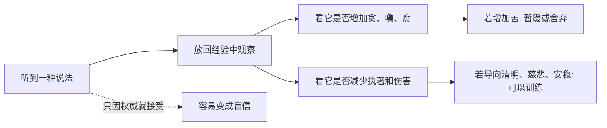

## 佛学思维筑基课: 公理01: 经验优先与如实观察

### 作者
digoal

### 日期
2026-05-18

### 标签
佛学 , 经验优先 , 如实观察 , 卡拉玛经 , 正见 , 身心经验 , 修行 , 检验 , 觉察 , 减苦

----

## 背景

> 面向对象: 高中生到普通读者  
> 核心问题: 佛学为什么总从“苦、受、念头、行为”这些身心经验讲起, 而不是先证明一个宇宙本体?  
> 先说结论: 经验优先公理说, 修行首先要观察可经验到的身心过程, 再判断什么会带来苦、什么会减少苦。它不是反理性, 而是要求把信念放回经验中检验。

## 一张图先看懂

## 求真讲法

### 它到底说了什么

“经验优先”不是说经典不重要, 而是说经典的作用是指导观察, 不是替你完成观察。佛学关心的核心对象是身心经验: 看到、听到、感到快乐或痛苦、起欲望、起愤怒、说话、行动、后悔、安定。

这条公理可以写成一句话: 若一个教法不能帮助人如实看见身心因果, 它就偏离了佛学作为解苦系统的中心。

### 它是怎么来的

早期佛教面对的是很多修行传统、祭祀传统和哲学争论。若每一种说法都要求人直接相信, 普通人会困在权威竞争里。经验优先的动机, 是把问题拉回可观察的结果: 这种想法和行为, 最后让人更贪、更恨、更迷糊, 还是更清醒、更少伤害?

在《卡拉玛经》(AN 3.65) 中, 佛陀对卡拉玛人不是要求他们按传统、传闻或老师名望接受说法, 而是让他们观察某些心理和行为是否有益、无害、受智者赞许, 并导向安乐。

### 它依赖哪些假设

| 假设 | 含义 | 如果不成立 |
|---|---|---|
| 身心经验可被观察 | 人能注意到感受、念头、欲望和行为后果 | 修行会变成纯理论 |
| 经验有因果结构 | 同类心理和行为会形成可识别后果 | 道德训练和禅修很难成立 |
| 人能学习分辨 | 人可以比较有益与有害的状态 | 正见无法生长 |
| 经典服务于实践 | 经典是地图, 不是替代行走 | 容易陷入文字执著 |

### 常见误解

误解一: 经验优先就是“我感觉对就对”。不对。佛学说的观察不是放纵主观感觉, 而是长期检查因果后果: 它是否减少贪嗔痴, 是否减少伤害。

误解二: 经验优先就是不要经典。不对。没有经典和善知识, 初学者容易把一时舒服误认为解脱。

误解三: 经验优先就是科学主义。不对。它与现代科学有相通处, 但佛学主要观察的是苦、执著、注意力、伦理后果这些修行经验。

## 求存讲法

### 它有什么用

它让人从“争谁说得对”转向“检查什么真的改变了苦”。这对学习、关系、情绪管理都很重要。

### 它怎么迁移到熟悉领域

学习时, 不要只问“这个方法名气大不大”, 而要问: 我用了两周后, 错题有没有减少? 注意力有没有稳定? 焦虑有没有变得可处理?

工作时, 不要只问“这个管理口号听起来先进不先进”, 而要问: 它是否让信息更清楚、责任更明确、协作成本更低?

### 它的适用范围和边界

经验优先适合检查身心训练和生活实践, 但不等于每个专业事实都靠个人体验判断。医学、法律、工程、金融风险仍要尊重专业证据。

### 正例: 怎么用它提升能力

一个学生听说“熬夜刷题最有效”。经验优先的做法不是立刻相信, 而是记录一周: 睡眠、正确率、复盘质量、第二天注意力。若发现熬夜让错误率升高, 就调整为早睡加错题复盘。

### 反例: 前提不成立会怎样

如果一个人把“我当下感觉舒服”当成唯一标准, 他可能用短视频、暴饮暴食、冲动消费来逃避压力。这里失败的原因是: 他没有观察长期后果, 把短期快感误作有益经验。

## 思考

经验优先要求人诚实: 不要因为一个观念神圣、流行、来自权威, 就不再检查它造成的心理和行为后果。真正困难的是, 人常常只愿意观察别人, 不愿意观察自己。

## 最后记住

1. 经验优先是佛学的入口: 先看见身心如何运作。
2. 它不是反经典, 而是让经典回到实践检验。
3. 观察标准不是“舒服”, 而是是否减少贪嗔痴和伤害。
4. 没有这条公理, 修行容易变成口号和身份认同。

## 参考资料

- AN 3.65, *Kesaputtiya/Kalama Sutta*, SuttaCentral/Dhammatalks: https://www.dhammatalks.net/suttacentral/sc2016/sc/en/an3.65.html
- Encyclopaedia Britannica, “Buddhism”: https://www.britannica.com/topic/Buddhism
- 《杂阿含经》, CBETA 电子佛典集成: https://tripitaka.cbeta.org/T02n0099_012
  
#### [PostgreSQL 解决方案集合](../201706/20170601_02.md "40cff096e9ed7122c512b35d8561d9c8")
  
  
#### [德哥 / digoal's Github - 公益是一辈子的事.](https://github.com/digoal/blog/blob/master/README.md "22709685feb7cab07d30f30387f0a9ae")
  
  
#### [About 德哥](https://github.com/digoal/blog/blob/master/me/readme.md "a37735981e7704886ffd590565582dd0")
  
  

  
