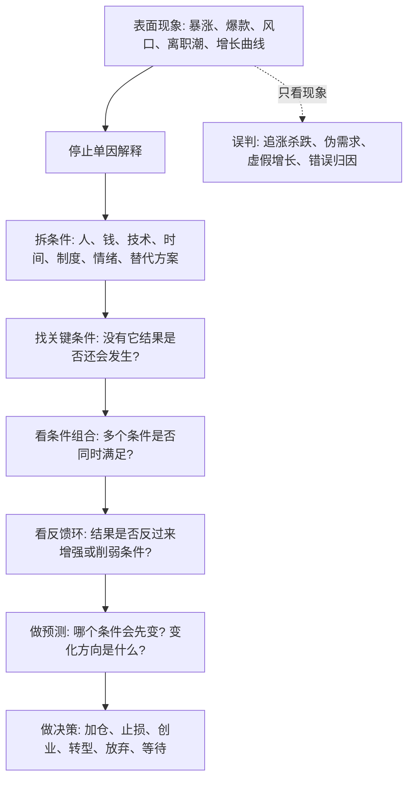

## 佛学思维筑基课: 缘起: 看穿表面变化的条件链公理

### 作者
digoal

### 日期
2026-05-18

### 标签
缘起 , 条件链 , 因果分析 , 关键条件 , 反馈环 , 反表象 , 产品判断 , 运营复盘 , 创业机会 , 投资风险

----

## 背景

> 面向对象: 大学生、产品经理、运营经理、有投资需求的人  
> 核心问题: 世界表面变化太快。热点、价格、流量、融资、舆论、技术概念天天变, 如果只看现象, 就很难判断真假, 更难预测未来。  
> 先说结论: 缘起可以被理解为一条底层条件链公理: 任何结果都不是孤立出现的, 而是依赖一组条件共同生成; 条件变了, 结果就会变。真正的判断力, 不是追逐现象, 而是识别现象背后的关键条件、条件组合和反馈路径。

说明: “缘起”原本是佛学核心概念, 常被译为 dependent origination 或 dependent arising。本文不做宗教劝信, 而是把它抽象成一套跨生活、产品、运营、创业、投资都能使用的因果分析工具。这个抽象会简化传统佛学中十二缘起、苦集灭道、无我、空性等复杂展开。

## 一张图先看懂



## 求真讲法

### 它到底说了什么

缘起最朴素的意思是: 这个存在, 那个才会存在; 这个发生, 那个才会发生; 这个条件消失, 那个结果也会改变或消失。

换成现代决策语言, 它说的是:

> 结果不是“自己发生”的。结果是条件网络的产物。

一个产品爆了, 不是因为“产品好”这么简单。它可能同时依赖:

- 用户已有强痛点。
- 替代方案足够差。
- 获客渠道刚好便宜。
- 交付成本可以控制。
- 团队能力匹配。
- 市场情绪愿意传播。
- 监管和平台规则暂时允许。

少掉其中几个条件, 同一个产品可能就不爆。条件变了, 爆款也会熄火。

### 它是怎么来的

人类最容易犯的判断错误之一, 是把复杂结果解释成单一原因。

```text
现象: 某公司股价上涨
简单解释: 因为它是好公司
缘起式追问:
  1. 利润真的增长了吗?
  2. 现金流跟上了吗?
  3. 行业估值是否整体抬升?
  4. 利率和流动性是否改变?
  5. 市场是不是在交易一个未来叙事?
  6. 竞争格局是否真的改善?
  7. 如果其中两个条件反转, 股价还站得住吗?
```

缘起的价值, 就是逼迫你从“单因解释”进入“条件网络解释”。

它不把世界看成一串孤立事件, 而是看成许多条件互相支撑、互相制约、互相改变的过程。佛学用它解释苦如何生成和止息; 在现代生活里, 我们可以用它解释选择、增长、失败、泡沫、竞争和风险。

### 它依赖哪些假设

第一, 结果依赖条件。没有条件, 结果不会凭空出现。

第二, 条件通常不止一个。现实中的重要结果很少由单一因素决定, 而是由多重条件共同生成。

第三, 条件有层级。不是每个条件都同样重要。有些是必要条件, 没有它结果就不会发生; 有些是加速条件, 有它结果更快出现; 有些只是背景条件。

第四, 条件会变化。今天成立的条件, 明天可能消失。判断未来不能只看今天的结果, 要看支撑结果的条件是否还能延续。

第五, 条件之间会互相影响。用户增长会吸引资本, 资本会补贴增长, 补贴会改变用户行为, 用户行为又会影响真实需求的判断。这就是反馈环。

### 常见误解

误解一: 缘起就是宿命论。  
不对。宿命论说“结果注定如此”; 缘起说“结果依条件如此”。既然依条件, 改变条件就可能改变结果。

误解二: 缘起就是凡事都有原因。  
太粗了。缘起不只是找原因, 而是找条件组合、条件层级、条件变化和反馈关系。

误解三: 缘起会让人犹豫不决。  
不对。缘起不是要求你无限分析, 而是帮助你找到最关键的少数条件, 然后用小成本验证。

误解四: 看懂缘起就能准确预测未来。  
不对。缘起提高的是预测质量, 不是消灭不确定性。复杂系统里仍然会有随机性、突发事件和不可见变量。

## 求存讲法

### 它有什么用

缘起最大的现实价值, 是把问题从“发生了什么”推进到“哪些条件让它发生”。

| 表面问法 | 缘起式问法 |
|---|---|
| 这个行业为什么火? | 哪些需求、技术、资本、政策、供给条件同时成熟了? |
| 这个产品为什么增长快? | 增长来自真实留存、渠道红利、补贴, 还是短期传播? |
| 这个人为什么成功? | 他的能力、资源、时机、平台、关系、风险承受力各占多少? |
| 这只股票为什么涨? | 盈利、估值、流动性、预期、资金结构分别贡献了什么? |
| 我为什么焦虑? | 信息摄入、比较对象、现金流、健康、关系、目标系统哪里出了问题? |

这会让你少被表面现象牵着走。你会开始问: 这个结果背后的条件是否真实? 是否可持续? 是否可复制? 是否正在反转?

### 它怎么迁移到熟悉领域

#### 生活

一个人说“我最近状态很差”, 表面看是情绪问题。缘起式分析会拆成:

- 睡眠是否不足?
- 运动是否减少?
- 信息摄入是否过载?
- 工作目标是否失控?
- 人际关系是否紧张?
- 财务压力是否上升?
- 是否把短期挫折解释成自我否定?

这样做不是为了复杂化生活, 而是为了找到能改的条件。比如先恢复睡眠和运动, 可能比反复追问“我是不是不行”更有效。

#### 产品

用户说想要一个功能, 只是一个表面信号。缘起式产品判断会追问:

- 用户现在用什么替代方案?
- 他为这个问题付出了什么成本?
- 新功能是否改变核心行为链?
- 功能带来的价值是否大于迁移成本?
- 上线后看点击, 还是看留存、复用、付费和推荐?

产品经理真正要看的不是“需求声音大不大”, 而是“需求成立的条件是否完整”。

#### 运营

一次活动带来大量新增, 很容易被当成成功。但缘起式运营会拆:

- 新增来自目标用户还是羊毛用户?
- 是否由补贴驱动?
- 补贴停止后是否留存?
- 活动是否伤害品牌和价格心智?
- 获客成本是否低于长期价值?

如果增长依赖“高补贴 + 低质量用户 + 短期渠道红利”, 那么它不是增长模型, 只是条件短暂堆出来的幻觉。

#### 创业

创业不是有好想法就行。缘起式创业至少要同时检查五类条件:

| 条件 | 要问的问题 |
|---|---|
| 痛点条件 | 客户是否已经为问题付出时间、金钱或组织成本? |
| 支付条件 | 预算来自哪里? 谁有决策权? |
| 供给条件 | 团队能否稳定交付比替代方案更好的结果? |
| 分发条件 | 获客渠道是否可持续, 成本是否可承受? |
| 防守条件 | 做起来后是否容易被平台、巨头或同行复制? |

只满足“痛点看起来存在”, 不等于创业条件成熟。

#### 投融资

投资中, 缘起能帮助你把“涨跌”拆成条件链。

```text
股价 = 基本面条件 + 估值条件 + 流动性条件 + 预期条件 + 情绪条件 + 仓位结构
```

好公司也可能是坏投资, 因为估值条件太高。  
差公司也可能短期上涨, 因为流动性和情绪条件强。  
看对方向也可能亏钱, 因为时间条件和仓位条件错了。

所以投资判断至少要问:

- 企业真实赚钱能力是否改善?
- 这种改善能持续多久?
- 当前价格隐含了多高预期?
- 哪个关键条件反转会导致亏损?
- 如果判断错了, 损失是否可承受?

### 它的适用范围和边界

缘起适合用于复杂现实问题: 个人选择、组织管理、产品增长、创业机会、投资风险、社会趋势。

但它有边界。

第一, 缘起不是万能解释器。不能看到任何结果后随便编一套条件链。条件必须能被观察、验证或至少被合理证伪。

第二, 缘起不是事后诸葛亮。真正有价值的缘起分析, 必须能在事前说清楚: 哪些条件出现, 我会提高判断; 哪些条件消失, 我会降低判断。

第三, 缘起不是平均主义。不是列出 20 个因素就算分析深刻。优秀判断要识别关键条件, 而不是堆砌变量。

第四, 缘起不是逃避选择。不确定性永远存在, 决策仍然要在信息不完整时发生。缘起的作用是让你更清楚自己在押哪些条件。

### 正例: 怎么用它提升能力

假设你想判断“AI 教育产品是否值得创业”。

表面判断会说: AI 很热, 教育刚需, 所以值得做。

缘起式判断会说:

1. 学生或家长是否已经为某个具体学习问题持续付费?
2. AI 是否比老师、题库、教辅、社群更好或更便宜?
3. 学习效果是否可验证, 还是只有新鲜感?
4. 获客成本是否会吞掉利润?
5. 政策、学校、家长信任是否支持这种交付方式?
6. 用户是否会长期留存, 还是考前短期使用?

如果你用小规模实验发现: 家长愿意付费, 学生每周使用, 错题改善可见, 获客来自口碑, 交付边际成本下降, 那么创业条件在增强。  
如果你发现: 只有试用热情, 没有持续使用; 只有低价购买, 没有复购; 只有演示效果, 没有学习结果, 那么条件不成立。

### 反例: 前提不成立会怎样

某投资者看到一家 AI 公司股价三个月涨了 80%, 认为“AI 是未来, 所以继续买”。他只看到了表面现象, 没有拆条件。

后来股价下跌, 原因不是“AI 没前途”这么简单, 而是支撑上涨的条件变了:

- 利率预期上行, 高估值资产承压。
- 公司收入增长没有兑现此前叙事。
- 竞争者增加, 毛利率下降。
- 大股东减持, 市场信心减弱。
- 前期拥挤交易导致下跌时踩踏。

这个反例失败的关键, 是把“长期技术方向”误当成“当前价格一定合理”。缘起分析会提醒他: 趋势、公司、价格、时间、仓位是不同条件, 不能混成一句口号。

## 思考

缘起训练的是一种反表象能力。

当你看到一个现象时, 不要立刻问“我要不要跟”。先问:

```text
1. 这个结果由哪些条件共同生成?
2. 哪些是必要条件, 哪些只是助推条件?
3. 哪些条件可持续, 哪些条件正在衰减?
4. 有没有反馈环正在放大结果?
5. 哪个条件反转, 会让整个判断失效?
6. 我能否用小成本验证关键条件?
```

从这个角度看, 判断真伪不是看谁讲得更激动, 而是看条件链是否完整。预测未来也不是猜一个结论, 而是追踪关键条件的变化。

更进一步, 缘起还能削弱两种危险心态:

- 傲慢: 我成功了, 所以全是我厉害。缘起会提醒你, 成功也依赖时代、平台、团队、资源和运气。
- 绝望: 我失败了, 所以我不行。缘起会提醒你, 失败也是条件组合的结果, 条件可改, 结果就可能改变。

## 最后记住

1. 缘起的核心不是玄学, 而是条件论: 结果依条件而生, 依条件而变。
2. 表面现象越热闹, 越要拆背后的关键条件、条件组合和反馈环。
3. 判断真伪, 要问条件链是否真实; 预测未来, 要看关键条件是否延续或反转。
4. 生活、产品、运营、创业、投资中, 很多错误都来自单因解释和条件混淆。
5. 缘起不是让你不决策, 而是让你知道自己到底在押哪些条件。

## 参考资料

- Encyclopaedia Britannica, “Paticca-samuppada”: https://www.britannica.com/topic/paticca-samuppada
- Encyclopaedia Britannica, “Buddhism - The Four Noble Truths”: https://www.britannica.com/topic/Buddhism/The-Four-Noble-Truths
- Encyclopedia of Buddhism, “Pratityasamutpada”: https://encyclopediaofbuddhism.org/wiki/Pratityasamutpada
- SuttaCentral, dependent origination related texts and translations: https://suttacentral.net/
- Stanford Encyclopedia of Philosophy, “Scientific Method”: https://plato.stanford.edu/entries/scientific-method/
  
#### [PostgreSQL 解决方案集合](../201706/20170601_02.md "40cff096e9ed7122c512b35d8561d9c8")
  
  
#### [德哥 / digoal's Github - 公益是一辈子的事.](https://github.com/digoal/blog/blob/master/README.md "22709685feb7cab07d30f30387f0a9ae")
  
  
#### [About 德哥](https://github.com/digoal/blog/blob/master/me/readme.md "a37735981e7704886ffd590565582dd0")
  
  

  
