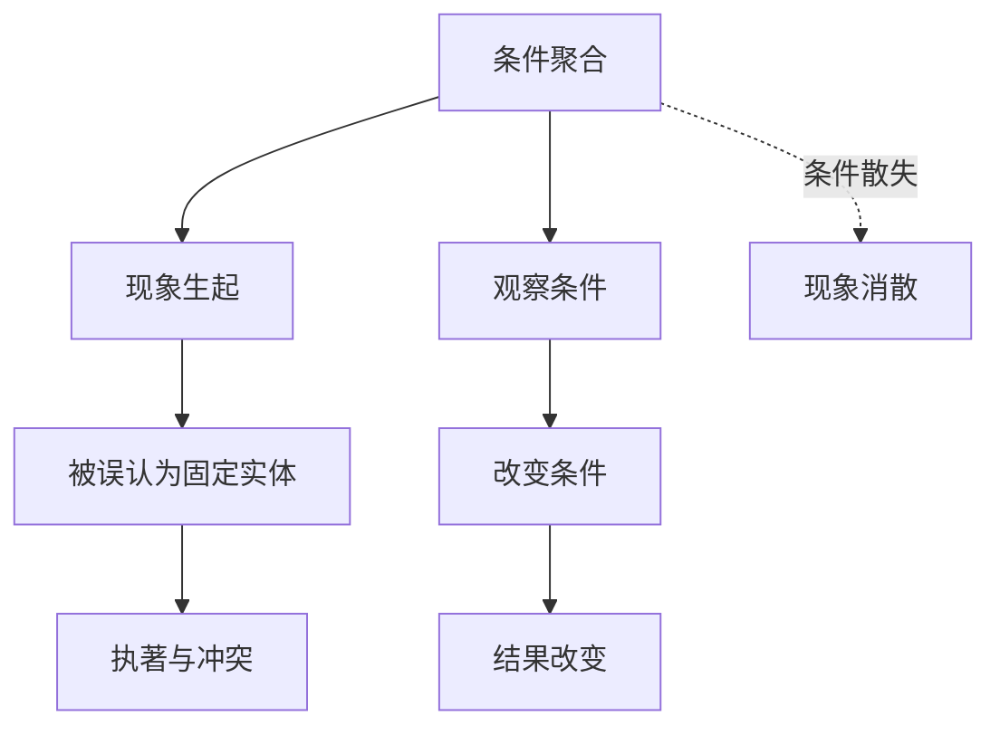

## 佛学思维筑基课: 公理02: 缘起

### 作者
digoal

### 日期
2026-05-18

### 标签
佛学 , 缘起 , 因缘 , 条件性 , 因果 , 无常 , 无我 , 修行 , 条件分析 , 减苦

----

## 背景

> 面向对象: 高中生到普通读者  
> 核心问题: 佛学为什么说“此有故彼有, 此生故彼生”?  
> 先说结论: 缘起公理说, 现象不是孤立出现的, 而是依条件生起、依条件消散。它是佛学最核心的因果骨架, 也是无常、无我、苦、空性和修行可能性的共同基础。

## 一张图先看懂

## 求真讲法

### 它到底说了什么

缘起的基本意思是: 有某些条件, 某个现象才会出现; 条件改变或消失, 现象也会改变或消失。它反对两种极端: 一种是认为事物有一个永恒不变的自性; 另一种是认为一切毫无原因、随机混乱。

比如愤怒不是凭空出现。它可能依赖疲劳、被冒犯的解释、身体紧张、旧经验、面子需求、语言刺激等条件。看见条件, 才有改变的入口。

### 它是怎么来的

佛学要解释苦为什么会反复出现。若苦是命中注定, 修行无意义; 若苦完全随机, 修行也无意义。缘起提供第三条路: 苦不是宿命, 也不是偶然, 而是条件链的结果。

SN 12.20 把缘起称为“特定条件性”的法则。无论是否有佛出现, 条件与结果的关系仍然成立; 佛陀的作用是觉悟并说明这套关系。

### 它依赖哪些假设

| 假设 | 说明 |
|---|---|
| 现象可分析为条件关系 | 不把事物看成孤立实体 |
| 条件有稳定倾向 | 相似条件常带来相似结果 |
| 条件可以被认识 | 人能通过观察和智慧看见因果 |
| 条件可以部分改变 | 修行、教育、制度、环境都可能改变后果 |

### 常见误解

误解一: 缘起就是宿命论。错。宿命论说结果已定, 缘起说结果依条件而定, 条件变则结果变。

误解二: 缘起就是简单线性因果。错。很多现象是多条件网络, 不是一个原因推一个结果。

误解三: 缘起就是“万事都有原因”, 所以谁受苦都是活该。错。缘起用来理解和减苦, 不是用来责怪受苦者。

## 求存讲法

### 它有什么用

缘起把问题从“本质判断”改成“条件分析”。这让人更少贴标签, 更能找到可改变的环节。

### 它怎么迁移到熟悉领域

学习成绩不是“聪明/笨”的单一结果, 而是方法、反馈、睡眠、练习量、情绪、老师和同伴环境共同作用。

关系冲突不是“对方坏”的单一结果, 而是沟通方式、利益压力、误解、旧伤、期待差异共同作用。

### 它的适用范围和边界

缘起适合分析身心、伦理和生活系统, 但不能被滥用成“什么都能解释”。如果找不到具体条件, 就要承认未知, 而不是编造因果。

### 正例: 怎么用它提升能力

一个人总拖延。缘起式分析会问: 任务是否太大? 是否缺少第一步? 是否害怕失败? 是否睡眠不足? 是否手机干扰太强? 找到条件后, 可以把任务切小、关掉通知、先做十分钟。

### 反例: 前提不成立会怎样

若把拖延解释为“我天生懒”, 就把过程实体化了。这个判断忽略条件, 使人失去调整入口。失败点在于否定了缘起公理: 他把多条件结果当成固定本质。

## 思考

缘起最深的地方是: 它同时削弱傲慢和绝望。成功不是纯粹“我厉害”, 失败也不是“我完了”; 两者都是条件结果。看清条件, 人才真正开始负责。

## 最后记住

1. 缘起是佛学的总枢纽。
2. 它不是宿命论, 而是条件论。
3. 看见条件, 才有改变条件的自由。
4. 无常、无我、空性都可以从缘起展开。

## 参考资料

- SN 12.20, *Conditions*, SuttaCentral/Dhammatalks: https://dhammatalks.net/suttacentral/sc2016/sc/en/sn12.20.html
- Encyclopaedia Britannica, “Buddhism - The Four Noble Truths”: https://www.britannica.com/topic/Buddhism/The-Four-Noble-Truths
- 《杂阿含经》, CBETA 电子佛典集成: https://tripitaka.cbeta.org/T02n0099_012
  
#### [PostgreSQL 解决方案集合](../201706/20170601_02.md "40cff096e9ed7122c512b35d8561d9c8")
  
  
#### [德哥 / digoal's Github - 公益是一辈子的事.](https://github.com/digoal/blog/blob/master/README.md "22709685feb7cab07d30f30387f0a9ae")
  
  
#### [About 德哥](https://github.com/digoal/blog/blob/master/me/readme.md "a37735981e7704886ffd590565582dd0")
  
  

  
